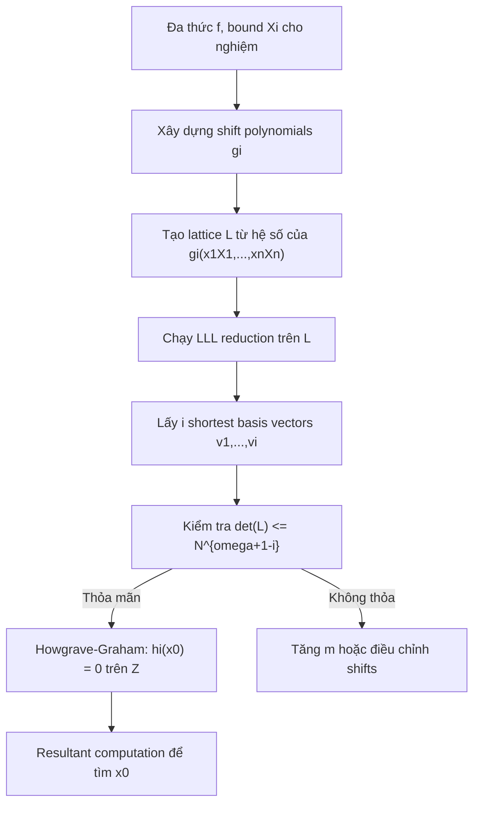

> **Prerequisites**: Coppersmith's method cho univariate modular equations [4, 5], LLL lattice basis reduction [13], khái niệm lattice (mạng số học) cơ bản  
> 🔴 **Prerequisite references**: Coppersmith [4, 5] — *Finding Small Roots* (nền tảng univariate); Lenstra, Lenstra, Lovász [13] — *Factoring Polynomials with Rational Coefficients* (LLL algorithm)  
> **Lesson type**: Math Component  
> **Covers**: §1 (Introduction — motivation và RSA example), §2 (opening — Coppersmith background), Lemma 1 (Howgrave-Graham), Fact 1 (LLL bound)
>
> **Notation**:
> | Ký hiệu | Ý nghĩa |
> |---------|---------|
> | $N$ | RSA modulus (composite, unknown factorization) |
> | $n$ | Số biến của đa thức |
> | $\omega$ | Số monomial của đa thức $h$ (sau khi scale) |
> | $\lVert \cdot \rVert$ | Euclidean norm của vector hệ số |
> | $X_j$ | Bound trên của biến $x_j$: $\lvert x_j^{(0)} \rvert < X_j$ |
> | $L$ | Lattice được xây dựng từ shift polynomials |
> | $\det(L)$ | Determinant của lattice $L$ |
> | $v_i$ | Basis vector thứ $i$ sau LLL reduction |
> | $\epsilon$ | Arbitrarily small constant (error term) |

---

## Motivation

Kể từ khi Coppersmith giới thiệu các kỹ thuật tìm nghiệm nhỏ của đa thức vào năm 1996 [4, 5, 6], các biến thể của phương pháp này đã được sử dụng rộng rãi trong cryptanalysis. Ý tưởng cốt lõi: nếu ta có một đa thức $f$ mà một nghiệm bí mật $x^{(0)}$ thỏa mãn $f(x^{(0)}) \equiv 0 \pmod{N}$, và nghiệm đó đủ nhỏ so với $N$, thì lattice-based techniques có thể recover $x^{(0)}$ trong thời gian polynomial.

Tại sao điều này hữu ích trong cryptanalysis? Hãy xem ví dụ ngay từ §1 của paper.

**RSA example.** Với RSA, các biến công khai $(N, e)$ và biến bí mật $(d, p, q)$ thỏa mãn:

$$
ed - 1 = k(N - (p + q - 1)), \quad \text{với } k \text{ nào đó (không biết)}
$$

Từ đây ta có thể tìm **integer root** $(d, k, p+q-1)$ của đa thức ba biến:

$$
f(x, y, z) = ex - yN + yz - 1
$$

Hoặc thay vào đó, tìm **modular root** $(k, p+q-1)$ của:

$$
f_e(y, z) = y(N - z) + 1 \equiv 0 \pmod{e}
$$

Boneh và Durfee [1] đã dùng Coppersmith technique để tìm modular root này, thu được bound:

$$
Y^{2+3\tau} Z^{1+3\tau+3\tau^2} < e^{1+3\tau}, \quad \text{với } \lvert y^{(0)} \rvert < Y,\ \lvert z^{(0)} \rvert < Z
$$

Tối ưu hóa $\tau > 0$ cho ra kết quả: nếu $d < N^{0.284}$ (sau đó tinh chỉnh thành $d < N^{0.292}$) thì RSA private key có thể bị recover trong thời gian polynomial.

> [!tip] 💡 Agent note
> Đây là ví dụ minh họa sức mạnh của phương pháp: từ một polynomial identity algebraic, ta đặt bài toán tìm nghiệm nhỏ, sau đó áp dụng lattice technique. Bước "thiết kế" đa thức phù hợp cho từng hệ thống mật mã là cốt lõi của cryptanalysis theo hướng này. Paper Jochemsz-May sẽ tổng quát hóa bước này thành một chiến lược tự động.

**Vấn đề.** Mỗi đa thức $f$ mới lại cần một phân tích riêng — đây là công việc tẻ nhạt và không trivial. Năm 2005, Blömer và May [3] chỉ ra cách tìm optimal bounds cho bivariate integer polynomials. Paper này của Jochemsz-May tổng quát hóa thành một **heuristic strategy áp dụng cho mọi đa thức nhiều biến**, dù có modular hay integer roots.

---

## Công cụ 1: Howgrave-Graham Lemma

Nền tảng của mọi phương pháp tìm nghiệm nhỏ qua lattice là **Howgrave-Graham Lemma** [11], được Howgrave-Graham đề xuất vào năm 1997. Lemma này trả lời câu hỏi: khi nào thì một nghiệm modular tự động trở thành nghiệm nguyên?

> [!note] Lemma 1 — Howgrave-Graham [11]
> Cho $h(x_1, \ldots, x_n) \in \mathbb{Z}[x_1, \ldots, x_n]$ là một đa thức nguyên gồm **nhiều nhất $\omega$ monomial**. Giả sử hai điều kiện sau đồng thời thỏa mãn:
>
> **(1)** $h\!\left(x_1^{(0)}, \ldots, x_n^{(0)}\right) \equiv 0 \pmod{N}$ với $\lvert x_j^{(0)} \rvert < X_j$ cho mọi $j$
>
> **(2)**
> $$
> \left\lVert h(x_1 X_1, \ldots, x_n X_n) \right\rVert < \frac{N}{\sqrt{\omega}}
> $$
>
> **Kết luận**: $h\!\left(x_1^{(0)}, \ldots, x_n^{(0)}\right) = 0$ **trên $\mathbb{Z}$** (không cần mod $N$).

**Ký hiệu norm.** Với đa thức $f(x_1, \ldots, x_n) = \sum a_{i_1 \cdots i_n} x_1^{i_1} \cdots x_n^{i_n}$, norm Euclidean của vector hệ số là:

$$
\lVert f(x_1, \ldots, x_n) \rVert^2 := \sum \lvert a_{i_1 \cdots i_n} \rvert^2
$$

**Proof sketch.** Ý tưởng cơ bản là xét đa thức $g(x_1, \ldots, x_n) := h(x_1 X_1, \ldots, x_n X_n)$. Tại điểm $\left(x_1^{(0)}/X_1, \ldots, x_n^{(0)}/X_n\right)$ — tất cả các tọa độ đều có giá trị tuyệt đối $< 1$. Theo bất đẳng thức Hadamard, nếu $\lVert g \rVert < N/\sqrt{\omega}$ thì $\lvert g(x_1^{(0)}/X_1, \ldots, x_n^{(0)}/X_n) \rvert < N$. Mà $g$ tại điểm này chính là $h(x_1^{(0)}, \ldots, x_n^{(0)})$, và điều kiện (1) cho biết giá trị này là bội số của $N$. Bội số của $N$ có giá trị tuyệt đối $< N$ chỉ có thể bằng $0$. $\blacksquare$

> [!info] 🟡 Nguồn gốc Lemma 1
> Đây là phiên bản tổng quát hóa cho $n$ biến của kết quả Howgrave-Graham [11, Lemma 1]. Paper gốc [11] chỉ xét univariate case ($n=1$). Jochemsz-May dùng phiên bản generalized này — có thể xem proof đầy đủ trong [14] (May's PhD thesis).

---

## Công cụ 2: LLL Lattice Basis Reduction

Lemma 1 cho ta điều kiện (2) mà $h$ cần thỏa mãn. Nhưng làm sao tìm được $h$ thỏa mãn điều kiện đó? Đây là vai trò của **LLL algorithm** [13].

> [!note] Fact 1 — LLL Reduction [13]
> Cho $L$ là một lattice có dimension $\omega$. Trong thời gian polynomial, thuật toán LLL output một **reduced basis** gồm các vector $v_i$, $1 \leq i \leq \omega$, thỏa mãn:
>
> $$
> \lVert v_1 \rVert \leq \lVert v_2 \rVert \leq \cdots \leq \lVert v_i \rVert \leq 2^{\frac{\omega(\omega-1)}{4(\omega+1-i)}} \cdot \det(L)^{\frac{1}{\omega+1-i}}
> $$

**Ý nghĩa thực tiễn.** LLL đảm bảo rằng $\lVert v_1 \rVert$ — shortest vector trong basis sau reduction — bị chặn trên bởi một hàm của $\det(L)$. Đây là điều kiện đủ (không phải tối ưu) để $v_1$ là short enough.

---

## Kết hợp: Điều kiện Determinant

Để áp dụng Lemma 1, ta cần $\lVert h(x_1 X_1, \ldots, x_n X_n) \rVert < N/\sqrt{\omega}$, tức điều kiện (2). Thay Fact 1 vào: nếu vector $v_i$ (tương ứng với đa thức $h_i$) trong LLL-reduced basis thỏa mãn:

$$
2^{\frac{\omega(\omega-1)}{4(\omega+1-i)}} \cdot \det(L)^{\frac{1}{\omega+1-i}} < \frac{N}{\sqrt{\omega}}
$$

thì $h_i$ sẽ thỏa điều kiện (2) của Howgrave-Graham. Điều này tương đương với:

$$
\det(L) \leq 2^{-\frac{\omega(\omega-1)}{4}} \cdot \left(\frac{1}{\sqrt{\omega}}\right)^{\omega+1-i} \cdot N^{\omega+1-i}
$$

> [!abstract] Điều kiện Determinant (dạng rút gọn)
> Trong phân tích, ta cho phép các hệ số không phụ thuộc $N$ đóng góp vào error term $\epsilon$. Khi đó điều kiện determinant rút gọn thành:
>
> $$
> \det(L) \leq N^{\omega+1-i}
> $$
>
> Nếu điều kiện này thỏa mãn, thì $i$ vector shortest trong LLL-reduced basis tương ứng với $i$ đa thức $h_1, \ldots, h_i$ đều thỏa Howgrave-Graham bound — và do đó tất cả đều triệt tiêu tại nghiệm $(x_1^{(0)}, \ldots, x_n^{(0)})$ **trên $\mathbb{Z}$**.

> [!tip] 💡 Agent note
> Điều kiện $\det(L) \leq N^{\omega+1-i}$ là **điều kiện thiết kế** của toàn bộ chiến lược: mọi lựa chọn shift polynomials và lattice basis đều nhắm đến việc thỏa mãn bất đẳng thức này. Càng nhỏ $\det(L)$ so với $N^{\omega+1-i}$, bound trên nghiệm tìm được càng lớn.

---

## Từ Nghiệm Modular đến Nghiệm Nguyên: Pipeline đầy đủ

Kết hợp hai công cụ trên, pipeline tổng quát để recover nghiệm nhỏ là:

**Bước then chốt** là xây dựng tập shift polynomials $g_i$ sao cho:
1. Tất cả $g_i$ đều có nghiệm $(x_1^{(0)}, \ldots, x_n^{(0)})$ modulo $N^m$ (hoặc $R$ trong integer case).
2. Lattice $L$ xây dựng từ $g_i$ có $\det(L)$ đủ nhỏ để điều kiện determinant thỏa mãn.

Đây chính là bài toán mà chiến lược của Jochemsz-May giải quyết — sẽ được trình bày chi tiết trong [[02-modular-roots-strategy|02. Modular Roots Strategy]] và [[03-integer-roots-strategy|03. Integer Roots Strategy]].

---

## Vì sao n ≥ 2 là Heuristic?

Với $n = 1$ (univariate), Coppersmith [4] chứng minh rigorous rằng nếu $\det(L) \leq N^{\omega}$ thì ta tìm được nghiệm. Với $n \geq 2$, sau khi có $n$ đa thức $h_1, \ldots, h_n$ triệt tiêu tại nghiệm, ta cần chúng **algebraically independent** để resultant computation ra kết quả đúng.

> [!warning] Assumption 1 — Heuristic Algebraic Independence
> Các phép tính resultant của các đa thức $h_i$ cho ra **các đa thức khác không** (non-zero polynomials).
>
> Assumption này không thể chứng minh rigorous cho $n \geq 2$ trong trường hợp tổng quát. Tất cả các tấn công dùng Coppersmith techniques với $n \geq 2$ đều mang tính **heuristic** và cần được validate bằng thực nghiệm cho các trường hợp cụ thể.

Trong thực tế, Assumption 1 hầu như luôn đúng — paper báo cáo nó "worked perfectly in practice" cho mọi instance thực nghiệm (xem §4 và §5 của paper gốc).

---

## Summary

- **Lemma 1 (Howgrave-Graham)**: nghiệm modular của $h$ trở thành nghiệm nguyên nếu $\lVert h(x_1 X_1, \ldots) \rVert < N/\sqrt{\omega}$.
- **Fact 1 (LLL)**: LLL trong thời gian polynomial output basis với $\lVert v_i \rVert \leq 2^{\frac{\omega(\omega-1)}{4(\omega+1-i)}} \det(L)^{\frac{1}{\omega+1-i}}$.
- **Điều kiện determinant**: kết hợp hai công cụ → $\det(L) \leq N^{\omega+1-i}$ (bỏ qua hệ số không phụ thuộc $N$).
- **Pipeline**: thiết kế shift polynomials → xây lattice → LLL → Howgrave-Graham → resultant.
- **Heuristic gap**: với $n \geq 2$, cần Assumption 1 (algebraic independence) — không prove được rigorously.

---

## References

- [1] Boneh, Durfee — *Cryptanalysis of RSA with Private Key d Less Than N^{0.292}*, IEEE Trans. Inf. Theory 2000 (🟡)
- [4] Coppersmith — *Finding a Small Root of a Univariate Modular Equation*, EUROCRYPT 1996 (🔴)
- [5] Coppersmith — *Finding a Small Root of a Bivariate Integer Equation*, EUROCRYPT 1996 (🔴)
- [6] Coppersmith — *Small Solutions to Polynomial Equations, and Low Exponent RSA Vulnerabilities*, J. Cryptology 1997
- [11] Howgrave-Graham — *Finding Small Roots of Univariate Modular Equations Revisited*, LNCS 1355, 1997 (🟡)
- [13] Lenstra, Lenstra, Lovász — *Factoring Polynomials with Rational Coefficients*, Math. Ann. 261, 1982 (🔴)
- [14] May — *New RSA Vulnerabilities Using Lattice Reduction Methods*, PhD Thesis, Paderborn 2003
