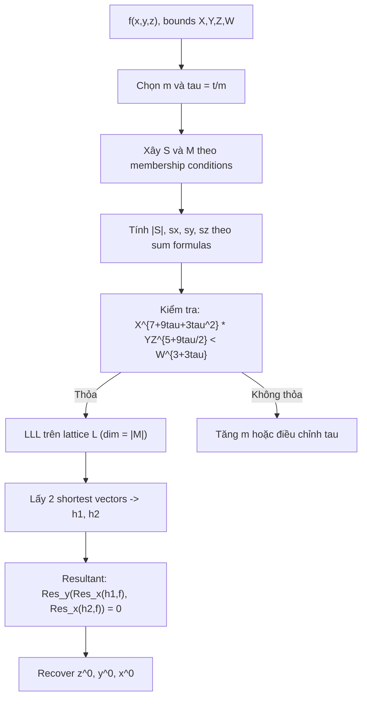

> **Prerequisites**: [[02-modular-roots-strategy|02. Modular Roots Strategy]], [[03-integer-roots-strategy|03. Integer Roots Strategy]]  
> **Lesson type**: Deep Dive  
> **Covers**: §3 đầy đủ — polynomial $f(x,y,z)$, định nghĩa $S$ và $M$, lattice diagonal entries, dimension counting, rút gọn bound
>
> **Notation**:
> | Ký hiệu | Ý nghĩa |
> |---------|---------|
> | $f(x,y,z)$ | Đa thức ba biến cụ thể từ §3 |
> | $X, Y, Z$ | Bounds cho $\lvert x^{(0)} \rvert$, $\lvert y^{(0)} \rvert$, $\lvert z^{(0)} \rvert$ |
> | $W$ | $\lVert f(xX, yY, zZ) \rVert_\infty$ — hệ số tối đa sau scale |
> | $\tau$ | $t = \tau m$ — tỉ lệ extra $x$-shifts |
> | $R$ | $W X^{2(m-1)+t} (YZ)^{m-1}$ — modulus nhân tạo của §3 |
> | $S, M$ | Tập monomial theo Extended Strategy với extra $x$-shifts |
> | $\lvert S \rvert, \lvert M \rvert$ | Số phần tử của $S$, $M$ |
> | $\omega$ | Dimension của lattice $= \lvert S \rvert + \lvert M \setminus S \rvert = \lvert M \rvert$ |

---

## Context

Lesson này trình bày §3 của paper — **bước kỹ thuật cốt lõi** nối chiến lược tổng quát (§2) với các tấn công RSA cụ thể (§4, §5). Đa thức ba biến $f(x,y,z)$ xuất hiện tự nhiên trong cả hai tấn công: nó encode các algebraic relations giữa private exponent và các hidden variables của RSA.

**Ba câu hỏi cần trả lời trong lesson này:**
1. *$S$ và $M$ của Extended Strategy trông như thế nào* với $f(x,y,z)$ cụ thể này?
2. *Determinant của lattice* là bao nhiêu?
3. *Điều kiện bound cuối* sau tối ưu hóa $\tau$ là gì?

---

## Đa thức và Thiết lập

> [!note] Setting 4.1 — Đa thức trivariate (§3)
> Xét đa thức:
>
> $$
> f(x, y, z) = a_0 + a_1 x + a_2 x^2 + a_3 y + a_4 z + a_5 xy + a_6 xz + a_7 yz
> $$
>
> với nghiệm nguyên nhỏ $(x^{(0)}, y^{(0)}, z^{(0)})$ thỏa $\lvert x^{(0)} \rvert < X$, $\lvert y^{(0)} \rvert < Y$, $\lvert z^{(0)} \rvert < Z$.
>
> **Cấu trúc bậc**: bậc tối đa của $x$ là $2$, của $y$ và $z$ đều là $1$. Vì vậy $d_x = 2$, $d_y = d_z = 1$.
>
> **Mục tiêu**: Áp dụng Extended Strategy (§2.2) với extra $x$-shifts để tìm hai đa thức $h_1, h_2$ cùng $f$ triệt tiêu tại $(x^{(0)}, y^{(0)}, z^{(0)})$ trên $\mathbb{Z}$.

---

## Định nghĩa $S$, $M$ và $R$

Cố định $m \in \mathbb{Z}^+$ và $t = \tau m$ (extra $x$-shifts). Áp dụng Extended Strategy (§2.2):

$$
S = \bigcup_{0 \leq j \leq t} \left\{ x^{i_1+j} y^{i_2} z^{i_3} \ \middle|\ x^{i_1} y^{i_2} z^{i_3} \text{ là monomial của } f^{m-1} \right\}
$$

$$
M = \left\{ \text{monomials của } x^{i_1} y^{i_2} z^{i_3} \cdot f \ \middle|\ x^{i_1} y^{i_2} z^{i_3} \in S \right\}
$$

**Membership conditions** (từ §3 của paper):

> [!abstract] Membership trong $S$ và $M$
>
> $$
> x^{i_1} y^{i_2} z^{i_3} \in S \iff \begin{cases} i_2 = 0, \ldots, m-1 \\ i_3 = 0, \ldots, m-1 \\ i_1 = 0, \ldots, 2(m-1) - (i_2 + i_3) + t \end{cases}
> $$
>
> $$
> x^{i_1} y^{i_2} z^{i_3} \in M \iff \begin{cases} i_2 = 0, \ldots, m \\ i_3 = 0, \ldots, m \\ i_1 = 0, \ldots, 2m - (i_2 + i_3) + t \end{cases}
> $$

**Giải thích.** Với $f^{m-1}$: bậc tối đa của $x$ là $2(m-1)$, của $y$ và $z$ là $m-1$. Khi $i_2 + i_3$ đơn vị bậc bị dùng bởi $y^{i_2} z^{i_3}$, bậc còn lại của $x$ là $2(m-1) - (i_2+i_3)$. Thêm $t$ extra shifts cho $x$: giới hạn $i_1 \leq 2(m-1)-(i_2+i_3)+t$. Tập $M$ tương tự với $f^m$ (bậc $x$ lên $2m$).

**Modulus $R$**: $l_x = 2(m-1)+t$ là bậc tối đa của $x$ trong $S$; $l_y = l_z = m-1$:

$$
R = W \cdot X^{2(m-1)+t} \cdot (YZ)^{m-1}
$$

---

## Shift Polynomials và Diagonal Entries

Hai loại shift polynomials từ §2.2:

$$
g : x^{i_1} y^{i_2} z^{i_3} \cdot f'(x,y,z) \cdot X^{2(m-1)+t-i_1} Y^{m-1-i_2} Z^{m-1-i_3} \quad \text{cho } x^{i_1}y^{i_2}z^{i_3} \in S
$$

$$
g' : R \cdot x^{i_1} y^{i_2} z^{i_3} \quad \text{cho } x^{i_1}y^{i_2}z^{i_3} \in M \setminus S
$$

Sau khi scale ($x \mapsto xX$, $y \mapsto yY$, $z \mapsto zZ$), **diagonal entries** của ma trận lattice:

- Các row ứng với $g$ (monomial $x^{i_1}y^{i_2}z^{i_3} \in S$): diagonal từ constant term của $f'$ sau scale là $X^{2(m-1)+t} (YZ)^{m-1}$
- Các row ứng với $g'$ (monomial $x^{i_1}y^{i_2}z^{i_3} \in M \setminus S$): diagonal là $R \cdot X^{i_1} Y^{i_2} Z^{i_3} = X^{2(m-1)+t+i_1} Y^{m-1+i_2} Z^{m-1+i_3} \cdot W$

---

## Tính $\det(L)$

$$
\det(L) = \prod_{\text{mọi row}} \text{diagonal entry}
$$

$$
= \left(X^{2(m-1)+t}(YZ)^{m-1}\right)^{|S|} \cdot \prod_{x^{i_1}y^{i_2}z^{i_3} \in M \setminus S} X^{2(m-1)+t+i_1} Y^{m-1+i_2} Z^{m-1+i_3} \cdot W
$$

Theo điều kiện bound (2) từ [[03-integer-roots-strategy|Lesson 03]]:

$$
\prod_{j \in \{x,y,z\}} X_j^{s_j} < W^{s_W}
$$

với $s_j = \sum_{x^i \in M \setminus S} i_j$ và $s_W = |S|$.

---

## Đếm Dimension và Tính $s_j$, $s_W$

**Tính $|S|$**:

$$
|S| = \sum_{i_2=0}^{m-1} \sum_{i_3=0}^{m-1} \bigl(2(m-1)-(i_2+i_3)+t+1\bigr)
$$

Sau tính toán (bỏ qua $o(m^2)$ terms khi $m \to \infty$):

$$
|S| = \left(1 + \tau\right) m^3 + o(m^2) \quad \text{(với } t = \tau m\text{)}
$$

> [!tip] 💡 Agent note
> Tính chính xác $|S|$ đòi hỏi đánh giá tổng hai chiều. Phương pháp: với $i_2$ và $i_3$ cố định, số giá trị $i_1$ hợp lệ là $2(m-1)-(i_2+i_3)+t+1$. Tổng theo $i_2, i_3$ từ $0$ đến $m-1$. Kết quả là đa thức bậc $3$ trong $m$, với hệ số leading $(1+\tau)$.

**Tính $s_x = \sum_{x^i \in M \setminus S} i_1$**:

Tập $M \setminus S$ gồm các monomial với $i_2$ hoặc $i_3$ bằng $m$, hoặc $i_1 = 2m-(i_2+i_3)+t$ (boundary của $M$ không nằm trong $S$). Sau tính toán:

$$
s_x = \left(\frac{7}{3} + 3\tau + \tau^2\right) m^3 + o(m^2)
$$

**Tính $s_y = s_z = \sum_{x^i \in M \setminus S} i_j$** (với $j = y$ hoặc $z$, symmetric):

$$
s_y = s_z = \left(\frac{5}{3} + \frac{3}{2}\tau\right) m^3 + o(m^2)
$$

---

## Rút Gọn Bound

Thay vào điều kiện $\prod_j X_j^{s_j} < W^{|S|}$:

$$
X^{s_x} \cdot Y^{s_y} \cdot Z^{s_z} < W^{|S|}
$$

$$
X^{\left(\frac{7}{3}+3\tau+\tau^2\right)m^3+o(m^2)} \cdot (YZ)^{\left(\frac{5}{3}+\frac{3}{2}\tau\right)m^3+o(m^2)} \leq W^{(1+\tau)m^3+o(m^2)}
$$

Chia cả hai vế cho $m^3$ (lấy exponent theo $m^3$) và cho phép $o(m^2)$ contribute vào $\epsilon$:

> [!abstract] Theorem — Trivariate Bound (§3)
> Dưới Assumption 1, với mọi $\epsilon > 0$, tất cả nghiệm nguyên nhỏ đủ nhỏ của $f(x,y,z)$ có thể tìm được trong thời gian polynomial trong $\log W$, với điều kiện tồn tại $\tau > 0$ sao cho:
>
> $$
> X^{7+9\tau+3\tau^2} \cdot (YZ)^{5+\frac{9}{2}\tau} < W^{3+3\tau-\epsilon}
> $$
>
> Tham số $\tau > 0$ được tối ưu hóa sau khi biết kích thước của $X, Y, Z, W$.

**Proof sketch.** Từ $s_x = (7/3+3\tau+\tau^2)m^3+o(m^2)$ và $s_y=s_z=(5/3+3\tau/2)m^3+o(m^2)$, $|S|=(1+\tau)m^3+o(m^2)$: chia condition $\prod X_j^{s_j} < W^{|S|}$ cho $(m^3)^{\text{mũ}}$, rút ra hệ số leading cho $X$, $YZ$, $W$. Terms $o(m^2)$ contribute vào $\epsilon$. $\blacksquare$

---

## Ví dụ Tối ưu $\tau$ cho §4

Trong §4 (RSA-CRT attack), các bounds là $X = N^\delta$, $Y = Z = N^{\delta+1/2}$, $W = N^{2+2\delta}$. Thay vào:

$$
(7+9\tau+3\tau^2)\delta + \left(5+\frac{9}{2}\tau\right)(2\delta+1) - (3+3\tau)(2+2\delta) < 0
$$

Khai triển:

$$
3\delta\tau^2 + 3\left(4\delta - \frac{1}{2}\right)\tau + (11\delta - 1) < 0
$$

Đây là bất phương trình bậc hai theo $\tau$. Có nghiệm dương khi discriminant $> 0$ và:

$$
\tau_{\text{opt}} = \frac{\frac{1}{2} - 4\delta}{2\delta}
$$

Thay $\tau_{\text{opt}}$ vào: điều kiện rút gọn thành $\delta < \frac{1}{4}(4 - \sqrt{13}) \approx 0.099$.

> [!tip] 💡 Agent note
> Bước tối ưu hóa $\tau$ là bước **algebraic optimization** chuẩn: ta có bất phương trình $a\tau^2 + b\tau + c < 0$ với $a, b, c$ phụ thuộc vào $\delta$. Giá trị $\tau$ tối ưu cho phép $\delta$ lớn nhất là đỉnh của parabola: $\tau_{\text{opt}} = -b/(2a)$. Thay vào và giải $\delta$ từ điều kiện $b^2 - 4ac > 0$.

---

## Sơ đồ Pipeline §3

---

## Summary

- **Đa thức**: $f(x,y,z) = a_0 + a_1 x + a_2 x^2 + \ldots + a_7 yz$ — $d_x=2$, $d_y=d_z=1$.
- **S/M membership**: $i_1 \leq 2(m-1)-(i_2+i_3)+t$ cho $S$; $i_1 \leq 2m-(i_2+i_3)+t$ cho $M$.
- **Exponent sums**: $s_x = (7/3+3\tau+\tau^2)m^3$; $s_y = s_z = (5/3+3\tau/2)m^3$; $|S| = (1+\tau)m^3$.
- **Bound cuối**: $X^{7+9\tau+3\tau^2}(YZ)^{5+9\tau/2} < W^{3+3\tau-\epsilon}$.
- **Dùng cho**: §4 (RSA-CRT, $\tau_{\text{opt}} = (1/2-4\delta)/(2\delta)$) và §5 (Common Prime RSA, tương tự).

**Tiếp theo**: [[05-attack-rsa-crt|05. Attack RSA-CRT]] áp dụng bound này vào tấn công Qiao-Lam scheme.

---

## References

- [3] Blömer, May — *A Tool Kit for Finding Small Roots of Bivariate Polynomials over the Integers*, EUROCRYPT 2005 (🟡)
- [7] Coron — *Finding Small Roots of Bivariate Integer Equations Revisited*, EUROCRYPT 2004 (🟡)
