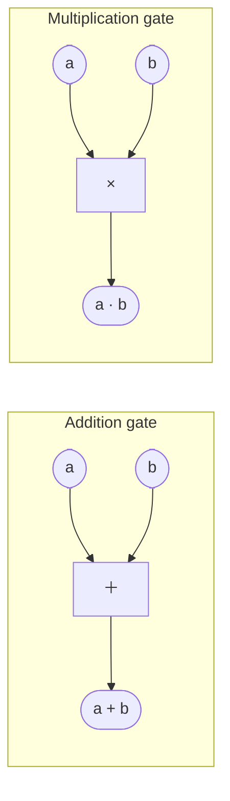
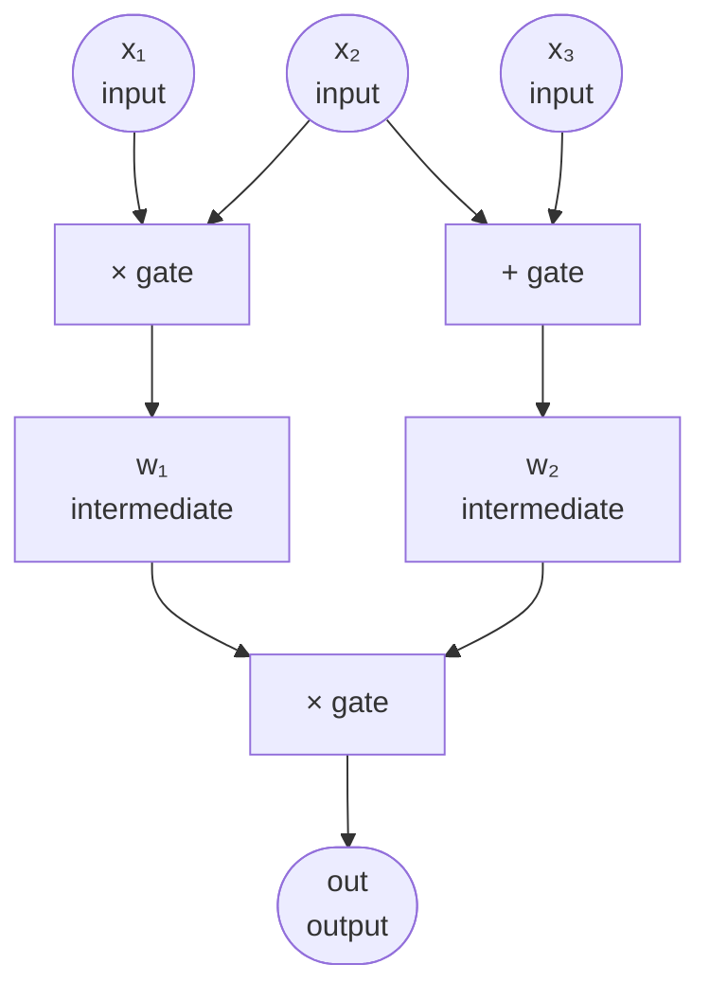
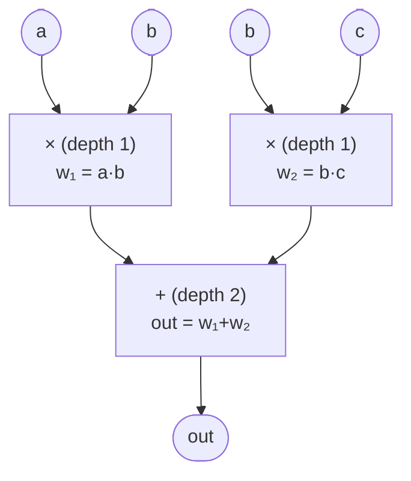
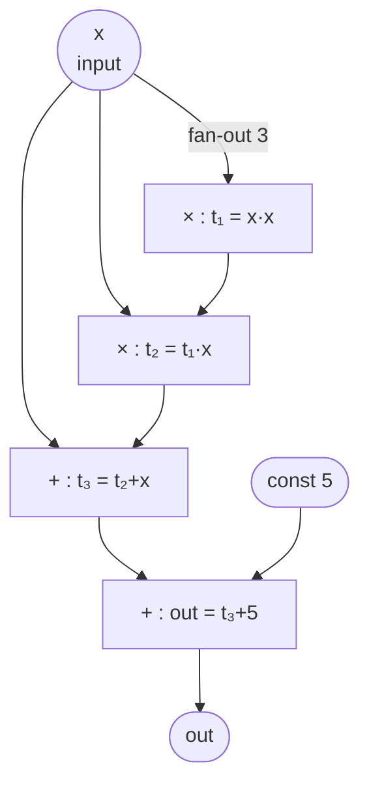
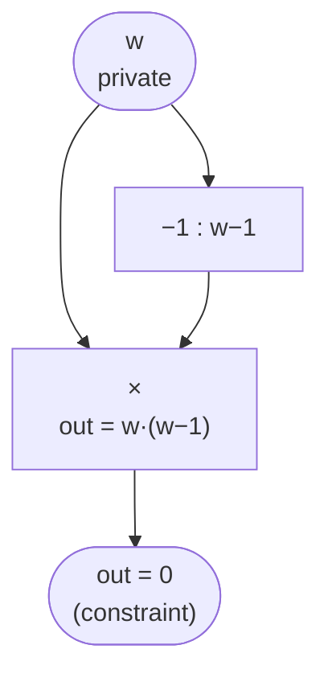
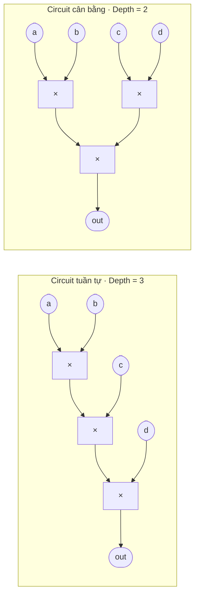

> **Prerequisites**: [[01-finite-fields|01. Finite Fields & Field Arithmetic]] — phép toán trong $\mathbb{F}_p$; [[02-polynomials-over-finite-fields|02. Polynomials over Finite Fields]] — khái niệm đa thức
> **Objectives**:
> - Định nghĩa chính xác arithmetic circuit: gates, wires, fan-in, depth, size
> - Phân biệt arithmetic circuit với Boolean circuit — tại sao ZK dùng arithmetic
> - Hiểu circuit satisfiability (CSAT) và mối quan hệ với NP
> - Đọc và vẽ được circuit từ một biểu thức toán học

---

## Motivation

Một ZK proof về bản chất là: *"Tôi biết một input bí mật sao cho một phép tính nào đó cho ra kết quả đúng."* Nhưng "phép tính" đó phải được mô tả chính xác theo cách mà một proof system có thể xử lý được.

**Arithmetic circuit** là ngôn ngữ mô tả phép tính đó. Thay vì mô tả bằng code (quá linh hoạt, khó prove), ta encode phép tính thành một mạng lưới các cổng cộng và nhân — đơn giản đủ để chuyển sang constraint system, nhưng đủ biểu diễn mọi phép tính đa thức.

Hãy hình dung: nếu bạn muốn prove "tôi biết $x$ sao cho $x^3 + x + 5 = 35$", bạn sẽ vẽ một circuit tính $x^3 + x + 5$, rồi prove rằng mình có assignment cho tất cả wires khiến circuit cho ra $35$.

---

## 1. Định nghĩa Formal

> [!definition] Definition 3.1 — Arithmetic Circuit
> Một **arithmetic circuit** $C$ trên field $\mathbb{F}$ là một đồ thị có hướng không chu trình (DAG — Directed Acyclic Graph) trong đó:
>
> - **Các nút lá** (leaf nodes / input wires): mang giá trị input $x_1, \ldots, x_n \in \mathbb{F}$ hoặc hằng số $c \in \mathbb{F}$
> - **Các nút trong** (internal nodes / gates): mỗi gate thực hiện một trong hai phép toán:
>   - **Addition gate** $(+)$: nhận $a, b$, xuất $a + b$
>   - **Multiplication gate** $(\times)$: nhận $a, b$, xuất $a \cdot b$
> - **Output wire**: giá trị tại nút ra của circuit
> - Tất cả phép toán thực hiện trong $\mathbb{F}$

Cấu trúc DAG đảm bảo không có vòng lặp — circuit thực hiện tính toán **feed-forward** một chiều, không có trạng thái hay recursion.

---

## 2. Gates, Wires và các thông số

### 2.1 Gates

Chỉ có hai loại gate cơ bản — đây là sự khác biệt lớn nhất so với Boolean circuit:



*Hai loại gate duy nhất trong arithmetic circuit — mọi phép tính đa thức đều biểu diễn được qua cộng và nhân.*

> [!note] Tại sao chỉ hai gate?
> Mọi đa thức (và do đó mọi phép tính hợp lý) đều có thể biểu diễn bằng cộng và nhân. Phép trừ là cộng với âm: $a - b = a + (-1) \cdot b$. Hằng số nhân là addition gate với constant wire. Không cần thêm gate nào khác.

### 2.2 Wires (Dây dẫn)

Mỗi cạnh trong DAG là một **wire** mang một giá trị trong $\mathbb{F}$. Có ba loại wire:



*Ba loại wire trong circuit: input wires (nút lá), intermediate wires (kết quả tạm), output wire.*

### 2.3 Các thông số đặc trưng của circuit

> [!definition] Definition 3.2 — Size, Depth, Fan-in, Fan-out
>
> - **Size** $|C|$: tổng số gates trong circuit — đo độ phức tạp tính toán
> - **Depth** $d(C)$: độ dài đường đi dài nhất từ input đến output — đo độ "song song" được
> - **Fan-in**: số input của mỗi gate (thường = 2 cho binary gates)
> - **Fan-out**: số nơi output của một gate được dùng — một wire có thể đi vào nhiều gates



*Circuit tính $f(a,b,c) = a \cdot b + b \cdot c$ — $b$ có fan-out = 2, size = 3 gates, depth = 2.*

---

## 3. So sánh: Arithmetic Circuit vs Boolean Circuit

Đây là điểm thường gây nhầm lẫn khi mới vào ZK:

| Tiêu chí | Boolean Circuit | Arithmetic Circuit |
|----------|----------------|-------------------|
| **Domain** | $\{0, 1\}$ | $\mathbb{F}_p$ (field lớn) |
| **Gates** | AND, OR, NOT, XOR | $+$, $\times$ |
| **Biểu diễn số** | Binary encoding (nhiều bit) | Một field element |
| **Phép nhân** | Tốn kém (AND gate) | Một gate duy nhất |
| **Dùng trong** | SHA-256, AES (bitwise ops) | Polynomial computations, hash functions ZK-friendly |
| **Constraint system** | R1CS nhị phân | R1CS / PLONK chuẩn |

**Khi nào dùng Boolean circuit trong ZK?** Khi tính toán có nhiều bitwise operations (như SHA-256 trong zkEVM), ta vẫn phải dùng arithmetic circuit nhưng **mô phỏng** từng bit — rất tốn kém. Đây là lý do các hàm hash ZK-friendly như Poseidon, MiMC được thiết kế riêng để thân thiện với arithmetic circuit.

---

## 4. Arithmetic Circuit Satisfiability (CSAT)

> [!definition] Definition 3.3 — Circuit Satisfiability
> Cho arithmetic circuit $C(x_1, \ldots, x_n, w_1, \ldots, w_m)$ với:
> - $x_i$: **public inputs** (verifier biết)
> - $w_j$: **witness inputs** (chỉ prover biết)
>
> Bài toán **CSAT** hỏi: tồn tại $w_1, \ldots, w_m \in \mathbb{F}$ sao cho $C(x_1, \ldots, x_n, w_1, \ldots, w_m) = 0$?

> [!theorem] Theorem 3.4 — CSAT là NP-complete
> Bài toán circuit satisfiability là **NP-complete**. Mọi bài toán trong NP đều có thể **reduce** về CSAT trong thời gian đa thức.

Đây là nền tảng lý thuyết của ZK: prove bất kỳ bài toán NP nào đều có thể chuyển về prove CSAT của một circuit phù hợp. ZK proof system giải quyết CSAT mà không lộ witness.

> [!example] Example 3.5 — CSAT cho bài toán đơn giản
> Prove "tôi biết $w$ sao cho $w^2 = 9$" (trong $\mathbb{F}_{13}$):
>
> Circuit: $C(w) = w \cdot w - 9$. Satisfying assignment: $w = 3$ (hoặc $w = 10$ vì $10^2 = 100 \equiv 9 \pmod{13}$).

---

## 5. Xây dựng circuit từ biểu thức — Ví dụ End-to-End

### Ví dụ 1: $f(x) = x^3 + x + 5$

**Bước 1 — Phân tích biểu thức thành các phép toán nhị phân:**

```
x^3 + x + 5
= (x · x · x) + x + 5
= ((x · x) · x) + x + 5
```

**Bước 2 — Vẽ circuit:**



*Circuit tính $f(x) = x^3 + x + 5$ — $x$ có fan-out = 3, size = 4 gates, depth = 3.*

**Bước 3 — Liệt kê wires và gates:**

| Wire | Giá trị | Gate |
|------|---------|------|
| $x$ | input | — |
| $t_1$ | $x \cdot x$ | $\times$ |
| $t_2$ | $t_1 \cdot x$ | $\times$ |
| $t_3$ | $t_2 + x$ | $+$ |
| $out$ | $t_3 + 5$ | $+$ |

```python
def circuit_x3_plus_x_plus_5(x, p):
    """
    Circuit tính x^3 + x + 5 trong F_p
    Trả về (output, intermediate_wires)
    """
    t1 = (x * x) % p           # x · x
    t2 = (t1 * x) % p          # t1 · x = x^3
    t3 = (t2 + x) % p          # x^3 + x
    out = (t3 + 5) % p         # x^3 + x + 5
    return out, {'t1': t1, 't2': t2, 't3': t3}

p = 13
x = 2
result, wires = circuit_x3_plus_x_plus_5(x, p)
print(f"x = {x}, out = {result}")       # 2^3 + 2 + 5 = 15 ≡ 2 mod 13
print(f"wires: {wires}")
assert result == (x**3 + x + 5) % p    # kiểm tra correctness
```

### Ví dụ 2: Circuit cho bài toán range check đơn giản

**Vấn đề**: Prove $w \in \{0, 1\}$ (w là bit) mà không lộ $w$. Constraint: $w \cdot (w - 1) = 0$.



*Circuit kiểm tra $w \in \{0,1\}$: constraint $w \cdot (w-1) = 0$.*

```python
def bit_check_circuit(w, p):
    """
    Kiểm tra w ∈ {0, 1}: constraint w*(w-1) = 0
    """
    out = (w * (w - 1)) % p
    return out

p = 13
for w in range(p):
    result = bit_check_circuit(w, p)
    if result == 0:
        print(f"w = {w} thỏa mãn (w là bit hợp lệ)")
    # Chỉ w=0 và w=1 thỏa mãn
```

> [!note] Bit constraint trong ZK circuits
> `w * (w - 1) = 0` là **constraint chuẩn** để kiểm tra một signal là bit. Nó xuất hiện liên tục trong mọi circuit thực tế — từ range proofs đến comparisons. Đây là ví dụ điển hình của cách encode logic điều kiện thành phép toán field.

---

## 6. Circuit Complexity và Trade-offs

### Gate Count vs Depth

Hai circuit có thể tính cùng một hàm nhưng có trade-off khác nhau:



*Cùng tính $a \cdot b \cdot c \cdot d$, cùng size = 3 gates — balanced circuit giảm depth từ 3 xuống 2.*

Trong ZK, **depth** ảnh hưởng đến số lượng constraint (và do đó proving time). Balanced circuits thường được ưa chuộng.

### Sub-circuit Reuse

Nếu cùng một tính toán xuất hiện nhiều lần, có thể dùng lại wire output (fan-out > 1) thay vì duplicate gates:

```python
def circuit_with_reuse(a, b, c, p):
    """
    Tính (a + b) * c + (a + b)
    Dùng lại kết quả a + b thay vì tính lại
    """
    s = (a + b) % p           # tính (a+b) một lần
    t1 = (s * c) % p          # dùng lần 1
    out = (t1 + s) % p        # dùng lần 2 — fan-out = 2
    return out

p = 7
print(circuit_with_reuse(2, 3, 4, p))   # (2+3)*4 + (2+3) = 25 ≡ 4 mod 7
```

---

## 7. Từ Circuit đến Constraint System — Preview

Mỗi **gate** trong circuit sẽ trở thành một **constraint** trong R1CS. Đây là bước quan trọng nhất nối Phần 2 sang Phần 3:

| Gate trong circuit | Constraint trong R1CS |
|-------------------|----------------------|
| $t_1 = x \cdot x$ | $x \cdot x = t_1$ |
| $t_2 = t_1 \cdot x$ | $t_1 \cdot x = t_2$ |
| $t_3 = t_2 + x$ | $(t_2 + x) \cdot 1 = t_3$ |
| $out = t_3 + 5$ | $(t_3 + 5) \cdot 1 = out$ |

Mỗi hàng là một constraint dạng $(L) \cdot (R) = (O)$ — đúng format R1CS. Bài 06–07 sẽ đi sâu vào chi tiết cách encode này.

---

## Summary

- **Arithmetic circuit** là DAG gồm addition gates và multiplication gates, wires mang giá trị trong $\mathbb{F}_p$.
- Các thông số: **size** (số gate), **depth** (đường dài nhất), **fan-in** (số input/gate), **fan-out** (số nơi dùng output).
- **CSAT** (circuit satisfiability): tồn tại witness sao cho circuit output = 0. Đây là bài toán NP-complete, nền tảng lý thuyết của ZK.
- Arithmetic circuit **khác Boolean circuit**: domain là $\mathbb{F}_p$, chỉ cần $+$ và $\times$, không cần encode từng bit.
- Mỗi gate → một constraint R1CS dạng $(L) \cdot (R) = (O)$ — cầu nối sang phần R1CS.

---

## References

- Oded Goldreich — *Computational Complexity*, Ch. 1 (circuit complexity)
- Justin Thaler — *Proofs, Arguments, and Zero-Knowledge*, Ch. 4
- Boneh & Shoup — *A Graduate Course in Applied Cryptography*, Ch. 20
- ZKProof Community Reference — Section 4: Arithmetic Circuits
