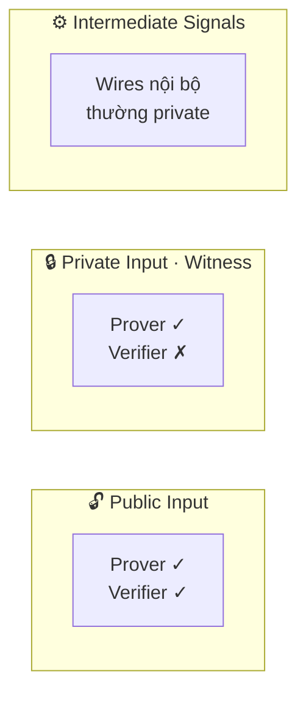
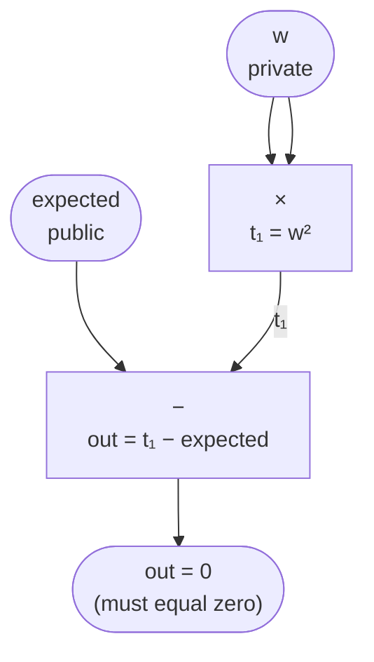
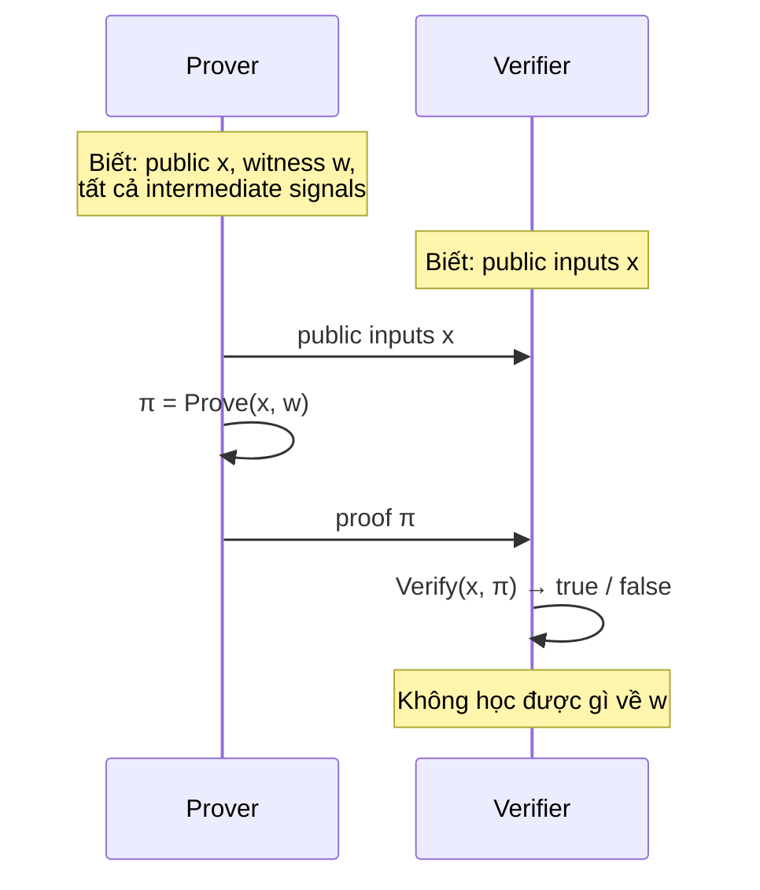
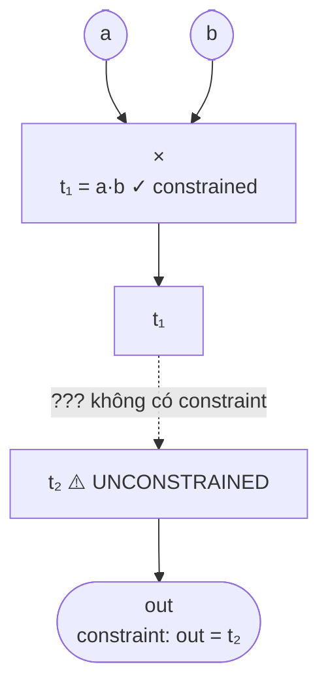

> **Prerequisites**: [[03-arithmetic-circuits|03. Arithmetic Circuits — Định nghĩa & Cấu trúc]] — gates, wires, circuit satisfiability
> **Objectives**:
> - Phân biệt rõ ba loại signal: public input, private input (witness), intermediate
> - Hiểu witness vector $\vec{z}$ và cấu trúc của nó trong R1CS
> - Nắm được luồng dữ liệu trong circuit — cái gì verifier biết, cái gì chỉ prover biết
> - Nhận biết visibility bug — lỗi phân loại signal sai dẫn đến leak thông tin hoặc unsound proof

---

## Motivation

Arithmetic circuit mô tả *phép tính*. Nhưng trong ZK, không phải tất cả wire đều được đối xử như nhau. Một số wire mang giá trị **verifier biết** (public), một số **chỉ prover biết** (private). Ranh giới này xác định **cái gì được chứng minh** và **cái gì được giữ bí mật**.

Nhầm lẫn phân loại signal là một trong những lỗi circuit phổ biến nhất trong bug bounty: khai báo một signal là public khi nó phải private (leak bí mật), hoặc một signal là private khi nó phải public (verifier không đủ thông tin để verify).

---

## 1. Ba loại Signal

> [!definition] Definition 4.1 — Signal
> Trong ngữ cảnh arithmetic circuit và constraint system, **signal** là tên gọi chung cho một wire có thể mang giá trị trong $\mathbb{F}_p$. Mỗi signal tương ứng với một phần tử trong witness vector $\vec{z}$.

Có ba loại signal:



*Ba loại signal trong circuit — phân loại đúng là yêu cầu bắt buộc để circuit vừa sound vừa zero-knowledge.*

### 1.1 Public Input

> [!definition] Definition 4.2 — Public Input
> **Public input** là signal mà cả **prover lẫn verifier** đều biết giá trị. Đây là "statement" — điều được chứng minh có liên quan đến giá trị cụ thể này.

Ví dụ trong "prove $w^2 = 9$": giá trị $9$ là public input. Verifier biết ta đang chứng minh về số $9$ cụ thể — không phải bất kỳ số nào khác.

Trong Circom, public inputs được khai báo tường minh:
```circom
// Circom syntax (tham khảo — không cần chạy)
template Square() {
    signal input w;           // private (default)
    signal input expected;    // sẽ được khai báo public
    signal output valid;

    w * w === expected;       // constraint
}

component main {public [expected]} = Square();
//                ↑ khai báo expected là public
```

### 1.2 Private Input (Witness)

> [!definition] Definition 4.3 — Private Input / Witness
> **Private input** (còn gọi là **witness**) là signal chỉ prover biết. Prover dùng witness để tạo proof, nhưng verifier **không thấy giá trị** — chỉ thấy rằng proof hợp lệ.

Witness là phần "bí mật" của ZK. Ví dụ: trong "prove tôi biết password hash khớp", password là witness — prover biết, verifier chỉ thấy hash (public input) và proof hợp lệ.

### 1.3 Intermediate Signals

> [!definition] Definition 4.4 — Intermediate Signal
> **Intermediate signal** là wire nội bộ của circuit — kết quả tạm thời của các phép tính trung gian. Chúng không phải input cũng không phải output cuối, nhưng **phải được constrain đầy đủ** để đảm bảo soundness.



*Luồng dữ liệu: $w$ private đi vào multiplication gate, $expected$ public đi vào subtraction gate — out phải bằng 0.*

> [!warning] Intermediate signals phải được constrain đầy đủ
> Một intermediate signal **không bị constrain** là một **under-constrained bug**. Prover có thể gán giá trị tùy ý cho signal đó, potentially bypass logic của circuit. Chi tiết ở Lesson 11.

---

## 2. Witness Vector $\vec{z}$

> [!definition] Definition 4.5 — Witness Vector
> Trong R1CS, toàn bộ signals của circuit được gom vào một **witness vector** $\vec{z}$:
>
> $$\vec{z} = (1, x_1, \ldots, x_\ell, w_1, \ldots, w_m)$$
>
> trong đó:
> - $1$: hằng số 1 (luôn là phần tử đầu tiên — dùng để encode constant gates)
> - $x_1, \ldots, x_\ell$: public inputs ($\ell$ signals)
> - $w_1, \ldots, w_m$: private inputs và intermediate signals ($m$ signals)
>
> Tổng kích thước: $|\vec{z}| = 1 + \ell + m$

**Tại sao có hằng số $1$?** Khi một gate cần dùng hằng số (ví dụ $+5$), ta không cần gate đặc biệt — chỉ cần nhân với signal hằng $1$ và scale hệ số. Điều này giữ cho format R1CS đồng nhất.

### Ví dụ: Witness vector cho circuit $x^3 + x + 5$

Circuit từ Lesson 03:
- $x$: public input (verifier biết $x$)
- $t_1 = x^2$: intermediate
- $t_2 = x^3$: intermediate
- $t_3 = x^3 + x$: intermediate
- $out$: public output (verifier biết $out$)

Witness vector:

$$\vec{z} = (1,\ \underbrace{x,\ out}_{\text{public}},\ \underbrace{t_1,\ t_2,\ t_3}_{\text{intermediate}})$$

```python
def build_witness_x3_plus_x_plus_5(x, p):
    """
    Tính toàn bộ signals và xây dựng witness vector
    cho circuit out = x^3 + x + 5
    """
    # Tính intermediate signals
    t1 = (x * x) % p           # x^2
    t2 = (t1 * x) % p          # x^3
    t3 = (t2 + x) % p          # x^3 + x
    out = (t3 + 5) % p         # x^3 + x + 5

    # Witness vector: [1, public inputs..., private/intermediate...]
    z = [1, x, out, t1, t2, t3]

    print(f"x = {x}")
    print(f"t1 = x^2       = {t1}")
    print(f"t2 = x^3       = {t2}")
    print(f"t3 = x^3 + x   = {t3}")
    print(f"out = x^3+x+5  = {out}")
    print(f"z = {z}")
    return z

p = 13
z = build_witness_x3_plus_x_plus_5(2, p)
```

---

## 3. Luồng dữ liệu trong ZK Protocol

Hiểu rõ ai biết gì là cực kỳ quan trọng khi audit circuit:



*Luồng tương tác ZK: prover tạo proof từ witness bí mật, verifier chỉ nhận proof và public inputs.*

### Invariant quan trọng

> [!theorem] Theorem 4.6 — ZK Visibility Invariant
> Một ZK proof system đảm bảo: verifier **không học được thêm bất kỳ thông tin nào** về witness $w$ ngoài việc biết rằng "tồn tại $w$ sao cho circuit satisfied".
>
> Hệ quả: mọi signal được khai báo **private** phải thực sự không suy luận được từ public inputs + proof.

---

## 4. Signal Visibility trong Circom — Ngữ nghĩa thực tế

Circom (ngôn ngữ viết ZK circuit phổ biến nhất) có ba từ khóa liên quan:

| Từ khóa | Ý nghĩa | Visibility |
|---------|---------|------------|
| `signal input` | Input từ bên ngoài circuit | Private (default) |
| `signal input` + `public [...]` | Input được khai báo public | Public |
| `signal output` | Output của circuit/template | Public (khi là top-level) |
| `signal` | Internal signal | Private |

```circom
// Ví dụ minh họa visibility (Circom — không cần chạy)
template Multiplier() {
    signal input a;      // private
    signal input b;      // private
    signal output c;     // public (vì là output)

    c <== a * b;         // constraint: c = a * b
}

component main {public []} = Multiplier();
// a, b: private (prover biết, verifier không biết)
// c: public (verifier biết kết quả nhân)
```

> [!warning] Output signal không tự động là public trong sub-circuits
> Trong Circom, `signal output` của một **template** (sub-circuit) chỉ là public ở **top-level component**. Khi template được dùng bên trong template khác, output của nó là intermediate — có thể private. Nhầm lẫn điều này là nguồn gốc của nhiều visibility bugs.

---

## 5. Các loại Visibility Bug thường gặp

### Bug 1: Private signal bị leak qua output

```circom
// BUG: hash_input là private nhưng lộ gián tiếp qua output
template LeakyCircuit() {
    signal input secret;
    signal output result;

    result <== secret * 2;   // result = 2 * secret
    // Verifier biết result → tính được secret = result / 2 !
}
```

**Phân tích**: Nếu constraint `result = 2 * secret` và `result` là public, verifier tính được `secret = result * inv(2)` — vi phạm privacy.

**Fix**: Thêm noise hoặc thiết kế lại circuit để output không linear với secret.

### Bug 2: Public signal bị khai báo private — Soundness hole

```python
# Giả lập: verifier chỉ kiểm tra constraint, không kiểm tra
# rằng "expected_hash" khớp với public input thực tế

def flawed_verify(proof, claimed_hash, actual_hash):
    """
    BUG: circuit nhận expected_hash là private input.
    Prover có thể dùng expected_hash = hash(fake_password)
    và verifier không biết expected_hash đó là gì!
    """
    # Verifier chỉ biết proof hợp lệ với SOME expected_hash
    # Không biết expected_hash = actual_hash hay không
    return verify_proof(proof)   # thiếu kiểm tra link public input!
```

**Fix**: `expected_hash` phải là public input — verifier tự provide giá trị này, không để prover chọn.

### Bug 3: Intermediate signal không constrain đủ



*Nếu $t_2$ không bị constrain nối với $t_1$, prover đặt $t_2$ tùy ý → soundness break.*

Nếu `t₂` không bị constrain nối với `t₁`, prover có thể đặt `t₂ = out` tùy ý → **soundness break**. Đây là under-constrained bug — chi tiết trong Lesson 11.

---

## 6. Kiểm tra Visibility khi Audit Circuit

Khi đọc một circuit để tìm bug, cần systematic walk-through sau:

```
Bước 1: Liệt kê tất cả signals
        → Phân loại: public / private / intermediate

Bước 2: Với mỗi private signal
        → Có thể suy luận từ public signals không?
        → Nếu có → visibility bug (leak)

Bước 3: Với mỗi public signal (đặc biệt là inputs)
        → Verifier có thực sự PROVIDE giá trị này không?
        → Hay prover tự chọn? → soundness bug

Bước 4: Với mỗi intermediate signal
        → Có ít nhất một constraint liên kết nó với signals khác?
        → Nếu không → under-constrained (Lesson 11)
```

```python
def audit_signals(circuit_spec):
    """
    Skeleton của công cụ audit signal visibility
    circuit_spec: dict mô tả signals và constraints
    """
    issues = []

    public_signals = set(circuit_spec['public'])
    private_signals = set(circuit_spec['private'])
    intermediate_signals = set(circuit_spec['intermediate'])
    constraints = circuit_spec['constraints']

    # Kiểm tra intermediate signals có được constrain không
    constrained = set()
    for lhs, rhs in constraints:
        constrained.update(extract_signals(lhs))
        constrained.update(extract_signals(rhs))

    for sig in intermediate_signals:
        if sig not in constrained:
            issues.append(f"UNDER-CONSTRAINED: {sig} không xuất hiện trong bất kỳ constraint nào")

    return issues

def extract_signals(expr):
    """Placeholder — thực tế parse expression tree"""
    return set(expr) if isinstance(expr, list) else {expr}
```

---

## Summary

- **Ba loại signal**: public input (verifier biết), private input / witness (chỉ prover biết), intermediate (wires nội bộ).
- **Witness vector** $\vec{z} = (1, x_1, \ldots, x_\ell, w_1, \ldots, w_m)$ — gom tất cả signals, luôn có $1$ ở đầu.
- **Visibility invariant**: verifier không học được gì thêm về witness ngoài "tồn tại witness thỏa circuit".
- **Visibility bugs**: private signal linear với public (leak), public signal bị để prover chọn (soundness hole), intermediate signal không constrain (under-constrained).
- Khi audit: phân loại signal → kiểm tra public không suy luận ra private → kiểm tra mọi intermediate đều bị constrain.

---

## References

- Justin Thaler — *Proofs, Arguments, and Zero-Knowledge*, Ch. 4
- Circom documentation — https://docs.circom.io/circom-language/signals/
- Trail of Bits — *Audit Techniques for ZK Circuits* (blog.trailofbits.com)
- 0xPARC — *ZK Bug Tracker* (github.com/0xPARC/zk-bug-tracker)
