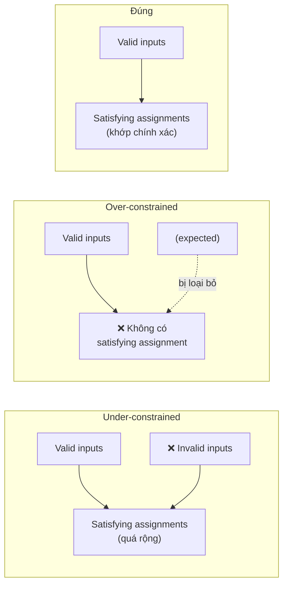
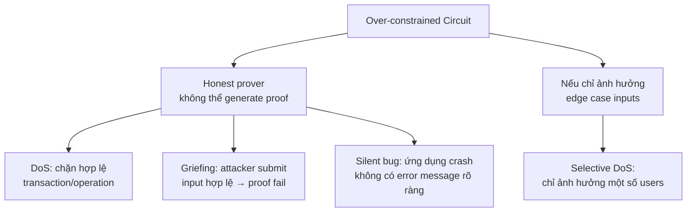

> **Prerequisites**: [[08-r1cs-soundness-completeness|08. R1CS — Soundness & Completeness]] — completeness; [[11-under-constrained-circuits|11. Under-constrained Circuits]] — phân loại constraint bugs
> **Objectives**:
> - Định nghĩa over-constrained circuit và phân biệt với under-constrained
> - Phân tích hậu quả: honest prover không thể generate proof → DoS / griefing
> - Nhận diện 4 pattern over-constrained phổ biến
> - Phân biệt over-constrained thực sự với over-constrained do precision / field mismatch

---

## Motivation

Ngược với under-constrained (quá ít constraints → soundness break), **over-constrained** là khi có quá nhiều constraints — đặc biệt là constraints mâu thuẫn nhau. Kết quả: **không tồn tại** satisfying assignment, kể cả với input hợp lệ.

Mức độ nguy hiểm: thấp hơn under-constrained (không forge được proof), nhưng có thể gây **DoS** (prover trung thực không tạo được proof), **griefing** (chặn người dùng hợp lệ), hoặc **silent failure** (circuit luôn reject mà không báo lỗi rõ ràng).

---

## 1. Định nghĩa

> [!definition] Definition 12.1 — Over-constrained Circuit
> Một circuit là **over-constrained** nếu tập satisfying assignments rỗng — không có $\vec{z}$ nào thỏa mãn toàn bộ constraints, kể cả với witness "đúng" về mặt logic.
>
> Hay: tập satisfying assignments **nhỏ hơn** tập expected valid inputs.

Lưu ý: over-constrained không phải lúc nào cũng là lỗi — đôi khi mục đích là restrict thêm. Lỗi xảy ra khi restriction quá chặt, loại bỏ cả các input hợp lệ.



*So sánh ba trường hợp: under-constrained, over-constrained, và đúng.*

---

## 2. Dạng 1 — Hai Constraints Mâu thuẫn

Hai constraints cùng constrain một signal nhưng yêu cầu giá trị khác nhau.

```python
p = 13

def r1cs_sat(A, B, C, z, p):
    """Kiểm tra R1CS: Az∘Bz = Cz, trả về True/False"""
    def mv(M, v): return [sum(M[i][j]*v[j] for j in range(len(v)))%p for i in range(len(M))]
    Az, Bz, Cz = mv(A,z), mv(B,z), mv(C,z)
    for i in range(len(Az)):
        lhs=(Az[i]*Bz[i])%p; rhs=Cz[i]
        print(f"  C{i+1}: {Az[i]}×{Bz[i]}={lhs} vs Cz={rhs} {'✓' if lhs==rhs else '✗ VIOLATED'}")
    return all((Az[i]*Bz[i]-Cz[i])%p==0 for i in range(len(Az)))

# Circuit muốn: t = x*x VÀ t = x*x + 1 (mâu thuẫn!)
# z = [1, x, t]
x = 3; t = (x*x)%p   # t = 9

A = [[0,1,0],[0,1,0]]
B = [[0,1,0],[0,1,0]]
C = [[0,0,1],          # c1: x*x = t
     [1,0,1]]          # c2: x*x = 1+t  (mâu thuẫn!)

z = [1, x, t]
print("=== Conflicting constraints ===")
sat = r1cs_sat(A, B, C, z, p)
print(f"Satisfiable: {sat}")   # False — completeness broken
```

---

## 3. Dạng 2 — Constraint Đúng nhưng Không thể Thoả trên $\mathbb{F}_p$

Một số constraint hợp lý về logic nhưng vô nghiệm trên finite field cụ thể.

```python
p = 13

# Muốn: x^2 + 11 = 0  (tức x = sqrt(-11) = sqrt(2))
# Trong F_13: -11 ≡ 2. Có sqrt(2) mod 13 không?
squares = {(x*x)%p for x in range(p)}
print(f"Quadratic residues mod {p}: {sorted(squares)}")
# QR = {0,1,3,4,9,10,12} → 2 KHÔNG phải QR

is_qr = 2 in squares
print(f"2 là QR mod {p}? {is_qr}")   # False

if not is_qr:
    print("→ Constraint x²=2 KHÔNG có nghiệm trong F_13 → over-constrained!")
```

**Ứng dụng thực tế**: Một số circuit dùng `sqrt` hoặc inverse của giá trị có thể bằng 0 — tạo ra constraint vô nghiệm với input biên.

---

## 4. Dạng 3 — Equality Constraint Quá Strict

Constraint yêu cầu hai signal bằng nhau, nhưng chỉ đúng với một subset nhỏ của valid inputs.

```circom
// BUG: constraint quá strict
template StrictCheck() {
    signal input x;
    signal input y;
    signal output out;

    x === y;           // ← constraint: x PHẢI bằng y
    out <== x + y;     // nếu x≠y → constraint trên fail → proof fail
}
// Hậu quả: chỉ hoạt động khi x=y, dù logic thực tế không yêu cầu
```

```python
p = 13

# R1CS cho StrictCheck: z = [1, x, y, out]
# Constraint 1: x = y  → (x - y)*1 = 0 → (1*x + (-1)*y)*1 = 1*0
# Constraint 2: x + y = out → 1*(x+y) = out

# Encode x = y: left = x-y, right = 1, out = 0
# Dạng R1CS: (x - y) * 1 = 0
# A: [0, 1, -1, 0], B: [1, 0, 0, 0], C: [0, 0, 0, 0]

A2 = [[0, 1, -1%p, 0],
      [1, 0,  0,   0]]
B2 = [[1, 0,  0,   0],
      [0, 1,  1,   0]]
C2 = [[0, 0,  0,   0],
      [0, 0,  0,   1]]

# Input hợp lệ: x=3, y=3
x, y = 3, 3; out=(x+y)%p
z_valid = [1, x, y, out]
print("=== x=y=3 (valid) ===")
r1cs_sat(A2, B2, C2, z_valid, p)

# Input hợp lệ nhưng x≠y: bị reject dù logic cho phép
x2, y2 = 3, 5; out2=(x2+y2)%p
z_rejected = [1, x2, y2, out2]
print("=== x=3, y=5 (logic OK nhưng bị reject!) ===")
r1cs_sat(A2, B2, C2, z_rejected, p)
```

---

## 5. Dạng 4 — Off-by-One trong Range Constraint

Range constraint sai biên: bao gồm cả 0 khi không nên, hoặc exclude giá trị hợp lệ.

```python
p = 13

# Muốn prove x ∈ [1, 10] nhưng encode nhầm x ∈ [0, 9]
# Dùng bit decomposition: x = b0 + 2*b1 + 4*b2 + 8*b3
# Với x=10: 10 = 0 + 2 + 0 + 8 → bits=[0,1,0,1] → OK
# Nhưng nếu constraint thêm b0+b1+b2+b3 < 4 (sai!) → x=10 bị loại

def check_range_constraint(x, n_bits, p):
    """
    Kiểm tra x có thể được biểu diễn bằng n_bits bits không.
    """
    if x < 0 or x >= 2**n_bits:
        return False, f"x={x} nằm ngoài range [0, {2**n_bits - 1}]"

    bits = [(x >> i) & 1 for i in range(n_bits)]
    recomposed = sum(bits[i] * (2**i) for i in range(n_bits)) % p
    return recomposed == x % p, f"bits={bits}, recomposed={recomposed}"

# Test với n_bits=3 (range [0,7]) nhưng x=10
ok, msg = check_range_constraint(10, 3, p)
print(f"x=10, n_bits=3: OK={ok}, {msg}")  # False — over-constrained

ok2, msg2 = check_range_constraint(10, 4, p)
print(f"x=10, n_bits=4: OK={ok2}, {msg2}")  # True
```

---

## 6. Phân biệt Over-constrained Thực sự vs Precision Issue

Một trường hợp tinh tế: circuit đúng về mặt toán học nhưng prover không thể generate proof vì lý do **implementation** (precision, type mismatch, integer overflow trong witness computation).

```python
p = 13

def diagnose_constraint_failure(A, B, C, z, p):
    def mv(M, v): return [sum(M[i][j]*v[j] for j in range(len(v)))%p for i in range(len(M))]
    Az, Bz, Cz = mv(A,z), mv(B,z), mv(C,z)
    failed = []
    for i in range(len(Az)):
        lhs=(Az[i]*Bz[i])%p; rhs=Cz[i]
        if lhs != rhs:
            failed.append({'constraint': i, 'Az_i': Az[i], 'Bz_i': Bz[i],
                           'lhs': lhs, 'rhs': rhs, 'diff': (lhs-rhs)%p})
    if not failed:
        print("Tất cả constraints satisfied ✓")
    else:
        for f in failed:
            print(f"Constraint {f['constraint']+1} FAILED:")
            print(f"  Az={f['Az_i']}, Bz={f['Bz_i']}, Az∘Bz={f['lhs']}, Cz={f['rhs']}")
            print(f"  Chênh lệch: {f['diff']} — nếu = ±1 thì có thể off-by-one")
    return failed

# Ví dụ: constraint off-by-one
# z = [1, x, out, t] với t = x*x, out = t + 5
# Bug: out_actual = t + 6 (sai 1)
A_oc=[[0,1,0,0],[5,0,0,1]]
B_oc=[[0,1,0,0],[1,0,0,0]]
C_oc=[[0,0,0,1],[0,0,1,0]]
x=3; t=(x*x)%p; out_wrong=(t+6)%p
z=[1, x, out_wrong, t]

print("=== Off-by-one constraint ===")
diagnose_constraint_failure(A_oc, B_oc, C_oc, z, p)
```

---

## 7. Tác động trong Hệ thống Thực

Over-constrained bugs có thể bị khai thác theo các cách sau:



*Các attack vector từ over-constrained circuit.*

---

## 8. Checklist Audit Over-constrained

```python
def audit_over_constrained(A, B, C, z_candidates, p):
    """
    Kiểm tra over-constrained bằng cách test nhiều valid witnesses.
    z_candidates: list các witness 'đúng' về mặt logic
    """
    def mv(M, v): return [sum(M[i][j]*v[j] for j in range(len(v)))%p for i in range(len(M))]

    results = []
    for z in z_candidates:
        Az, Bz, Cz = mv(A,z), mv(B,z), mv(C,z)
        sat = all((Az[i]*Bz[i]-Cz[i])%p==0 for i in range(len(Az)))
        results.append((z, sat))
        status = "✓ SAT" if sat else "✗ UNSAT (over-constrained!)"
        print(f"  z={z}: {status}")

    all_sat = all(r[1] for r in results)
    n_failed = sum(1 for r in results if not r[1])
    print(f"\n{len(z_candidates)} witnesses tested, {n_failed} failed")
    if n_failed > 0:
        print("⚠️  Over-constrained detected!")
    return all_sat

# Test: circuit x² + 5 với nhiều valid x
p = 13
A=[[0,1,0,0],[5,0,0,1]]
B=[[0,1,0,0],[1,0,0,0]]
C=[[0,0,0,1],[0,0,1,0]]

candidates = []
for x_val in range(1, 6):
    t1=(x_val*x_val)%p
    out=(t1+5)%p
    candidates.append([1, x_val, out, t1])

print("=== Audit: circuit out=x²+5 với nhiều x ===")
audit_over_constrained(A, B, C, candidates, p)
```

---

## Summary

- **Over-constrained** = tập satisfying assignments rỗng (hoặc nhỏ hơn expected) → completeness bị phá → honest prover bị reject.
- **4 dạng chính**: (1) hai constraints mâu thuẫn, (2) constraint vô nghiệm trên $\mathbb{F}_p$, (3) equality constraint quá strict, (4) off-by-one trong range constraint.
- **Hậu quả**: DoS, griefing, selective failure cho edge-case inputs.
- **Nguy hiểm tinh tế**: circuit pass unit test với "happy path" inputs nhưng fail với biên → dễ bỏ sót.
- **Audit**: test với **nhiều valid witnesses**, đặc biệt là edge cases (x=0, x=p-1, x=1, max value).

---

## References

- Justin Thaler — *Proofs, Arguments, and Zero-Knowledge*, Ch. 4
- Trail of Bits — *Audit Techniques for ZK Circuits* (blog.trailofbits.com, 2022)
- Veridise — *Common Circuit Bugs* (veridise.com/blog)
- 0xPARC — *ZK Bug Tracker* (github.com/0xPARC/zk-bug-tracker)
