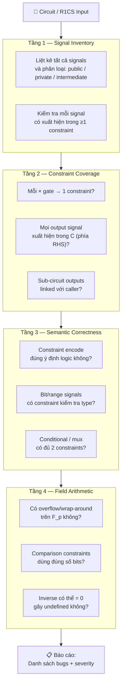
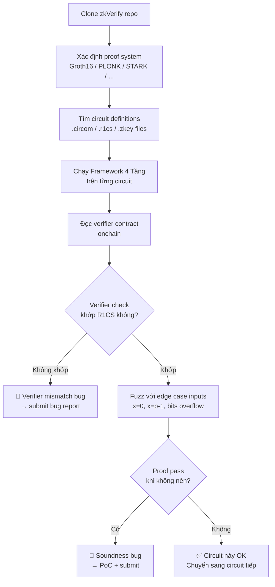

> **Prerequisites**: [[11-under-constrained-circuits|11. Under-constrained Circuits]]; [[12-over-constrained-circuits|12. Over-constrained Circuits]]; [[07-circuit-to-r1cs|07. Chuyển đổi Circuit → R1CS]]; [[10-qap-satisfiability|10. QAP Satisfiability & Divisibility]]
> **Objectives**:
> - Tổng hợp thành một framework audit hoàn chỉnh cho ZK circuit
> - Nắm vững 4 tầng kiểm tra: signal, constraint, semantic, field
> - Áp dụng được framework vào zkVerify và các ZK codebase thực tế
> - Xây dựng bộ test template để verify constraint completeness

---

## Motivation

Lessons 11 và 12 đã phân tích từng loại lỗi riêng lẻ. Bài này tổng hợp thành một **framework audit hệ thống** — quy trình từng bước để kiểm tra constraint completeness của một ZK circuit bất kỳ.

Đây là bài cuối của series, hướng trực tiếp vào mục tiêu: **bug bounty trên zkVerify**.

---

## 1. Framework Audit 4 Tầng



*Framework audit 4 tầng — từ inventory đến field arithmetic.*

---

## 2. Tầng 1 — Signal Inventory

Bước đầu tiên: lập bản đồ tất cả signals.

```python
class CircuitAuditor:
    """
    Framework audit constraint completeness cho ZK circuit.
    """

    def __init__(self, A, B, C, n_signals, p,
                 public_indices=None, output_indices=None):
        self.A = A
        self.B = B
        self.C = C
        self.n = n_signals
        self.p = p
        self.public_indices = set(public_indices or [])
        self.output_indices = set(output_indices or [])
        self.m = len(A)
        self.issues = []

    def _signal_type(self, idx):
        if idx == 0: return "const(1)"
        if idx in self.output_indices: return "output"
        if idx in self.public_indices: return "public"
        return "private/intermediate"

    def layer1_signal_inventory(self):
        """Tầng 1: kiểm tra mọi signal có xuất hiện trong constraint."""
        print("\n=== Tầng 1: Signal Inventory ===")
        for s in range(self.n):
            in_any = any(
                self.A[i][s] != 0 or self.B[i][s] != 0 or self.C[i][s] != 0
                for i in range(self.m)
            )
            stype = self._signal_type(s)
            if not in_any and s not in self.public_indices and s != 0:
                msg = f"z[{s}] ({stype}): không xuất hiện trong bất kỳ constraint nào"
                self.issues.append(("CRITICAL", "under-constrained", msg))
                print(f"  🔴 {msg}")
            else:
                print(f"  ✓ z[{s}] ({stype}): OK")
```

---

## 3. Tầng 2 — Constraint Coverage

```python
    def layer2_constraint_coverage(self):
        """Tầng 2: kiểm tra output signals bị constrain và sub-circuit linking."""
        print("\n=== Tầng 2: Constraint Coverage ===")

        # 2a. Output signals phải xuất hiện trong C (RHS của ít nhất 1 constraint)
        for out_idx in self.output_indices:
            in_C = any(self.C[i][out_idx] != 0 for i in range(self.m))
            if not in_C:
                msg = f"z[{out_idx}] (output): không bị pinned trong C — prover có thể forge"
                self.issues.append(("CRITICAL", "missing-pinning", msg))
                print(f"  🔴 {msg}")
            else:
                print(f"  ✓ z[{out_idx}] (output): pinned trong C")

        # 2b. Đếm số constraints
        print(f"  ℹ️  Tổng: {self.m} constraints cho {self.n} signals")

        # 2c. Kiểm tra constraints có cột A hoặc B không (không phải trivial 0*0=0)
        trivial = sum(
            1 for i in range(self.m)
            if all(self.A[i][j] == 0 for j in range(self.n)) or
               all(self.B[i][j] == 0 for j in range(self.n))
        )
        if trivial > 0:
            msg = f"{trivial} constraints có A hoặc B toàn 0 — có thể là redundant/useless"
            self.issues.append(("WARNING", "trivial-constraint", msg))
            print(f"  ⚠️  {msg}")
```

---

## 4. Tầng 3 — Semantic Correctness

```python
    def layer3_semantic_check(self, bit_signal_indices=None,
                               mux_constraint_pairs=None):
        """
        Tầng 3: kiểm tra semantic — bit check, mux, v.v.
        bit_signal_indices: list index của signals dùng như bit
        mux_constraint_pairs: list (b_idx, a_idx, c_idx, out_idx)
        """
        print("\n=== Tầng 3: Semantic Check ===")

        # 3a. Bit signals phải có constraint b*(b-1) = 0
        for b_idx in (bit_signal_indices or []):
            has_bit_check = False
            for i in range(self.m):
                # b*(b-1) = 0: A[i][b] = 1, B[i][b] = 1, B[i][0] = -1, C[i] = zero row
                a_is_b = (self.A[i][b_idx] != 0 and
                          sum(self.A[i][j] for j in range(self.n) if j != b_idx) == 0)
                b_has_neg_const = self.B[i][0] != 0 or self.B[i][b_idx] != 0
                if a_is_b and b_has_neg_const:
                    has_bit_check = True
                    break
            if not has_bit_check:
                msg = f"z[{b_idx}] được dùng như bit nhưng KHÔNG có constraint b*(b-1)=0"
                self.issues.append(("CRITICAL", "missing-bit-check", msg))
                print(f"  🔴 {msg}")
            else:
                print(f"  ✓ z[{b_idx}] (bit): có bit check")
```

---

## 5. Tầng 4 — Field Arithmetic

```python
    def layer4_field_check(self, range_signals=None):
        """
        Tầng 4: kiểm tra field arithmetic — overflow, range.
        range_signals: list (signal_idx, expected_max_bits)
        """
        print("\n=== Tầng 4: Field Arithmetic ===")

        # 4a. Kiểm tra constants trong ma trận có hợp lệ không
        large_threshold = self.p // 2
        for matrix_name, M in [("A", self.A), ("B", self.B), ("C", self.C)]:
            for i in range(self.m):
                for j in range(self.n):
                    v = M[i][j]
                    # Giá trị lớn gần p/2 trở lên có thể là negative encoding
                    if v > large_threshold and v != 0:
                        print(f"  ℹ️  {matrix_name}[{i}][{j}] = {v} "
                              f"(≡ {v - self.p} mod p) — negative encoding")

        # 4b. Range signal checks
        for sig_idx, max_bits in (range_signals or []):
            # Tìm constraints liên quan đến sig_idx trong C
            in_C = any(self.C[i][sig_idx] != 0 for i in range(self.m))
            if not in_C:
                msg = (f"z[{sig_idx}] cần range check ({max_bits} bits) "
                       f"nhưng không có constraint trong C")
                self.issues.append(("HIGH", "missing-range-check", msg))
                print(f"  🔴 {msg}")

    def report(self):
        """In báo cáo tổng hợp."""
        print("\n" + "="*50)
        print("AUDIT REPORT")
        print("="*50)
        if not self.issues:
            print("✅ Không tìm thấy vấn đề nào!")
            return

        by_severity = {}
        for sev, kind, msg in self.issues:
            by_severity.setdefault(sev, []).append((kind, msg))

        for sev in ["CRITICAL", "HIGH", "WARNING"]:
            if sev in by_severity:
                print(f"\n[{sev}]")
                for kind, msg in by_severity[sev]:
                    print(f"  [{kind}] {msg}")
        print(f"\nTổng: {len(self.issues)} issues")
```

---

## 6. Demo End-to-End — Audit Circuit Có Bug

Giả lập audit circuit bị under-constrained và over-constrained:

```python
p = 13

# === Circuit BUG: out = x^2 nhưng thiếu pinning cho out ===
# z = [1, x, out, t1]  — out là public output, t1 là intermediate
# Chỉ có: t1 = x*x (không có out = t1)

A_bug = [[0, 1, 0, 0]]   # c1: x * x = t1
B_bug = [[0, 1, 0, 0]]
C_bug = [[0, 0, 0, 1]]   # output = t1 (NOT out!)

auditor = CircuitAuditor(
    A=A_bug, B=B_bug, C=C_bug,
    n_signals=4, p=p,
    public_indices={1, 2},    # x và out là public
    output_indices={2}        # out cần pinning
)
auditor.layer1_signal_inventory()
auditor.layer2_constraint_coverage()
auditor.layer3_semantic_check(bit_signal_indices=[])
auditor.layer4_field_check()
auditor.report()
```

```python
# === Circuit ĐÚNG: out = x^2 + 5 ===
# z = [1, x, out, t1]
A_ok = [[0,1,0,0], [5,0,0,1]]
B_ok = [[0,1,0,0], [1,0,0,0]]
C_ok = [[0,0,0,1], [0,0,1,0]]

auditor2 = CircuitAuditor(
    A=A_ok, B=B_ok, C=C_ok,
    n_signals=4, p=p,
    public_indices={1, 2},
    output_indices={2}
)
auditor2.layer1_signal_inventory()
auditor2.layer2_constraint_coverage()
auditor2.layer3_semantic_check()
auditor2.layer4_field_check()
auditor2.report()
```

---

## 7. Áp dụng vào zkVerify — Hướng dẫn Thực tế

zkVerify là một ZK proof verification layer. Khi audit:



*Workflow áp dụng audit framework vào zkVerify codebase.*

### Checklist Cụ thể cho zkVerify

```python
ZKVERIFY_AUDIT_CHECKLIST = """
TẦNG 1 — SIGNAL INVENTORY
□ Đọc .circom hoặc .r1cs: liệt kê tất cả signals
□ Với mỗi signal: xác định type (public/private/intermediate)
□ Kiểm tra: mọi intermediate signal có ≥1 constraint
□ Kiểm tra: mọi output signal có pinning constraint

TẦNG 2 — CONSTRAINT COVERAGE
□ Đếm số × gates trong circuit
□ Số constraints ≥ số × gates?
□ Sub-circuit (component) outputs được linked với parent?
□ Có redundant/trivial constraints không? (0*0=0)

TẦNG 3 — SEMANTIC CHECK
□ Signals dùng như bit: có b*(b-1)=0 không?
□ Signals dùng làm index/selector: có range check không?
□ MUX/conditional: có đủ 2 constraints không?
□ Hash outputs: linked với expected value không?
□ Merkle path: từng step có đủ left/right selector không?

TẦNG 4 — FIELD ARITHMETIC
□ Range proofs: số bits đủ lớn để cover giá trị hợp lệ?
□ Comparison: dùng đúng technique (< vs ≤)?
□ Phép chia: denominator có thể bằng 0 không?
□ Bit decomposition: có thêm constraint ngăn overflow không?

VERIFIER CONTRACT
□ Public inputs trong Solidity khớp với R1CS public inputs?
□ Pairing equation trong verifier đúng với proof system?
□ Không có bypass nào (skip verify khi proof length = 0)?
□ Re-entrancy và front-running trong verify flow?
"""

print(ZKVERIFY_AUDIT_CHECKLIST)
```

---

## 8. Template Test Suite

Bộ test để verify constraint completeness tự động:

```python
def constraint_completeness_test_suite(A, B, C, z_valid_list,
                                        z_invalid_list, p):
    """
    Test suite đầy đủ cho constraint completeness.

    z_valid_list  : witnesses đúng — phải SAT
    z_invalid_list: witnesses sai  — phải UNSAT
    """
    def mv(M, v):
        return [sum(M[i][j]*v[j] for j in range(len(v)))%p for i in range(len(M))]
    def sat(z):
        Az,Bz,Cz=mv(A,z),mv(B,z),mv(C,z)
        return all((Az[i]*Bz[i]-Cz[i])%p==0 for i in range(len(Az)))

    print("=== Constraint Completeness Test Suite ===")
    passed = 0; failed = 0

    print("\n[Completeness — valid witnesses phải SAT]")
    for z in z_valid_list:
        ok = sat(z)
        status = "✓ PASS" if ok else "✗ FAIL (over-constrained?)"
        print(f"  z={z}: {status}")
        if ok: passed += 1
        else:  failed += 1

    print("\n[Soundness — invalid witnesses phải UNSAT]")
    for z, description in z_invalid_list:
        ok = not sat(z)
        status = "✓ PASS" if ok else "✗ FAIL (under-constrained!)"
        print(f"  z={z} [{description}]: {status}")
        if ok: passed += 1
        else:  failed += 1

    print(f"\nKết quả: {passed} passed, {failed} failed")
    return failed == 0

# Ví dụ: test circuit out = x^2 + 5
p = 13
A=[[0,1,0,0],[5,0,0,1]]
B=[[0,1,0,0],[1,0,0,0]]
C=[[0,0,0,1],[0,0,1,0]]

valid_witnesses = [
    [1, 2, (4+5)%p,  4],   # x=2: out=9, t1=4
    [1, 3, (9+5)%p,  9],   # x=3: out=1, t1=9
    [1, 0, (0+5)%p,  0],   # x=0: out=5, t1=0
    [1, 1, (1+5)%p,  1],   # x=1: out=6, t1=1
]

invalid_witnesses = [
    ([1, 3, 5,   9],   "out sai (5 thay vì 1)"),
    ([1, 3, 1,   5],   "t1 sai (5 thay vì 9)"),
    ([1, 3, 1,   0],   "t1=0, out=1 — cả hai đều sai"),
    ([1, 0, 999%p, 0], "out giả với x=0"),
]

constraint_completeness_test_suite(A, B, C, valid_witnesses, invalid_witnesses, p)
```

---

## 9. Severity Matrix

| Bug Type | Soundness | Completeness | Severity | Bounty Impact |
|----------|-----------|--------------|----------|---------------|
| Unconstrained signal | Broken | OK | **Critical** | Cao nhất |
| Missing bit check | Broken | OK | **Critical** | Cao |
| Missing sub-circuit link | Broken | OK | **Critical** | Cao |
| Wrong constraint logic | Broken | OK | **Critical** | Cao |
| Field overflow | Broken | OK | **High** | Cao |
| Conflicting constraints | OK | Broken | **High** | Trung bình |
| Off-by-one range | Partial | Partial | **Medium** | Trung bình |
| Redundant constraint | OK | OK | **Info** | Thấp |

---

## Summary

- **Framework 4 tầng**: (1) Signal Inventory, (2) Constraint Coverage, (3) Semantic Check, (4) Field Arithmetic — kiểm tra theo thứ tự từ dễ đến khó phát hiện.
- **`CircuitAuditor`**: class Python tổng hợp toàn bộ logic audit — có thể mở rộng cho từng circuit cụ thể.
- **Test suite template**: `constraint_completeness_test_suite()` với valid và invalid witnesses — đây là cách hiệu quả nhất để prove một bug tồn tại (PoC).
- **zkVerify workflow**: clone → xác định proof system → chạy framework → kiểm tra verifier contract → fuzz edge cases.
- **Severity**: soundness bugs (under-constrained) luôn critical; completeness bugs (over-constrained) thường high nhưng ít được đánh giá cao hơn.

---

## References

- 0xPARC — *ZK Bug Tracker* (github.com/0xPARC/zk-bug-tracker)
- Trail of Bits — *Circomspect Static Analyzer* (github.com/trailofbits/circomspect)
- Veridise — *Picus Automated Constraint Checker* (eprint.iacr.org/2023/1614)
- Iden3 — *Circom Security Best Practices* (docs.circom.io)
- zkVerify — *Bug Bounty Program* (immunefi.com/bounty/zkverify)
- Zellic — *ZK Security Auditing Techniques* (zellic.io/blog/zk-security)
