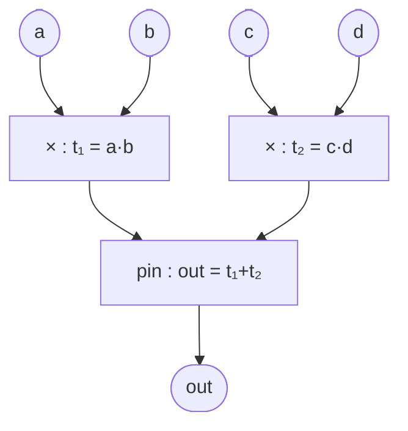
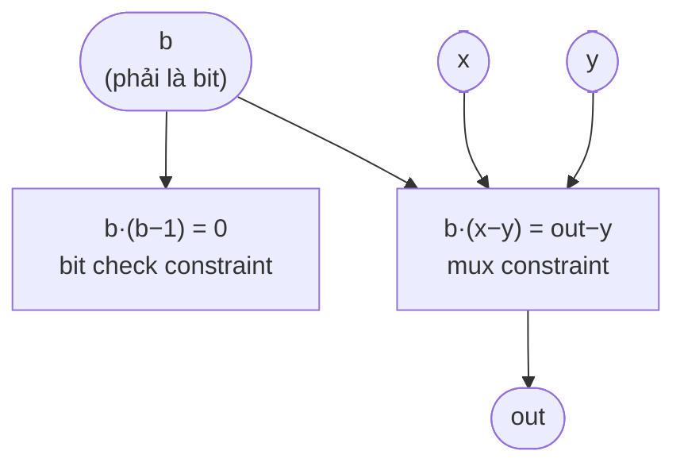

> **Bài tập có lời giải** — Hai ví dụ end-to-end đầy đủ hơn, xây từ đầu đến QAP, kèm verification code.

---

## Ví dụ 1: $out = (a \cdot b) + (c \cdot d)$

Circuit tính tổng của hai tích — 2 multiplication gates, 1 addition gate.

### Bước 1 — Circuit và Signals



*Circuit tính $out = ab + cd$ — 2 multiplication gates, addition hấp thụ vào pinning constraint.*

**Signals và witness vector**: $\vec{z} = (z_0, z_1, z_2, z_3, z_4, z_5, z_6)$

| Index | Signal | Giá trị ($a=2, b=3, c=4, d=5, p=17$) |
|-------|--------|--------------------------------------|
| $z_0$ | $1$ | $1$ |
| $z_1$ | $a$ | $2$ |
| $z_2$ | $b$ | $3$ |
| $z_3$ | $c$ | $4$ |
| $z_4$ | $d$ | $5$ |
| $z_5$ | $out$ | $(6+20) \bmod 17 = 9$ |
| $z_6$ | $t_1$ | $6$ |
| $z_7$ | $t_2$ | $20 \bmod 17 = 3$ |

Witness vector: $\vec{z} = (1, 2, 3, 4, 5, 9, 6, 3)$, kích thước $n = 8$.

### Bước 2 — Flat Constraints

**Constraint 1**: $a \cdot b = t_1 \implies z_1 \cdot z_2 = z_6$

**Constraint 2**: $c \cdot d = t_2 \implies z_3 \cdot z_4 = z_7$

**Constraint 3** (pinning): $1 \cdot (t_1 + t_2) = out \implies 1 \cdot (z_6 + z_7) = z_5$

$m = 3$ constraints, $n = 8$ signals.

### Bước 3 — Ma trận R1CS

Hàng thứ $i$: hệ số trên các ký hiệu $[z_0, z_1, z_2, z_3, z_4, z_5, z_6, z_7]$

$$A = \begin{pmatrix} 0&1&0&0&0&0&0&0 \\ 0&0&0&1&0&0&0&0 \\ 1&0&0&0&0&0&0&0 \end{pmatrix}$$

$$B = \begin{pmatrix} 0&0&1&0&0&0&0&0 \\ 0&0&0&0&1&0&0&0 \\ 0&0&0&0&0&0&1&1 \end{pmatrix}$$

$$C = \begin{pmatrix} 0&0&0&0&0&0&1&0 \\ 0&0&0&0&0&0&0&1 \\ 0&0&0&0&0&1&0&0 \end{pmatrix}$$

### Bước 4 — Verify R1CS

```python
p = 17

def r1cs_verify(A, B, C, z, p, label=""):
    def mv(M, v):
        return [sum(M[i][j]*v[j] for j in range(len(v))) % p for i in range(len(M))]
    Az, Bz, Cz = mv(A, z), mv(B, z), mv(C, z)
    ok = all((Az[i]*Bz[i] - Cz[i]) % p == 0 for i in range(len(Az)))
    print(f"{'[' + label + '] ' if label else ''}R1CS satisfied: {ok}")
    for i in range(len(Az)):
        lhs = (Az[i]*Bz[i]) % p
        print(f"  C{i+1}: {Az[i]} × {Bz[i]} = {lhs}, Cz = {Cz[i]} {'✓' if lhs==Cz[i] else '✗'}")
    return ok

a, b, c, d = 2, 3, 4, 5
t1 = (a*b) % p          # 6
t2 = (c*d) % p          # 20 % 17 = 3
out = (t1 + t2) % p     # 9

z = [1, a, b, c, d, out, t1, t2]
print(f"z = {z}")

#        z0 z1 z2 z3 z4 z5 z6 z7
A = [
    [0, 1, 0, 0, 0, 0, 0, 0],   # c1 left: a
    [0, 0, 0, 1, 0, 0, 0, 0],   # c2 left: c
    [1, 0, 0, 0, 0, 0, 0, 0],   # c3 left: 1
]
B = [
    [0, 0, 1, 0, 0, 0, 0, 0],   # c1 right: b
    [0, 0, 0, 0, 1, 0, 0, 0],   # c2 right: d
    [0, 0, 0, 0, 0, 0, 1, 1],   # c3 right: t1 + t2
]
C = [
    [0, 0, 0, 0, 0, 0, 1, 0],   # c1 out: t1
    [0, 0, 0, 0, 0, 0, 0, 1],   # c2 out: t2
    [0, 0, 0, 0, 0, 1, 0, 0],   # c3 out: out
]

r1cs_verify(A, B, C, z, p, label="ab+cd correct")
```

### Bước 5 — QAP Construction

```python
def lagrange_3pt(r1, y1, r2, y2, r3, y3, p):
    """Lagrange interpolation qua 3 điểm, trả về hệ số [a0, a1, a2]."""
    def inv(x, p): return pow(x, p-2, p)
    # L1(x) = (x-r2)(x-r3)/((r1-r2)(r1-r3))
    d1 = (inv((r1-r2)%p, p) * inv((r1-r3)%p, p)) % p
    # L2, L3 tương tự — dùng numpy-style tính bằng tay
    def make_L(ri, rj, rk, p):
        # (x-rj)(x-rk) = x^2 - (rj+rk)x + rj*rk
        d = (inv((ri-rj)%p, p) * inv((ri-rk)%p, p)) % p
        a0 = (rj*rk % p * d) % p
        a1 = (-(rj+rk) % p * d) % p
        a2 = d
        return [a0 % p, a1 % p, a2 % p]
    L1 = make_L(r1, r2, r3, p)
    L2 = make_L(r2, r1, r3, p)
    L3 = make_L(r3, r1, r2, p)
    # f(x) = y1*L1 + y2*L2 + y3*L3
    result = [(y1*L1[k] + y2*L2[k] + y3*L3[k]) % p for k in range(3)]
    return result

def poly_eval(coeffs, x, p):
    result = 0
    for c in reversed(coeffs): result = (result*x + c) % p
    return result

# Domain H = {1, 2, 3}
r1, r2, r3 = 1, 2, 3

# Ví dụ: interpolate u_1(x) cho cột j=1 của A
# A[:,1] = [1, 0, 0]  (A[0][1]=1, A[1][1]=0, A[2][1]=0)
A_col1 = [1, 0, 0]
u1 = lagrange_3pt(r1, A_col1[0], r2, A_col1[1], r3, A_col1[2], p)
print(f"\nu_1(x) = {u1[0]} + {u1[1]}x + {u1[2]}x²")

# Verify: u1(1)=1, u1(2)=0, u1(3)=0
for ri, yi in [(r1, 1), (r2, 0), (r3, 0)]:
    val = poly_eval(u1, ri, p)
    print(f"  u_1({ri}) = {val}, expected {yi} {'✓' if val==yi else '✗'}")
```

---

## Ví dụ 2: Boolean MUX với Bit Check Đầy đủ

Circuit: $out = \text{if } b \text{ then } x \text{ else } y$ với $b \in \{0,1\}$ được enforce.

### Circuit và Constraints



*Circuit MUX đầy đủ với bit check — 2 constraints, witness vector kích thước 5.*

**Witness**: $\vec{z} = (z_0, z_1, z_2, z_3, z_4) = (1, b, x, y, out)$

**2 Constraints**:

1. **Bit check**: $b \cdot (b - 1) = 0 \implies b \cdot b = b$

   $A_1 = [0,1,0,0,0]$, $B_1 = [0,1,0,0,0]$, $C_1 = [0,1,0,0,0]$

2. **MUX**: $b \cdot (x - y) = out - y$

   $A_2 = [0,1,0,0,0]$, $B_2 = [0,0,1,-1,0]$, $C_2 = [0,0,0,-1,1]$

```python
p = 17

#        z0  z1  z2   z3   z4
A = [
    [0,  1,  0,   0,   0],    # c1 left: b
    [0,  1,  0,   0,   0],    # c2 left: b
]
B = [
    [0,  1,  0,   0,   0],    # c1 right: b
    [0,  0,  1,  -1,   0],    # c2 right: x - y
]
C = [
    [0,  1,  0,   0,   0],    # c1 out: b  (b*b = b)
    [0,  0,  0,  -1,   1],    # c2 out: out - y
]

# Normalize negative values to F_p
A = [[(v % p) for v in row] for row in A]
B = [[(v % p) for v in row] for row in B]
C = [[(v % p) for v in row] for row in C]

x_val, y_val = 10, 4

print("=== b=1 (output = x) ===")
b1, out1 = 1, x_val
z1 = [1, b1, x_val, y_val, out1]
r1cs_verify(A, B, C, z1, p, "b=1")

print("\n=== b=0 (output = y) ===")
b0, out0 = 0, y_val
z0 = [1, b0, x_val, y_val, out0]
r1cs_verify(A, B, C, z0, p, "b=0")

print("\n=== b=7 (not a bit — phải UNSAT) ===")
b_bad = 7
out_bad = (b_bad*(x_val - y_val) + y_val) % p
z_bad = [1, b_bad, x_val, y_val, out_bad]
r1cs_verify(A, B, C, z_bad, p, "b=7 (bad)")

print("\n=== b=1, out sai — phải UNSAT ===")
z_wrong_out = [1, 1, x_val, y_val, y_val]   # b=1 nhưng đưa out=y
r1cs_verify(A, B, C, z_wrong_out, p, "b=1 wrong out")
```

### R1CS Completeness Test

```python
print("\n=== Completeness Test Suite: MUX ===")

valid = [
    [1, 0, x_val, y_val, y_val],   # b=0 → out=y
    [1, 1, x_val, y_val, x_val],   # b=1 → out=x
]
invalid = [
    ([1, 7, x_val, y_val, out_bad], "b=7 không phải bit"),
    ([1, 1, x_val, y_val, y_val],   "b=1 nhưng out=y"),
    ([1, 0, x_val, y_val, x_val],   "b=0 nhưng out=x"),
]

def mv(M, v):
    return [sum(M[i][j]*v[j] for j in range(len(v))) % p for i in range(len(M))]
def sat(z):
    Az,Bz,Cz=mv(A,z),mv(B,z),mv(C,z)
    return all((Az[i]*Bz[i]-Cz[i])%p==0 for i in range(len(Az)))

print("Valid witnesses (phải SAT):")
for z in valid:
    print(f"  z={z}: {'✓ SAT' if sat(z) else '✗ FAIL'}")

print("Invalid witnesses (phải UNSAT):")
for z, desc in invalid:
    print(f"  [{desc}]: {'✓ UNSAT' if not sat(z) else '✗ WRONG — UNDER-CONSTRAINED!'}")
```

---

## Tổng hợp: So sánh hai ví dụ

| | Ví dụ 1: $ab+cd$ | Ví dụ 2: MUX |
|--|-----------------|--------------|
| **Signals** | 8 | 5 |
| **Constraints** | 3 | 2 |
| **× gates** | 2 | 1 (bit check) + 1 (mux) |
| **Addition xử lý** | Pinning constraint | Hấp thụ vào B/C linear combo |
| **Special check** | Không | Bit check bắt buộc |
| **Pattern** | Arithmetic computation | Conditional/selector |

---

*Appendix kết thúc — quay lại [[index|Index]] để xem toàn bộ series.*
