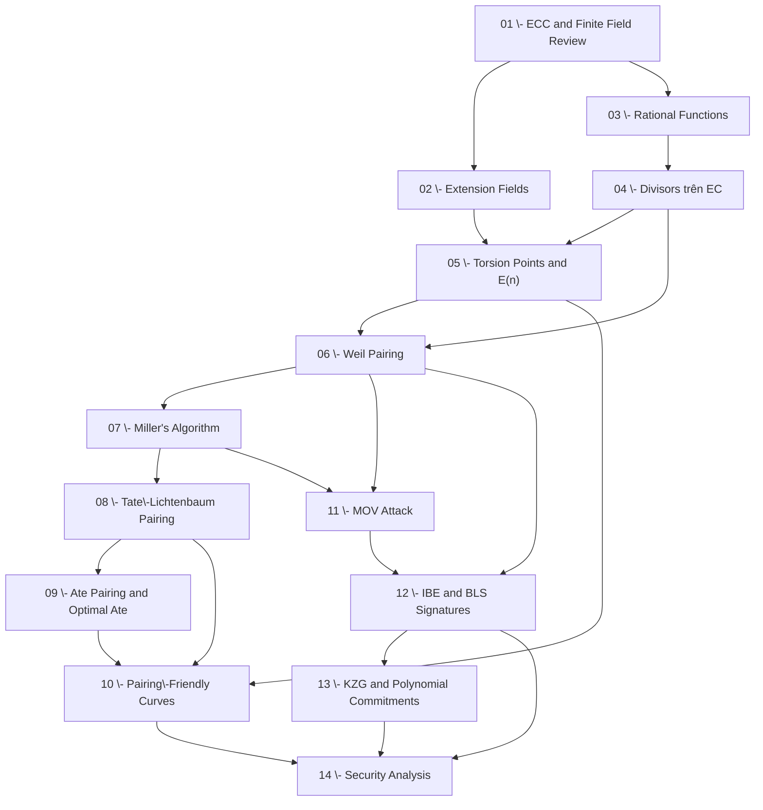

# Roadmap: Pairing trên Đường Cong Elliptic (Pairings on Elliptic Curves)

> **Level**: Research — đủ để đọc paper và implement **Background**: ECC cơ bản, đại số tuyến tính, trường hữu hạn cơ bản **SageMath**: Có **Obsidian Theorem Plugin**: Có **Ngôn ngữ**: Nội dung tiếng Việt — thuật ngữ toán tiếng Anh
> 
> **Textbooks chính:**
> 
> - Silverman — _The Arithmetic of Elliptic Curves_ (AEC)
> - Washington — _Elliptic Curves: Number Theory and Cryptography_
> - Galbraith — _Mathematics of Public Key Cryptography_ (MoPKC), Ch. 26
> - Sutherland — MIT 18.783 Lecture Notes (2022), Lectures 23–24
> - Lynn — _PBC: Notes on Elliptic Curves_ (Stanford, BLS thesis)
> - Costello — _Pairing for Beginners_

---

## Tổng quan lộ trình

Lộ trình gồm **4 giai đoạn** và **14 lessons**, đi từ nền tảng đại số hình học cần thiết, qua định nghĩa và tính toán pairing, đến ứng dụng mật mã học và phân tích bảo mật.

```
Giai đoạn A — Nền tảng (Lessons 01–03)
  └─ Chuẩn bị toán cụ thể: ECC, extension fields, rational functions

Giai đoạn B — Cơ sở lý thuyết Pairing (Lessons 04–07)
  └─ Divisors, torsion, Weil pairing, Miller's algorithm

Giai đoạn C — Các Pairing thực tế (Lessons 08–10)
  └─ Tate, Ate, pairing-friendly curves, embedding degree

Giai đoạn D — Ứng dụng Mật mã (Lessons 11–14)
  └─ MOV attack, IBE, BLS, SNARKs/KZG, bảo mật
```

---

## Bảng Lessons

|#|Tên Lesson|Khái niệm chính|Prerequisite|Độ khó|
|---|---|---|---|---|
|**01**|**ECC và Finite Field Review**|Group law, $E(\mathbb{F}_q)$, Frobenius, $j$-invariant, torsion subgroup $E[n]$|—|★☆☆☆☆|
|**02**|**Extension Fields và Tower Extensions**|$\mathbb{F}_{q^k}$, tower $\mathbb{F}_q \subset \mathbb{F}_{q^k}$, roots of unity $\mu_n$, norm map|01|★★☆☆☆|
|**03**|**Rational Functions và Algebraic Geometry trên Curves**|$\bar{k}(E)$, zeros/poles, order of vanishing $\text{ord}_P(f)$, Riemann–Roch sơ lược|01|★★★☆☆|
|**04**|**Divisors trên Đường Cong Elliptic**|$\text{Div}(E)$, $\text{Div}^0(E)$, principal divisors, Picard group $\text{Pic}^0(E)$, $\text{div}(f)$, Weil reciprocity|03|★★★☆☆|
|**05**|**Torsion Points và Cấu trúc $E[n]$**|$E[n] \cong (\mathbb{Z}/n\mathbb{Z})^2$, Galois action, embedding degree $k$, $\mu_n \subset \mathbb{F}_{q^k}^\times$|01, 02, 04|★★★☆☆|
|**06**|**Weil Pairing — Định nghĩa và Tính chất**|Định nghĩa $e_n : E[n] \times E[n] \to \mu_n$, bilinearity, non-degeneracy, alternating, Galois-equivariance|04, 05|★★★★☆|
|**07**|**Miller's Algorithm — Tính Weil Pairing hiệu quả**|Miller functions $f_{n,P}$, double-and-add loop, độ phức tạp $O(\log n)$, SageMath implementation|06|★★★★☆|
|**08**|**Tate–Lichtenbaum Pairing**|Định nghĩa $t_n : E(\mathbb{F}_q)[n] \times E(\mathbb{F}_q)/nE(\mathbb{F}_q) \to \mathbb{F}_{q^k}^\times / (\mathbb{F}_{q^k}^\times)^n$, final exponentiation, so sánh với Weil|06, 07|★★★★☆|
|**09**|**Ate Pairing và Optimal Ate Pairing**|Ate pairing, Miller loop rút gọn, twist curves, denominator elimination, Optimal Ate, tại sao Ate nhanh hơn Tate|08|★★★★★|
|**10**|**Pairing-Friendly Curves và Embedding Degree**|Embedding degree $k$, MNT curves, BN curves, BLS12 curves, Freeman–Scott–Teske taxonomy, constructing curves via CM|05, 08, 09|★★★★★|
|**11**|**MOV Attack và Frey–Rück Reduction**|Pairing-based ECDLP $\to$ DLP trong $\mathbb{F}_{q^k}^\times$, điều kiện supersingular, tại sao random curves an toàn|06, 07|★★★☆☆|
|**12**|**Ứng dụng: IBE và BLS Signatures**|Boneh–Franklin IBE, Joux tripartite DH, BLS short signatures, Short group signatures, tính chất từ bilinearity|06, 11|★★★★☆|
|**13**|**Ứng dụng: Polynomial Commitments và KZG**|KZG commitment scheme, trusted setup, opening proofs, $e(C - [v]G_1, H) = e(\pi, [\tau - x]G_2)$, Plonk/Groth16 context|12|★★★★★|
|**14**|**Bảo mật Pairing-Based Cryptography**|BDH assumption, DBDH, $q$-type assumptions, MOV threshold, subgroup attacks, twist attacks, security levels cho BN254/BLS12-381|10, 12, 13|★★★★★|

---

## Dependency Graph



---

## Định hướng nội dung mỗi giai đoạn

### Giai đoạn A — Nền tảng (Lessons 01–03)

Mục tiêu: Kiến chắc lại các công cụ toán sẽ dùng xuyên suốt. Không phải "ôn tập nhàm" — những thứ như **rational functions trên curves**, **order of vanishing**, **Riemann–Roch** là thứ nhiều người học ECC bỏ qua nhưng hoàn toàn cần thiết để hiểu divisors.

- Lesson 01 có thể đọc lướt nếu ECC đã vững; tập trung vào torsion và Frobenius.
- Lesson 02 quan trọng cho phần kỹ thuật: mọi pairing output vào $\mathbb{F}_{q^k}^\times$, phải hiểu trường này.
- Lesson 03 là bước nhảy lớn — đây là điểm nhiều tài liệu không giải thích rõ.

### Giai đoạn B — Lý thuyết Pairing (Lessons 04–07)

Mục tiêu: Hiểu **tại sao** Weil pairing tồn tại, **tại sao** nó bilinear, và **làm thế nào** tính được nó bằng máy tính.

- Lesson 04–05 là nền tảng đại số hình học thuần túy — cần đọc kỹ.
- Lesson 06 là trọng tâm lý thuyết: định nghĩa qua divisors, chứng minh bilinearity từ Weil reciprocity.
- Lesson 07 là trọng tâm thuật toán: Miller's algorithm, implement SageMath, verify bằng toy example.

### Giai đoạn C — Pairing thực tế (Lessons 08–10)

Mục tiêu: Hiểu tại sao **Tate** và **Ate** được dùng trong thực tế thay vì Weil; biết chọn curve phù hợp.

- Lesson 08: Tate khác Weil ở chỗ chỉ cần một lần gọi Miller, output cần final exponentiation.
- Lesson 09: Ate pairing là state-of-the-art, dùng trong BN254, BLS12-381.
- Lesson 10: Đây là "engineering" của pairing — BN254 và BLS12-381 là hai curves thực tế nhất hiện nay.

### Giai đoạn D — Ứng dụng & Bảo mật (Lessons 11–14)

Mục tiêu: Đọc được paper về IBE, BLS, SNARKs; biết đánh giá security margin của một scheme.

- Lesson 11 là bước "nối" — attack đầu tiên dùng pairing, giải thích tại sao chỉ một số curves an toàn.
- Lesson 12–13: Các ứng dụng kinh điển, mỗi ứng dụng minh họa một property khác nhau của pairing.
- Lesson 14: Phân tích bảo mật, các assumption phổ biến, security bits cho curves hiện đại.

---

## Tài liệu tham khảo chính

|Mã|Tài liệu|
|---|---|
|AEC|Silverman, _The Arithmetic of Elliptic Curves_, Springer GTM 106|
|Wash|Washington, _Elliptic Curves: Number Theory and Cryptography_, 2nd ed., CRC Press|
|MoPKC|Galbraith, _Mathematics of Public Key Cryptography_, Cambridge UP — [Free PDF](https://www.math.auckland.ac.nz/~sgal018/crypto-book/)|
|MIT18.783|Sutherland, MIT 18.783 Lecture Notes 2022 — [Free PDF](https://math.mit.edu/classes/18.783/)|
|PfB|Costello, _Pairing for Beginners_ — [Free PDF](https://www.craigcostello.com.au/s/PairingsForBeginners.pdf)|
|Lynn|Ben Lynn, PBC Notes — [Web](https://crypto.stanford.edu/pbc/notes/)|
|BF01|Boneh & Franklin, _Identity-Based Encryption from the Weil Pairing_, CRYPTO 2001|
|BLS01|Boneh, Lynn & Shacham, _Short Signatures from the Weil Pairing_, ASIACRYPT 2001|
|KZG10|Kate, Zaverucha & Goldberg, _Constant-Size Commitments to Polynomials_, ASIACRYPT 2010|
|FST10|Freeman, Scott & Teske, _A Taxonomy of Pairing-Friendly Elliptic Curves_, J. Cryptology 2010|

---

## Progress Tracker

### Giai đoạn A — Nền tảng

- [ ] 01 - ECC và Finite Field Review
- [ ] 02 - Extension Fields và Tower Extensions
- [ ] 03 - Rational Functions và Algebraic Geometry trên Curves

### Giai đoạn B — Lý thuyết Pairing

- [ ] 04 - Divisors trên Đường Cong Elliptic
- [ ] 05 - Torsion Points và Cấu trúc $E[n]$
- [ ] 06 - Weil Pairing — Định nghĩa và Tính chất
- [ ] 07 - Miller's Algorithm — Tính Weil Pairing hiệu quả

### Giai đoạn C — Pairing thực tế

- [ ] 08 - Tate–Lichtenbaum Pairing
- [ ] 09 - Ate Pairing và Optimal Ate Pairing
- [ ] 10 - Pairing-Friendly Curves và Embedding Degree

### Giai đoạn D — Ứng dụng & Bảo mật

- [ ] 11 - MOV Attack và Frey–Rück Reduction
- [ ] 12 - Ứng dụng: IBE và BLS Signatures
- [ ] 13 - Ứng dụng: Polynomial Commitments và KZG
- [ ] 14 - Bảo mật Pairing-Based Cryptography