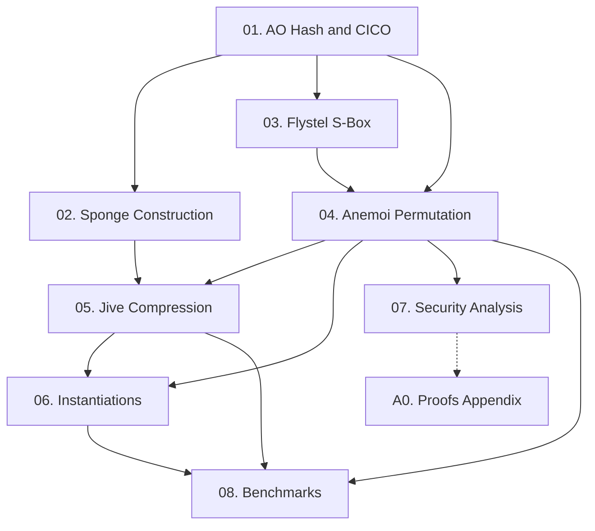

Paper này đề xuất **Anemoi** — một họ ZK-friendly permutation cho hash function và compression function, tối ưu đồng thời cho R1CS, Plonk, và native performance. Hai đóng góp kỹ thuật chính là S-box **Flystel** (khai thác CCZ-equivalence) và mode hoạt động **Jive** (Merkle tree compression). Course này cover toàn bộ nội dung của paper [Bou+22/23].

**Tài liệu gốc**: [ePrint 2022/840](https://eprint.iacr.org/2022/840)  
**Published**: CRYPTO 2023, LNCS 14083, pp. 507–539  
**Kiến thức nền tảng yêu cầu** (🔴 Prerequisite references): Sponge construction [BDPV07/08], Groth16 R1CS [Gro16], Plonk [GWC19], CCZ-equivalence [CCZ98], finite fields $\mathbb{F}_p$

---

## Lesson Overview

| # | Title | Type | Covers | File | Dependencies |
|---|-------|------|--------|------|-------------|
| 01 | AO Hash Functions & CICO Problem | Foundation | §1, §2.1–§2.4 | [[01-ao-hash-functions-and-cico\|01. AO Hash Functions & CICO]] | — |
| 02 | Sponge Construction & Hash Security | Foundation | §3 | [[02-sponge-construction\|02. Sponge Construction]] | 01 |
| 03 | The Flystel S-Box | Math Component | §4.1–§4.5 | [[03-flystel-sbox\|03. The Flystel S-Box]] | 01 |
| 04 | The Anemoi Permutation | Scheme | §5.1–§5.5, Table 1 | [[04-anemoi-permutation\|04. The Anemoi Permutation]] | 01, 03 |
| 05 | Jive Compression Mode | Scheme | §6.1, §6.3 | [[05-jive-compression-mode\|05. Jive Compression Mode]] | 02, 04 |
| 06 | Concrete Instantiations & Security Claims | Deep Dive | §6.2–§6.4 | [[06-anemoi-instantiations\|06. Concrete Instantiations]] | 04, 05 |
| 07 | Security Analysis: Algebraic Attacks | Attack | §7.1–§7.5, Eq. (2) | [[07-security-analysis-algebraic-attacks\|07. Security Analysis]] | 04 |
| 08 | Performance & Benchmarks | Deep Dive | §8 | [[08-performance-benchmarks\|08. Performance & Benchmarks]] | 04, 05, 06 |
| A0 | Security Proofs Appendix | Deep Dive | Appendix A | [[a0-security-proofs\|A0. Security Proofs]] | 07 |

**Lesson types**: Foundation · Math Component · Scheme · Attack · Deep Dive

---

## Coverage Map

| Document section | Covered in lesson |
|-----------------|-------------------|
| §1 Introduction, Contributions, Applications | 01 |
| §2.1–§2.2 Notation, AO landscape | 01 |
| §2.3 CICO Problem | 01 |
| §2.4 Existing AO primitives (MiMC, Rescue, Poseidon, Griffin) | 01 |
| §3 Sponge / Duplex Construction | 02 |
| §3 Indifferentiability, Hermetic Sponge | 02 |
| §4.1 Butterfly structure background | 03 |
| §4.2 Open Flystel H | 03 |
| §4.3 Closed Flystel V | 03 |
| §4.4 CCZ-equivalence of H and V | 03 |
| §4.5 Arithmetization cost analysis | 03 |
| §5.1 Round constants | 04 |
| §5.2 Linear layer (MDS + Pseudo-Hadamard) | 04 |
| §5.3 S-box layer | 04 |
| §5.4–§5.5 Full permutation, Table 1 | 04 |
| §6.1 AnemoiJive / Jive mode | 05 |
| §6.2 AnemoiSponge | 06 |
| §6.3 BLS12-381, BN-254 instances | 06 |
| §6.4 Security claims | 06 |
| §7.1 Statistical attacks | 07 |
| §7.2–§7.3 Algebraic attacks / Gröbner basis | 07 |
| §7.4–§7.5 Interpolation, round count Eq. (2) | 07 |
| §8 Performance benchmarks | 08 |
| Appendix A | A0 |

---

## Dependency Graph

---

## Progress

- [x] [[01-ao-hash-functions-and-cico|01. AO Hash Functions & CICO]]
- [x] [[02-sponge-construction|02. Sponge Construction]]
- [x] [[03-flystel-sbox|03. The Flystel S-Box]]
- [x] [[04-anemoi-permutation|04. The Anemoi Permutation]]
- [x] [[05-jive-compression-mode|05. Jive Compression Mode]]
- [x] [[06-anemoi-instantiations|06. Concrete Instantiations]]
- [x] [[07-security-analysis-algebraic-attacks|07. Security Analysis]]
- [x] [[08-performance-benchmarks|08. Performance & Benchmarks]]
- [x] [[a0-security-proofs|A0. Security Proofs]]

---

## 🟡 Integrated References

| Ref Key | Used in lesson | What is integrated |
|---------|---------------|--------------------|
| [AABDS20] Rescue-Prime | 01, 08 | Design comparison: $x^{1/\alpha}$ inversions; R1CS/Plonk constraint counts |
| [GKRRS21] Poseidon | 01, 08 | Primary R1CS/Plonk benchmark target; design contrast với full/partial rounds |
| [BCI+20] Butterfly structures | 03 | Open/closed butterfly — Flystel directly extends; CCZ property source |
| [BDPV11] Hermetic sponge | 02 | Security model cho AnemoiSponge — hermetic claim |

---

## Notes

- Lesson 01 và 02 là foundation — nên đọc trước khi vào bất kỳ lesson kỹ thuật nào.
- Lesson 03 (Flystel) là trọng tâm lý thuyết của paper — CCZ-equivalence là đóng góp mới nhất.
- Lesson 07 (Security Analysis) có thể đọc độc lập sau Lesson 04, không cần 05/06.
- A0 chỉ cần nếu muốn đọc extended proofs của Appendix A.
- Đọc song song paper gốc: https://eprint.iacr.org/2022/840
