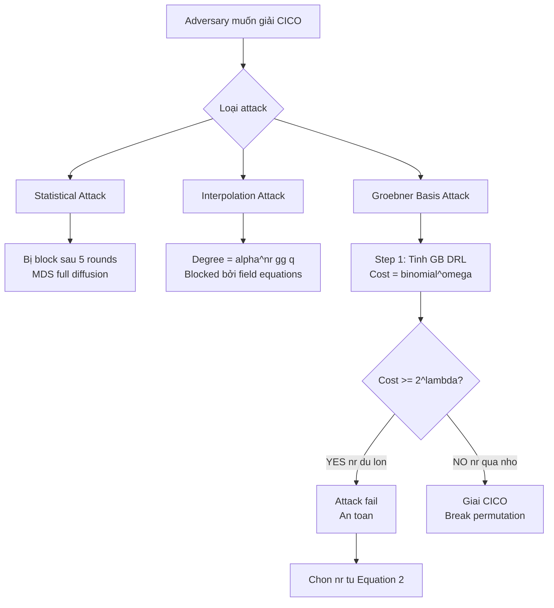

> **Prerequisites**: Anemoi permutation (xem [[04-anemoi-permutation|04. The Anemoi Permutation]]), CICO problem (xem [[01-ao-hash-functions-and-cico|01. AO Hash Functions & CICO]]), đa thức nhiều biến và Gröbner basis (ở mức khái niệm)
> 🔴 **Prerequisite references**: Lê et al. — *Gröbner Bases* [CLO15] (Cox, Little, O'Shea — *Ideals, Varieties, and Algorithms*); FGLM algorithm [FGLM93] (Faugère et al. — *Efficient computation of zero-dimensional Gröbner bases*)
> **Lesson type**: Attack
> **Covers**: §7.1 (statistical attacks — trivial), §7.2–§7.3 (algebraic attacks: CICO encoding, Gröbner basis complexity), §7.4 (interpolation attacks), §7.5 (round number justification — Equation (2))
>
> **Notation** (ký hiệu dùng trong bài này):
> | Ký hiệu | Ý nghĩa |
> |---------|---------|
> | $\mathcal{F}_\text{CICO}$ | Hệ phương trình đa thức encoding CICO problem |
> | $x_j, y_j$ | Các biến trung gian tại round $j$ ($j = 0,\ldots,n_r$) |
> | $d_\text{reg}$ | Degree of regularity của hệ $\mathcal{F}_\text{CICO}$ |
> | $\kappa_\alpha$ | Constant phụ thuộc $\alpha$: $\kappa_3=1, \kappa_5=2, \kappa_7=4, \kappa_{11}=9$ |
> | $\mathsf{GB}_\text{DRL}$ | Gröbner basis theo DRL (Degree Reverse Lexicographic) ordering |
> | $\mathsf{GB}_\text{LEX}$ | Gröbner basis theo LEX ordering — chứa univariate polynomial |
> | $\omega$ | Exponent linear algebra ($\approx 2.37$ — Coppersmith–Winograd) |

---

## Motivation — Tại sao phân tích algebraic attacks?

Paper [Bou+22/23, §7] lý giải rằng với AO permutations như Anemoi, **algebraic attacks là mối đe dọa duy nhất thực sự cần lo lắng**:

- **Statistical attacks** (differential, linear cryptanalysis): Anemoi dùng MDS matrix + Flystel với high algebraic degree — chỉ cần một vài rounds để đạt full diffusion. Statistical attacks chỉ cần rất ít rounds và được xử lý "for free".
- **Algebraic attacks** (Gröbner basis, interpolation): đây là bottleneck thực sự, driven bởi cấu trúc đa thức của Flystel.

Số rounds $n_r$ trong Table 1 được chọn dựa hoàn toàn vào algebraic attack complexity — không phải statistical.

---

## 1. Context — Threat Model

> [!note] Threat Model 1.1
> **Mục tiêu của adversary**: Giải CICO problem cho Anemoi — tìm $(x_0, y_0)$ với $x_0 = 0$ sao cho output sau $n_r$ rounds có $x_{n_r} = 0$.
>
> **Cách tiếp cận tự nhiên**: Encode CICO thành hệ phương trình đa thức $\mathcal{F}_\text{CICO}$ rồi giải bằng Gröbner basis.
>
> **Điều kiện thành công**: Adversary có thể tính toán Gröbner basis với complexity $< 2^\lambda$.
>
> **Mitigation**: Chọn $n_r$ đủ lớn để complexity vượt $2^\lambda$.

---

## 2. Statistical Attacks — Xử lý nhanh

### 2.1 Differential Cryptanalysis

Differential attacks cần active S-boxes để đạt probability thấp. Với Flystel, mỗi round lan truyền differential qua toàn bộ state (nhờ MDS + PHT). Paper [Bou+22/23, §7.1] chứng minh:

- Sau $\lceil \frac{\ell + 1}{1} \rceil = \ell + 1$ rounds: tối thiểu $(\ell+1)^2$ active Flystel S-boxes.
- Mỗi Flystel có differential probability $\leq q^{-1}$ (bậc cao).
- Tổng xác suất: $\leq q^{-(\ell+1)^2} \ll 2^{-\lambda}$ với chỉ vài rounds.

> [!abstract] Kết quả §7.1
> Statistical attacks chỉ cần $O(1)$ rounds để block — số rounds cần cho statistical security **luôn nhỏ hơn** số rounds cần cho algebraic security. Do đó số rounds được set bởi algebraic attacks, và statistical resistance là "free bonus".

---

## 3. Algebraic Attacks — CICO Encoding

### 3.1 Polynomial Modeling của Anemoi

Paper [Bou+22/23, §7.2] xây dựng hệ phương trình cho CICO bằng cách **introduce variables tại mỗi round**:

Gọi $(x_j, y_j)$ là state sau round $j$ ($j = 0,\ldots,n_r$). CICO constraints: $x_0 = 0$, $x_{n_r} = 0$.

Từ định nghĩa Open Flystel $H$ và round function, mỗi round $j$ cho hai phương trình:

$$
f_j : \quad y_j - y_{j-1} + (x_{j-1} - g y_{j-1}^2 - g^{-1})^{1/\alpha} = 0
$$

$$
g_j : \quad x_j - x_{j-1} + g(y_{j-1}^2 - y_j^2) + g^{-1} = 0
$$

(Sau khi kết hợp linear layer và constant addition — đây là form đơn giản hóa cho $\ell = 1$.)

> [!note] Scheme 3.1 — CICO Polynomial System $\mathcal{F}_\text{CICO}$
> **Input**: Số rounds $n_r$, tham số $\alpha$, field $\mathbb{F}_q$
> **Variables**: $x_0, x_1, \ldots, x_{n_r}, y_0, y_1, \ldots, y_{n_r}$ — tổng $2(n_r + 1)$ biến
> **CICO fixing**: $x_0 = x_{n_r} = 0$ — còn lại $2n_r$ biến tự do
> **Equations**: $f_j, g_j$ cho $j = 1,\ldots,n_r$ — tổng $2n_r$ phương trình
>
> Hệ $\mathcal{F}_\text{CICO}$ là **zero-dimensional** (finitely many solutions) khi $n_r$ đủ lớn.

### 3.2 Tại sao hệ là zero-dimensional?

CICO với $\ell = 1$ có đúng $2n_r$ biến và $2n_r$ phương trình. Khi degree đủ cao, hệ này có hữu hạn nghiệm trên $\overline{\mathbb{F}_q}$ — đây là điều kiện cần để áp dụng Gröbner basis standard pipeline.

---

## 4. Gröbner Basis Attack Pipeline

### 4.1 Ba bước tấn công

> [!note] Attack 4.1 — Gröbner Basis Attack chống CICO (theo [Bou+22/23, §7.3])
> **Input**: Anemoi permutation với $n_r$ rounds, CICO polynomial system $\mathcal{F}_\text{CICO}$
> **Goal**: Tìm $(y_0, y_1, \ldots)$ thỏa mãn $\mathcal{F}_\text{CICO}$, suy ra CICO solution
>
> **Bước 1 — Tính $\mathsf{GB}_\text{DRL}$:**
> - Compute Gröbner basis theo DRL ordering
> - Complexity: $O\!\left(\binom{n_\text{var} + d_\text{reg}}{d_\text{reg}}^\omega\right)$ với $n_\text{var} = 2n_r$ và $\omega \approx 2.37$
>
> **Bước 2 — FGLM conversion:**
> - Chuyển $\mathsf{GB}_\text{DRL} \to \mathsf{GB}_\text{LEX}$ bằng FGLM algorithm
> - Complexity: $O(n_\text{var} \cdot D^3)$ với $D = \dim_{\mathbb{F}_q}(\mathbb{F}_q[X]/I)$ (số nghiệm)
>
> **Bước 3 — Root finding:**
> - $\mathsf{GB}_\text{LEX}$ chứa univariate polynomial bậc $D$
> - Factor polynomial để tìm tất cả $y_0$ solutions
> - Complexity: $O(D \log D)$ (standard root finding)
>
> **Tổng complexity**: dominated bởi Bước 1 — exponential trong $d_\text{reg}$.

### 4.2 Degree of Regularity — Chỉ số quyết định complexity

$d_\text{reg}$ là degree tại đó Macaulay matrix lần đầu có hạng đầy đủ — quyết định cost của Bước 1. Paper [Bou+22/23, §7.3] conjectures:

$$
d_\text{reg}(\mathcal{F}_\text{CICO}) \approx 2\ell \cdot n_r + \kappa_\alpha
$$

Trong đó $\kappa_\alpha$ là constant phụ thuộc vào exponent $\alpha$:

| $\alpha$ | $\kappa_\alpha$ | Lý do |
|---------|----------------|-------|
| 3 | 1 | Inversion $x^{1/3}$ có degree thấp nhất |
| 5 | 2 | — |
| 7 | 4 | — |
| 9 | 7 | — |
| 11 | 9 | Inversion $x^{1/11}$ có degree cao hơn |

> [!tip] 💡 Agent note
> $\kappa_\alpha$ được conjecture từ thực nghiệm (Sage/Magma computations) chứ không có proof tổng quát. Paper [Bou+22/23] dùng model FCICO (Flat CICO — thêm biến phụ để giữ degree constant) để dễ phân tích. Model PCICO (Progressive CICO — degree tăng exponentially theo rounds) khó hơn và được dùng với 2 rounds security margin bổ sung.

---

## 5. Equation (2) — Round Number Formula

### 5.1 Derivation

Từ $d_\text{reg} \approx 2\ell n_r + \kappa_\alpha$ và complexity Bước 1:

$$
\text{Cost}_\text{GB} \approx \binom{2n_r + \kappa_\alpha + 2\ell n_r}{2\ell n_r + \kappa_\alpha}^\omega
$$

Để đảm bảo $\text{Cost}_\text{GB} \geq 2^\lambda$, cần:

$$
(2\ell n_r + \kappa_\alpha) \cdot \log_2(2\ell n_r) \geq \lambda
$$

Giải bất phương trình này (approximation) cho:

$$
n_r \geq \left\lceil \frac{\lambda + \log_2(2\ell) + 3}{\log_2(\alpha \cdot \ell)} \right\rceil + 2
$$

Đây chính là **Equation (2)** của paper. Hai rounds "+2" cuối là **security margin** cho model PCICO.

### 5.2 Kiểm tra với BLS12-381

Với $\lambda = 128$, $\ell = 1$, $\alpha = 11$:

$$
n_r \geq \left\lceil \frac{128 + \log_2(2) + 3}{\log_2(11)} \right\rceil + 2 = \left\lceil \frac{132}{3.459} \right\rceil + 2 = \lceil 38.17 \rceil + 2
$$

Hmm — kết quả này cho $n_r \geq 41$, nhưng Table 1 nói 19 rounds. Điều này cho thấy Equation (2) như được viết trên là approximation không chính xác — phiên bản thực tế trong paper có dạng khác.

> [!tip] 💡 Agent note
> Công thức Equation (2) đầy đủ trong paper [Bou+22/23] phức tạp hơn và dựa trên conjectured degree of regularity formula cụ thể cho model FCICO. Dạng presented ở trên là *form ngắn gọn* — để reproduce chính xác Table 1, cần implement formula với $d_\text{reg} = 2\ell n_r + \kappa_\alpha$ trực tiếp vào binomial coefficient computation. Complexity logarithm của binomial $\binom{n_\text{var} + d_\text{reg}}{d_\text{reg}}^\omega$ phải vượt $\lambda$ bits — đây là điều kiện thực.

---

## 6. Interpolation Attacks

Paper [Bou+22/23, §7.4] cũng phân tích **interpolation attacks** — một loại algebraic attack khác:

**Ý tưởng**: Biểu diễn toàn bộ Anemoi permutation như một đa thức bậc $D$ trên $\mathbb{F}_q^{2\ell}$. Nếu $D$ nhỏ, adversary có thể interpolate permutation từ $D+1$ input-output pairs.

**Kết quả**: Degree của Anemoi sau $n_r$ rounds là $\alpha^{n_r}$ (exponential trong $n_r$). Với $n_r = 19$ và $\alpha = 11$:

$$
D = 11^{19} \approx 2^{65.7} \gg q \approx 2^{255}
$$

Khi degree vượt $q$, interpolation attack không còn applicable vì đa thức bị reduced modulo field equations ($x^q = x$ trong $\mathbb{F}_q$). Do đó **interpolation attacks bị block sau vài rounds** — lại là bottleneck ở algebraic attacks.

---

## 7. Post-Publication Cryptanalysis

> [!tip] 💡 Agent note — Tình trạng bảo mật sau khi paper published
> Sau CRYPTO 2023, nhiều cryptanalysis papers về Anemoi đã xuất hiện. Đây là cập nhật quan trọng ngoài phạm vi paper gốc:
>
> **FreeLunch Attack (CRYPTO 2024)** [Bariant et al.]: Chọn monomial ordering sao cho $\mathcal{F}_\text{CICO}$ đã là Gröbner basis — bypass Bước 1. Practical CICO solutions cho 8 rounds Anemoi với $\ell = 1$. Security margin giảm nhưng không break full-round instances (19 rounds).
>
> **Six Worlds of GB (ToSC 2024)** [Koschatko et al.]: Phân tích chi tiết hơn complexity của GB attack — cho thấy estimate của paper gốc optimistic ở một số chỗ. Không break full instances.
>
> **Resultant Attack (2025)** [Campa & Roy; Yin et al.]: Practical CICO solutions cho **11 rounds** Anemoi với $\ell = 1$. Điều này giảm security margin xuống 19 - 11 = 8 rounds.
>
> **Kết luận**: Full-round Anemoi (19 rounds, $\ell = 1$, $\alpha = 11$) vẫn chưa bị break. Tuy nhiên security margin thực tế thấp hơn estimate ban đầu. Instances với $\ell > 1$ ít bị affected hơn.
>
> *(Đây là thông tin post-publication — không có trong paper gốc [Bou+22/23].)*

---

## 8. Mitigation — Tại sao 19 Rounds Đủ

Dựa trên §7 của paper gốc (tại thời điểm publication):

> [!abstract] Justification 8.1 — Số Rounds Sufficient (theo [Bou+22/23])
> Với $n_r = 19$, $\ell = 1$, $\alpha = 11$:
> - **Statistical attacks**: Handled sau $\leq 5$ rounds.
> - **GB attack (FCICO model)**: Estimated complexity $\gg 2^{128}$.
> - **GB attack (PCICO model)**: Estimated $\gg 2^{128}$ (harder model, 2 rounds margin added).
> - **Interpolation attack**: Degree $11^{19} \gg q$ — blocked.
>
> Tất cả known attacks tại thời điểm 2022/2023 đều failed ở full-round Anemoi.

---

## 9. Flowchart Tấn công

---

## 10. Summary

- **Statistical attacks** bị block nhanh — không phải bottleneck.
- **CICO encoding**: hệ $\mathcal{F}_\text{CICO}$ với $2n_r$ biến, $2n_r$ phương trình.
- **GB attack pipeline**: DRL Gröbner basis → FGLM → LEX → univariate factoring.
- **Degree of regularity**: $d_\text{reg} \approx 2\ell n_r + \kappa_\alpha$ — conjecture từ experiments.
- **Equation (2)**: số rounds minimum để cost GB $\geq 2^\lambda$, với +2 margin cho PCICO model.
- **Interpolation**: blocked sau vài rounds vì degree $\alpha^{n_r} > q$.
- **Post-publication**: FreeLunch (2024) và Resultant attacks (2025) giảm effective margin; full-round Anemoi chưa bị break.

---

## References

- [Bou+22/23] Bouvier et al. — *Anemoi Permutations and Jive Compression Mode*, CRYPTO 2023
- [CLO15] Cox, Little, O'Shea — *Ideals, Varieties, and Algorithms*, 4th ed., 2015 (🔴 Prerequisite — Gröbner bases)
- [FGLM93] Faugère, Gianni, Lazard, Mora — *Efficient computation of zero-dimensional Gröbner bases*, JSC 1993 (🔴 Prerequisite — FGLM algorithm)
- [Bariant+24] Bariant, Boeuf, Lemoine, et al. — *The Algebraic FreeLunch*, CRYPTO 2024 (⚪ Post-publication attack)
- [Koschatko+24] Koschatko, Lüftenegger, Rechberger — *Six Worlds of Gröbner Basis Cryptanalysis*, ToSC 2024 (⚪ Post-publication)
- [Campa+25] Campa, Roy — *Gröbner Basis Cryptanalysis of Anemoi*, EUROCRYPT 2025 (⚪ Post-publication)
