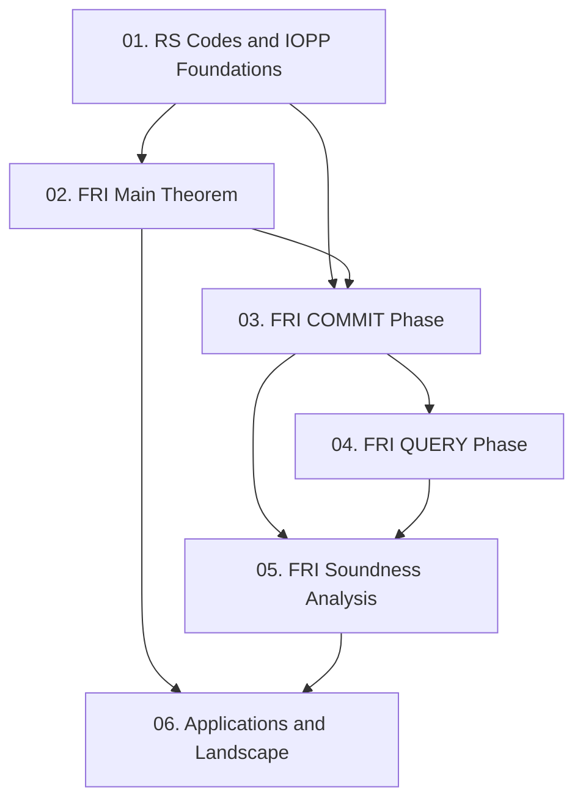

Paper gốc giới thiệu **FRI (Fast RS IOPP)** — Interactive Oracle Proof of Proximity đầu tiên cho họ mã Reed-Solomon có prover complexity tuyến tính nghiêm ngặt (< 6N) và verifier complexity logarithmic nghiêm ngặt (≤ 21 log N), đồng thời là nền tảng lý thuyết trực tiếp của ZK-STARK. Course này cover toàn bộ nội dung 17 trang của paper, từ định nghĩa mô hình IOPP đến phân tích soundness và ứng dụng thực tế.

**Tài liệu gốc**: [Fast RS IOPP (FRI), ICALP 2018](https://drops.dagstuhl.de/storage/00lipics/lipics-vol107-icalp2018/LIPIcs.ICALP.2018.14/LIPIcs.ICALP.2018.14.pdf)  
**Kiến thức nền tảng yêu cầu** (🔴 Prerequisite):
- Finite fields & polynomials (assumed)
- Reed-Solomon codes — định nghĩa cơ bản [Reed-Solomon 1960]
- PCP / PCPP model — [Ben-Sasson, Sudan 2008] [23], [Ben-Sasson et al. 2006] [21]
- Proof composition — [Dinur-Reingold 2004] [30]

---

## Lesson Overview

| # | Title | Type | Covers (sections) | File | Dependencies |
|---|-------|------|-------------------|------|-------------|
| 01 | RS Codes, IOP & IOPP Foundations | Foundation | §1 (intro), §1.1.1, §1.1.2, Table 1 | [[01-rs-iopp-foundations\|01. RS Codes & IOPP Foundations]] | — |
| 02 | FRI Main Theorem & Complexity | Foundation | §1.1.3, Theorem 2, Conjecture 3, Remarks | [[02-fri-main-theorem\|02. FRI Main Theorem]] | 01 |
| 03 | FRI Protocol — COMMIT Phase | Scheme | §2.1 (degree-folding, FFT analogy, round consistency test) | [[03-fri-commit-phase\|03. FRI COMMIT Phase]] | 01, 02 |
| 04 | FRI Protocol — QUERY Phase & Formal Protocol | Deep Dive | §2.1.1 (binary fields, COMMIT/QUERY separation, affine subspace polynomials) | [[04-fri-query-phase\|04. FRI QUERY Phase]] | 03 |
| 05 | Soundness Analysis | Math Component | §2.2 (proof composition, distance preservation, biased IOPP) | [[05-fri-soundness\|05. FRI Soundness Analysis]] | 03, 04 |
| 06 | Applications, Concrete Complexity & Landscape | Survey | §1.2, §1.3.1–1.3.3, §1.4, Figure 1, Eq. (2) | [[06-fri-applications\|06. Applications & Related Works]] | 02, 05 |

**Lesson types**: Foundation · Math Component · Scheme · Deep Dive · Survey

---

## Coverage Map

| Document section | Covered in lesson |
|------------------|-------------------|
| §1 Introduction (context, RS proximity problem) | 01 |
| §1.1.1 IOP definition (round/proof/query complexity) | 01 |
| §1.1.2 IOPP — Definition 1 (formal) | 01 |
| Table 1 (comparison of RS proximity protocols) | 01 |
| §1.1.3 Main Theorem — Theorem 2 + Conjecture 3 | 02 |
| Remark: space complexity | 02 |
| Remark: FRI for smooth codes | 02 |
| Remark: computational model for decision complexity | 02 |
| §2.1 FRI overview & FFT analogy (degree-folding, round consistency test) | 03 |
| Remark: FRI as "biased" version of quasi-linear RS-PCPP | 03 |
| §2.1.1 Differences informal vs. actual protocol (binary fields, affine subspace poly, COMMIT/QUERY phases) | 04 |
| §2.2 Soundness analysis overview (proof composition, δ⁽¹⁾ ≥ (1−o(1))δ⁽⁰⁾) | 05 |
| §1.2 Applications to transparent ZK (ZK-STARK, Kilian/Micali compilation) | 06 |
| §1.3.1 RS block-length of realized systems (Figure 1.A) | 06 |
| §1.3.2 Estimated communication complexity (Eq. 2, Figure 1.B) | 06 |
| §1.3.3 Round complexity considerations | 06 |
| §1.4 Related works | 06 |

---

## Dependency Graph

---

## Progress

- [ ] [[01-rs-iopp-foundations\|01. RS Codes & IOPP Foundations]]
- [ ] [[02-fri-main-theorem\|02. FRI Main Theorem]]
- [ ] [[03-fri-commit-phase\|03. FRI COMMIT Phase]]
- [ ] [[04-fri-query-phase\|04. FRI QUERY Phase]]
- [ ] [[05-fri-soundness\|05. FRI Soundness Analysis]]
- [ ] [[06-fri-applications\|06. Applications & Related Works]]

---

## 🟡 Integrated References

| Ref Key | Authors, Short Title | Dùng trong lesson | Nội dung tích hợp |
|---------|---------------------|-------------------|-------------------|
| [23] | Ben-Sasson, Sudan — *Short PCPs with polylog query complexity*, SICOMP 2008 | 03, 05 | Quasilinear RS-PCPP là nền tảng FRI; bivariate decomposition Q(X,Y) |
| [12] | Ben-Sasson et al. — *On probabilistic checking in perfect ZK*, ECCC 2016 | 01 | Definition 1 (IOPP) lấy trực tiếp từ [12, §3.2] |
| [19] | Ben-Sasson, Chiesa, Spooner — *Interactive Oracle Proofs*, TCC 2016 | 01 | IOP framework; complexity parameters định nghĩa chính thức |
| [53] | Polischuk, Spielman — *Nearly-linear holographic proofs*, STOC 1994 | 05 | Bivariate testing theorem — lý do prior works mất constant soundness |
| [43] | Kilian — *Efficient ZK proofs*, STOC 1992 | 06 | Kilian scheme: Merkle hash compilation FRI → interactive argument |
| [49] | Micali — *Computationally sound proofs*, SICOMP 2000 | 06 | Micali scheme: RO compilation FRI → CS proof / non-interactive |

---

## Notes

- **L01** là lesson nặng nhất về định nghĩa; nên đọc kỹ Definition 1 (IOPP) trước khi qua L02.
- **L03** là trái tim của course — degree-folding và FFT analogy là insight quan trọng nhất.
- **L04** cover các kỹ thuật binary-field-specific (linearized polynomials, affine subspace) mà paper gọi là "technical differences" — cần thiết để hiểu implementation thực tế.
- **L05** là phần khó nhất về mặt toán học; nên đọc sau khi nắm chắc L03–L04.
- **L06** có thể đọc sau L02 (nếu chỉ quan tâm ứng dụng) hoặc sau L05 (để hiểu đầy đủ).
- Full version của paper (TR17-134, [10]) có thêm chi tiết về smooth codes và proof đầy đủ của Theorem 2 — được reference trong L02 và L05.
