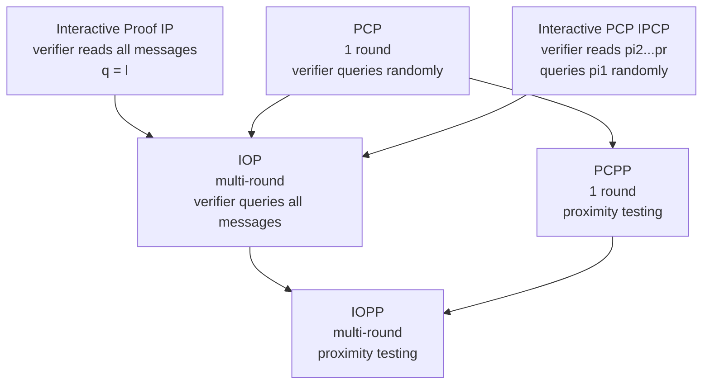

> **Prerequisites**: Finite fields & polynomials, Hamming distance, basic probability  
> 🔴 **Prerequisite references**: Reed & Solomon — *Polynomial codes over certain finite fields* [RS60] (RS code definition); Ben-Sasson & Sudan — *Short PCPs with polylog query complexity* [BS08] (quasilinear PCPP construction)  
> **Lesson type**: Foundation  
> **Covers**: §1 (giới thiệu RS proximity problem), §1.1.1 (IOP), §1.1.2 (IOPP — Definition 1), Table 1
>
> **Notation**
> | Ký hiệu | Ý nghĩa | Ghi chú |
> |---------|---------|---------|
> | $\mathbb{F}$ hoặc $F$ | Finite field (trường hữu hạn) | Paper dùng $F$; ta dùng cả hai |
> | $S \subseteq F$ | Tập evaluation, $\lvert S \rvert = N$ | Còn gọi là *evaluation set* |
> | $\rho \in (0,1]$ | Code rate | $\rho = 2^{-R}$ trong FRI |
> | $d$ | Degree bound, $d < \rho N$ | Degree của polynomial được encode |
> | $\delta \in (0,1)$ | Proximity parameter — khoảng cách tương đối | $\delta$-far = relative Hamming distance $\geq \delta$ |
> | $\Delta(f, C)$ | Relative Hamming distance từ $f$ đến code $C$ | $\Delta(f,C) = \min_{c \in C} \frac{\lvert\{x : f(x) \neq c(x)\}\rvert}{N}$ |
> | $r$ | Round complexity của IOP/IOPP | Số vòng tương tác |
> | $\ell(N)$ | Proof length — tổng độ dài các message của prover | Tính trên alphabet $F$ |
> | $q(N)$ | Query complexity — số entries verifier đọc | $q(N) \ll \ell(N)$ trong IOPP |
> | $s^-(δ)$ | Soundness function — xác suất reject khi $\Delta(f^{(0)}, C) = \delta$ | Ký hiệu của [12] |
> | $P, V$ | Prover và Verifier | Randomized algorithms |

---

## Motivation

Một trong những bài toán nền tảng của proof systems hiện đại là: **làm thế nào để verifier kiểm tra rằng một hàm $f$ là (gần) một codeword của mã Reed-Solomon, mà không cần đọc toàn bộ $f$?**

Đây không phải câu hỏi lý thuyết thuần túy. Trong các hệ thống ZK-STARK và PCP hiệu quả, computation integrity được quy về bài toán "codeword membership" của RS codes. Nếu giải quyết bài toán này với prover complexity tuyến tính và verifier complexity logarithmic, ta có nền tảng cho một ZK proof system thực tế. Đây chính xác là điều FRI thực hiện.

Lesson này xây dựng toàn bộ ngữ cảnh: RS code là gì, bài toán proximity là gì, và mô hình tính toán IOPP cho phép ta phát biểu bài toán một cách chính xác.

---

## 1. Reed-Solomon Codes và RS Proximity Problem

### 1.1 Định nghĩa RS Code

> [!note] Definition 1.1 — Reed-Solomon Code
> Cho finite field $F$, tập evaluation $S \subseteq F$ với $\lvert S \rvert = N$, và rate parameter $\rho \in (0,1]$.
>
> **RS code** $\mathsf{RS}[F, S, \rho]$ là tập hợp tất cả các hàm $f : S \to F$ sao cho $f$ là evaluation của một polynomial $P \in F[X]$ có bậc $\deg(P) < \rho N$:
>
> $$
> \mathsf{RS}[F, S, \rho] = \bigl\{ f : S \to F \;\big|\; \exists P \in F[X],\; \deg(P) < \rho N,\; \forall x \in S,\; f(x) = P(x) \bigr\}
> $$
>
> **Dimension** (số codewords): $\lvert \mathsf{RS}[F, S, \rho] \rvert = \lvert F \rvert^{\rho N}$, vì có $\lvert F \rvert^{\rho N}$ polynomials với $\lfloor \rho N \rfloor$ coefficients tự do.
>
> **Minimum distance**: Bởi Schwartz-Zippel Lemma, hai polynomial khác nhau bậc $< \rho N$ có thể trùng trên tối đa $\rho N - 1$ điểm trong $S$. Do đó minimum relative Hamming distance là $1 - \rho$ (khoảng cách tương đối ít nhất $1 - \rho$).

Trực giác: một codeword $f$ là "low-degree polynomial được sample tại $N$ điểm". Codeword nào cũng được xác định hoàn toàn bởi $\rho N$ giá trị (các coefficients của $P$), nhưng được *viết ra* tại $N$ điểm — đây chính là redundancy của mã.

### 1.2 RS Proximity Problem

> [!note] Definition 1.2 — RS Proximity Problem
> **Input**: Oracle access tới hàm $f : S \to F$.  
> **Goal**: Phân biệt hai trường hợp:
>
> - **YES**: $f \in \mathsf{RS}[F, S, \rho]$ (f là một codeword)
> - **NO**: $\Delta(f, \mathsf{RS}[F, S, \rho]) \geq \delta$ (f *xa* tất cả codewords theo Hamming distance tương đối $\delta$)
>
> với *"độ tin cậy cao"* (soundness lớn) và *"số query nhỏ"* (query complexity nhỏ).

Đây khác với *membership testing* (xác định chính xác $f \in C$ hay không): proximity problem cho phép zone trung gian $0 < \Delta(f, C) < \delta$ không cần phân biệt, và chấp nhận xác suất nhỏ về lỗi.

> [!tip] 💡 Agent note
> Tại sao "proximity" thay vì "membership"? Trong thực tế, prover gửi $f$ qua channel có lỗi, hoặc $f$ được sinh từ computation với floating-point error. Proximity problem tự nhiên hơn: nếu $f$ "gần" một codeword, ta vẫn coi là hợp lệ. Hơn nữa, nó cho phép recursive proof composition — một kỹ thuật trung tâm của FRI.

---

## 2. Ba Mô Hình Giải RS Proximity Problem

Paper đặt FRI trong bối cảnh ba mô hình tăng dần độ mạnh (Table 1 trong paper):

### Mô hình 1: Testing (không có proof)

Verifier chỉ có oracle access tới $f$, không có thêm dữ liệu. Prover không tồn tại (hoặc "spend zero effort"). Cần $d + 1$ queries để giải chính xác (Rubinfeld-Sudan [58]): lấy $d+1$ điểm và kiểm tra xem chúng có nằm trên polynomial bậc $< \rho N$ không. Prover complexity = 0, nhưng query complexity = $O(\rho N)$ — quá lớn cho $N$ lớn.

### Mô hình 2: PCPP (thêm proof tĩnh)

Verifier nhận oracle access tới cả $f$ **và** một *auxiliary proof* $\pi$ được prover tính toán. Proof tĩnh (non-interactive). Các công trình tốt nhất đạt proof length $\tilde{O}(N)$ và query complexity $O(1/\delta)$, nhưng prover complexity $\geq N \log^{1.5} N$ (siêu tuyến tính).

### Mô hình 3: IOPP (thêm tương tác đa vòng)

Verifier và prover tương tác qua $r$ vòng. Verifier gửi random challenges; prover trả lời bằng oracle messages. Verifier chỉ đọc một số ít entries từ mỗi oracle. Đây là mô hình của FRI.

**Bảng so sánh** (tóm tắt Table 1 trong paper, với $\rho = 1/8$, soundness $\geq 0.99\delta$):

| Hệ thống | Prover comp. | Proof length | Verifier comp. | Query comp. | Rounds |
|----------|-------------|-------------|---------------|------------|--------|
| Testing [58] | $0$ | $0$ | $\tilde{O}(\rho N)$ | $\rho N$ | $0$ |
| PCP [2,3] | $N^{O(1)}$ | $N^{O(1)}$ | $N^{O(1)}$ | $O(1/\delta)$ | $1$ |
| PCPP [23] | $\geq N\log^{1.5} N$ | $\geq N\log^{1.5} N$ | $\frac{1}{\delta}\log^{5.8} N$ | $\frac{1}{\delta}\log^{5.8} N$ | $1$ |
| IOPP [12,9] | $N\log^c N$ | $> 4N$ | $\frac{1}{\delta}\log^c N$ | $O(1/\delta)$ | $\log\log N$ |
| **FRI (this work)** | $< 6N$ | $< N/3$ | $\leq 21\log N$ | $2\log N$ | $\log N / 2$ |

FRI là hệ thống đầu tiên có prover complexity *tuyến tính nghiêm ngặt* và verifier complexity *logarithmic nghiêm ngặt*.

---

## 3. Mô Hình IOP

Trước khi định nghĩa IOPP, ta cần hiểu IOP — mô hình tổng quát hơn, được giới thiệu chính thức trong [19].

> [!note] Definition 1.3 — Interactive Oracle Proof (IOP)
> (theo [19], nhắc lại trong [12, §3.2])
>
> Một **IOP system** $\mathcal{S} = (P, V)$ là một cặp randomized algorithms tương tác. Với input $x$ độ dài $N$:
>
> - **Round complexity** $r(N)$: số vòng tương tác.
> - **Trong mỗi vòng**: Prover gửi một *oracle message* (verifier có oracle access — chỉ đọc được một số entries được chọn), sau đó Verifier trả lời bằng một *explicit message* (Verifier đọc toàn bộ).
> - **Proof length** $\ell(N)$: tổng độ dài tất cả oracle messages của Prover.
> - **Query complexity** $q(N)$: tổng số entries Verifier đọc từ tất cả oracle messages; $q(N) \ll \ell(N)$.
> - **Output**: $\langle P \leftrightarrow V \rangle(x) \in \{\mathsf{accept}, \mathsf{reject}\}$.
>
> IOP được gọi là **transparent** (hay có *public randomness*) nếu tất cả messages của Verifier là public random coins và tất cả queries được xác định bởi public coins — broadcast cho cả Prover.

> [!info] 🟡 IOP Framework (từ Ben-Sasson, Chiesa, Spooner [BCS16] = [19])
> IOP tổng quát hóa đồng thời cả Interactive Proofs (IP) lẫn PCPs: trong IP, verifier đọc toàn bộ prover messages ($q = \ell$); trong PCP, chỉ có 1 round và verifier query ngẫu nhiên. IOP kết hợp: nhiều rounds, mỗi round prover gửi oracle message mà verifier chỉ query một phần. [BCS16] còn chứng minh rằng bất kỳ public-coin IOP nào cũng có thể compile thành non-interactive proof trong Random Oracle Model.
>
> *(theo [19]: Ben-Sasson, Chiesa, Spooner — Interactive Oracle Proofs, TCC 2016, pp. 31–60)*

---

## 4. Mô Hình IOPP — Định Nghĩa Chính Thức

> [!note] Definition 1.4 — Interactive Oracle Proof of Proximity (IOPP)
> (Definition 1 trong paper, lấy từ [12, §3.2])
>
> Cho code $C = \{f : S \to \Sigma\}$ trên alphabet $\Sigma$, finite set $S$.  
> Một **$r$-round IOPP** $\mathcal{S} = (P, V)$ là một $(r+1)$-round IOP thỏa mãn:
>
> **First message format**: Message đầu tiên của Prover, ký hiệu $f^{(0)}$, là một codeword *giả định* của $C$, tức là $f^{(0)} : S \to \Sigma$.
>
> **Completeness**: Với mọi $f^{(0)} \in C$ (codeword thực sự):
>
> $$
> \Pr\bigl[\langle P \leftrightarrow V \rangle = \mathsf{accept} \;\big|\; \Delta(f^{(0)}, C) = 0\bigr] = 1
> $$
>
> **Soundness**: Với mọi (có thể malicious) Prover $P^*$ và mọi $f^{(0)}$ với $\Delta(f^{(0)}, C) = \delta$:
>
> $$
> \Pr\bigl[\langle P^* \leftrightarrow V \rangle = \mathsf{reject} \;\big|\; \Delta(f^{(0)}, C) = \delta\bigr] \geq s^-(\delta)
> $$
>
> trong đó $s^- : (0,1] \to [0,1]$ là **soundness function**.
>
> **IOPP proof length**: Tổng độ dài tất cả oracle messages của Prover *ngoại trừ* $f^{(0)}$.  
> **Prover complexity**: Thời gian sinh tất cả messages *ngoại trừ* $f^{(0)}$.  
> **Query complexity**: Tổng số queries tới *tất cả* messages, bao gồm cả $f^{(0)}$.

> [!info] 🟡 IOPP từ [12]
> Definition 1.4 trên được lấy trực tiếp từ [12, §3.2] (Ben-Sasson et al., *On Probabilistic Checking in Perfect ZK*, 2016). Paper đó định nghĩa IOPP trong bối cảnh xây dựng ZK-IOPs cho NEXP; FRI tái sử dụng định nghĩa này. Điểm đáng chú ý: $f^{(0)}$ *không* được tính vào proof length vì đây là input của bài toán (prover claim), không phải proof.
>
> *(theo [12]: Ben-Sasson, Chiesa, Forbes, Gabizon, Riabzev, Spooner — On Probabilistic Checking in Perfect ZK, ECCC 2016)*

### Remark: Mô hình tính complexity

Paper để ngỏ computational model cho *decision complexity* của Verifier. Default tự nhiên là boolean circuit complexity. Tuy nhiên trong FRI — vì code được định nghĩa trên finite field $F$ và mỗi query trả về một phần tử $F$ — model phù hợp nhất là **arithmetic complexity**: đếm số phép toán số học trên $F$ mà Verifier thực hiện để đưa ra verdict (sau khi đã có query answers). Đây là model paper dùng để phát biểu "verifier complexity $\leq 21 \log N$".

---

## 5. Quan Hệ Giữa Các Mô Hình

IOPP = tổng quát hóa đồng thời của IPs, PCPs, IPCPs **và** PCPPs. FRI là một IOPP cụ thể cho RS codes.

---

## 6. Tóm Tắt

- $\mathsf{RS}[F, S, \rho]$: hàm $f : S \to F$ là evaluation của polynomial bậc $< \rho N$. Minimum relative distance $= 1 - \rho$.
- **RS proximity problem**: phân biệt $f \in C$ vs $\Delta(f, C) \geq \delta$ với ít queries.
- **Ba mô hình**: Testing (0 proof), PCPP (static proof), IOPP (interactive proof với oracle access).
- **IOP**: $r$ rounds, prover gửi oracle messages, verifier query ngẫu nhiên; transparent nếu verifier dùng public coins.
- **IOPP** (Definition 1): IOP với *completeness* (honest prover luôn accepted) và *soundness* $s^-(\delta)$ (far codeword bị rejected với xác suất $\geq s^-(\delta)$). Proof length không tính $f^{(0)}$.
- FRI là IOPP đầu tiên đạt prover $< 6N$ và verifier $\leq 21 \log N$ — **tuyến tính và logarithmic nghiêm ngặt**.

---

## References

- [RS60] Reed, Solomon — *Polynomial codes over certain finite fields*, JSIAM 1960 (🔴 Prerequisite)
- [BS08] Ben-Sasson, Sudan — *Short PCPs with polylog query complexity*, SICOMP 2008 (🔴 Prerequisite)
- [19] = [BCS16] Ben-Sasson, Chiesa, Spooner — *Interactive Oracle Proofs*, TCC 2016 (🟡 Integrated)
- [12] Ben-Sasson, Chiesa, Forbes, Gabizon, Riabzev, Spooner — *On Probabilistic Checking in Perfect ZK*, ECCC 2016 (🟡 Integrated)
- [58] Rubinfeld, Sudan — *Self-testing polynomial functions*, SODA 1992 (⚪ Citation only)
- [21] Ben-Sasson et al. — *Robust PCPs of proximity*, SICOMP 2006 (⚪ Citation only)
- [23] Ben-Sasson, Sudan — *Short PCPs with polylog query complexity*, SICOMP 2008 (⚪ — sẽ integrate sâu ở L03)
