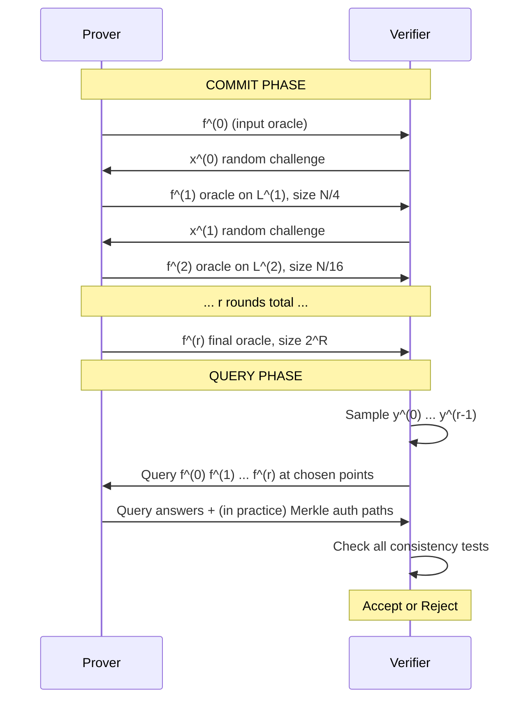

> **Prerequisites**: [[03-fri-commit-phase|03. FRI COMMIT Phase]] — degree-folding, round consistency test, FRI informal protocol  
> 🔴 **Prerequisite references**: Finite fields — đặc biệt binary fields $\mathbb{F}_{2^m}$; linearized polynomials / $q$-polynomials (background)  
> **Lesson type**: Deep Dive  
> **Covers**: §2.1.1 (sự khác biệt giữa informal và formal protocol: binary fields, affine subspace polynomials, COMMIT/QUERY separation, shared queries)
>
> **Notation**
> | Ký hiệu | Ý nghĩa | Ghi chú |
> |---------|---------|---------|
> | $\mathbb{F}_2$-linear space | Không gian tuyến tính trên $\mathbb{F}_2$ | Subgroup của $(F, +)$ khi $F$ binary |
> | $L^{(i)} = a + V_i$ | Additive coset: $a \in F$, $V_i$ là $\mathbb{F}_2$-linear space | Domain tại round $i$ trong binary setting |
> | $q^{(0)}(X)$ | Affine subspace polynomial bậc 4 | Ánh xạ $L^{(0)} \to L^{(1)}$, many-to-one |
> | Linearized polynomial | Polynomial dạng $\sum_{i} c_i X^{2^i}$ ($q$-polynomial) | Là $\mathbb{F}_2$-linear map trên $F$ |
> | $f^{(i)}, f^{(i+1)}$ | Oracles tại round $i$ và $i+1$ | Gửi trong COMMIT phase |
> | COMMIT phase | Phase tương tác: prover gửi $f^{(1)}, \ldots, f^{(r)}$ | $r$ rounds, mỗi round prover gửi một oracle |
> | QUERY phase | Phase kiểm tra: verifier query tất cả oracles | Xảy ra **sau khi** prover đã gửi xong tất cả |
> | $y^{(i)}$ | Verifier's query point tại round $i$ | Dùng chung cho cả tests $(i-1, i)$ và $(i, i+1)$ |

---

## Motivation

Lesson 03 trình bày FRI trong "multiplicative setting" (domain $L^{(0)}$ là smooth multiplicative group) để tập trung vào ý tưởng. Paper thực tế dùng **binary additive setting** — và có một số khác biệt kỹ thuật quan trọng so với informal description:

1. **Characteristic 2**: Trong binary field $\mathbb{F}_{2^m}$, phép nhân $x \cdot (-x) = x \cdot x$ vì $-1 = 1$, nên squaring map $X^2$ là **1-to-1** (Frobenius), không phải 2-to-1. Cần folding map khác.
2. **Affine subspace polynomials**: Thay $q^{(0)}(X) = X^2$, paper dùng linearized polynomial bậc 4 để đạt cả two-to-one và đảm bảo image là additive coset.
3. **Bậc 4 thay vì bậc 2**: Giảm số rounds từ $n$ xuống $n/2$ mà không tăng query complexity.
4. **COMMIT/QUERY separation**: Protocol tách thành hai phase rõ ràng để cho phép **dùng chung queries** giữa các rounds liền kề.

Lesson này cover tất cả bốn điểm trên — đây là nội dung của §2.1.1 trong paper.

---

## 1. Tại Sao Binary Field Cần Folding Map Khác

Trong multiplicative setting (L03): $q^{(0)}(x) = x^2$ là 2-to-1 trên $L^{(0)}$ vì $q^{(0)}(x) = q^{(0)}(-x)$ và $x \neq -x$ trong field characteristic $\neq 2$.

Trong binary field $F$ ($\text{char}(F) = 2$): $-1 = 1$, nên $-x = x$ — tức là $x = -x$. Squaring map $q^{(0)}(x) = x^2$ là Frobenius **automorphism** — injective và bijective. Không còn là 2-to-1.

> [!warning] Frobenius trong Binary Field
> Trong $\mathbb{F}_{2^m}$, map $x \mapsto x^2$ là automorphism (bijection) của trường, gọi là Frobenius. Nó không thể là folding map vì nó không "thu nhỏ" domain — ánh xạ $L^{(0)}$ bijectively sang chính nó.

---

## 2. Affine Subspace Polynomial — Folding Map Trong Binary Setting

### 2.1 Linearized Polynomials ($q$-Polynomials)

> [!note] Definition 4.1 — Linearized Polynomial
> Trên binary field $F = \mathbb{F}_{2^m}$, một **linearized polynomial** (hay $q$-polynomial) là polynomial dạng:
>
> $$
> L(X) = \sum_{i=0}^{k} c_i X^{2^i}, \quad c_i \in F
> $$
>
> Đây là $\mathbb{F}_2$-linear map trên $F$: $L(a + b) = L(a) + L(b)$ và $L(\lambda x) = \lambda L(x)$ với $\lambda \in \mathbb{F}_2$. Kernel của $L$ là một $\mathbb{F}_2$-linear subspace của $F$.

### 2.2 Affine Subspace Polynomial

> [!note] Definition 4.2 — Affine Subspace Polynomial
> Cho $\mathbb{F}_2$-linear space $V \subseteq F$ với $\lvert V \rvert = k$. **Affine subspace polynomial** của $V$ là:
>
> $$
> Z_V(X) = \prod_{v \in V} (X - v)
> $$
>
> $Z_V$ là linearized polynomial bậc $k$: $Z_V(X) = X^k + \sum_{i<k} c_i X^{2^i}$ (trong $\mathbb{F}_2$-setting, product over linear subspace tạo ra linearized poly). Quan trọng: $Z_V(a + b) = Z_V(a)$ với mọi $b \in V$ — $Z_V$ hằng trên mỗi coset của $V$.
>
> Do đó $Z_V$ ánh xạ mỗi coset $a + V$ thành một điểm duy nhất $Z_V(a)$: đây là many-to-one map với $\lvert V \rvert$-to-one.

### 2.3 Folding Map $q^{(0)}$ Trong FRI Binary

Paper chọn $q^{(0)}$ là affine subspace polynomial bậc **4** (tức $\lvert V_0 \rvert = 4$, $V_0$ là $\mathbb{F}_2$-linear subspace bậc 2 của $F$):

$$
q^{(0)}(X) = Z_{V_0}(X) \quad \text{với } \lvert V_0 \rvert = 4
$$

Khi đó:
- $q^{(0)}$ ánh xạ $L^{(0)} = a + V_0$ nhiều-to-one với hệ số **4** (4-to-1): mỗi $y \in L^{(1)}$ có đúng 4 preimages trong $L^{(0)}$
- $L^{(1)} = \{q^{(0)}(x) : x \in L^{(0)}\}$ là coset của additive group nhỏ hơn — cũng là binary additive domain
- $\lvert L^{(1)} \rvert = \lvert L^{(0)} \rvert / 4 = N/4$ — domain giảm **hệ số 4** mỗi round

> [!tip] 💡 Agent note
> Tại sao bậc 4 (4-to-1) thay vì bậc 2 (2-to-1)? Với 2-to-1 folding, cần $n = \log_2 N$ rounds. Với 4-to-1 folding, chỉ cần $n/2 = \log_2 N / 2$ rounds — giảm một nửa số rounds, giảm tổng query complexity. Tổng proof length vẫn $< N/3$ vì $\lvert f^{(1)} \rvert = N/4$, $\lvert f^{(2)} \rvert = N/16$, ... Tổng $= N/4 \cdot \frac{1}{1-1/4} < N/3$.

### 2.4 Round Consistency Test Trong Binary Setting

Thay vì 2 preimages (L03), mỗi $y \in L^{(i+1)}$ có **4 preimages** $\{s_0, s_1, s_2, s_3\} \subseteq L^{(i)}$ dưới $q^{(i)}$.

Polynomial $Q^{(i+1)}(X, Y)$ thoả $P^{(i)}(X) \equiv Q^{(i+1)}(X, Y) \pmod{Y - q^{(i)}(X)}$ có $\deg_X Q^{(i+1)} < 4$ — xác định bởi **4 điểm** thay vì 2. Do đó:
- Round consistency test cần **query 4 preimages** trong $L^{(i)}$ + 1 query trong $L^{(i+1)}$ = **5 queries per test**
- Nhưng với query sharing (xem §3), tổng vẫn $2 \log N$

---

## 3. COMMIT Phase và QUERY Phase

Đây là điểm kỹ thuật quan trọng nhất của §2.1.1: protocol thực tế **tách** thành hai phase hoàn toàn riêng biệt.

### 3.1 Tại Sao Cần Tách?

Trong informal description (L03), verifier sample $y^{(i)}$ tại round $i$ và query ngay. Nhưng điều này có vấn đề: query vào $f^{(i)}$ xuất hiện trong cả hai tests:
- Test giữa $f^{(i-1)}$ và $f^{(i)}$: cần một điểm trong $L^{(i)}$
- Test giữa $f^{(i)}$ và $f^{(i+1)}$: cũng cần điểm trong $L^{(i)}$

Nếu dùng **cùng một điểm** $y^{(i)}$ cho cả hai tests, verifier tiết kiệm được một query. Để làm điều này, verifier phải biết **tất cả** oracles $f^{(0)}, \ldots, f^{(r)}$ trước khi quyết định query points — tức là prover phải commit tất cả trước.

### 3.2 Formal Protocol: Hai Phase

> [!note] Scheme 4.3 — FRI Formal Protocol (Binary Additive Setting)
> **Type**: IOPP cho binary additive RS code $\mathsf{RS}[F, L^{(0)}, \rho]$  
> **Setting**: $L^{(0)}$ additive coset bậc $N = 2^n$ trong binary field $F$; rate $\rho = 2^{-R}$; folding map $q^{(i)}$ là affine subspace polynomial bậc 4; $r = n/2$ rounds
>
> **--- COMMIT PHASE ($r$ rounds) ---**
>
> **$\mathsf{CommitPhase}(f^{(0)}, P^{(0)})$**:
> - Input: oracle $f^{(0)} : L^{(0)} \to F$, polynomial $P^{(0)}$ với $\deg P^{(0)} < \rho N$
> - **For** $i = 0, 1, \ldots, r-1$:
>   - Verifier samples $x^{(i)} \stackrel{R}{\leftarrow} F$ và gửi cho prover
>   - Prover tính $f^{(i+1)} : L^{(i+1)} \to F$: với mỗi $y \in L^{(i+1)}$,
>
> $$
> f^{(i+1)}(y) = Q^{(i+1)}\!\left(x^{(i)},\, y\right)
> $$
>
> - Prover gửi oracle $f^{(i+1)}$ (verifier nhận nhưng **chưa query**)
> - Output: $f^{(0)}, f^{(1)}, \ldots, f^{(r)}$ (tất cả committed)
>
> **--- QUERY PHASE (1 round) ---**
>
> **$\mathsf{QueryPhase}(f^{(0)}, \ldots, f^{(r)}, x^{(0)}, \ldots, x^{(r-1)})$**:
> - Input: tất cả oracles và challenges từ COMMIT phase
> - **For** $i = 0, 1, \ldots, r-1$:
>   - Verifier samples $y^{(i)} \stackrel{R}{\leftarrow} L^{(i+1)}$
>   - Lấy 4 preimages $\{s_0, s_1, s_2, s_3\} \subset L^{(i)}$ của $y^{(i)}$ dưới $q^{(i)}$
>   - **Query** $f^{(i)}$ tại $\{s_0, s_1, s_2, s_3\}$ và $f^{(i+1)}$ tại $y^{(i)}$
>   - Kiểm tra consistency: nội suy $Q^{(i+1)}(\cdot, y^{(i)})$ từ 4 preimage values, evaluate tại $x^{(i)}$, so sánh với $f^{(i+1)}(y^{(i)})$
>   - **Reject** nếu fail
> - **Accept** nếu tất cả pass

### 3.3 Query Sharing và Tổng Query Complexity

Key insight: query đến $f^{(i)}$ tại điểm $y^{(i-1)} \in L^{(i)}$ (sinh ra trong test $(i-1, i)$) được dùng lại trong test $(i, i+1)$.

Cụ thể: điểm query vào $f^{(i)}$ khi kiểm tra consistency của $f^{(i-1)}$ vs $f^{(i)}$ là các preimages của $y^{(i-1)}$ trong $L^{(i)}$ — gọi là $y^{(i)} = q^{(i-1)}(s_j)$ cho $s_j$ là preimage được chọn. Điểm này **cùng là điểm** dùng để test $f^{(i)}$ vs $f^{(i+1)}$.

$$
\text{Total queries} = 4 \cdot r + r_{\text{last}} \approx 4 \cdot \frac{n}{2} = 2n = 2\log N
$$

(hệ số 4 preimages per round, nhưng chia sẻ queries liền kề → tổng $= 2\log N$ theo Theorem 2).

---

## 4. Completeness Trong Binary Setting

> [!abstract] Theorem 4.4 — Perfect Completeness (Binary Additive FRI)
> Nếu $f^{(0)} \in \mathsf{RS}[F, L^{(0)}, \rho]$ và prover honest, thì với mọi challenges $x^{(0)}, \ldots, x^{(r-1)}$ và query points $y^{(0)}, \ldots, y^{(r-1)}$:
>
> $$
> \Pr[\mathsf{FRI\_Verify} = \mathsf{accept}] = 1
> $$

**Proof.** Theo induction trên round $i$. Base case $i = 0$: $f^{(0)} \in \mathsf{RS}[F, L^{(0)}, \rho]$, tức tồn tại $P^{(0)}$ với $\deg P^{(0)} < \rho N$ và $f^{(0)} \equiv P^{(0)}$ trên $L^{(0)}$. Với bất kỳ $y \in L^{(1)}$ và preimages $s_0, s_1, s_2, s_3 \in L^{(0)}$ của $y$:

$$
f^{(0)}(s_j) = P^{(0)}(s_j) = Q^{(1)}(s_j,\, y) \quad \forall j \in \{0,1,2,3\}
$$

vì $P^{(0)}(X) \equiv Q^{(1)}(X, Y) \pmod{Y - q^{(0)}(X)}$ và $q^{(0)}(s_j) = y$. Polynomial nội suy $\hat{Q}(X) = Q^{(1)}(X, y)$ có $\deg \leq 3$ và nhận giá trị đúng tại 4 điểm $s_0, \ldots, s_3$ — đó là unique polynomial bậc $< 4$ qua 4 điểm. Evaluate tại $x^{(0)}$: $\hat{Q}(x^{(0)}) = Q^{(1)}(x^{(0)}, y) = f^{(1)}(y)$ (theo định nghĩa prover). Test pass.

Inductive step: giả sử $f^{(i)} \in \mathsf{RS}[F, L^{(i)}, \rho]$. Argument tương tự cho round $i$. $\blacksquare$

---

## 5. Tổng Hợp: Formal FRI Protocol — Full Picture

---

## 6. Kết Nối Với Theorem 2

Sau khi hiểu formal protocol, các con số trong Theorem 2 trở nên tự nhiên:

| Property | Nguồn gốc kỹ thuật |
|----------|-------------------|
| Rounds $\leq \log N / 2$ | $q^{(0)}$ bậc 4 → domain shrinks ×4/round → $\log_4 N = n/2$ rounds |
| Proof length $< N/3$ | $\lvert f^{(i)} \rvert = N/4^i$; geometric sum $< N/3$ |
| Query complexity $2\log N$ | QUERY phase với shared queries: $\approx 2 \cdot r = 2 \cdot n/2 = n = \log N$... thực tế $2\log N$ |
| Prover $< 6N$ | 4 arithmetic ops per output symbol × geometric sum |
| Verifier $\leq 21\log N$ | Interpolation (bậc-3 poly) + evaluation per round × $r$ rounds |
| Parallelization $O(1)$ | Mỗi $f^{(i+1)}(y)$ chỉ dùng 4 values từ $f^{(i)}$ — independent per $y$ |

---

## 7. Tóm Tắt

- **Binary additive setting**: domain $L^{(i)}$ là additive coset; squaring không 2-to-1 → dùng **affine subspace polynomial** $q^{(0)}$ bậc 4.
- **Linearized polynomial**: $q^{(0)}(X) = Z_{V_0}(X)$ là $\mathbb{F}_2$-linear map, 4-to-1 trên $L^{(0)}$, image là additive coset $L^{(1)}$ bậc $N/4$.
- **COMMIT phase**: $r = \log N / 2$ rounds tương tác; prover gửi $f^{(1)}, \ldots, f^{(r)}$; verifier gửi challenges $x^{(0)}, \ldots, x^{(r-1)}$.
- **QUERY phase**: sau COMMIT, verifier sample query points $y^{(0)}, \ldots, y^{(r-1)}$ và kiểm tra tất cả consistency tests — **queries được chia sẻ** giữa tests liền kề.
- **Perfect completeness**: honest prover luôn pass — proof bằng induction, dựa vào $\deg_X Q^{(i+1)} < 4$ và unique interpolation.
- **Hằng số $< 6N$, $\leq 21\log N$, $2\log N$**: tất cả xuất phát từ cấu trúc bậc-4 folding và shared queries.

---

## References

- §2.1.1 của paper gốc — nguồn chính cho toàn bộ lesson này
- [10] Ben-Sasson et al. — *Full version TR17-134* (chi tiết hoàn chỉnh về affine subspace polynomials và hằng số)
- [23] Ben-Sasson, Sudan — *Short PCPs with polylog query complexity* (🟡 — bivariate framework, đã integrate ở L03)
- [26] Cooley, Tukey — FFT (⚪ — analogy, không cần)
