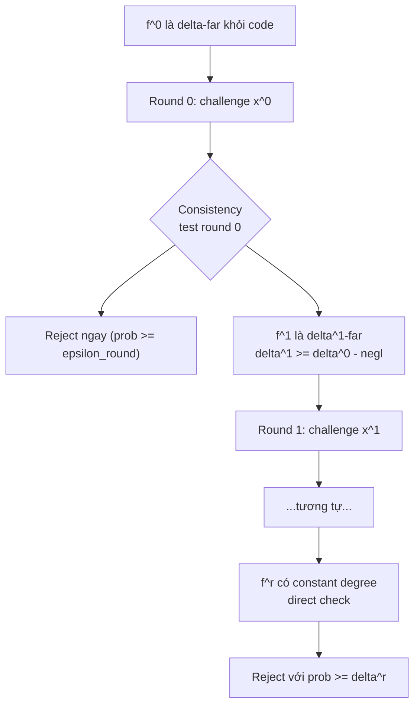

> **Prerequisites**: [[03-fri-commit-phase|03. FRI COMMIT Phase]], [[04-fri-query-phase|04. FRI QUERY Phase]] — toàn bộ FRI protocol, round consistency test, bivariate decomposition  
> 🔴 **Prerequisite references**: Ben-Sasson, Sudan [BS08] (quasilinear RS-PCPP, bivariate framework); Polishchuk, Spielman [PS94] (bivariate low-degree test — sẽ integrate bên dưới)  
> **Lesson type**: Math Component  
> **Covers**: §2.2 (proof composition, soundness loss mechanism, tại sao FRI cải thiện, $\delta^{(1)} \geq (1-o(1))\delta^{(0)}$ dưới unique decoding radius)
>
> **Notation**
> | Ký hiệu | Ý nghĩa | Ghi chú |
> |---------|---------|---------|
> | $\delta^{(i)}$ | Relative Hamming distance của $f^{(i)}$ từ $\mathsf{RS}[F, L^{(i)}, \rho]$ | Distance sau $i$ rounds folding |
> | $\delta^{(0)}$ | Distance của input $f^{(0)}$ từ code | Tham số "thật" của soundness |
> | $\frac{1-\rho}{2}$ | Unique decoding radius của RS code | Nếu $\delta < \frac{1-\rho}{2}$, codeword gần nhất là duy nhất |
> | $1 - \rho$ | Maximum relative distance của RS code | Khoảng cách tối đa giữa hai codewords |
> | $\varepsilon_{\text{round}}$ | Round consistency error — xác suất verifier chấp nhận round không nhất quán | Do $P^*$ honest về round consistency nhưng $f^{(1)}$ sai |
> | $P^*$ | Malicious prover | Không nhất thiết follow protocol |
> | $\mathcal{O}(1/\lvert F \rvert)$ | Negligible error — xác suất sự kiện xấu theo $x^{(0)}$ | Nhỏ vì $\lvert F \rvert \gg N$ |

---

## Motivation

Sau khi hiểu FRI protocol hoạt động như thế nào (L03–L04), câu hỏi then chốt còn lại là: **tại sao nó đúng khi prover không honest?** Đây là phần soundness analysis — phần khó nhất và quan trọng nhất của paper (§2.2).

Cụ thể, ta cần chứng minh: nếu $f^{(0)}$ là $\delta^{(0)}$-far khỏi code, thì với xác suất cao verifier reject. Điều này không tự nhiên vì một malicious prover có thể gửi $f^{(1)}, \ldots, f^{(r)}$ tùy ý — không nhất thiết là IFFT của $f^{(0)}$.

---

## 1. Proof Composition và Bài Toán Soundness

### 1.1 Proof Composition Là Gì?

**Proof composition** là kỹ thuật quy bài toán proximity testing trên domain lớn về bài toán proximity testing trên domain nhỏ hơn. Arora-Safra [3] giới thiệu kỹ thuật này cho PCPs; [21,30] áp dụng cho PCPPs; FRI dùng cho IOPPs theo cách mới.

Trong FRI, mỗi round là một bước proof composition:
- Round $i$ quy bài toán "kiểm tra $f^{(i)}$ gần code" thành "kiểm tra $f^{(i+1)}$ gần code" (domain nhỏ hơn).
- Đây hoạt động nếu: khi $f^{(i)}$ xa code, thì $f^{(i+1)}$ (do malicious prover gửi) **cũng xa code** với xác suất cao.

### 1.2 Hai Chi Phí Của Mỗi Round

Mỗi round composition áp đặt hai chi phí lên verifier:

**Chi phí 1 — Round consistency error** ($\varepsilon_{\text{round}}$): Xác suất verifier's consistency test cho phép $f^{(i+1)}$ không nhất quán với $f^{(i)}$. Để đảm bảo verifier không bị "qua mặt", $\varepsilon_{\text{round}}$ phải nhỏ.

**Chi phí 2 — Distance reduction**: Nếu $f^{(i)}$ là $\delta^{(i)}$-far khỏi code, ta cần $f^{(i+1)}$ là $\delta^{(i+1)}$-far với $\delta^{(i+1)}$ không quá nhỏ hơn $\delta^{(i)}$. Nếu $\delta^{(i+1)} \ll \delta^{(i)}$, soundness suy giảm qua các rounds.

---

## 2. Tại Sao Prior Works Mất Constant Soundness Mỗi Round

### 2.1 Cơ Chế: Bivariate Testing Theorem Của [PS94]

> [!info] 🟡 Bivariate Testing Theorem (từ Polischuk, Spielman [PS94] = [53])
> Xét bivariate polynomial $Q(X, Y)$ trên field $F$ với $\deg_X Q, \deg_Y Q \leq d$ (balanced degrees). Nếu một hàm $g : S \times S \to F$ thỏa mãn: với phần lớn "lines" (axis-parallel hoặc non-axis-parallel) $\ell$, restriction $g|_\ell$ gần một polynomial bậc $d$, thì $g$ gần một bivariate polynomial bậc $d$.
>
> **Soundness implication**: Nếu $f(x, y)$ là $\delta$-far khỏi tất cả bivariate polynomials bậc $d$, thì fraction $\geq \Omega(\delta)$ của các lines sẽ bị "bad". Quan trọng hơn: trong phân tích [23], mỗi lần áp dụng bivariate test, distance bị **shrink** thêm một hằng số nhân.
>
> *(theo [53]: Polischuk, Spielman — Nearly-linear size holographic proofs, STOC 1994, pp. 194–203)*

### 2.2 Vấn Đề Của Balanced Degrees

Trong quasilinear RS-PCPP [23], $q^{(0)}(X) = X^{2^{n/2}}$ → $Q^{(1)}(X, Y)$ có balanced degrees:

$$
\deg_X Q^{(1)} \approx \deg_Y Q^{(1)} \approx 2^{n/2}
$$

Bivariate testing theorem [PS94] áp dụng ở đây. Nhưng kết quả có **constant multiplicative loss**:

$$
\delta^{(1)} \leq \frac{1}{2} \delta^{(0)}
$$

(hay tổng quát hơn $\delta^{(1)} \leq c \cdot \delta^{(0)}$ với $c < 1$ là hằng số). Sau $r$ rounds:

$$
\delta^{(r)} \leq c^r \cdot \delta^{(0)} = c^{O(\log N)} \cdot \delta^{(0)} \to 0 \quad \text{quá nhanh}
$$

Để tránh $\delta^{(r)}$ tiến về 0, prior works phải giới hạn $r \leq O(\log \log N)$ rounds. Điều này buộc dùng $q^{(0)}$ bậc cao ($\approx N^{1/2}$) để đạt đủ reduction trong ít rounds — dẫn đến prover complexity $\Omega(N \log N)$.

---

## 3. FRI: Chỉ Mất Additive Soundness

### 3.1 Khai Thác Biased Degrees

FRI dùng $q^{(0)}(X)$ bậc thấp (degree 2 hoặc 4) → $\deg_X Q^{(1)} \ll \deg_Y Q^{(1)}$ (biased). Điều này có hệ quả quan trọng: X-axis của bivariate polynomial có **constant degree** — không cần áp dụng bivariate testing theorem cho trục X. Chỉ cần kiểm tra trục Y.

Trực giác: $Q^{(1)}(X, y)$ là polynomial bậc $\leq 3$ trong $X$ — **xác định bởi 4 điểm**. Nếu verifier kiểm tra consistency tại điểm $(x^{(0)}, y)$ và cả 4 preimages của $y$ đều pass, thì $Q^{(1)}(x^{(0)}, y)$ được xác định chính xác.

### 3.2 Distance Preservation — Kết Quả Chính

> [!abstract] Theorem 5.1 — Distance Preservation (§2.2, dưới unique decoding radius)
> Cho $f^{(0)}$ là $\delta^{(0)}$-far khỏi $\mathsf{RS}[F, L^{(0)}, \rho]$ với $\delta^{(0)} < \frac{1-\rho}{2}$ (dưới unique decoding radius).
>
> Với verifier's random challenge $x^{(0)} \stackrel{R}{\leftarrow} F$ và một malicious prover gửi $f^{(1)} : L^{(1)} \to F$ bất kỳ, ta có:
>
> $$
> \Pr_{x^{(0)}}\!\left[\, \varepsilon_{\text{round}}(x^{(0)}) + \delta^{(1)}(x^{(0)}) \geq \delta^{(0)} \,\right] \geq 1 - \frac{O(1)}{\lvert F \rvert}
> $$
>
> Nói cách khác: với xác suất $\geq 1 - O(1/\lvert F \rvert)$ theo $x^{(0)}$, hoặc:
> - round consistency error lớn ($\varepsilon_{\text{round}}$ không nhỏ), hoặc
> - $f^{(1)}$ cũng xa code ($\delta^{(1)} \approx \delta^{(0)}$)
>
> Hai trường hợp này là **additive**: tổng $\varepsilon_{\text{round}} + \delta^{(1)} \geq \delta^{(0)}$.

**Proof sketch** (theo §2.2 của paper):

*Case 1 — Honest prover (thực ra không cần vì prover honest luôn accepted):*
Khi $f^{(1)} = Q^{(1)}(x^{(0)}, \cdot)$ (honest), round consistency error = 0, và $\delta^{(1)} = \delta^{(0)}$ (rate không đổi).

*Case 2 — Dishonest prover, $f^{(1)}$ nhất quán với $f^{(0)}$ (consistency error = 0):*
Nếu round consistency test pass (error = 0), prover đã commit $f^{(1)}(y) = Q^{(1)}(x^{(0)}, y)$ cho phần lớn $y \in L^{(1)}$. Ta cần chứng minh $f^{(1)}$ xa code tương đương với $f^{(0)}$.

Argument chính (đây là phần "thách thức" của paper):

Giả sử $\delta^{(0)} < \frac{1-\rho}{2}$. Thì codeword gần nhất $c^{(0)} \in \mathsf{RS}[F, L^{(0)}, \rho]$ với $f^{(0)}$ là **duy nhất** (unique decoding regime). Gọi $P^{(0)}$ là polynomial tương ứng. Từ bivariate decomposition:
$$
P^{(0)}(X) = Q^{(1)}(X, q^{(0)}(X)) \quad \text{(đẳng thức polynomial)}
$$
Nếu $f^{(0)}$ là $\delta^{(0)}$-far khỏi $c^{(0)}$, thì với phần lớn $x \in L^{(0)}$: $f^{(0)}(x) \neq P^{(0)}(x)$. Vì $q^{(0)}$ là $k$-to-1 ($k = 4$), với phần lớn $y \in L^{(1)}$, ít nhất một trong 4 preimages $\{s_j\}$ có $f^{(0)}(s_j) \neq P^{(0)}(s_j)$.

Đây gây ra "mâu thuẫn" với $f^{(1)}(y) = Q^{(1)}(x^{(0)}, y)$ (nếu consistency error = 0): interpolation từ 4 điểm sai sẽ cho ra $Q^{(1)}(x^{(0)}, y)$ sai với xác suất cao theo $x^{(0)}$. Cụ thể, ta có thể chứng minh $f^{(1)}$ cũng $\delta^{(1)}$-far với $\delta^{(1)} \geq \delta^{(0)} - O(1/\lvert F \rvert)$.

*Case 3 — Dishonest prover, consistency error $> 0$:*
Nếu prover cố gắng cheat: gửi $f^{(1)}$ không nhất quán với $f^{(0)}$, thì round consistency error $\varepsilon_{\text{round}}$ phải đủ lớn để bù đắp phần thiếu hụt của $\delta^{(1)}$. Tổng $\varepsilon_{\text{round}} + \delta^{(1)} \geq \delta^{(0)}$ vẫn đúng. $\square$

> [!warning] Điều Kiện $\delta^{(0)} < \frac{1-\rho}{2}$ Là Bắt Buộc
> Theorem 5.1 chỉ áp dụng khi $f^{(0)}$ nằm trong **unique decoding radius** $\frac{1-\rho}{2}$. Tại sao? Vì argument dựa vào codeword gần nhất là **duy nhất** — nếu có nhiều codewords "gần bằng nhau", bivariate argument bị phá vỡ.
>
> Cho $\delta^{(0)} > \frac{1-\rho}{2}$: paper dùng soundness analysis của [23] (bivariate testing theorem [PS94]) với **constant multiplicative loss**, nhưng vì $\delta_0$ được chọn đủ nhỏ, kết quả vẫn có ích. Đây là lý do Theorem 2 chỉ claim soundness tới $\delta_0 \approx \frac{1}{4}(1-3\rho)$ thay vì $\frac{1-\rho}{2}$.

---

## 4. Hệ Quả: Số Rounds Có Thể Tăng Lên $\Theta(\log N)$

### 4.1 Tại Sao Additive Loss Cho Phép $\Theta(\log N)$ Rounds?

Với additive soundness loss, sau $r$ rounds:

$$
\sum_{i=0}^{r-1} \varepsilon^{(i)}_{\text{round}} + \delta^{(r)} \geq \delta^{(0)} - r \cdot \frac{O(1)}{\lvert F \rvert}
$$

Với $\lvert F \rvert \gg N$ và $r = O(\log N)$, phần sai số $r \cdot O(1/\lvert F \rvert) = O(\log N / \lvert F \rvert) = O(N/\lvert F \rvert)$ — rất nhỏ. Do đó tổng soundness sau tất cả rounds vẫn $\approx \delta^{(0)}$.

So sánh với prior works (multiplicative loss $c^r$): sau $r = \log N$ rounds với $c = 1/2$:

$$
\delta^{(r)} \leq (1/2)^{\log N} \cdot \delta^{(0)} = \frac{\delta^{(0)}}{N} \to 0
$$

Hoàn toàn mất soundness. Đây là lý do prior works **bị giới hạn** ở $r \leq O(\log \log N)$ rounds.

### 4.2 Kết Quả Về Rounds Trong Theorem 2

FRI dùng $r = \log N / 2$ rounds (với $q^{(0)}$ bậc 4). Mỗi round chỉ mất $O(1/\lvert F \rvert)$ soundness → tổng loss sau $r$ rounds là $O(\log N / \lvert F \rvert) = O(N / \lvert F \rvert^{1/2}) \approx 0$.

| Hệ thống | Max rounds | Lý do giới hạn |
|---------|------------|---------------|
| Prior PCPP/IOPP [23] | $O(\log \log N)$ | Constant multiplicative loss per round |
| **FRI** | $\Theta(\log N)$ | Negligible additive loss per round |

---

## 5. Cấu Trúc Tổng Thể Của Soundness Analysis

Soundness của FRI được thiết lập theo cơ chế sau:

Verifier reject nếu **bất kỳ** round nào fail. Xác suất reject tổng thể:

$$
\Pr[\text{reject}] \geq 1 - \prod_{i=0}^{r-1}(1 - \varepsilon^{(i)}_{\text{round}}) \cdot (1 - \text{prob reject at round } r)
$$

Vì tổng $\sum \varepsilon^{(i)}_{\text{round}} + \delta^{(r)} \geq \delta^{(0)} - O(N/\lvert F \rvert)$, verifier reject với probability $\geq \min\{\delta^{(0)}, \delta_0\} - O(N/\lvert F \rvert)$ — đúng với Theorem 2 (với $O(N/\lvert F \rvert) = 3N/\lvert F \rvert$).

---

## 6. Phân Tích Cho "Trường Hợp Lớn" ($\delta^{(0)} > \frac{1-\rho}{2}$)

Khi $\delta^{(0)}$ vượt unique decoding radius, FRI vẫn có soundness nhưng argument khác:

Paper kết hợp hai phân tích:
- **Dưới unique decoding radius**: dùng Theorem 5.1 (additive loss, FRI-specific).
- **Trên unique decoding radius**: dùng bivariate testing theorem [PS94] qua [23] với constant multiplicative loss — nhưng $\delta^{(0)}$ lớn nên even sau multiplicative shrinkage, vẫn có $\delta^{(r)}$ đáng kể.

Kết quả kết hợp: soundness $\geq \min\{\delta^{(0)}, \delta_0\} - 3N/\lvert F \rvert$ với $\delta_0 \geq \frac{1}{4}(1-3\rho) - 1/\sqrt{N}$ — đây chính là soundness bound trong Theorem 2.

> [!tip] 💡 Agent note
> Conjecture 3 (từ L02) đề xuất rằng additive loss nhỏ hơn thực ra đúng cho **tất cả** $\delta \leq 1-\rho$, không chỉ dưới unique decoding radius. Nếu đúng, $\delta_0 \to 1 - \rho$. Chứng minh đầy đủ cho vùng trên unique decoding radius vẫn là open problem — chi tiết trong full version [10].

---

## 7. Tóm Tắt

- **Proof composition**: mỗi FRI round quy proximity testing trên domain lớn thành domain nhỏ hơn.
- **Prior works** dùng bivariate testing [PS94] với balanced degrees → mất $c \cdot \delta^{(i)}$ (multiplicative) mỗi round → giới hạn $r \leq O(\log \log N)$.
- **FRI** dùng biased degrees ($\deg_X Q^{(1)} \ll \deg_Y Q^{(1)}$) → X-axis kết thúc ngay (constant degree) → chỉ mất additive $O(1/\lvert F \rvert)$ mỗi round dưới unique decoding radius.
- **Distance preservation** (Theorem 5.1): $\varepsilon_{\text{round}} + \delta^{(1)} \geq \delta^{(0)} - O(1/\lvert F \rvert)$ với xác suất cao.
- **Hệ quả**: FRI có thể dùng $r = \Theta(\log N)$ rounds → prover linear, verifier logarithmic.
- **Soundness bound** (Theorem 2): $\min\{\delta, \delta_0\} - 3N/\lvert F \rvert$ — tích hợp cả hai vùng $\delta \leq \delta_0$ và $\delta > \delta_0$.

---

## References

- [53] = [PS94] Polischuk, Spielman — *Nearly-linear size holographic proofs*, STOC 1994 (🟡 Integrated: bivariate testing theorem, lý do constant soundness loss trong prior works)
- [23] Ben-Sasson, Sudan — *Short PCPs with polylog query complexity*, SICOMP 2008 (🟡 — bivariate framework, soundness analysis cho vùng trên unique decoding radius)
- [10] Ben-Sasson et al. — *Full version TR17-134* (proof đầy đủ Theorem 5.1 và soundness trên unique decoding radius)
- [21] Ben-Sasson et al. — *Robust PCPs of proximity*, SICOMP 2006 (🔴 — proof composition history)
- [30] Dinur, Reingold — *Assignment testers*, FOCS 2004 (🔴 — proof composition for PCPPs)
