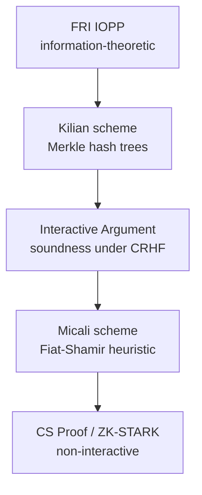

> **Prerequisites**: [[02-fri-main-theorem|02. FRI Main Theorem]] (Theorem 2, Conjecture 3); [[05-fri-soundness|05. FRI Soundness Analysis]] (soundness bound, round complexity)  
> 🔴 **Prerequisite references**: Không có thêm — lesson này ứng dụng, không mở rộng lý thuyết  
> **Lesson type**: Survey  
> **Covers**: §1.2 (ZK applications), §1.3.1–1.3.3 (concrete complexity, Figure 1, Eq. 2), §1.4 (related works)
>
> **Notation**
> | Ký hiệu | Ý nghĩa | Ghi chú |
> |---------|---------|---------|
> | $\mathsf{CC}_{\delta,\varepsilon}(N)$ | Communication complexity (bits) của argument compiled từ FRI | Eq. (2) trong paper |
> | $q_{\delta,\varepsilon}$ | Total query complexity để đạt soundness $\geq 1 - \varepsilon$ | Phụ thuộc $\delta$ và $\varepsilon$ |
> | $\mathsf{AP}_{\delta,\varepsilon}$ | Số nodes trong authentication paths (Merkle) | Phụ thuộc $\delta$, $\varepsilon$, cấu trúc trees |
> | $\lambda$ | Output length của hash function (bits) | $\lambda = 160$ trong ví dụ paper |
> | $\mathsf{root}^{(i)}$ | Merkle root của oracle $f^{(i)}$ | Prover commit bằng $\mathsf{root}^{(i)}$ |
> | ZK-STARK | Scalable Transparent ARgument of Knowledge — zero knowledge | Ứng dụng chính của FRI |
> | SNARK | Succinct Non-interactive ARgument of Knowledge | Cần trusted setup |
> | SCI | Succinct Computational Integrity — hệ thống không ZK trước FRI | Baseline so sánh |

---

## Motivation

Các lesson trước xây dựng FRI từ gốc đến ngọn — từ định nghĩa IOPP (L01) đến soundness analysis (L05). Lesson này trả lời câu hỏi **thực tế**: FRI ứng dụng vào đâu, communication complexity cụ thể là bao nhiêu, và nó đứng ở đâu trong landscape của các proof systems?

---

## 1. FRI Trong Hệ Thống ZK-STARK

### 1.1 Ba Tính Chất Của ZK-STARK

Paper đặt FRI trong mục tiêu xây dựng ZK argument systems đạt đồng thời ba tính chất (§1.2):

> [!note] Definition 6.1 — ZK-STARK Properties
> **ZK-STARK** (Scalable Transparent ARgument of Knowledge) là ZK argument system thỏa mãn:
>
> **(1) Transparent**: Setup chỉ dùng **public randomness** — không cần trusted setup phase (không có "toxic waste" như SNARKs). Verifier messages là public coins.
>
> **(2) Universal**: Áp dụng cho **mọi computation** (không phải chỉ một circuit/language cụ thể).
>
> **(3) Doubly scalable**: Cả hai chiều:
> - Prover: **quasi-linear** proving time (thay vì polynomial)
> - Verifier: **polylogarithmic** verification time

FRI là thành phần cốt lõi để đạt tính chất (3) — prover linear $O(N)$ và verifier logarithmic $O(\log N)$ trong bài toán RS proximity.

### 1.2 Chuỗi Biên Dịch: Từ FRI Đến ZK-STARK

Để biến FRI (một IOPP information-theoretic) thành một argument system cryptographic, cần hai bước biên dịch:

> [!info] 🟡 Kilian Compilation — Interactive Argument (từ Kilian [43])
> **Kilian's scheme** (STOC 1992) biến bất kỳ IOP nào thành **interactive argument** sử dụng Merkle hash trees:
>
> - Tại đầu mỗi round $i$, prover tính Merkle tree $\mathsf{Tree}^{(i)}$ với leaves là các entries của $f^{(i)}$.
> - Prover gửi $\mathsf{root}^{(i)} = \mathsf{root}(\mathsf{Tree}^{(i)})$ — commitment ngắn gọn.
> - Verifier reply với random challenge; prover tiếp tục COMMIT phase.
> - Trong QUERY phase: mỗi query answer đi kèm **authentication path (AP)** chứng minh giá trị nhất quán với $\mathsf{root}^{(i)}$.
> - Soundness: collision-resistant hash function đảm bảo prover không thể thay đổi oracle sau khi commit.
>
> *(theo [43]: Kilian — A note on efficient zero-knowledge proofs and arguments, STOC 1992)*

> [!info] 🟡 Micali Compilation — Non-Interactive CS Proof (từ Micali [49])
> **Micali's scheme** (SICOMP 2000) tiếp tục biên dịch interactive argument thành **non-interactive** bằng Random Oracle Model:
>
> - Verifier messages (random challenges) được "simulate" bằng cách hash các oracles trước đó: $x^{(i)} = H(\mathsf{root}^{(0)}, \ldots, \mathsf{root}^{(i)})$.
> - Prover tự tính toàn bộ interaction mà không cần verifier tham gia.
> - Trong thực tế: hash function như SHA2 thay thế Random Oracle (Fiat-Shamir heuristic [31]).
> - Kết quả: **CS proof** — non-interactive, succinct, publicly verifiable.
>
> *(theo [49]: Micali — Computationally sound proofs, SICOMP 30(4), 2000)*

Chuỗi biên dịch hoàn chỉnh:

---

## 2. Communication Complexity Cụ Thể

### 2.1 Công Thức $\mathsf{CC}_{\delta,\varepsilon}(N)$

Sau khi compiled qua Kilian/Micali, communication complexity của prover là:

$$
\mathsf{CC}_{\delta,\varepsilon}(N) = q_{\delta,\varepsilon} \cdot \log\lvert F \rvert + \mathsf{AP}_{\delta,\varepsilon} \cdot \lambda \tag{2}
$$

trong đó:
- $q_{\delta,\varepsilon}$: tổng query complexity trong IOP model để đạt soundness $\geq 1 - \varepsilon$ với proximity parameter $\delta$
- $\mathsf{AP}_{\delta,\varepsilon}$: số nodes tổng cộng trong các authentication paths của tất cả Merkle trees $\mathsf{Tree}^{(0)}, \ldots, \mathsf{Tree}^{(r)}$
- $\lambda$: số bits output của hash function (độ dài mỗi node Merkle)

**Thành phần thứ nhất** ($q_{\delta,\varepsilon} \cdot \log\lvert F \rvert$): payload thực tế — các query values (mỗi value là một field element = $\log\lvert F \rvert$ bits).

**Thành phần thứ hai** ($\mathsf{AP}_{\delta,\varepsilon} \cdot \lambda$): overhead xác thực Merkle — thường chiếm đa số communication trong thực tế.

### 2.2 Tham Số Cụ Thể Từ Paper

Paper dùng các tham số thực tế:

| Tham số | Giá trị | Lý do |
|---------|---------|-------|
| $\lambda$ | $160$ bits | SHA1-level security |
| $\varepsilon$ | $2^{-80}$ | Soundness error $\leq 2^{-80}$ |
| $\lvert F \rvert$ | $2^{64}$ | Field size — 64-bit field |
| $\rho$ | $1/8$ | Code rate dùng trong SCI [7] và ZK-STARK [11] |
| $\delta$ | $1 - \rho = 7/8$ | Maximally large proximity parameter |

### 2.3 Block-Length Thực Tế (Figure 1.A)

Degree $d = \rho N - 1 \approx N/8$ — message length của RS code. Với TinyRAM [18] — virtual machine đơn giản dùng trong SCI:

$$
d \approx T \cdot 2^{21}
$$

với $T$ là số TinyRAM machine cycles. Degree $d \in [2^{12}, 2^{26}]$ cho các ứng dụng crypto-currency thực tế:
- $d \approx 2^{12}$ = 4096 cho single hash (Davies-Meyer AES128)
- $d \approx 2^{19}$ cho single SHA2
- $d \approx 2^{22}$ cho Zerocash Pour circuit (64 hash invocations)

### 2.4 Communication Complexity Theo Degree (Figure 1.B)

Với $\lambda = 160$, $\varepsilon = 2^{-80}$, $\lvert F \rvert = 2^{64}$, $\rho = 1/8$, $\delta = 7/8$:

| Degree $d$ | CC (proven, Theorem 2) | CC (conjectured, Conjecture 3) |
|-----------|----------------------|-------------------------------|
| $2^{12}$ | ~KB range | ~KB (nhỏ hơn) |
| $2^{20}$ | ~KB–MB range | Nhỏ hơn đáng kể |
| $2^{26}$ | ~MB range | Smaller by constant factor |

Hai đường trong Figure 1.B (đỏ = proven, xanh = conjectured) cho thấy: cải thiện soundness từ Theorem 2 sang Conjecture 3 làm giảm đáng kể communication complexity, đặc biệt với $\delta$ lớn (gần $1 - \rho$).

> [!tip] 💡 Agent note
> Figure 1.B không được reproduce ở đây do copyright. Nhưng pattern quan trọng cần nắm: communication complexity của FRI **polylogarithmic** trong $N$ — nhỏ hơn nhiều so với SCI (cỡ tens of MB) hay naive re-execution. ZK-SNARKs nhỏ hơn (~300 bytes) nhưng cần trusted setup và không quantum-safe.

---

## 3. Round Complexity Considerations

### 3.1 Round Complexity Trong Hệ Thống Thực Tế

FRI có $r \leq \log N / 2$ rounds. Với $d \leq 2^{40}$, $r \leq 20$ rounds. Nếu dùng blockchain làm "time-stamping service" và "public randomness beacon" (ví dụ Zcash generate block mỗi 2.5 phút):

$$
\text{Thời gian FRI proof} \approx r \times 2 \times 2.5 \text{ phút} = r \times 5 \text{ phút}
$$

Với $d = 2^{40}$ (worst case): $\approx 40 \times 5/2 = 100$ phút $< 2$ giờ — chấp nhận được trong thực tế blockchain.

### 3.2 Trade-off Rounds vs. Queries

Full version [10] mô tả trade-off tinh tế hơn: thay vì cố định $q^{(0)}$ bậc 4, ta có thể điều chỉnh để đạt:

$$
r = \frac{\log d}{\log q}
$$

với $q$ là số preimages mỗi round. Tăng $q$ (bậc cao hơn của $q^{(0)}$) → ít rounds hơn nhưng nhiều queries hơn mỗi round. Đây cho phép tùy chỉnh theo use case.

### 3.3 Non-Interactive Compilation

Micali scheme [49] áp dụng Random Oracle Model để "compress" toàn bộ interaction thành non-interactive proof. Theo [19, Remark 1.6], điều này áp dụng được cho multi-round IOPs như FRI với **negligible impact** lên argument length. Thực tế: những ai dùng SHA2 như Random Oracle (Bitcoin, nhiều blockchain khác) có thể compile FRI thành succinct non-interactive argument.

---

## 4. Landscape: FRI Trong Bức Tranh Tổng Thể

### 4.1 So Sánh Với Các Hệ Thống ZK Chính

| Hệ thống | Transparent | Prover time | Verifier time | ZK | Quantum-safe |
|---------|-------------|------------|--------------|-----|-------------|
| QSP-SNARK (Zerocash/Zcash) | ✗ | $O(N \log N)$ | $O(1)$ | ✓ | ✗ |
| SCI (Ben-Sasson et al. [7]) | ✓ | $O(N \log N)$ | $O(\log^c N)$ | ✗ | ✓ |
| **ZK-STARK (via FRI)** | **✓** | **$O(N)$** | **$O(\log^2 N)$** | **✓** | **✓** |

ZK-STARK là hệ thống duy nhất đạt cả bốn tính chất đồng thời. Prover ~50× nhanh hơn SCI, ~10× nhanh hơn ZK-SNARKs (theo [11, Figure 5]).

### 4.2 Related Works — Phân Loại Theo §1.4

#### High-rate LTCs

Locally testable codes (LTCs) — prover complexity và proof length bằng 0 (định nghĩa). Nhưng các LTC hiện đại (Kopparty et al. [45], Gopi et al. [36]) có super-polylogarithmic query complexity và không biết cách chuyển thành PCPs với parameters tốt. RS codes có PCP/IOP constructions rõ ràng nhờ algebraic structure.

#### PCPs và IOPs Ngắn

| Công trình | Proof length | Query complexity | Prover |
|-----------|-------------|-----------------|--------|
| Moshkovitz-Raz [51] | $N^{1+o(1)}$ | $O(1)$ (bits) | Super-linear |
| Ben-Sasson et al. [22] | $O(N)$ | $N^\epsilon$ | Super-linear |
| Ben-Sasson et al. [13] | $O(N)$, 2 rounds | Constant | Super-linear |
| **FRI** | $O(N)$ | $O(\log N)$ | **$O(N)$** |

FRI là hệ thống RS-IOPP duy nhất có prover linear.

#### Soundness Amplification

Các kỹ thuật như parallel repetition [55] (Raz), gap amplification [28] (Dinur), direct-product testing [34] đều cho soundness tốt nhưng prover complexity super-linear. Không áp dụng trực tiếp để cải thiện FRI.

#### Doubly-Efficient "Proofs for Muggles"

Goldwasser-Kalai-Rothblum [35], Reingold et al. [57]: prover polynomial time (không quasi-linear), verifier super-polylogarithmic (thường super-linear). Không đạt được doubly efficient như FRI.

---

## 5. Tóm Tắt

- **ZK-STARK = FRI + Kilian + Micali**: IOPP information-theoretic → interactive argument → non-interactive CS proof.
- **Kilian [43]**: Merkle hash commitment biến oracle thành commitment; authentication paths chứng minh query answers.
- **Micali [49]**: Fiat-Shamir trong ROM làm non-interactive; applies to multi-round FRI với negligible overhead.
- **CC formula** (Eq. 2): $q_{\delta,\varepsilon} \cdot \log\lvert F\rvert + \mathsf{AP}_{\delta,\varepsilon} \cdot \lambda$ — hai thành phần payload + Merkle overhead.
- **Thực tế**: với $d \in [2^{12}, 2^{26}]$, communication complexity FRI nhỏ hơn nhiều so với SCI; prover ×50 nhanh hơn.
- **Round complexity**: $r \leq \log N / 2$ → $\leq 20$ rounds cho $N \leq 2^{40}$; có thể non-interactive qua Fiat-Shamir.
- **Landscape**: FRI/ZK-STARK là hệ thống transparent ZK duy nhất đạt prover $O(N)$ + verifier $\text{poly}\log N$ + ZK + quantum-safe đồng thời.

---

## References

- [43] Kilian — *A note on efficient ZK proofs and arguments*, STOC 1992 (🟡 Integrated: Merkle compilation)
- [49] Micali — *Computationally sound proofs*, SICOMP 2000 (🟡 Integrated: RO compilation, non-interactive)
- [11] Ben-Sasson et al. — *ZK-STARK paper*, 2017 (ứng dụng chính của FRI)
- [7] Ben-Sasson et al. — *SCI system*, ePrint 2016:646 (baseline so sánh)
- [15] Ben-Sasson et al. — *Zerocash*, IEEE S&P 2014 (⚪)
- [31] Fiat, Shamir — *How to prove yourself*, CRYPTO 1986 (⚪ — Fiat-Shamir heuristic)
- [19] Ben-Sasson, Chiesa, Spooner — *Interactive Oracle Proofs*, TCC 2016 (🟡 — đã integrate L01)
- [51] Moshkovitz, Raz; [13] Ben-Sasson et al.; [28] Dinur; [35] Goldwasser et al.; [57] Reingold et al. — related works (⚪)
