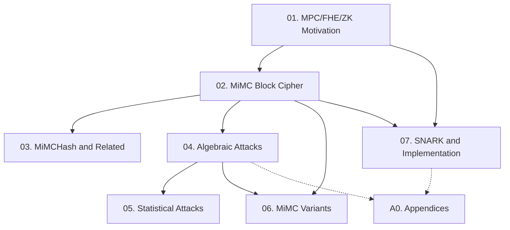

Course này distill toàn bộ nội dung paper MiMC (ASIACRYPT 2016) — thiết kế block cipher và hash function tối thiểu số nhân trường hữu hạn, nhắm đến MPC/FHE/ZK. Tất cả sections, theorems, algorithms, và appendices của paper đều được cover.

**Tài liệu gốc**: [eprint.iacr.org/2016/492](https://eprint.iacr.org/2016/492)  
**Kiến thức nền yêu cầu** (🔴): Finite field arithmetic [MVO96], Block cipher cơ bản (SPN/Feistel), Gröbner bases [BKW93]

---

## Lesson Overview

| # | Title | Type | Covers (sections) | File | Dependencies |
|---|-------|------|-------------------|------|-------------|
| 01 | MPC/FHE/ZK Motivation and Multiplicative Complexity | Foundation | §1, §3.6, §4.1 | [[01-mimc-motivation\|01. MPC/FHE/ZK Motivation]] | — |
| 02 | MiMC Block Cipher Construction | Scheme | §2.1, §2.2, Prop. 1, Lemma 1, Fig. 1 | [[02-mimc-block-cipher\|02. MiMC Block Cipher]] | 01 |
| 03 | MiMCHash and Related Designs | Scheme + Survey | §2.3, §3.1–3.5 | [[03-mimchash-related\|03. MiMCHash & Related Designs]] | 02 |
| 04 | Security Analysis — Algebraic Attacks | Attack | §4.2 (interpolation, GCD, invariant subfields) | [[04-mimc-algebraic-attacks\|04. Algebraic Attacks]] | 02 |
| 05 | Security Analysis — Statistical Attacks | Attack | §4.2 (differential, linear, degree, hash) | [[05-mimc-statistical-attacks\|05. Statistical Attacks]] | 04 |
| 06 | MiMC Variants | Deep Dive | §5.1–5.3, Theorem 1, Algorithm 1 | [[06-mimc-variants\|06. MiMC Variants]] | 02, 04 |
| 07 | SNARK Applications and Implementation | Deep Dive | §6.1–6.3, Def. 1–2, Tables 3–4, §7 | [[07-mimc-snark-impl\|07. SNARK & Implementation]] | 01, 02 |
| A0 | SNARK Prover and Restricted Security Analysis | — | Appendix A, B, C | [[a0-mimc-appendices\|A0. Appendices]] | 07, 04 |

**Lesson types**: Foundation · Math Component · Scheme · Attack · Protocol · Deep Dive · Specification · Survey

---

## Coverage Map

| Document section | Covered in lesson |
|------------------|-------------------|
| §1 Introduction | 01 |
| §3.6 Comparison (Tables 1, 2) | 01 |
| §4.1 Computation Cost Model | 01 |
| §2.1 Block cipher (MiMC-n/n, MiMC-2n/n, Prop. 1, Lemma 1, Fig. 1) | 02 |
| §2.2 Permutation | 02 |
| §2.3 Hash function (sponge, MiMCHash-256) | 03 |
| §3.1 Knudsen-Nyberg cipher | 03 |
| §3.2 Pohlig-Hellman cipher | 03 |
| §3.3 Naor-Reingold PRF | 03 |
| §3.4 Ajtai, SWIFFT, SWIFFTX | 03 |
| §3.5 SPRING | 03 |
| §4.2 Interpolation attack | 04 |
| §4.2 GCD attack | 04 |
| §4.2 Invariant subfields | 04 |
| §4.2 Differential attacks | 05 |
| §4.2 Linear attacks | 05 |
| §4.2 Algebraic degree and higher-order differentials | 05 |
| §4.2 Hash-specific security considerations | 05 |
| §5.1 MiMC over prime fields | 06 |
| §5.2 Larger keys (Gröbner, Resultants) | 06 |
| §5.3 Different round functions (Theorem 1, Algorithm 1) | 06 |
| §6.1 SNARK (Def. 1, 2, Table 3) | 07 |
| §6.2 Direct implementation (Table 4) | 07 |
| §6.3 Higher-order masking (CGPQR) | 07 |
| §7 Conclusions | 07 |
| Appendix A (SNARK prover, parameters) | A0 |
| Appendix B (restricted complexity analysis) | A0 |
| Appendix C (SNARK experiments, Fig. 2, 3) | A0 |

---

## Dependency Graph

---

## Progress

- [x] [[01-mimc-motivation|01. MPC/FHE/ZK Motivation]]
- [x] [[02-mimc-block-cipher|02. MiMC Block Cipher]]
- [x] [[03-mimchash-related|03. MiMCHash & Related Designs]]
- [x] [[04-mimc-algebraic-attacks|04. Algebraic Attacks]]
- [x] [[05-mimc-statistical-attacks|05. Statistical Attacks]]
- [x] [[06-mimc-variants|06. MiMC Variants]]
- [x] [[07-mimc-snark-impl|07. SNARK & Implementation]]
- [x] [[a0-mimc-appendices|A0. Appendices]]

---

## 🟡 Integrated References

| Ref Key | Used in lesson | Nội dung integrate |
|---------|---------------|--------------------|
| [ARS+15] | 01, 07 | LowMC design: AND count, comparison với MiMC trong SNARK |
| [BSCG+13] | 01, 07, A0 | SNARK construction, R1CS, prover algorithm complexity |
| [JK97] | 04 | Interpolation attack construction + meet-in-the-middle variant |
| [KN95] | 03 | KN cipher design — MiMC là simplification trực tiếp |
| [BDPA08] | 03 | Sponge framework — MiMCHash dùng trực tiếp |
| [CGP+12] | 07 | CGPQR higher-order masking scheme |

---

## Notes

- L01 là bắt buộc đọc trước — thiết lập toàn bộ motivation và metrics cho paper.
- L04 là lesson kỹ thuật nặng nhất: interpolation attack và GCD attack quyết định toàn bộ round count của MiMC.
- L04 → L05 nên đọc liền nhau để hiểu trọn security argument.
- A0 là optional — cần thiết khi muốn hiểu chi tiết SNARK implementation hoặc attack khi restricted resources.
