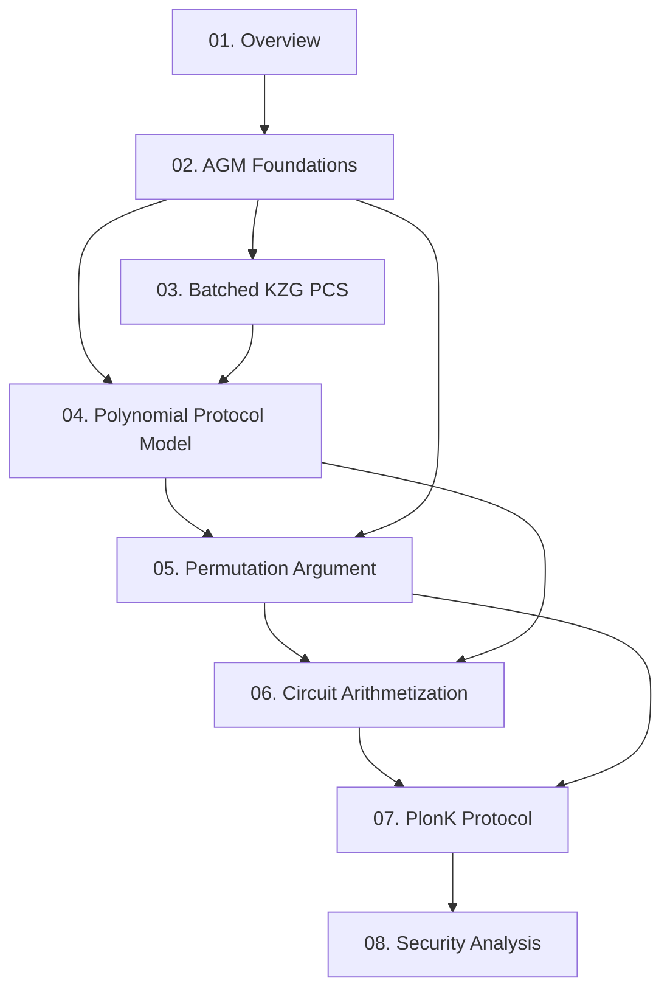

PLONK (Gabizon, Williamson, Ciobotaru — ePrint 2019/953) là một **universal, updatable zk-SNARK** với fully succinct verification cho arithmetic circuit satisfiability. Course này distill toàn bộ paper — từ context ban đầu, KZG polynomial commitments, mô hình polynomial protocol trừu tượng, permutation argument, arithmetization, đến full protocol và security analysis.

**Tài liệu gốc**: [ePrint 2019/953](https://eprint.iacr.org/2019/953.pdf)  
**Kiến thức nền tảng yêu cầu** (🔴 Prerequisite references): ECC/bilinear pairings [KZG10-prereq], SNARK with preprocessing [GGPR13], arithmetic circuit satisfiability [BCC+16]

---

## Lesson Overview

| # | Title | Type | Covers (sections) | File | Dependencies |
|---|-------|------|-------------------|------|-------------|
| 01 | Overview, Motivation & Efficiency | Survey | §1, §1.1–1.4, Tables 1–2, Fig 1 | [[01-plonk-overview\|01. Overview & Motivation]] | — |
| 02 | Mathematical Foundations & AGM | Foundation | §2, §2.1–2.2, Def 2.1, Lemma 2.2 | [[02-plonk-agm-foundations\|02. AGM Foundations]] | 01 |
| 03 | Batched KZG Polynomial Commitment | Deep Dive | §3, §3.1, Def 3.1, Lemma 3.3 | [[03-plonk-kzg-pcs\|03. Batched KZG PCS]] | 02 |
| 04 | Idealized Polynomial Protocol Model | Math Component | §4, Def 4.1, 4.3, Lemma 4.5, 4.7, Claim 4.6 | [[04-plonk-polynomial-protocol\|04. Polynomial Protocol Model]] | 02, 03 |
| 05 | Permutation Argument | Deep Dive | §5, §5.1–5.2, Protocol 5.1, Lemma 5.2–5.4 | [[05-plonk-permutation-argument\|05. Permutation Argument]] | 02, 04 |
| 06 | Circuit Arithmetization (PlonK Gates) | Math Component | §6, §6.1–6.2 | [[06-plonk-arithmetization\|06. Circuit Arithmetization]] | 04, 05 |
| 07 | The PlonK Protocol | Protocol | §7, §8, Theorem 7.1, Corollary 7.2 | [[07-plonk-protocol\|07. The PlonK Protocol]] | 05, 06 |
| 08 | Security Analysis | Foundation | §2.2, §4.2, §7.1, Corollary 7.2 proof | [[08-plonk-security\|08. Security Analysis]] | 07 |

**Lesson types**: Foundation · Math Component · Deep Dive · Protocol · Survey

---

## Coverage Map

| Document section | Covered in lesson |
|------------------|-------------------|
| §1 Introduction | 01 |
| §1.1 Our results | 01 |
| §1.2 Efficiency Analysis (Table 1, 2) | 01 |
| §1.3 Performance & Benchmarks (Fig 1) | 01 |
| §1.4 Comparison with Fractal/Marlin | 01 |
| §2.1 Terminology and Conventions | 02 |
| §2.2 AGM model, Def 2.1, Lemma 2.2 | 02 |
| §3 Def 3.1, §3.1 PCS (gen/com/open) | 03 |
| §3.1 Lemma 3.3 (efficiency) | 03 |
| §4 Def 4.1, 4.3, Remark 4.2, 4.4 | 04 |
| §4.1 Lemma 4.5, Claim 4.6 (ranged protocols) | 04 |
| §4.2 Lemma 4.7 (compilation), linearisation polynomial | 04 |
| §5.1 Protocol 5.1, Lemma 5.2 | 05 |
| §5.2 Protocol 5.3, Lemma 5.4 | 05 |
| §6.1 Gate constraints (qL, qR, qO, qM, qC) | 06 |
| §6.2 Copy constraints (σ, SID, Sσ1/2/3) | 06 |
| §7 Theorem 7.1, Corollary 7.2 (statement) | 07 |
| §8 Full protocol (Setup/Preprocess/Prove/Verify) | 07 |
| Corollary 7.2 proof (efficiency bound) | 08 |
| AGM security reduction (Lemma 4.7 applied to PLONK) | 08 |
| Zero-knowledge discussion (§8 blinding factors) | 08 |

---

## Dependency Graph

---

## Progress

- [ ] [[01-plonk-overview\|01. Overview & Motivation]]
- [ ] [[02-plonk-agm-foundations\|02. AGM Foundations]]
- [ ] [[03-plonk-kzg-pcs\|03. Batched KZG PCS]]
- [ ] [[04-plonk-polynomial-protocol\|04. Polynomial Protocol Model]]
- [ ] [[05-plonk-permutation-argument\|05. Permutation Argument]]
- [ ] [[06-plonk-arithmetization\|06. Circuit Arithmetization]]
- [ ] [[07-plonk-protocol\|07. The PlonK Protocol]]
- [ ] [[08-plonk-security\|08. Security Analysis]]

---

## 🟡 Integrated References

| Ref Key | Used in lesson | What is integrated |
|---------|---------------|--------------------|
| [KZG10] | 03 | gen/com/open protocol; Kate commitment scheme definition |
| [BG12] | 05 | Grand product argument (permutation check over subgroup) |
| [FKL18] | 02, 08 | Algebraic Group Model definition; Lemma 2.2 proof technique |

---

## Notes

- **Thứ tự học**: Lessons 01 → 02 → 03 → 04 → 05 → 06 → 07 → 08 là tuyến tính; không có lesson nào optional.
- **Lesson 07** bao gồm §8 (full protocol) vì §8 chỉ là self-contained restatement của §7, không có nội dung mới về lý thuyết.
- **Lesson 08** (Security) cover Corollary 7.2 proof chi tiết — đây là phần paper trình bày vắn tắt nhất nhưng quan trọng nhất; lesson này sẽ expand bằng kết quả từ Lemma 4.7 và AGM framework.
- Paper có zero-knowledge discussion ở §8 (blinding factors); nội dung này được cover trong lesson 08, không tách ra riêng vì ngắn.
- Đây là paper ~38 trang với 8 sections chính — 8 lessons là hợp lý (mỗi lesson ~4–5 trang coverage).
