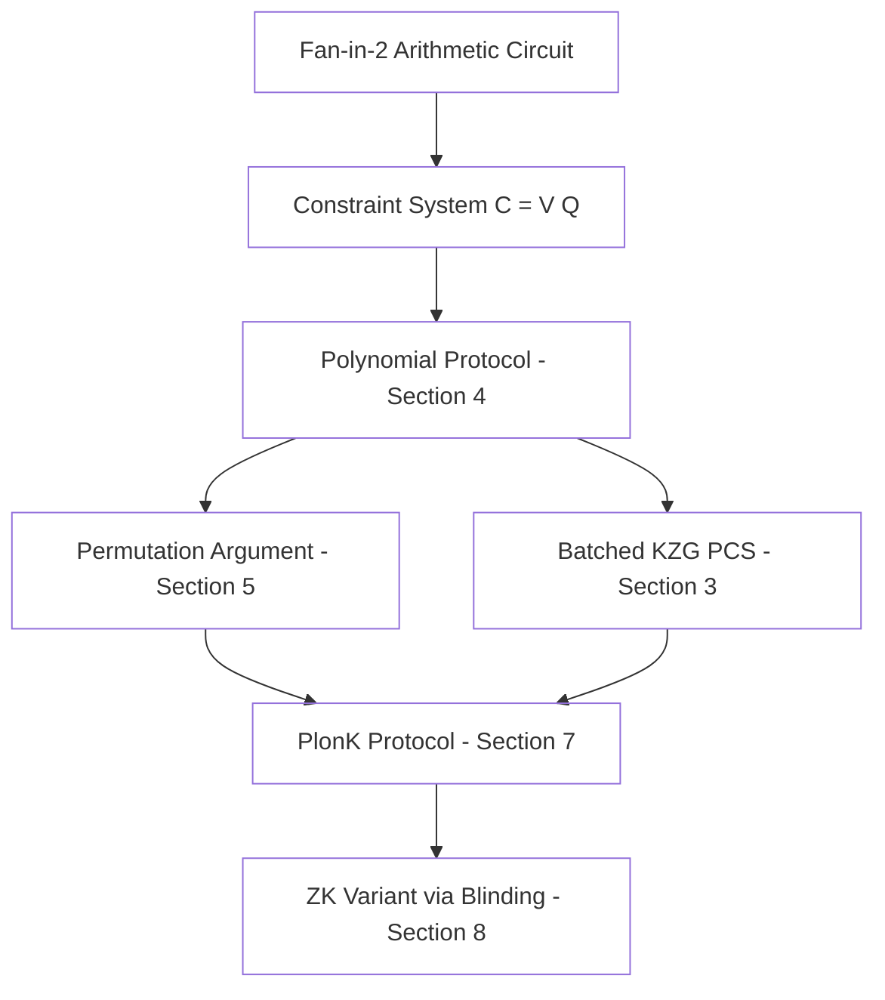

> **Prerequisites**: zk-SNARK cơ bản (completeness, soundness, zero knowledge), elliptic curve groups, polynomial evaluation  
> 🔴 **Prerequisite references**: Groth — *On the Size of Pairing-based Non-interactive Arguments* [Gro16] (Groth16 background); Maller et al. — *Sonic* [MBKM] (tiền thân trực tiếp của PLONK)  
> **Lesson type**: Foundation  
> **Covers**: §1, §1.1 (Our results), §1.2 (Efficiency Analysis, Table 1–2), §1.3 (Benchmarks, Figure 1), §1.4 (Comparison with Fractal/Marlin)
>
> **Notation** (ký hiệu dùng trong bài này):
> | Ký hiệu | Ý nghĩa | Ký hiệu trong paper |
> |---------|---------|---------------------|
> | $\mathbb{F}$ | Prime field (trường hữu hạn bậc nguyên tố) | $F$ |
> | $\mathbb{G}_1, \mathbb{G}_2, \mathbb{G}_t$ | Các nhóm bậc $r$ trong pairing group | $G_1, G_2, G_t$ |
> | $\lambda$ | Security parameter | $\lambda$ |
> | $n$ | Số multiplication gates trong circuit | $n$ |
> | $a$ | Số addition gates trong circuit | $a$ |
> | $m$ | Số wires trong circuit | $m$ |
> | SRS | Structured Reference String (chuỗi tham chiếu có cấu trúc) | $\mathsf{srs}$ |

---

## Motivation

### Bài toán cốt lõi: Chứng minh computation mà không tiết lộ witness

Một **zk-SNARK** (Zero-Knowledge Succinct Non-Interactive Argument of Knowledge) cho phép một prover thuyết phục một verifier rằng một computation $C$ có một input hợp lệ $\omega$ (witness) thỏa mãn output $x$ — mà không cần tiết lộ $\omega$, và với proof cực ngắn (logarithmic trong kích thước mạch).

Ứng dụng thực tế: blockchain privacy (Zcash), rollup Ethereum (zkSync, Aztec), chứng minh toàn vẹn tính toán phân tán.

### Rào cản lớn nhất: Circuit-specific trusted setup

Hệ thống SNARK đỉnh cao nhất trước PLONK là **Groth16** [Gro16]: proof chỉ gồm 3 elements nhóm, verifier chỉ cần 3 bilinear pairing. Nhưng Groth16 có một nhược điểm cốt tử — **CRS (Common Reference String) phải sinh riêng cho từng circuit**. Điều này có nghĩa:

- Mỗi khi thay đổi logic chương trình → phải tổ chức lại trusted setup ceremony.
- Nếu trusted setup bị compromise → toàn bộ hệ thống mất soundness.
- Không thể tái sử dụng setup cho nhiều ứng dụng khác nhau.

**Universal SNARK** giải quyết vấn đề này: một SRS duy nhất phục vụ mọi circuit kích thước nhỏ hơn giới hạn $n_{\max}$. PlonK là một universal SNARK, điều đó có nghĩa Aztec Protocol chỉ cần một lần trusted setup cho toàn bộ nền tảng.

---

## zk-SNARK Fully Succinct — Định nghĩa

Paper [GWC19, §1] định nghĩa **fully succinct** zk-SNARK cho circuit satisfiability là hệ thống thỏa mãn đồng thời bốn điều kiện:

> [!note] Định nghĩa — Fully Succinct zk-SNARK
> Một zk-SNARK cho circuit satisfiability là **fully succinct** nếu:
>
> 1. **Preprocessing**: thời gian tạo SRS là quasilinear theo kích thước circuit — $O(n \log n)$
> 2. **Prover**: thời gian sinh proof là quasilinear — $O(n \log n)$
> 3. **Proof length**: độ dài proof là logarithmic — $O(\log n)$ (trong thực tế: hằng số group elements)
> 4. **Verifier**: thời gian verify là polylogarithmic — $O(\mathsf{polylog}(n))$

**Universal** thêm điều kiện thứ năm: SRS có thể được tạo theo cách *updatable* — bất kỳ bên nào cũng có thể contribute vào SRS, và chỉ cần **một** trong các participants là honest để đảm bảo soundness.

---

## Đóng góp chính của PlonK

### Hai cải tiến kỹ thuật cốt lõi

PlonK [GWC19, §1.1] đạt được fully succinct universal SNARK nhờ hai insight kỹ thuật:

**Insight 1 — Arithmetization trực tiếp qua gate-based system:**  
Thay vì dùng R1CS (Rank-1 Constraint System) như Sonic [MBKM], PlonK arithmetize circuit fan-in-2 trực tiếp thành constraint system $(V, Q)$ với hai loại ràng buộc:
- *Gate constraints*: mỗi gate $(a_i, b_i, c_i)$ thỏa mãn $q_{L,i} a_i + q_{R,i} b_i + q_{M,i} a_i b_i + q_{O,i} c_i + q_{C,i} = 0$
- *Copy constraints*: wires được kết nối nhau phải mang cùng giá trị (được kiểm tra qua permutation argument)

**Insight 2 — Permutation argument trên multiplicative subgroup:**  
Thay vì dùng bivariate polynomial để encode linear constraints (như Sonic), PlonK encode wire values như *evaluations* của univariate polynomial trên multiplicative subgroup $H \subset \mathbb{F}$. Điều này cho phép dùng permutation argument của Bayer-Groth [BG12] một cách đơn giản hơn đáng kể.

> [!tip] 💡 Agent note
> Tại sao multiplicative subgroup lại tiện? Nếu $H \subset \mathbb{F}$ là multiplicative subgroup bậc $n$ với generator $g$, thì Lagrange basis polynomial $L_x(X)$ của một phần tử $x \in H$ có dạng:
>
> $$L_x(X) = c_x \cdot \frac{X^n - 1}{X - x}$$
>
> Đây là biểu diễn cực kỳ thưa (sparse) — rất thuận lợi cho việc xây dựng polynomial identity checks mà không cần FFT tốn kém.

---

## So sánh hiệu suất

Paper [GWC19, §1.2] so sánh PlonK với state-of-the-art qua prover work (số G₁ exponentiations):

**Prover comparison** (từ Table 1 của paper):

| Hệ thống | SRS size | Prover work | Proof length | Succinct | Universal |
|----------|----------|-------------|--------------|----------|-----------|
| Groth16 | (non-updateable) | $6n + m$ G₁ exp | 2 G₁, 1 G₂ | ✓ | ✗ |
| Sonic (helped) | $12d$ G₁+G₂ | $18n$ G₁ exp | 4 G₁, 2 F | ✗ | ✓ |
| Sonic (succinct) | $4d$ G₁+G₂ | **$273n$** G₁ exp | 20 G₁, 16 F | ✓ | ✓ |
| **PlonK (fast prover)** | $d$ G₁, 1 G₂ | **$9(n+a)$** G₁ exp | 9 G₁, 6 F | ✓ | ✓ |
| **PlonK (small proof)** | $3d$ G₁, 1 G₂ | $11(n+a)$ G₁ exp | 7 G₁, 6 F | ✓ | ✓ |

*($d$ = max circuit size, $n$ = multiplication gates, $a$ = addition gates)*

**Verifier comparison** (từ Table 2 của paper):

| Hệ thống | Verifier work |
|----------|---------------|
| Groth16 | 3 pairings + $\ell$ G₁ exp |
| Sonic (succinct) | 13 pairings |
| **PlonK (small)** | **2 pairings** + 16 G₁ exp |

Chỉ 2 pairings đạt được nhờ cấu trúc đơn giản của các prover polynomials và thực tế G₂ elements trong mỗi pairing là cố định (tối ưu hóa ≈30% thời gian pairing [CS10]).

> [!info] Đọc bảng đúng cách
> Comparison PlonK vs Groth16 đòi hỏi giả định về $a/n$. Với $a = 2n$ (phổ biến), PlonK cần ≈ $2.25\times$ prover work hơn Groth16 nhưng có SRS universal + updatable. So với Sonic succinct, PlonK nhanh hơn ≈ $10\times$.

---

## Benchmarks thực tế

Paper [GWC19, §1.3] benchmark PlonK trên BN254 curve (Barretenberg library, Surface Pro 6, 16GB RAM, Core i7-8650U):

| Circuit size | Prove time | Verify time |
|-------------|------------|-------------|
| $2^{13}$ gates | ~0.2s | ~4ms |
| $2^{17}$ gates | ~3s | ~8ms |
| $2^{20}$ gates (~1M gates) | ~23s | ~10ms |

Ngay cả với hơn 1 triệu gates, PlonK có thể sinh proof trên consumer hardware trong dưới 23 giây — đây là bước đột phá so với các universal SNARK trước đó.

Prover work chia thành hai phần xấp xỉ bằng nhau:
- **G₁ scalar multiplications** (commitments + openings)
- **FFT**: 8 FFTs kích thước $4n$, 5 FFTs kích thước $2n$, 12 FFTs kích thước $n$

---

## So sánh với Marlin/Fractal

Concurrent work Marlin [CHM+19] và Fractal [COS19] dùng phương pháp **randomized sumcheck** để xử lý R1CS. Điểm khác biệt then chốt [GWC19, §1.4]:

PlonK tập trung vào **fan-in-2 constant circuits** thay vì R1CS với unlimited addition fan-in. Điều này có nghĩa:
- *Wiring constraints* của PlonK chỉ là equality constraints → reducible về permutation check
- Marlin cần bivariate sparse evaluation để handle general linear constraints

> [!warning] Khi nào Marlin hiệu quả hơn PlonK?
> Trong trường hợp "fully dense" R1CS constraint $\left(\sum_j a_j x_j\right) \cdot \left(\sum_j b_j x_j\right) = \sum_j c_j x_j$ với tất cả entries non-zero, Marlin có thể tốt hơn PlonK vì fan-in lớn được xử lý hiệu quả hơn. Với các circuit thông thường, PlonK nhanh hơn ≈2x.

---

## Kiến trúc tổng thể PlonK

Hệ thống PlonK được xây dựng theo 5 lớp chồng nhau:

Mỗi lớp sẽ được phân tích chi tiết trong các lesson tiếp theo theo thứ tự dependency.

---

## Summary

- PlonK là **universal fully succinct zk-SNARK** — một SRS duy nhất cho mọi circuit kích thước $\leq n_{\max}$, updatable.
- Hai đóng góp kỹ thuật cốt lõi: **gate-based arithmetization** (vs R1CS) và **univariate permutation argument trên multiplicative subgroup** (vs bivariate Sonic).
- Prover cần $9(n+a)$ G₁ exp — nhanh hơn **30×** so với Sonic succinct, gần bằng **1.1×** Groth16 (ở $a=0$).
- Verifier chỉ cần **2 bilinear pairings** — hiệu quả nhất trong các universal SNARKs.
- Proof length: **9 G₁ + 6 field elements** (fast) hoặc 7 G₁ + 6 field elements (small) — hằng số không phụ thuộc circuit size.

---

## References

- [GWC19] Gabizon, Williamson, Ciobotaru — *PlonK: Permutations over Lagrange-bases for Oecumenical Noninteractive arguments of Knowledge*, ePrint 2019/953
- [MBKM] Maller, Bowe, Kohlweiss, Meiklejohn — *Sonic: Zero-Knowledge SNARKs from Linear-Size Universal and Updatable Structured Reference Strings*, CCS 2019 (🔴 Prerequisite)
- [Gro16] Groth — *On the Size of Pairing-based Non-interactive Arguments*, EUROCRYPT 2016 (🔴 Prerequisite)
- [BG12] Bayer, Groth — *Efficient Zero-Knowledge Argument for Correctness of a Shuffle*, EUROCRYPT 2012 (🟡 Integrate — dùng ở Lesson 05)
- [CHM+19] Chiesa, Hu, Maller et al. — *Marlin: Preprocessing zkSNARKs with Universal and Updatable SRS*, ⚪
- [COS19] Chiesa, Ojha, Spooner — *Fractal: Post-Quantum and Transparent Recursive Proofs*, ⚪
- [CS10] Chatterjee, Scott — pairing optimization, ⚪
