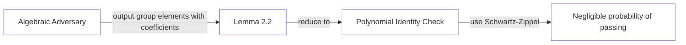

> **Prerequisites**: Bilinear pairing cơ bản ($e: \mathbb{G}_1 \times \mathbb{G}_2 \to \mathbb{G}_t$), discrete logarithm problem, polynomial evaluation  
> 🔴 **Prerequisite references**: Fuchsbauer, Kiltz, Loss — *The Algebraic Group Model and its Applications* [FKL18] (AGM original paper — dùng để phân tích Groth16)  
> **Lesson type**: Foundation  
> **Covers**: §2.1 (Terminology & Conventions), §2.2 (AGM model, Definition 2.1, Lemma 2.2, Knowledge Soundness in AGM)
>
> **Notation** (ký hiệu dùng trong bài này):
> | Ký hiệu | Ý nghĩa | Ký hiệu trong paper |
> |---------|---------|---------------------|
> | $\mathbb{F}$ | Prime field bậc $r = \lambda^{\omega(1)}$ | $F$ |
> | $\mathbb{G}_1, \mathbb{G}_2, \mathbb{G}_t$ | Pairing groups bậc $r$ | $G_1, G_2, G_t$ |
> | $e : \mathbb{G}_1 \times \mathbb{G}_2 \to \mathbb{G}_t$ | Non-degenerate bilinear pairing | $e$ |
> | $g_1, g_2$ | Generators của $\mathbb{G}_1, \mathbb{G}_2$ | $g_1, g_2$ |
> | $[x]_1 := x \cdot g_1$ | Encoding của scalar $x$ trong $\mathbb{G}_1$ | $[x]_1$ |
> | $[x]_2 := x \cdot g_2$ | Encoding của scalar $x$ trong $\mathbb{G}_2$ | $[x]_2$ |
> | $\mathsf{srs}$ | Structured Reference String | $\mathsf{srs}$ |
> | $Q$ | Degree của SRS (max degree polynomial được commit) | $Q$ |
> | $\mathsf{negl}(\lambda)$ | Negligible function | $\mathsf{negl}(\lambda)$ |
> | $\mathcal{A}$ | Adversary (PPT algorithm) | $A$ |
> | $\mathcal{E}$ | Extractor (efficient algorithm trích xuất witness) | $E$ |

---

## Motivation

### Tại sao cần một security model đặc biệt?

PlonK là một SNARK dựa trên **polynomial commitments** (KZG scheme). Trong KZG, một commitment có dạng $[f(x)]_1 = f(x) \cdot g_1$ — là một group element trong $\mathbb{G}_1$ mà từ đó không thể reconstruct $f(x)$ (do DLP). Vậy làm thế nào một verifier có thể tin rằng prover "thực sự biết" polynomial $f$ phía sau commitment?

Security proof chuẩn theo **Generic Group Model** (GGM) quá mạnh và không capture được các attack trên các group cụ thể. Ngược lại, **Algebraic Group Model (AGM)** [FKL18] là một model trung gian: adversary được phép làm việc với biểu diễn cụ thể của group elements, nhưng phải "giải thích" mọi group element mình output như một linear combination của các elements đã nhận được. Điều này tự nhiên với prover trong SNARK vì prover tính toán tất cả commitments bằng cách evaluate polynomial trên SRS.

---

## Terminology và Conventions

Paper [GWC19, §2.1] thiết lập các convention sau, được dùng xuyên suốt mọi phần:

**Object generator** $O(\lambda)$ trả về toàn bộ cryptographic objects:

$$O(\lambda) = (\mathbb{F}, \mathbb{G}_1, \mathbb{G}_2, \mathbb{G}_t, e, g_1, g_2)$$

trong đó $\mathbb{F}$ có bậc nguyên tố $r = \lambda^{\omega(1)}$ (super-polynomial), và $e(g_1, g_2) = g_t$ (generator của $\mathbb{G}_t$).

**Encoding notation**: $[x]_1 := x \cdot g_1$ và $[x]_2 := x \cdot g_2$. Nhóm $\mathbb{G}_1, \mathbb{G}_2$ được viết *cộng tính* (additively), nhóm $\mathbb{G}_t$ viết nhân tính.

**SRS của monomials**: SRS trong PlonK có dạng:

$$\mathsf{srs} = \left(\left([x^i]_1\right)_{a \leq i \leq b},\ \left([x^i]_2\right)_{c \leq i \leq d}\right)$$

cho $x \in \mathbb{F}$ uniform ngẫu nhiên. Bowe et al. [BGM17] chứng minh SRS dạng này có thể sinh trong một **universal updatable setup** với chỉ một honest participant.

**Public-coin protocols + Fiat-Shamir**: PlonK được mô tả như interactive protocol (verifier gửi random coins), nhưng trở thành non-interactive qua **Fiat-Shamir transform** (dùng random oracle / hash function thay cho verifier messages). Proof length = tổng communication của prover.

---

## Algebraic Group Model (AGM)

> [!info] 🟡 Algebraic Group Model (theo [FKL18])
> AGM được Fuchsbauer, Kiltz và Loss giới thiệu trong *The Algebraic Group Model and its Applications* (CRYPTO 2018). Model này được thiết kế để phân tích security của các scheme dựa trên discrete log, cụ thể là Groth16. PlonK [GWC19, §2.2] adopt AGM với adaptation nhỏ phù hợp với SRS-based protocols.
>
> **Định nghĩa AGM adversary** (theo [FKL18], adapted cho SRS):
> Một adversary $\mathcal{A}$ là *algebraic* trong một SRS-based protocol nếu với mọi $i \in \{1, 2\}$: bất cứ khi nào $\mathcal{A}$ output một element $A \in \mathbb{G}_i$, nó cũng output một vector $\mathbf{v}$ trên $\mathbb{F}$ sao cho:
>
> $$A = \langle \mathbf{v},\ \mathsf{srs}_i \rangle$$
>
> tức là $A$ là linear combination (tường minh) của các SRS elements trong $\mathbb{G}_i$ mà $\mathcal{A}$ đã nhận được.

Ý nghĩa thực tế: một algebraic adversary không thể "tạo ra" group element từ hư không — nó phải chỉ ra cách element đó được tổ hợp từ các inputs đã biết. Đây là mô hình hóa hành vi của prover trong PlonK: mọi commitment $[f(x)]_1$ đều là linear combination của $[1]_1, [x]_1, [x^2]_1, \ldots$ với coefficients là coefficients của $f$.

---

## Q-DLOG Assumption

> [!note] Definition 2.1 — Q-DLOG Assumption
> **Input**: $[1]_1, [x]_1, \ldots, [x^Q]_1, [1]_2, [x]_2, \ldots, [x^Q]_2$ với $x \in \mathbb{F}$ uniform.
>
> **Assumption**: Với mọi $Q = \mathsf{poly}(\lambda)$, xác suất để một PPT adversary $\mathcal{A}$ output được $x$ từ input trên là $\mathsf{negl}(\lambda)$.
>
> **Formal**:
>
> $$\Pr\left[\mathcal{A}\left([1]_1, [x]_1, \ldots, [x^Q]_1, [1]_2, [x]_2, \ldots, [x^Q]_2\right) = x\right] \leq \mathsf{negl}(\lambda)$$

Đây là generalization của DLP: thay vì chỉ cho $[x]_1$, adversary được cho toàn bộ "power series" $[x^0]_1, [x^1]_1, \ldots, [x^Q]_1$ — nhưng vẫn không tính được $x$. Assumption này mạnh hơn DLP (DLP chỉ cho $[x]_1$) nhưng vẫn được tin là hard trên các pairing-friendly curves như BN254.

> [!tip] 💡 Agent note
> Tại sao cần dạng "power series" $[x^i]_1$ thay vì chỉ $[x]_1$? Vì SRS của PlonK (và KZG) chứa đúng dạng này — prover nhận được $[1]_1, [x]_1, \ldots, [x^{d-1}]_1$ để compute polynomial commitments. Security proof cần nói: ngay cả với toàn bộ SRS này, adversary không thể tìm được $x$ (nếu tìm được thì có thể forge commitments).

---

## Real vs Ideal Pairing Check

Đây là công cụ kỹ thuật trung tâm cho phép chuyển từ security analysis trên group elements sang polynomial identity checks — đơn giản hơn nhiều.

**Real pairing check**: một check của dạng

$$(\mathbf{a} \cdot T_1) \cdot (T_2 \cdot \mathbf{b}) = 0$$

trong đó $T_1, T_2$ là matrices trên $\mathbb{F}$, và tích $\cdot$ ở đây là tích pairing qua $e: \mathbb{G}_1 \times \mathbb{G}_2 \to \mathbb{G}_t$. Đây là check thực tế verifier thực hiện với encoded elements.

**Ideal check**: Vì $\mathcal{A}$ là algebraic, mỗi $[a_j]_1$ nó output đều có representation $a_j = \sum_\ell v_\ell f_{1,\ell}(x) = R_{1,j}(x)$ với $R_{1,j}(X) := \sum_\ell v_\ell f_{1,\ell}(X)$ là polynomial. Ideal check kiểm tra *polynomial identity*:

$$(R_1 \cdot T_1)(T_2 \cdot R_2) \equiv 0$$

là đẳng thức đa thức (không phải chỉ tại điểm $x$).

---

## Lemma 2.2 — Equivalence of Real and Ideal Checks

> [!abstract] Lemma 2.2 (PlonK Paper — §2.2)
> Giả sử Q-DLOG cho $(\mathbb{G}_1, \mathbb{G}_2)$. Cho một algebraic adversary $\mathcal{A}$ tham gia vào một protocol với degree-$Q$ SRS:
>
> $$\Pr[\text{real pairing check passes}] \leq \Pr[\text{ideal check holds}] + \mathsf{negl}(\lambda)$$

**Proof** (theo [GWC19, §2.2]):

Gọi $\gamma$ là khoảng cách xác suất giữa hai vế. Ta xây dựng adversary $\mathcal{A}^*$ giải Q-DLOG với xác suất $\gamma$, buộc $\gamma = \mathsf{negl}(\lambda)$.

$\mathcal{A}^*$ nhận Q-DLOG challenge $\left([1]_1, [x]_1, \ldots, [x^Q]_1, [1]_2, \ldots, [x^Q]_2\right)$ và dùng nó để construct SRS hợp lệ. $\mathcal{A}^*$ chạy $\mathcal{A}$ trong protocol, simulate verifier role.

Vì $\mathcal{A}$ là algebraic, $\mathcal{A}^*$ nhận được vectors coefficients $\mathbf{v}$ cho mỗi group element output và tính được các polynomials $\{R_{i,j}\}$. $\mathcal{A}^*$ check xem ta có ở trong event "real check pass nhưng ideal check fail" không.

Nếu có, $\mathcal{A}^*$ tính:

$$R := (R_1 \cdot T_1)(T_2 \cdot R_2)$$

$R$ là polynomial trong $\mathbb{F}_{<2Q}[X]$ mà $R \not\equiv 0$ (ideal check fail) nhưng $R(x) = 0$ (real check pass). Vậy $x$ là nghiệm của một non-zero polynomial bậc $< 2Q$, và $\mathcal{A}^*$ factor $R$ để tìm $x$. Mâu thuẫn với Q-DLOG. $\blacksquare$

**Hệ quả thực tế**: Để chứng minh soundness của PlonK, ta chỉ cần chứng minh rằng không có algebraic adversary nào làm ideal check pass — tức là không thể làm một polynomial identity đúng mà không biết witness. Đây là bài toán thuần túy về đa thức, không cần quan tâm đến group structure nữa.

---

## Knowledge Soundness trong AGM

> [!note] Definition — Knowledge Soundness in AGM
> Protocol $\Pi$ giữa prover $P$ và verifier $V$ cho relation $\mathcal{R}$ có **knowledge soundness trong AGM** nếu tồn tại extractor $\mathcal{E}$ efficient sao cho xác suất để một algebraic adversary $\mathcal{A}$ thắng game sau là $\mathsf{negl}(\lambda)$:
>
> 1. $\mathcal{A}$ chọn input $x$ và play role của $P$ trong $\Pi$ với input $x$
> 2. $\mathcal{E}$ được access vào toàn bộ messages của $\mathcal{A}$ (kể cả coefficient vectors) và output $\omega$
> 3. $\mathcal{A}$ **thắng** nếu: (a) $V$ output $\mathsf{acc}$, VÀ (b) $(x, \omega) \notin \mathcal{R}$

Nghĩa là: nếu verifier chấp nhận proof, extractor có thể extract witness hợp lệ từ messages của prover. Đây là notion "prover biết witness" trong AGM.

---

## SRS-based Public-Coin Protocols

Một chi tiết quan trọng [GWC19, §2.1]: toàn bộ PlonK được định nghĩa như **public-coin interactive protocol** (verifier chỉ gửi random coins, prover gửi group elements và field elements). Kết quả non-interactive đạt được qua Fiat-Shamir. Điều này cho phép nói "proof length = tổng bytes prover gửi" một cách sạch sẽ.

Việc sử dụng Fiat-Shamir với hash function $H: \{0,1\}^* \to \mathbb{F}$ (modeled as random oracle) cho phép extract verifier challenges từ transcript — đây là technique chuẩn nhưng cần lưu ý rằng soundness analysis qua random oracle không được cover trong paper gốc (một điểm yếu được chỉ ra sau này).

---

## Vị trí trong PlonK

Lesson này thiết lập **nền tảng security** cho toàn bộ paper. Mọi security theorem trong §3–§8 đều được phát biểu và chứng minh theo một trong hai pattern:

Khi đọc bất kỳ proof nào trong các section sau, hãy nhớ: "algebraic adversary → ideal check → polynomial identity → Schwartz-Zippel" là pattern chuẩn.

---

## Summary

- **Algebraic Group Model** [FKL18]: adversary phải "giải thích" mọi group element nó output như linear combination của SRS elements — model này nằm giữa GGM và standard model, phù hợp với hành vi thực tế của prover trong polynomial commitment schemes.
- **Q-DLOG assumption** (Def 2.1): với toàn bộ power series $[x^i]_1, [x^i]_2$, vẫn không tính được $x$ — generalization của DLP phù hợp với SRS structure.
- **Lemma 2.2**: real pairing check → ideal polynomial check, sai lệch xác suất $\leq \mathsf{negl}(\lambda)$ dưới Q-DLOG. Đây là công cụ trung tâm để chứng minh soundness của KZG, permutation argument, và PlonK protocol.
- **Knowledge soundness in AGM**: extractor $\mathcal{E}$ có thể extract witness từ coefficient vectors của algebraic adversary — natural hơn generic rewinding argument.

---

## References

- [GWC19] Gabizon, Williamson, Ciobotaru — *PlonK: Permutations over Lagrange-bases...*, ePrint 2019/953, §2
- [FKL18] Fuchsbauer, Kiltz, Loss — *The Algebraic Group Model and its Applications*, CRYPTO 2018 (🟡 Integrated: AGM definition, ideal/real pairing check technique)
- [BGM17] Bowe, Gabizon, Miers — *Scalable Multi-party Computation for zk-SNARK Parameters in the Random Beacon Model*, 2017 (🔴 Prerequisite: universal updatable SRS setup)
