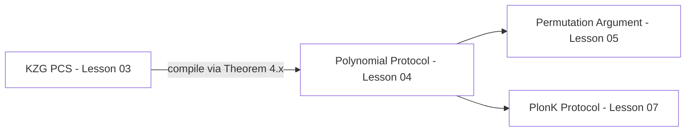

> **Prerequisites**: AGM và Q-DLOG (xem [[02-agm-qdlog|02. AGM & Q-DLOG]]), bilinear pairing, polynomial evaluation  
> 🔴 **Prerequisite references**: Kate, Zaverucha, Goldberg — *Constant-Size Commitments to Polynomials and Their Applications* [KZG10] (paper gốc định nghĩa KZG commitment)  
> **Lesson type**: Scheme  
> **Covers**: §3 (Definition 3.1, scheme §3.1, knowledge soundness argument, Remark 3.2, Lemma 3.3)
>
> **Notation** (ký hiệu dùng trong bài này — kế thừa từ Lesson 02):
> | Ký hiệu | Ý nghĩa | Ký hiệu trong paper |
> |---------|---------|---------------------|
> | $\mathbb{F}_{<d}[X]$ | Tập đa thức bậc $< d$ trên $\mathbb{F}$ | $F_{<d}[X]$ |
> | $\mathsf{cm}$ | Commitment tới đa thức $f$ | $\mathsf{cm}$ |
> | $f$ | Polynomial được commit | $f$ |
> | $z$ | Evaluation point (điểm hỏi) | $z$ |
> | $s$ | Opening value: $s = f(z)$ | $s$ |
> | $h(X)$ | Quotient polynomial: $h(X) = \frac{f(X) - f(z)}{X - z}$ | $h(X)$ |
> | $W := [h(x)]_1$ | Witness commitment (proof of opening) | $W$ |
> | $\gamma, \gamma'$ | Verifier random challenges (batch combination) | $\gamma, \gamma'$ |
> | $r'$ | Verifier random challenge (batch hai điểm) | $r'$ |
> | $t$ | Số polynomials trong batch | $t$ |
> | $t_1, t_2$ | Số polynomials tại điểm $z$, $z'$ tương ứng | $t_1, t_2$ |

---

## Motivation

### Bài toán: làm thế nào prover cam kết một polynomial mà không reveal nó?

Trong PlonK, prover phải chứng minh với verifier rằng các polynomial (encoding wire values, gate constraints, permutation) thỏa mãn một số identities — mà không tiết lộ giá trị cụ thể của chúng. Công cụ cốt lõi cho việc này là **polynomial commitment scheme (PCS)**.

Một PCS cho phép prover:
1. **Commit**: gửi một "cam kết ngắn" $\mathsf{cm}$ đại diện cho polynomial $f$ (nhưng không reveal $f$)
2. **Open**: sau đó chứng minh rằng $f(z) = s$ tại một điểm $z$ cụ thể do verifier chọn

Trong PlonK cụ thể, prover cần mở **nhiều polynomials tại nhiều điểm** cùng lúc. Paper [GWC19, §3] xây dựng phiên bản batched của scheme [KZG10] để đáp ứng yêu cầu này một cách hiệu quả.

---

## Definition — d-Polynomial Commitment Scheme

> [!note] Definition 3.1 — d-Polynomial Commitment Scheme
> **Loại**: Cryptographic primitive  
> **Setting**: Field $\mathbb{F}$ bậc nguyên tố, groups $\mathbb{G}_1, \mathbb{G}_2$ với pairing $e$
>
> Một **$d$-polynomial commitment scheme** gồm:
>
> **$\mathsf{gen}(d)$**
> - Input: degree bound $d$
> - Output: SRS $\mathsf{srs}$
>
> **$\mathsf{com}(f,\, \mathsf{srs})$**
> - Input: polynomial $f \in \mathbb{F}_{<d}[X]$, SRS
> - Output: commitment $\mathsf{cm}$
>
> **$\mathsf{open}$** (public-coin protocol giữa $P_{\mathsf{PC}}$ và $V_{\mathsf{PC}}$)
> - Input chung: $t$, danh sách commitments $\mathsf{cm}_1, \ldots, \mathsf{cm}_t$, điểm $z_1, \ldots, z_t \in \mathbb{F}$, giá trị alleged $s_1, \ldots, s_t$
> - $P_{\mathsf{PC}}$ biết thêm: $f_1, \ldots, f_t \in \mathbb{F}_{<d}[X]$ với $\mathsf{cm}_i = \mathsf{com}(f_i, \mathsf{srs})$
> - Output: $V_{\mathsf{PC}}$ output $\mathsf{acc}$ hoặc $\mathsf{rej}$
>
> **Completeness**: Nếu $\mathsf{cm}_i = \mathsf{com}(f_i, \mathsf{srs})$ và $s_i = f_i(z_i)$ đúng với mọi $i$, thì $V_{\mathsf{PC}}$ output $\mathsf{acc}$ với xác suất 1.
>
> **Knowledge soundness in AGM**: Tồn tại extractor $\mathcal{E}$ efficient sao cho adversary algebraic $\mathcal{A}$ có thể win KS game với xác suất $\leq \mathsf{negl}(\lambda)$.

> [!info] 🟡 KZG Commitment — Ý tưởng cốt lõi (từ [KZG10])
> Kate, Zaverucha, Goldberg [KZG10] quan sát: nếu $f(z) = s$ thì $(X - z)$ chia hết $(f(X) - s)$, tức là tồn tại **quotient polynomial** $h(X) = \frac{f(X) - s}{X - z}$.
>
> Thay vì reveal $f$, prover chỉ cần gửi $[h(x)]_1$ — commitment của quotient. Verifier kiểm tra bằng pairing:
>
> $$e(\mathsf{cm} - [s]_1,\, [1]_2) = e([h(x)]_1,\, [x - z]_2)$$
>
> Nếu $f(z) \neq s$, thì $h$ không phải polynomial (có mẫu), và algebraic adversary không thể fake $[h(x)]_1$ — đây là knowledge soundness.
>
> *(theo [KZG10]: Kate, Zaverucha, Goldberg — Constant-Size Commitments to Polynomials and Their Applications, ASIACRYPT 2010)*

---

## KZG PCS — Scheme cụ thể

> [!note] Scheme 3.2 — KZG Polynomial Commitment (PlonK variant, §3.1)
> **Type**: d-Polynomial Commitment Scheme  
> **Setting**: SRS monomials $([x^i]_1)_{0 \leq i < d}$, $[1]_2$, $[x]_2$ với $x \in \mathbb{F}$ uniform
>
> **$\mathsf{gen}(d)$**
> - Chọn $x \stackrel{R}{\leftarrow} \mathbb{F}$
> - Output: $\mathsf{srs} = \left([1]_1, [x]_1, [x^2]_1, \ldots, [x^{d-1}]_1,\, [1]_2, [x]_2\right)$
>
> **$\mathsf{com}(f, \mathsf{srs})$**
> - Input: $f(X) = \sum_{i=0}^{d-1} a_i X^i \in \mathbb{F}_{<d}[X]$
> - Output: $\mathsf{cm} := [f(x)]_1 = \sum_{i=0}^{d-1} a_i \cdot [x^i]_1$
>
> **$\mathsf{open}$ — Trường hợp một điểm** ($z_1 = \ldots = z_t = z$):
>
> (a) $V_{\mathsf{PC}}$ gửi $\gamma \stackrel{R}{\leftarrow} \mathbb{F}$
>
> (b) $P_{\mathsf{PC}}$ tính:
>
> $$h(X) := \sum_{i=1}^{t} \gamma^{i-1} \cdot \frac{f_i(X) - f_i(z)}{X - z}$$
>
> và gửi $W := [h(x)]_1$
>
> (c) $V_{\mathsf{PC}}$ tính:
>
> $$F := \sum_{i=1}^{t} \gamma^{i-1} \cdot \mathsf{cm}_i, \qquad v := \left[\sum_{i=1}^{t} \gamma^{i-1} \cdot s_i\right]_1$$
>
> (d) $V_{\mathsf{PC}}$ output $\mathsf{acc}$ khi và chỉ khi:
>
> $$e(F - v,\, [1]_2) \cdot e(-W,\, [x-z]_2) = 1$$

---

## Mở rộng: Batch tại Hai Điểm

Paper [GWC19, §3.1] cũng mô tả trường hợp hai điểm phân biệt $z, z'$, được dùng trực tiếp trong PlonK Protocol (§7). Đây là contribution từ Appendix C của Sonic [MBKM].

> [!note] Scheme 3.3 — KZG Batched Opening tại Hai Điểm (từ [MBKM] Appendix C)
> **Input**: commitments $\{\mathsf{cm}_i\}_{i \in [t_1]}$ cho polynomials tại $z$; $\{\mathsf{cm}'_i\}_{i \in [t_2]}$ cho polynomials tại $z'$
>
> **$\mathsf{open}(\{\mathsf{cm}_i\}, \{\mathsf{cm}'_i\}, \{z, z'\}, \{s_i, s'_i\})$**:
>
> (a) $V_{\mathsf{PC}}$ gửi $\gamma, \gamma' \stackrel{R}{\leftarrow} \mathbb{F}$
>
> (b) $P_{\mathsf{PC}}$ tính hai quotient polynomials:
>
> $$h(X) := \sum_{i=1}^{t_1} \gamma^{i-1} \cdot \frac{f_i(X) - f_i(z)}{X - z}, \qquad h'(X) := \sum_{i=1}^{t_2} \gamma'^{i-1} \cdot \frac{f'_i(X) - f'_i(z')}{X - z'}$$
>
> và gửi $W := [h(x)]_1$, $W' := [h'(x)]_1$
>
> (c) $V_{\mathsf{PC}}$ gửi $r' \stackrel{R}{\leftarrow} \mathbb{F}$
>
> (d) $V_{\mathsf{PC}}$ tính:
>
> $$F := \left(\sum_{i=1}^{t_1} \gamma^{i-1} \cdot \mathsf{cm}_i - \left[\sum_{i=1}^{t_1} \gamma^{i-1} \cdot s_i\right]_1\right) + r' \cdot \left(\sum_{i=1}^{t_2} \gamma'^{i-1} \cdot \mathsf{cm}'_i - \left[\sum_{i=1}^{t_2} \gamma'^{i-1} \cdot s'_i\right]_1\right)$$
>
> và output $\mathsf{acc}$ khi và chỉ khi:
>
> $$e\!\left(F + z \cdot W + r'z' \cdot W',\, [1]_2\right) \cdot e\!\left(-W - r' \cdot W',\, [x]_2\right) = 1$$
>
> *(theo [MBKM]: Maller, Bowe, Kohlweiss, Meiklejohn — Sonic, CCS 2019, Appendix C)*

> [!tip] 💡 Agent note
> Tại sao check pairing có dạng kỳ lạ này? Gọi $g(X) := \sum \gamma^{i-1} f_i(X)$ và $s := \sum \gamma^{i-1} s_i$. Ta muốn check $g(z) = s$, tức $(X - z)\ |\ (g(X) - s)$. Commitment là $[g(x)]_1 = F$. Quotient $h(X) = (g(X)-s)/(X-z)$, nên $g(X) - s = h(X)(X - z)$. Tại điểm $x$: $g(x) - s = h(x)(x - z)$, dẫn đến $e(F - v, [1]_2) = e(W, [x-z]_2)$, hay $e(F-v, [1]_2) \cdot e(-W, [x-z]_2) = 1$. Phần $r'$ batch hai điểm một cách random: nếu cả hai checks pass, $(r', z, z')$ là random, xác suất fake thấp.

---

## Correctness

> [!abstract] Theorem 3.4 — Correctness
> Cho $f_1, \ldots, f_t \in \mathbb{F}_{<d}[X]$ và $\mathsf{cm}_i = \mathsf{com}(f_i, \mathsf{srs})$. Nếu $s_i = f_i(z)$ với mọi $i$ thì $\mathsf{open}$ chạy đúng sẽ khiến $V_{\mathsf{PC}}$ output $\mathsf{acc}$ với xác suất 1.

**Proof** (trường hợp một điểm): Gọi $g(X) = \sum_{i} \gamma^{i-1} f_i(X)$, $s = \sum_i \gamma^{i-1} s_i$. Vì $s_i = f_i(z)$, ta có $g(z) = s$, nên $h(X) = (g(X) - s)/(X - z)$ là polynomial hợp lệ.

Tính $F = [g(x)]_1$ và $W = [h(x)]_1$. Kiểm tra pairing:

$$e(F - v, [1]_2) = e([g(x) - s]_1, [1]_2) = e([h(x)(x-z)]_1, [1]_2) = e([h(x)]_1, [x-z]_2) = e(W, [x-z]_2)$$

Suy ra $e(F-v,[1]_2) \cdot e(-W,[x-z]_2) = 1$. $\blacksquare$

---

## Knowledge Soundness

> [!abstract] Theorem 3.5 — Knowledge Soundness in AGM (§3.1)
> Tồn tại extractor $\mathcal{E}$ efficient sao cho với mọi algebraic adversary $\mathcal{A}$, nếu $\mathcal{A}$ restrict vào $z_1 = \ldots = z_t = z$, xác suất win KS game là $\mathsf{negl}(\lambda)$.

**Proof sketch** (theo [GWC19, §3.1]):

**Extract phase**: $\mathcal{A}$ algebraic nên khi output $\mathsf{cm}_i = \sum_j a_{i,j} [x^j]_1$, extractor $\mathcal{E}$ nhận được coefficients $\{a_{i,j}\}$ và reconstruct:

$$f_i(X) := \sum_{j=0}^{d-1} a_{i,j} X^j$$

**Soundness argument**: Giả sử $\mathcal{A}$ claim $s_i \neq f_i(z)$ với một $i$ nào đó. $V_{\mathsf{PC}}$ gửi $\gamma$ ngẫu nhiên. Định nghĩa $f(X) = \sum_i \gamma^{i-1} f_i(X)$ và $s = \sum_i \gamma^{i-1} s_i$. Do $s_i \neq f_i(z)$ cho một $i$, ta có e.w.p. $t/|\mathbb{F}|$ là $f(z) \neq s$.

$\mathcal{A}$ output $W = [H(x)]_1$ cho một $H \in \mathbb{F}_{<d}[X]$. Theo Lemma 2.2, đủ để kiểm tra ideal check:

$$f(X) - s \equiv H(X)(X - z)$$

Nếu ideal check pass thì $f(z) = s$ — mâu thuẫn. Vậy ideal check fail với xác suất $\geq 1 - \mathsf{negl}(\lambda)$, dẫn đến real check fail. $\blacksquare$

> [!warning] Remark 3.2 — AGM vs Generic PCS
> Trong paper [GWC19], khái niệm "knowledge soundness" cho PCS **không trùng** với knowledge soundness cho relation như §2.2. Ở đây, extractor $\mathcal{E}$ output polynomial ngay sau khi $\mathcal{A}$ commit — không cần rewinding. Điều này **chỉ khả thi trong AGM**: không có AGM, $\mathcal{E}$ thường phải rewind $\mathcal{A}$ trong giai đoạn open. Đây là lý do các paper generic PCS (như [BDFG20, §2.3]) phân tách riêng binding và knowledge soundness.

---

## Efficiency — Lemma 3.3

> [!abstract] Lemma 3.3 — Efficiency của Batched KZG
> Fix $d > 0$. Có một $d$-polynomial commitment scheme $\mathcal{S}$ sao cho:
>
> (a) **Commitment**: với $f \in \mathbb{F}_{<n}[X]$ ($n \leq d$), tính $\mathsf{com}(f)$ cần $n$ G₁-exponentiations.
>
> (b) **Opening**: Cho $\mathbf{z} = (z_1, \ldots, z_t)$ và $f_1, \ldots, f_t \in \mathbb{F}_{<d}[X]$, gọi $t^*$ là số điểm phân biệt trong $\mathbf{z}$, và $d_i = \max\{\deg(f_j) : z_j = \text{điểm thứ } i\}$. Khi đó:
>
> - **Prover**: $\sum_{i \in [t^*]} d_i$ G₁-exponentiations
> - **Verifier**: $t + 2t^* - 2$ G₁-exponentiations và $2$ pairings

Trong PlonK cụ thể: $t^* = 2$ điểm phân biệt, $t \approx 7$ polynomials → verifier cần $7 + 4 - 2 = 9$ G₁ exp và 2 pairings. Đây là nguồn gốc của "2P, 9 G₁ exp" trong Table 2 của paper.

---

## Vị trí trong PlonK

KZG PCS là lớp cryptographic thấp nhất. Lesson tiếp theo (Lesson 04) sẽ build một abstraction layer cao hơn — **Polynomial Protocols** — để lý luận về PlonK mà không cần expose chi tiết KZG mỗi lần.

---

## Summary

- **KZG commitment**: $\mathsf{com}(f) = [f(x)]_1$ — một G₁ element, hiding $f$ dưới DLP.
- **Opening**: prover gửi $W = [h(x)]_1$ với $h(X) = (f(X) - s)/(X-z)$; verifier kiểm tra qua bilinear pairing.
- **Batching tại một điểm**: linear-combine $t$ polynomials với random $\gamma$ → một quotient $h$, một pairing check.
- **Batching tại hai điểm** [MBKM Appendix C]: hai quotients $W, W'$; random $r'$ batch hai pairing equations → vẫn chỉ **2 pairings**.
- **Knowledge soundness** (AGM): extractor trivially đọc $f_i$ từ coefficients của algebraic adversary — ideal check fail implies soundness.
- **Efficiency** (Lemma 3.3): commit = $n$ G₁ exp; open tại 2 điểm = prover $O(n)$ exp, verifier **2 pairings + $O(t)$ G₁ exp**.

---

## References

- [GWC19] Gabizon, Williamson, Ciobotaru — *PlonK*, ePrint 2019/953, §3
- [KZG10] Kate, Zaverucha, Goldberg — *Constant-Size Commitments to Polynomials and Their Applications*, ASIACRYPT 2010 (🟡 Integrated: com/open/verify construction)
- [MBKM] Maller, Bowe, Kohlweiss, Meiklejohn — *Sonic*, CCS 2019, Appendix C (🟡 Integrated: batched two-point opening)
- [BDFG20] Boneh, Drake, Fisch, Gabizon — *Efficient polynomial commitment schemes for multiple points and polynomials*, ePrint 2020/081 (⚪ Citation: generic PCS framework)
