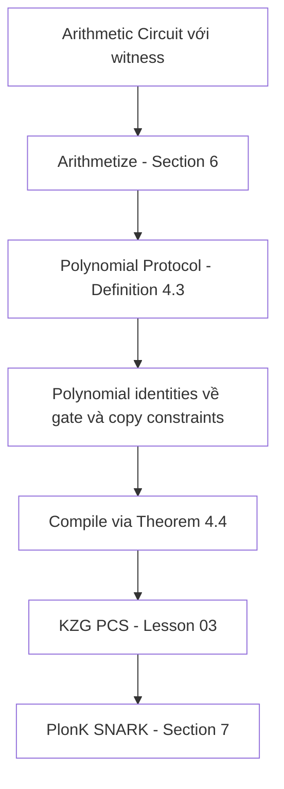

> **Prerequisites**: KZG PCS (xem [[03-kzg-pcs|03. KZG Polynomial Commitment]]), AGM và Q-DLOG (xem [[02-agm-qdlog|02. AGM & Q-DLOG]]), zk-SNARK definitions cơ bản  
> 🔴 **Prerequisite references**: Ben-Sasson et al. — *Interactive Oracle Proofs* [BCS16] (IOP model tổng quát — polynomial protocol là trường hợp đặc biệt)  
> **Lesson type**: Foundation  
> **Covers**: §4 đầy đủ (Definition 4.1, Definition 4.3, Theorem compilation PCS→SNARK, Remark 4.2)
>
> **Notation** (ký hiệu dùng trong bài này):
> | Ký hiệu | Ý nghĩa | Ký hiệu trong paper |
> |---------|---------|---------------------|
> | $P_{\mathsf{poly}}$ | Prover trong polynomial protocol | $P_{\mathsf{poly}}$ |
> | $V_{\mathsf{poly}}$ | Verifier trong polynomial protocol | $V_{\mathsf{poly}}$ |
> | $\mathcal{I}$ | Trusted party (ideal polynomial oracle) | $I$ |
> | $d$ | Degree bound: polynomials gửi phải có degree $< d$ | $d$ |
> | $D$ | Degree bound của polynomial identities verifier hỏi | $D$ |
> | $t$ | Số polynomials prover gửi | $t$ |
> | $\ell$ | Số preprocessed polynomials | $\ell$ |
> | $g_1, \ldots, g_\ell$ | Preprocessed (circuit-specific) polynomials | $g_1, \ldots, g_\ell$ |
> | $f_1, \ldots, f_t$ | Polynomials prover gửi tới $\mathcal{I}$ | $f_1, \ldots, f_t$ |
> | $\mathcal{R}$ | Relation (tập các cặp $(x, \omega)$ hợp lệ) | $R$ |

---

## Motivation

### Tại sao cần một abstraction layer mới?

Sau khi đã có KZG PCS (Lesson 03), ta có thể xây dựng PlonK trực tiếp như một sequence of polynomial commitments và pairing checks. Nhưng cách đó khó đọc và khó chứng minh.

PlonK [GWC19, §4] thay vào đó introduce một **abstraction layer trung gian**: *Polynomial Protocols*. Ý tưởng:

1. **Thiết kế** PlonK như một protocol với một **trusted oracle** $\mathcal{I}$ giữ các polynomials — prover gửi polynomials cho $\mathcal{I}$, verifier hỏi $\mathcal{I}$ về các polynomial identities.
2. **Compile** polynomial protocol thành SNARK thực tế bằng cách thay $\mathcal{I}$ bằng KZG PCS.

Tách biệt này rất mạnh: mọi security proof ở cấp polynomial protocol là về **polynomial identities** thuần túy — không cần xét cryptographic operations. Sau đó một theorem compilation đơn giản nâng security lên thành SNARK security.

---

## Polynomial Protocol — Định nghĩa

> [!note] Definition 4.1 — $(d, D, t, \ell)$-Polynomial Protocol
> **Participants**: Prover $P_{\mathsf{poly}}$, Verifier $V_{\mathsf{poly}}$, và Trusted party $\mathcal{I}$  
> **Setting**: Có sẵn $\ell$ **preprocessed polynomials** $g_1, \ldots, g_\ell \in \mathbb{F}_{<d}[X]$ đã biết cả hai bên (thường là circuit-specific polynomials)
>
> **Protocol execution**:
>
> 1. **Messages của $P_{\mathsf{poly}}$** gửi đến $\mathcal{I}$: mỗi message là một polynomial $f \in \mathbb{F}_{<d}[X]$. Nếu $P_{\mathsf{poly}}$ gửi message không ở dạng này, protocol bị abort.
>
> 2. **Messages của $V_{\mathsf{poly}}$ tới $P_{\mathsf{poly}}$**: tùy ý (nhưng ta tập trung vào public-coin: chỉ gửi random coins).
>
> 3. **Cuối protocol**: gọi $f_1, \ldots, f_t$ là các polynomials $P_{\mathsf{poly}}$ đã gửi. $V_{\mathsf{poly}}$ hỏi $\mathcal{I}$ xem các **polynomial identities** sau có đúng không — mỗi identity có dạng:
>
> $$F(X) := G\!\left(X,\; h_1(v_1(X)),\; \ldots,\; h_M(v_M(X))\right) \equiv 0$$
>
> với $h_i \in \{f_1, \ldots, f_t, g_1, \ldots, g_\ell\}$, $G \in \mathbb{F}[X, X_1, \ldots, X_M]$, và $v_i \in \mathbb{F}_{<d}[X]$ sao cho $F \in \mathbb{F}_{<D}[X]$ khi prover follow protocol đúng.
>
> 4. $V_{\mathsf{poly}}$ output $\mathsf{acc}$ nếu tất cả identities đều đúng, ngược lại $\mathsf{rej}$.

> [!tip] 💡 Agent note
> Dạng identity $G(X, h_1(v_1(X)), \ldots) \equiv 0$ nghe phức tạp nhưng trong PlonK thực tế chỉ dùng dạng đơn giản: ví dụ $f_1(X) \cdot g_1(X) - f_2(X) \equiv 0$ trên $H$ (multiplicative subgroup), hoặc $Z(\omega X) \cdot f(X) - Z(X) \cdot g(X) \equiv 0$ (permutation argument). Dạng tổng quát chỉ là để definition đủ mạnh bao cover mọi trường hợp.

---

## Remark 4.2 — Tại sao không enforce degree nhỏ hơn $d$?

> [!info] Remark 4.2
> Một model biểu cảm hơn sẽ cho phép $P_{\mathsf{poly}}$ gửi messages $(f, n)$ với $n \leq d$, và $\mathcal{I}$ enforce $f \in \mathbb{F}_{<n}[X]$. PlonK tránh làm vậy vì không cần extra power này, và nó sẽ giảm hiệu quả (cần PCS có khả năng dynamically enforce degree bound nhỏ hơn $d$, như biến thể [MBKM] của KZG có thể làm — nhưng phức tạp hơn).

---

## Polynomial Protocol cho Relation

> [!note] Definition 4.3 — Polynomial Protocol cho Relation $\mathcal{R}$
> Một *polynomial protocol cho relation $\mathcal{R}$* là một polynomial protocol (theo Def 4.1) với thêm:
>
> 1. **Input**: $P_{\mathsf{poly}}$ và $V_{\mathsf{poly}}$ đều nhận input $x$; $P_{\mathsf{poly}}$ giả định có witness $\omega$ sao cho $(x, \omega) \in \mathcal{R}$.
>
> 2. **Completeness**: Nếu $P_{\mathsf{poly}}$ follow protocol đúng với witness $\omega$ hợp lệ, $V_{\mathsf{poly}}$ output $\mathsf{acc}$ với xác suất 1.
>
> 3. **Knowledge Soundness**: Tồn tại extractor $\mathcal{E}$ efficient sao cho với mọi $P_{\mathsf{poly}}^*$ và input $x$: nếu $P_{\mathsf{poly}}^*$ khiến $V_{\mathsf{poly}}$ output $\mathsf{acc}$ với xác suất $\epsilon > \mathsf{negl}(\lambda)$, thì $\mathcal{E}$ (nhận messages của $P_{\mathsf{poly}}^*$) output $\omega$ với $(x, \omega) \in \mathcal{R}$ với xác suất $\geq \epsilon - \mathsf{negl}(\lambda)$.

---

## Theorem — Compilation: Polynomial Protocol → SNARK

Đây là theorem trung tâm của §4 — nó cho phép "lift" một polynomial protocol thành SNARK thực tế.

> [!abstract] Theorem 4.4 — Compilation (PlonK §4, implicit)
> Cho một $(d, D, t, \ell)$-polynomial protocol $\Pi$ cho relation $\mathcal{R}$ với completeness và knowledge soundness. Cho một $d$-polynomial commitment scheme $\mathcal{S}$ với completeness và knowledge soundness in AGM.
>
> Khi đó tồn tại một SNARK $\Pi'$ cho $\mathcal{R}$ với:
> - **Completeness**: inherit từ $\Pi$ và $\mathcal{S}$
> - **Knowledge soundness in AGM**: inherit từ cả hai, under Q-DLOG
> - **Proof length**: $= t$ commitments (mỗi cái là 1 G₁ element) + communication của $\mathsf{open}$ protocol
> - **Verifier work**: $=$ verifier work trong $\Pi$ (identity checks → point evaluations) + verifier work trong $\mathcal{S}.\mathsf{open}$

**Construction**: Thay $\mathcal{I}$ bằng $\mathcal{S}$:
- Mỗi lần $P_{\mathsf{poly}}$ gửi polynomial $f$ cho $\mathcal{I}$ → prover thực gửi $\mathsf{com}(f) \in \mathbb{G}_1$ cho verifier
- Cuối protocol, verifier muốn check $F(X) \equiv 0$ → dùng Schwartz-Zippel: random $\zeta$, check $F(\zeta) = 0$ bằng cách request các evaluation $f_i(\zeta)$ từ prover qua $\mathsf{open}$
- Verifier tự tính $g_j(\zeta)$ (preprocessed polynomials public) và verify tất cả evaluations qua KZG open

> [!tip] 💡 Agent note
> **Tại sao polynomial identity check → point evaluation?** Theo **Schwartz-Zippel Lemma**: nếu $F \not\equiv 0$ là polynomial bậc $D$ trên field $|\mathbb{F}|$, thì $\Pr_{\zeta \leftarrow \mathbb{F}}[F(\zeta) = 0] \leq D/|\mathbb{F}| = \mathsf{negl}(\lambda)$. Vậy check $F(\zeta) = 0$ tại điểm ngẫu nhiên đủ để detect violation với xác suất cao. Đây là cách "verifier hỏi $\mathcal{I}$ về identity" được compile thành "request evaluations tại random point".

---

## Flow toàn bộ: từ Circuit đến SNARK

Polynomial Protocol model cho phép mô tả PlonK ở mức cao:

Permutation argument (Lesson 05) và arithmetization (Lesson 06) đều được thiết kế như polynomial protocols. Protocol hoàn chỉnh (Lesson 07) là ghép chúng lại và compile qua KZG.

---

## Ý nghĩa thực tế của Preprocessed Polynomials

Trong PlonK, $g_1, \ldots, g_\ell$ (preprocessed polynomials) tương ứng với **selector polynomials** của circuit:

| Polynomial | Ý nghĩa |
|-----------|---------|
| $q_L(X)$ | Left input selector |
| $q_R(X)$ | Right input selector |
| $q_M(X)$ | Multiplication gate selector |
| $q_O(X)$ | Output selector |
| $q_C(X)$ | Constant selector |
| $S_{\sigma_1}(X), S_{\sigma_2}(X), S_{\sigma_3}(X)$ | Permutation polynomials (copy constraints) |

Tất cả đây là polynomial đã cố định theo circuit — chúng được commit trong giai đoạn **preprocessing** một lần và reuse cho mọi proof. Đây là lý do preprocessing chỉ tốn $O(n)$ G₁ exp một lần.

---

## So sánh với Generic IOP Model

Polynomial protocol là **restricted IOP** (Interactive Oracle Proof):

| | Generic IOP [BCS16] | Polynomial Protocol [GWC19] |
|---|---|---|
| Oracle gửi | Arbitrary strings | Polynomials bậc $< d$ |
| Query verifier | Positions trong string | Evaluations tại điểm |
| Identity check | Không có | Check $F(X) \equiv 0$ (degree $< D$) |
| Compile bằng | Various hash-based PCS | KZG (hoặc PCS khác) |

Sự restriction này làm cho polynomial protocol đơn giản hơn IOP, nhưng đủ để capture toàn bộ PlonK và nhiều SNARK khác.

---

## Summary

- **Polynomial protocol** = protocol giữa $P_{\mathsf{poly}}, V_{\mathsf{poly}}, \mathcal{I}$ trong đó prover gửi polynomials cho oracle, verifier check polynomial identities — abstraction không cần cryptography.
- **Def 4.1**: parameters $(d, D, t, \ell)$ đặc trưng hóa degree bounds, số polynomials, số preprocessed polynomials.
- **Def 4.3**: thêm input $(x, \omega)$ với relation $\mathcal{R}$, completeness và knowledge soundness.
- **Compilation Theorem 4.4**: thay oracle $\mathcal{I}$ bằng KZG PCS → polynomial identities trở thành evaluation requests qua Schwartz-Zippel → SNARK thực tế với security inherit từ protocol và PCS.
- **Preprocessed polynomials** = selector polynomials của circuit, commit một lần trong preprocessing.
- Pattern trong PlonK: **thiết kế ở mức polynomial protocol** (simple, purely algebraic) → **compile thành SNARK** (via KZG) là cách tư duy sạch nhất để hiểu và chứng minh PlonK.

---

## References

- [GWC19] Gabizon, Williamson, Ciobotaru — *PlonK*, ePrint 2019/953, §4
- [BCS16] Ben-Sasson, Chiesa, Spooner — *Interactive Oracle Proofs*, TCC 2016 (🔴 Prerequisite: IOP model)
- [KZG10] Kate, Zaverucha, Goldberg — *Constant-Size Commitments...*, ASIACRYPT 2010 (dùng trong compilation)
