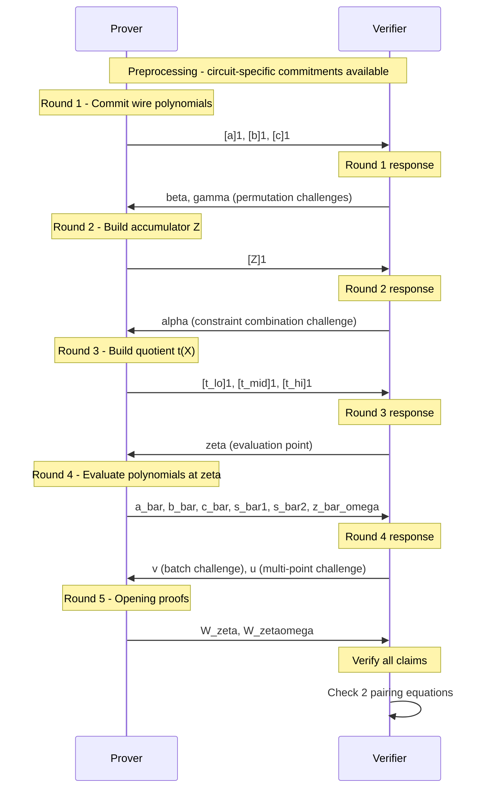

> **Prerequisites**: KZG PCS ([[03-kzg-pcs|03. KZG]]), Polynomial Protocols ([[04-polynomial-protocols|04. Polynomial Protocols]]), Permutation Argument ([[05-permutation-argument|05. Permutation Argument]]), Arithmetization ([[06-plonk-arithmetization|06. Arithmetization]])  
> 🔴 **Prerequisite references**: Tất cả 🟡 references đã integrate trong Lessons 02–06  
> **Lesson type**: Protocol  
> **Covers**: §7 đầy đủ (Protocol 7.1 với 5 rounds, quotient polynomial, linearization trick, Theorem 7.1 knowledge soundness, proof composition, efficiency)
>
> **Notation** (ký hiệu mới trong bài này — kế thừa tất cả ký hiệu Lessons 01–06):
> | Ký hiệu | Ý nghĩa | Ký hiệu trong paper |
> |---------|---------|---------------------|
> | $\alpha$ | Verifier challenge Round 2: kết hợp gate + permutation constraints | $\alpha$ |
> | $\zeta$ | Verifier challenge Round 3 (evaluation point) | $\mathfrak{z}$ (paper) |
> | $v$ | Verifier challenge Round 4 (batch field elements) | $v$ |
> | $u$ | Verifier challenge Round 4 (batch opening proofs) | $u$ |
> | $t(X)$ | Quotient polynomial: $t(X) = \text{constraint polynomial} / Z_H(X)$ | $t(X)$ |
> | $t_{lo}, t_{mid}, t_{hi}$ | Ba phần của $t(X)$ bậc $< n$ mỗi phần | $t_{lo}, t_{mid}, t_{hi}$ |
> | $r(X)$ | Linearization polynomial (verifier có thể tính commitment) | $r(X)$ |
> | $\bar{a}, \bar{b}, \bar{c}$ | Evaluations: $a(\zeta), b(\zeta), c(\zeta)$ | $\bar{a}, \bar{b}, \bar{c}$ |
> | $\bar{s}_{\sigma 1}, \bar{s}_{\sigma 2}$ | Evaluations: $S_{\sigma,1}(\zeta), S_{\sigma,2}(\zeta)$ | $\bar{s}_{\sigma 1}, \bar{s}_{\sigma 2}$ |
> | $\bar{z}_\omega$ | Evaluation: $Z(\zeta\omega)$ | $\bar{z}_\omega$ |
> | $W_\zeta, W_{\zeta\omega}$ | KZG opening proofs tại $\zeta$ và $\zeta\omega$ | $W_\mathfrak{z}, W_{\mathfrak{z}\omega}$ |

---

## Participants và Goal

**Prover $P$**: biết circuit $\mathcal{C}$, public input $x \in \mathbb{F}^\ell$, và private witness $\omega \in \mathbb{F}^{m-\ell}$ thỏa mãn tất cả constraints.

**Verifier $V$**: biết circuit $\mathcal{C}$ (qua preprocessed commitments), public input $x$, và muốn verify existence of valid witness mà không biết $\omega$.

**Adversary model**: algebraic adversary trong AGM, dưới Q-DLOG assumption.

**Output**: proof $\pi_{\mathsf{SNARK}}$ gồm **9 G₁ elements + 6 field elements** (fast prover variant).

---

## Protocol Flow — Tổng Quan

---

## Round 1 — Wire Polynomial Commitments

**Prover**:
1. Với witness $(x, \omega)$, tính wire values $\{a_i, b_i, c_i\}_{i \in [n]}$ bằng cách evaluate circuit trên $(x, \omega)$
2. Xây dựng polynomials $a(X), b(X), c(X) \in \mathbb{F}_{<n}[X]$ qua interpolation: $a(\omega^{i-1}) = x_{a_i}$, v.v.
3. Gửi $[a]_1 := [a(x_{\mathsf{srs}})]_1$, $[b]_1$, $[c]_1$

**Verifier** nhận commitments, gửi $\beta, \gamma \stackrel{R}{\leftarrow} \mathbb{F}$

---

## Round 2 — Accumulator Polynomial

**Prover**:
1. Dùng $\beta, \gamma$ từ verifier, tính accumulator polynomial $Z(X) \in \mathbb{F}_{<n}[X]$ của extended permutation check (Lesson 05):

$$Z(\omega^0) = 1, \quad Z(\omega^{i+1}) = Z(\omega^i) \cdot \prod_{j \in \{L,R,O\}} \frac{f_j(\omega^i) + \beta \cdot S_{\mathsf{ID},j}(\omega^i) + \gamma}{f_j(\omega^i) + \beta \cdot S_{\sigma,j}(\omega^i) + \gamma}$$

2. Gửi $[Z]_1 := [Z(x_{\mathsf{srs}})]_1$

**Verifier** gửi $\alpha \stackrel{R}{\leftarrow} \mathbb{F}$

---

## Round 3 — Quotient Polynomial

Đây là round trung tâm: prover chứng minh tất cả constraints đều thỏa mãn bằng cách xây dựng quotient polynomial $t(X)$.

**Hai constraints cần encode**:

**(1) Gate constraint trên $H$:**
$$a(X)q_L(X) + b(X)q_R(X) + a(X)b(X)q_M(X) + c(X)q_O(X) + q_C(X) + \mathsf{PI}(X) = 0 \quad \forall X \in H$$

**(2) Permutation constraints trên $H$** (ba identities từ Lesson 05):
- $L_1(X)(Z(X) - 1) = 0$
- $Z(\omega X) \prod_j (f_j(X) + \beta S_{\sigma,j}(X) + \gamma) = Z(X) \prod_j (f_j(X) + \beta S_{\mathsf{ID},j}(X) + \gamma)$

**Kết hợp với $\alpha$**: Prover dùng $\alpha$ để linear-combine các constraints thành một polynomial duy nhất và chia cho $Z_H(X) = X^n - 1$:

$$t(X) = \frac{1}{Z_H(X)}\Bigl[\underbrace{(\text{gate constraint})}_{\text{degree } \leq 2n} + \alpha \cdot \underbrace{(\text{permutation transition})}_{\text{degree } \leq 3n} + \alpha^2 \cdot \underbrace{L_1(X)(Z(X)-1)}_{\text{degree } \leq n}\Bigr]$$

Nếu tất cả constraints đều đúng trên $H$, thì mỗi hạng tử chia hết $Z_H(X)$, và $t(X)$ là polynomial bậc $< 3n$.

**Split**: Vì $\deg(t) < 3n$ lớn hơn SRS degree $n$, prover split:

$$t(X) = t_{lo}(X) + X^n \cdot t_{mid}(X) + X^{2n} \cdot t_{hi}(X)$$

với mỗi phần $\in \mathbb{F}_{<n}[X]$.

**Prover** gửi $[t_{lo}]_1$, $[t_{mid}]_1$, $[t_{hi}]_1$

**Verifier** gửi $\zeta \stackrel{R}{\leftarrow} \mathbb{F}$ (điểm evaluation)

---

## Round 4 — Polynomial Evaluations

**Prover** evaluate và gửi các giá trị tại $\zeta$ (và tại $\zeta\omega$ cho $Z$):

$$\bar{a} = a(\zeta), \quad \bar{b} = b(\zeta), \quad \bar{c} = c(\zeta)$$
$$\bar{s}_{\sigma 1} = S_{\sigma,1}(\zeta), \quad \bar{s}_{\sigma 2} = S_{\sigma,2}(\zeta)$$
$$\bar{z}_\omega = Z(\zeta \omega)$$

> [!tip] 💡 Agent note — Tại sao $Z(\zeta\omega)$ thay vì $Z(\zeta)$?
> Trong identity permutation (2) của Round 3, có cả $Z(X)$ lẫn $Z(\omega X)$. Để dùng **linearization trick** (xem dưới), prover chỉ cần gửi một evaluation của $Z$. Bằng cách gửi $\bar{z}_\omega = Z(\zeta\omega)$ thay vì $Z(\zeta)$, verifier có thể construct commitment của $r(X)$ dưới dạng linear combination mà không cần multiplication — đây là core của trick.

**Verifier** gửi $v, u \stackrel{R}{\leftarrow} \mathbb{F}$

---

## Round 5 — Opening Proofs và Linearization

### Linearization Polynomial $r(X)$

**Vấn đề**: Verifier muốn check rằng $t(X) \cdot Z_H(\zeta) = \text{constraint polynomial tại } \zeta$. Tuy nhiên constraint polynomial chứa tích $a(\zeta) b(\zeta) q_M(\zeta)$ — hai polynomial nhân nhau — verifier không thể compute commitment vì KZG chỉ additively homomorphic.

**Giải pháp (linearization)**: Vì prover đã gửi $\bar{a} = a(\zeta)$ trong Round 4, verifier xem $\bar{a}$ như một **scalar** và xây dựng polynomial tuyến tính:

$$r(X) := \bar{a} \bar{b} q_M(X) + \bar{a} q_L(X) + \bar{b} q_R(X) + \bar{c} q_O(X) + q_C(X) + \mathsf{PI}(\zeta)$$
$$+ \alpha \Bigl[(\bar{a} + \beta\zeta + \gamma)(\bar{b} + \beta k_1\zeta + \gamma)(\bar{c} + \beta k_2\zeta + \gamma) Z(X)\Bigr]$$
$$- \alpha \Bigl[(\bar{a} + \beta\bar{s}_{\sigma 1} + \gamma)(\bar{b} + \beta\bar{s}_{\sigma 2} + \gamma)\beta S_{\sigma,3}(X) \bar{z}_\omega\Bigr]$$
$$+ \alpha^2 L_1(\zeta) Z(X)$$
$$- Z_H(\zeta)\Bigl[t_{lo}(X) + \zeta^n t_{mid}(X) + \zeta^{2n} t_{hi}(X)\Bigr]$$

$r(X)$ là **linear** trong các committed polynomials → verifier tính được $[r]_1$ từ commitments đã có mà không cần prover gửi thêm. Và $r(\zeta) = 0$ khi tất cả constraints đúng.

### Opening Proof $W_\zeta$

Prover batch tất cả evaluations tại $\zeta$ thành một opening proof $W_\zeta$ sử dụng challenge $v$:

$$W_\zeta(X) := \frac{1}{X - \zeta}\Bigl[r(X) + v\bigl(a(X) - \bar{a}\bigr) + v^2\bigl(b(X) - \bar{b}\bigr) + v^3\bigl(c(X) - \bar{c}\bigr) + v^4\bigl(S_{\sigma,1}(X) - \bar{s}_{\sigma 1}\bigr) + v^5\bigl(S_{\sigma,2}(X) - \bar{s}_{\sigma 2}\bigr)\Bigr]$$

### Opening Proof $W_{\zeta\omega}$

$$W_{\zeta\omega}(X) := \frac{Z(X) - \bar{z}_\omega}{X - \zeta\omega}$$

**Prover** gửi $W_\zeta := [W_\zeta(x_{\mathsf{srs}})]_1$ và $W_{\zeta\omega} := [W_{\zeta\omega}(x_{\mathsf{srs}})]_1$

---

## Verifier Check

Verifier tự tính:
- $Z_H(\zeta) = \zeta^n - 1$, $L_1(\zeta)$, $\mathsf{PI}(\zeta)$ từ public inputs
- $[r]_1$ từ preprocessed commitments + proof elements (linear combination)
- $F := [r]_1 + v[a]_1 + v^2[b]_1 + v^3[c]_1 + v^4[S_{\sigma,1}]_1 + v^5[S_{\sigma,2}]_1$
- $E := [r(\zeta) + v\bar{a} + v^2\bar{b} + v^3\bar{c} + v^4\bar{s}_{\sigma 1} + v^5\bar{s}_{\sigma 2}]_1$

**Verifier check** (2 pairing equations — dùng batched KZG từ Lesson 03):

$$e\!\left(F - E + u \cdot [Z]_1 - [u\bar{z}_\omega]_1,\ [1]_2\right) \cdot e\!\left(-W_\zeta - u \cdot W_{\zeta\omega},\ [x_{\mathsf{srs}}]_2\right) \stackrel{?}{=} 1$$

Chỉ **2 bilinear pairings** cho toàn bộ verification — nguồn gốc con số trong Table 2.

---

## Proof Structure

**Proof** $\pi_{\mathsf{SNARK}}$ (fast prover variant, 9 G₁ + 6 field elements):

| Element | Round | Type |
|---------|-------|------|
| $[a]_1, [b]_1, [c]_1$ | 1 | 3 G₁ |
| $[Z]_1$ | 2 | 1 G₁ |
| $[t_{lo}]_1, [t_{mid}]_1, [t_{hi}]_1$ | 3 | 3 G₁ |
| $W_\zeta, W_{\zeta\omega}$ | 5 | 2 G₁ |
| $\bar{a}, \bar{b}, \bar{c}, \bar{s}_{\sigma 1}, \bar{s}_{\sigma 2}, \bar{z}_\omega$ | 4 | 6 $\mathbb{F}$ |

---

## Theorem 7.1 — Knowledge Soundness

> [!abstract] Theorem 7.1 (PlonK §7)
> Protocol 7.1 là $H$-ranged polynomial protocol cho relation $\mathcal{R}_\mathcal{C}$ với completeness và knowledge soundness in AGM.

**Proof sketch** (theo [GWC19, §7]):

**Extractor $\mathcal{E}$**: Nhận coefficient vectors của algebraic adversary khi commit $[a]_1, [b]_1, [c]_1$ → extract polynomials $a(X), b(X), c(X)$ → recover wire assignment $x_{a_i} = a(\omega^{i-1})$, v.v. → define $\omega := (x_{\ell+1}, \ldots, x_m)$.

**Case split**: Nếu verifier accept nhưng $(x, \omega) \notin \mathcal{R}_\mathcal{C}$, có hai cases:
1. $(a, b, c)$ không copy-satisfy $\sigma(\mathcal{C})$ — xác suất fail của permutation check theo Lemma 5.3 là $\mathsf{negl}(\lambda)$  
2. $(a, b, c)$ copy-satisfy nhưng gate constraint fail tại một $\omega^{i_0}$ — quotient $t(X)$ không tồn tại, và tại random $\zeta$, $r(\zeta) \neq 0$ với xác suất $\geq 1 - 3n/|\mathbb{F}|$

Cả hai cases dẫn đến verifier reject với xác suất $\geq 1 - \mathsf{negl}(\lambda)$. $\blacksquare$

---

## Non-Interactive via Fiat-Shamir

Toàn bộ protocol là **public-coin** — mọi verifier challenge là random field elements. Áp dụng **Fiat-Shamir transform**: thay mỗi verifier challenge bằng hash của transcript đến thời điểm đó:

$$\beta = H(\mathsf{srs}, \mathcal{C}, [a]_1, [b]_1, [c]_1), \quad \gamma = H(\ldots, \beta), \quad \alpha = H(\ldots, [Z]_1), \quad \ldots$$

→ Proof trở thành **non-interactive** và không cần verifier online trong quá trình proving. Đây là dạng PlonK được deploy trong thực tế (Aztec, zkSync, v.v.)

---

## Summary

PlonK protocol gồm 5 rounds:
- **Round 1**: Commit wire polynomials $a, b, c$ → nhận $\beta, \gamma$
- **Round 2**: Commit accumulator $Z$ (permutation) → nhận $\alpha$  
- **Round 3**: Compute và commit quotient $t = t_{lo} + X^n t_{mid} + X^{2n} t_{hi}$ (tất cả constraints / $Z_H$) → nhận $\zeta$
- **Round 4**: Gửi 6 evaluations tại $\zeta$ và $\zeta\omega$ → nhận $v, u$
- **Round 5**: Gửi $W_\zeta, W_{\zeta\omega}$ (batched KZG opening proofs với linearization $r(X)$)

**Verifier** chỉ cần **2 pairings** nhờ batching. **Proof** = 9 G₁ + 6 F. **Fiat-Shamir** → non-interactive. **Theorem 7.1** → knowledge soundness in AGM.

---

## References

- [GWC19] Gabizon, Williamson, Ciobotaru — *PlonK*, ePrint 2019/953, §7
- [BG12] Bayer, Groth — *Shuffle Argument* (🟡 via Lesson 05)
- [KZG10] Kate et al. — *Polynomial Commitments* (🟡 via Lesson 03)
