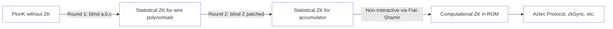

> **Prerequisites**: PlonK Protocol đầy đủ (xem [[07-plonk-protocol|07. The PLONK Protocol]]), zero-knowledge definition cơ bản (honest-verifier ZK, statistical ZK)  
> 🔴 **Prerequisite references**: Sefranek — *How (Not) to Simulate PLONK* [Sef24] (formal ZK proof của patched version — cần sau bài này)  
> **Lesson type**: Deep Dive  
> **Covers**: §8 (ZK modification, blinding polynomials, ZK claim, analysis), ghi chú về vulnerability được phát hiện 2022 và patch
>
> **Notation** (kế thừa đầy đủ Lessons 01–07):
> | Ký hiệu | Ý nghĩa | Ký hiệu trong paper |
> |---------|---------|---------------------|
> | $b_1, \ldots, b_9$ | Random blinding scalars | $b_1, \ldots, b_9$ |
> | $a'(X), b'(X), c'(X)$ | Blinded wire polynomials | — |
> | $Z'(X)$ | Blinded accumulator polynomial | — |
> | $Z_H(X) = X^n - 1$ | Vanishing polynomial (multiply để blind) | $Z_H(X)$ |

---

## Motivation

### Protocol 7.1 là knowledge-sound nhưng chưa zero-knowledge

PlonK Protocol (Lesson 07) chứng minh rằng **verifier học được gì từ proof?** Trong dạng chưa blind, câu trả lời là: có thể nhiều hơn mức cần thiết.

Cụ thể, wire polynomials $a(X), b(X), c(X)$ trong Round 1 được xây dựng bằng cách **interpolate đúng witness values** tại $H = \{\omega^0, \ldots, \omega^{n-1}\}$. Khi verifier nhận commitment $[a]_1 = [a(x_{\mathsf{srs}})]_1$, họ không biết $a(X)$; nhưng khi prover gửi $\bar{a} = a(\zeta)$ trong Round 4, họ nhận được một evaluation. Nếu protocol chạy nhiều lần với cùng witness, hay nếu adversary có thêm side-channel, có thể extract thông tin về witness.

**Zero-knowledge** yêu cầu: distribution của proof $\pi$ khi biết $(x, \omega)$ phải không phân biệt được với một **simulated** proof không cần biết $\omega$. Đây là property bổ sung cho completeness + soundness.

---

## Kỹ thuật Blinding (§8)

### Ý tưởng

Thêm **random terms** vào các polynomials sao cho:
1. Chúng vẫn đúng tại $H$ (không làm hỏng gate/permutation constraints)
2. Chúng làm evaluations tại các điểm ngoài $H$ (như $\zeta$) trở nên **statistically hiding** — nghĩa là không phụ thuộc vào witness

Trick: nhân thêm $Z_H(X) = X^n - 1$ với random polynomial — vì $Z_H(\omega^i) = 0$ với mọi $\omega^i \in H$, những terms này biến mất tại $H$ nhưng xuất hiện tại $\zeta \notin H$.

---

## Blinded Wire Polynomials

> [!note] ZK Modification — Blinded Wire Polynomials (§8)
> Thay vì dùng $a(X)$ thuần từ interpolation, prover xây dựng:
>
> $$a'(X) := (b_1 X + b_2) \cdot Z_H(X) + a(X)$$
>
> $$b'(X) := (b_3 X + b_4) \cdot Z_H(X) + b(X)$$
>
> $$c'(X) := (b_5 X + b_6) \cdot Z_H(X) + c(X)$$
>
> với $b_1, \ldots, b_6 \stackrel{R}{\leftarrow} \mathbb{F}$ được chọn fresh mỗi lần prove.

**Vì sao hoạt động**: Với $\omega^i \in H$: $Z_H(\omega^i) = 0$, nên $a'(\omega^i) = a(\omega^i)$ — gate constraints và copy constraints vẫn đúng. Tại $\zeta \notin H$: $a'(\zeta) = (b_1 \zeta + b_2) Z_H(\zeta) + a(\zeta)$ — phụ thuộc vào random $b_1, b_2$, che đi $a(\zeta)$.

**Degree tăng thêm $n+1$**: $\deg(a') = n + 1$ (thay vì $n-1$). Paper [GWC19, §8] dùng blinding bậc 1 $(b_1 X + b_2)$ đủ cho **honest-verifier ZK**.

---

## Blinded Accumulator Polynomial

> [!note] ZK Modification — Blinded Accumulator (§8)
> Accumulator $Z(X)$ cũng được blind:
>
> $$Z'(X) := (b_7 X^2 + b_8 X + b_9) \cdot Z_H(X) + Z(X)$$
>
> với $b_7, b_8, b_9 \stackrel{R}{\leftarrow} \mathbb{F}$.

**Lý do cần bậc cao hơn**: $Z(X)$ xuất hiện trong constraint với cả $Z(\omega X)$ — tức là cần che đi evaluation tại cả $\zeta$ **lẫn** $\zeta\omega$. Blinding bậc $2$ (3 free coefficients) đủ để cả $Z'(\zeta)$ và $Z'(\zeta\omega)$ độc lập ngẫu nhiên với witness.

> [!warning] Vulnerability trong §8 gốc — Phát hiện 2022
> Paper gốc [GWC19, §8] **chỉ claim** ZK property mà không đưa ra formal proof hoặc simulator. Năm 2022, Sefranek [Sef24] phát hiện rằng trong phiên bản gốc, $Z'(X)$ **chỉ được blind bằng** $(b_7 X + b_8)Z_H(X)$ — bậc 1 thay vì bậc 2. Điều này dẫn đến một lỗ hổng: với blinding bậc 1, có hai evaluations $Z'(\zeta)$ và $Z'(\zeta\omega)$ nhưng chỉ có hai free random parameters ($b_7, b_8$) → system bị overdetermined → adversary có thể extract thông tin từ proof.
>
> **Patch**: Gabizon cùng với Sefranek sửa lỗi bằng cách nâng lên $(b_7 X^2 + b_8 X + b_9)Z_H(X)$ (bậc 2, 3 free parameters). Patch này được public ngày 30/6/2022 và apply vào eprint. **Phiên bản sau June 2022 đã được vá.**
>
> **Formal ZK proof**: Sefranek [Sef24] construct simulator cho patched version và prove statistical ZK. Đây là formal security proof đầu tiên của ZK property trong PlonK.

---

## ZK Protocol — Tổng Hợp Thay Đổi

> [!note] Protocol 8.1 — ZK Variant của PlonK (§8)
> **Thay đổi so với Protocol 7.1**:
>
> **Round 1**: Thay $a(X), b(X), c(X)$ bằng $a'(X), b'(X), c'(X)$ — blinded với 6 random scalars
>
> **Round 2**: Thay $Z(X)$ bằng $Z'(X)$ — blinded với 3 random scalars (patched version)
>
> **Round 3**: Quotient $t(X)$ được tính dựa trên $a', b', c', Z'$ — tự động absorb blinding terms (chúng cancel vì vanish on $H$)
>
> **Rounds 4–5**: Không thay đổi về cấu trúc; evaluations $\bar{a} = a'(\zeta), \bar{b} = b'(\zeta)$, v.v. bây giờ là statistically hiding
>
> **Proof structure**: giống hệt Protocol 7.1 — **không tăng proof size**, không thay đổi verifier

---

## Phân Tích ZK Property

### Honest-Verifier Statistical ZK (HVZK)

Trong Interactive Oracle Proof setting (Lesson 04), ZK được phân tích ở cấp polynomial protocol trước khi compile. PlonK [GWC19, §8] claim **honest-verifier ZK** — simulator biết $(x, \zeta, \alpha, v, \ldots)$ nhưng không biết $\omega$ có thể fake ra distribution proof hợp lệ.

**Tại sao statistical (không phải computational)?** Blinding terms $b_i$ là random field elements hoàn toàn — không dựa trên bất kỳ computational hardness assumption nào. Với $|\mathbb{F}|$ đủ lớn, statistical distance giữa real và simulated là negligible.

**Tại sao chỉ honest-verifier?** Verifier dishonest có thể gửi challenges $\zeta$ phụ thuộc vào commitments, potentially làm lộ thông tin. Để đạt full ZK, cần đặc tả thêm; phiên bản non-interactive (Fiat-Shamir) đạt ZK trong Random Oracle Model.

### Simulator Construction (từ [Sef24])

Với patched version, simulator $\mathcal{S}$ hoạt động như sau:
1. Chọn random $a', b', c', Z'$ (không từ witness) — bất kỳ polynomials với degrees đúng
2. Compute $t'(X)$ từ $a', b', c', Z'$ sao cho evaluations $r'(\zeta) = 0$ (backward: tính $t'$ để thỏa mãn verifier check)
3. Điều này khả thi vì simulator biết trapdoor của SRS (trong ZK simulation model)

**Key insight**: Sefranek [Sef24] chứng minh distributions của $(r(\zeta), \bar{a}, \bar{b}, \bar{c}, \bar{s}_{\sigma 1}, \bar{s}_{\sigma 2}, \bar{z}_\omega)$ trong real và simulated executions là statistically indistinguishable — nhờ blinding terms $b_1, \ldots, b_9$ đủ bậc.

---

## Phân Tích Degree

Các blinding terms tăng degree của polynomials:

| Polynomial | Degree gốc | Degree sau blinding |
|-----------|-----------|-------------------|
| $a'(X)$ | $n-1$ | $n+1$ |
| $b'(X)$ | $n-1$ | $n+1$ |
| $c'(X)$ | $n-1$ | $n+1$ |
| $Z'(X)$ | $n-1$ | $n+2$ (patched) |
| $t(X)$ | $\leq 3n-4$ | $\leq 3n+5$ → split vẫn hoạt động |

Tăng degree nhỏ không ảnh hưởng đến correctness hay efficiency đáng kể — SRS size được giữ nguyên với buffer nhỏ.

---

## Vị trí trong Hệ sinh thái

ZK property là lý do PlonK được dùng trong các ứng dụng privacy-preserving:

---

## Summary

- **ZK modification** = thêm random blinding terms vào $a(X), b(X), c(X), Z(X)$ bằng cách nhân với $Z_H(X)$ — biến mất tại $H$ (không phá constraints), xuất hiện tại $\zeta$ (che thông tin witness)
- **Wire blinding**: $(b_i X + b_{i+1}) Z_H(X)$ — bậc 1, đủ cho một evaluation point
- **Accumulator blinding (patched)**: $(b_7 X^2 + b_8 X + b_9) Z_H(X)$ — bậc 2, cần thiết vì $Z$ được evaluate tại cả $\zeta$ và $\zeta\omega$
- **Vulnerability 2022**: phiên bản gốc dùng blinding bậc 1 cho $Z$ → overdetermined → lộ thông tin. Patch: nâng lên bậc 2
- **Formal proof**: Sefranek [Sef24] xây dựng simulator cho patched version, chứng minh statistical ZK
- **Proof size không thay đổi**: 9 G₁ + 6 F — blinding là implementation detail, transparent với verifier

---

## References

- [GWC19] Gabizon, Williamson, Ciobotaru — *PlonK*, ePrint 2019/953, §8
- [Sef24] Sefranek — *How (Not) to Simulate PLONK*, SCN 2024 (🔴 Prerequisite: formal ZK proof của patched version)
