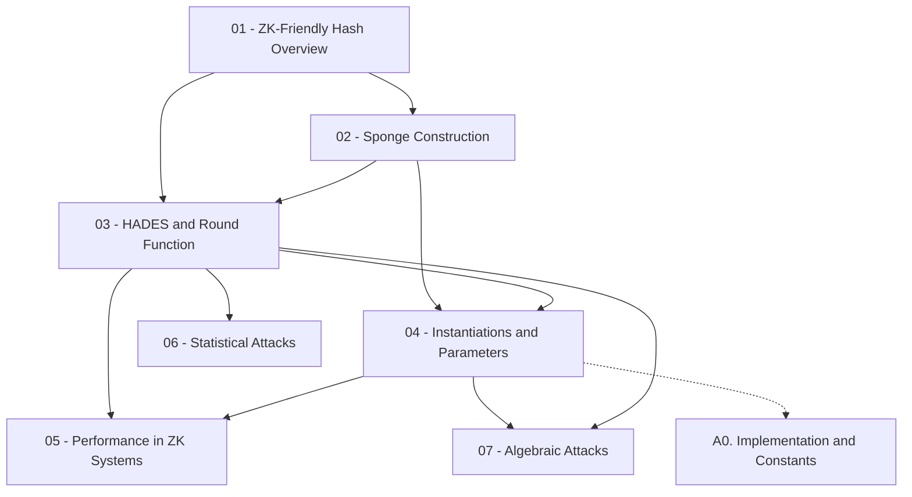

Course này cover toàn bộ nội dung paper **POSEIDON** (USENIX Security 2021) — hash function đại số tối ưu cho ZK proof systems, từ motivation và design, qua toàn bộ phân tích bảo mật (tấn công thống kê và đại số), đến đánh giá performance trên Groth16, PLONK và STARKs.

**Tài liệu gốc**: [POSEIDON: A New Hash Function for Zero-Knowledge Proof Systems](https://eprint.iacr.org/2019/458)  
**Kiến thức nền tảng yêu cầu** (🔴 Prerequisite): Finite field / GF(p) basics; Sponge construction [BDPA08]; Block cipher / SPN design; ZK proof systems (SNARKs/STARKs) ở mức khái niệm.

---

## Lesson Overview

| # | Tiêu đề | Type | Covers (sections) | File | Dependencies |
|---|---------|------|-------------------|------|-------------|
| 01 | ZK-Friendly Hash Functions & POSEIDON Overview | Foundation | §1, §1.1–1.5 | [[01-zk-hash-motivation\|01. ZK-Friendly Hash Functions]] | — |
| 02 | Sponge Construction & POSEIDONπ Sponge | Math Component | §2.1 | [[02-sponge-construction\|02. Sponge Construction]] | 01 |
| 03 | HADES Design Strategy & Round Function | Deep Dive | §2.2, §2.2.1–2.2.3 | [[03-hades-round-function\|03. HADES & Round Function]] | 01, 02 |
| 04 | Concrete Instantiations & Parameter Selection | Scheme | §2.3, §3.1–3.4, App. A | [[04-instantiations-parameters\|04. Instantiations & Parameters]] | 02, 03 |
| 05 | Performance in ZK Proof Systems | Deep Dive | §4, §4.1–4.3 | [[05-performance-zk-systems\|05. Performance in ZK Systems]] | 03, 04 |
| 06 | Statistical Attacks on POSEIDON | Attack | §5.1 | [[06-statistical-attacks\|06. Statistical Attacks]] | 03 |
| 07 | Algebraic Attacks on POSEIDON | Attack | §5.2 | [[07-algebraic-attacks\|07. Algebraic Attacks]] | 03, 04 |
| A0 | Efficient Implementation & Round Constant Generation | — | App. A, App. B | [[a0-implementation\|A0. Implementation & Constants]] | 04 |

**Lesson types**: Foundation · Math Component · Scheme · Attack · Protocol · Deep Dive · Specification · Survey

---

## Coverage Map

| Document section | Covered in lesson |
|------------------|-------------------|
| §1 Introduction | 01 |
| §1.1 Our Contributions (Table 1) | 01 |
| §1.2 Comparison to HADES [GLR+20] | 01 |
| §1.3 Related Work | 01 |
| §1.4 Structure of the Paper | 01 |
| §1.5 Historic Remarks | 01 |
| §2.1 The Sponge Construction | 02 |
| §2.1 Sponge Security | 02 |
| §2.1 Our POSEIDONπ Sponges (Algorithm 1) | 02 |
| §2.2 The Permutation Family POSEIDONπ | 03 |
| §2.2.1 Details on the HADES Strategy (Fig. 2) | 03 |
| §2.2.2 The Round Function (Fig. 3) — S-Box Layer | 03 |
| §2.2.2 The Round Function — Linear Layer (MDS) | 03 |
| §2.2.2 Avoiding Insecure Matrices (Algorithm 2) | 03 |
| §2.2.3 Interaction Between Full and Partial Rounds | 03 |
| §2.3 Domain Separation for POSEIDON | 04 |
| §3.1 Definitions (Definition 1) | 04 |
| §3.2 Security Claims (Claims 1–4) | 04 |
| §3.3 Security Margin | 04 |
| §3.4 Attack Details (round number formulae) | 04 |
| §4.1 SNARKs with POSEIDONπ — Groth16 (Table 3) | 05 |
| §4.1 SNARKs with POSEIDONπ — PLONK | 05 |
| §4.2 STARKs with POSEIDONπ (Table 4) | 05 |
| §4.3 Applications: Merkle Trees, Bulletproofs | 05 |
| §5.1 Linear Cryptanalysis | 06 |
| §5.1 Rebound Attacks (differential) | 06 |
| §5.1 Invariant Subspace Attack | 06 |
| §5.2 Gröbner Basis Attack (CICO problem) | 07 |
| §5.2 Interpolation Attack | 07 |
| Appendix A — Round Constant Generation (Grain LFSR) | A0 |
| Appendix B — Efficient Implementation (sparse matrix) | A0 |

---

## Dependency Graph

---

## Progress

- [x] [[01-zk-hash-motivation\|01. ZK-Friendly Hash Functions & POSEIDON Overview]]
- [x] [[02-sponge-construction\|02. Sponge Construction & POSEIDONπ Sponge]]
- [x] [[03-hades-round-function\|03. HADES Design Strategy & Round Function]]
- [x] [[04-instantiations-parameters\|04. Concrete Instantiations & Parameter Selection]]
- [x] [[05-performance-zk-systems\|05. Performance in ZK Proof Systems]]
- [x] [[06-statistical-attacks\|06. Statistical Attacks on POSEIDON]]
- [x] [[07-algebraic-attacks\|07. Algebraic Attacks on POSEIDON]]
- [x] [[a0-implementation\|A0. Efficient Implementation & Round Constant Generation]]

---

## 🟡 Integrated References

| Ref Key | Dùng trong lesson | Nội dung integrate |
|---------|------------------|--------------------|
| [GLR+20] | 01, 03 | HADES design strategy: full/partial round structure, wide trail argument |
| [BDPA08] | 02 | Sponge security theorem: $M = c/2$ bits từ capacity |
| [AGR+16] | 01, 05 | MiMC: cube S-box, multiplicative complexity framework, performance baseline |
| [ACD+19] | 01, 06 | Rescue/MARVELlous: interpolation attack, so sánh Table 1 |
| [Gro16] | 05 | R1CS model, constraint counting (Groth16) |
| [GWC19] | 05 | Gate constraint model (PLONK) |

---

## Notes

- **Lesson 01** nên đọc song song với §1 của paper gốc để thấy Table 1 (performance comparison) đầy đủ.
- **Lesson 03** là bài cốt lõi nhất — nắm vững HADES và round function trước khi đọc bất kỳ security lesson nào.
- **Lesson 06 và 07** độc lập nhau sau khi có Lesson 03; có thể đọc song song.
- **Lesson 05** đòi hỏi hiểu R1CS/AET ở mức khái niệm; nếu chưa biết ZK arithmetization, đọc thêm Groth16 [Gro16] hoặc STARK [BBHR19] trước.
- **A0** là appendix kỹ thuật, chỉ cần khi implement POSEIDON thực tế.
