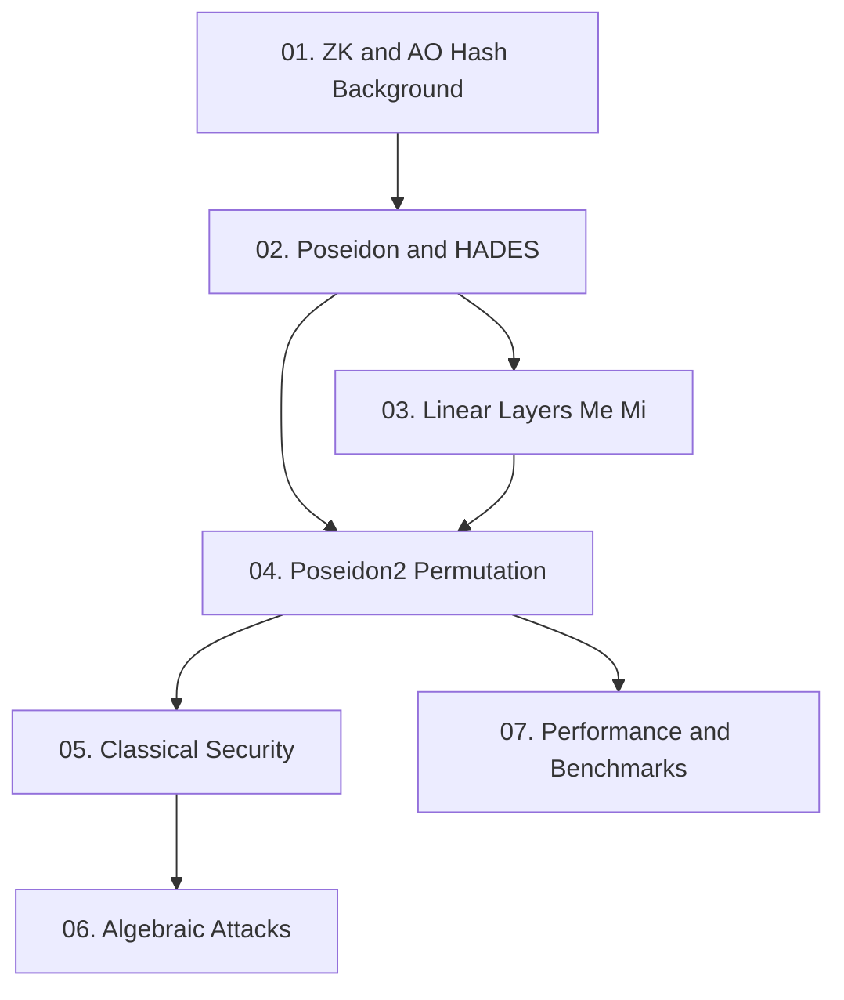

**Poseidon2** là phiên bản tối ưu hóa của hash function Poseidon, được thiết kế đặc biệt cho các hệ thống chứng minh zero-knowledge. Paper đề xuất linear layers mới $(M_E, M_I)$ giảm số phép nhân lên đến 90% và số constraint Plonk lên đến 70%, đồng thời bổ sung compression function mode và củng cố bảo mật chống algebraic attack mới. Course này cover toàn bộ 8 section của paper gốc.

**Tài liệu gốc**: [eprint.iacr.org/2023/323](https://eprint.iacr.org/2023/323)  
**Kiến thức nền tảng yêu cầu** (🔴 Prerequisite): Poseidon hash function [GKR+21], ZK proof systems cơ bản, Arithmetic trên finite field $\mathbb{F}_p$

---

## Lesson Overview

| # | Title | Type | Covers (sections) | File | Dependencies |
|---|-------|------|-------------------|------|-------------|
| 01 | ZK Proof Systems and AO Hash Functions | Foundation | §1, §2 | [[01-zk-ao-hash-background\|01. ZK & AO Hash]] | — |
| 02 | Poseidon and the HADES Design Strategy | Foundation | §3 | [[02-poseidon-hades\|02. Poseidon & HADES]] | 01 |
| 03 | New Linear Layers: M_E and M_I | Math Component | §4 | [[03-linear-layers-me-mi\|03. Linear Layers]] | 02 |
| 04 | The Poseidon2 Permutation and Modes of Operation | Scheme | §5, §6 | [[04-poseidon2-permutation\|04. Poseidon2 Permutation]] | 02, 03 |
| 05 | Classical Security Analysis | Foundation | §7.1, §7.2 | [[05-classical-security\|05. Classical Security]] | 04 |
| 06 | Algebraic Attacks and the Sauer Fix | Attack | §7.3 | [[06-algebraic-attacks\|06. Algebraic Attacks]] | 05 |
| 07 | Performance, Plonk Arithmetization & Benchmarks | Deep Dive | §8 | [[07-performance-benchmarks\|07. Performance]] | 04 |

**Lesson types**: Foundation · Math Component · Scheme · Attack · Deep Dive

---

## Coverage Map

| Document section | Covered in lesson |
|------------------|-------------------|
| §1 Introduction | 01 |
| §2.1 Notations | 01 |
| §2.2 ZK Proof Systems | 01 |
| §2.3 Arithmetization (R1CS, Plonk) | 01 |
| §3.1 HADES Design Strategy | 02 |
| §3.2 Poseidon_π Permutation | 02 |
| §4.1 Requirements for Linear Layers | 03 |
| §4.2 External Matrix M_E | 03 |
| §4.3 Internal Matrix M_I | 03 |
| §5.1 Poseidon2_π Specification | 04 |
| §5.2 Instances (Table 1) | 04 |
| §6.1 Sponge Mode | 04 |
| §6.2 Compression Function Mode | 04 |
| §7.1 Differential & Linear Attacks | 05 |
| §7.2 Algebraic Attacks (Interpolation, Gröbner) | 05 |
| §7.3 New Algebraic Attack + Fix | 06 |
| §8.1 Plain Performance (Rust benchmarks) | 07 |
| §8.2 Plonk Arithmetization Technique | 07 |
| §8.3 Comparison Table | 07 |
| Figure 1 | 04 |
| Table 1 | 04 |

---

## Dependency Graph

---

## Progress

- [x] [[01-zk-ao-hash-background\|01. ZK & AO Hash Background]]
- [x] [[02-poseidon-hades\|02. Poseidon & HADES]]
- [x] [[03-linear-layers-me-mi\|03. Linear Layers M_E and M_I]]
- [x] [[04-poseidon2-permutation\|04. Poseidon2 Permutation]]
- [x] [[05-classical-security\|05. Classical Security Analysis]]
- [x] [[06-algebraic-attacks\|06. Algebraic Attacks & Sauer Fix]]
- [x] [[07-performance-benchmarks\|07. Performance & Benchmarks]]

---

## 🟡 Integrated References

| Ref Key | Used in lesson | What is integrated |
|---------|---------------|--------------------|
| [GLRRS20] | 02 | HADES design strategy — full/partial round split, branch number argument |
| [PGWZS19] | 01, 07 | Plonk arithmetization — constraint model và cách đếm |
| [DL18] | 03 | Lightweight MDS matrix construction cho M_E |
| [ABM23] | 06 | Algebraic attack (Sauer-type) và bản fix của GKS23 |
| [JK97] | 05 | Interpolation attack model dùng trong security analysis |

---

## Notes

Học theo thứ tự 01 → 02 → 03 → 04 là bắt buộc do chuỗi phụ thuộc. Lesson 05–06 (security) và Lesson 07 (performance) có thể đọc song song sau Lesson 04. Lesson 07 đặc biệt hữu ích cho những ai muốn triển khai Poseidon2 trong Plonk circuit thực tế.
