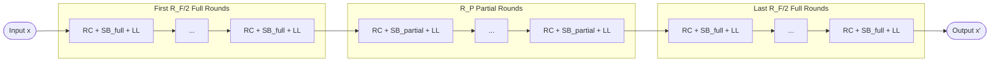

> **Prerequisites**: Finite field $\mathbb{F}_p$, AO hash function context (xem [[01-zk-ao-hash-background|01. ZK & AO Hash Background]]), SPN (substitution-permutation network) cơ bản  
> 🔴 **Prerequisite references**: Grassi et al. — *POSEIDON: A New Hash Function for ZK Proof Systems* [GKR+21]; Grassi et al. — *The HADES Design Strategy* [GLRRS20]  
> **Lesson type**: Foundation  
> **Covers**: §3.1 (HADES Design Strategy), §3.2 (Poseidon_π Permutation — round function, S-box, linear layer, round constants, parameters)
>
> **Notation** (bổ sung từ Lesson 01):
> | Ký hiệu | Ý nghĩa | Ký hiệu trong paper |
> |---------|---------|---------------------|
> | $x \in \mathbb{F}_p^t$ | State của permutation (vector $t$ phần tử) | $x$ |
> | $M \in \mathbb{F}_p^{t \times t}$ | MDS matrix (linear layer của Poseidon) | $M$ |
> | $C = (c_0, \ldots, c_{t-1})$ | Round constant vector | $C$ |
> | $S_\alpha : \mathbb{F}_p \to \mathbb{F}_p$ | S-box: $S_\alpha(x) = x^\alpha$ | $S_\alpha$ |
> | $\mathsf{RC}$ | Round constant addition layer | — |
> | $\mathsf{SB}$ | S-box layer | — |
> | $\mathsf{LL}$ | Linear layer (matrix multiply) | — |
> | $B(M)$ | Branch number của matrix $M$ | $B(M)$ |

---

## Motivation

Trước Poseidon, các AO hash function như MiMC chỉ dùng một loại round duy nhất: mỗi round áp dụng S-box cho **toàn bộ** state. Điều này đơn giản nhưng lãng phí — tính phi tuyến được "phân phối đều" ngay cả ở những vị trí không thực sự cần thiết.

Năm 2020, Grassi et al. đề xuất **chiến lược thiết kế HADES** [GLRRS20]: xen kẽ giữa *full rounds* (S-box toàn bộ state) và *partial rounds* (S-box chỉ một phần tử). Ý tưởng là: full rounds cung cấp bảo mật cao ở đầu và cuối permutation, còn partial rounds ở giữa tăng bậc đa thức một cách kinh tế. Poseidon là AO hash function đầu tiên áp dụng HADES và trở thành tiêu chuẩn thực tế trong hệ sinh thái ZK.

Bài học này distill §3 của paper [GKS23] — phần nền tảng cần thiết để hiểu những thay đổi của Poseidon2.

---

## HADES Design Strategy (§3.1)

> [!info] 🟡 HADES Design Strategy (theo [GLRRS20]: Grassi, Lüftenegger, Rechberger, Rotaru, Schofnegger — EUROCRYPT 2020)
> HADES là một chiến lược thiết kế cho SPN permutation trên $\mathbb{F}_p^t$. Thay vì dùng toàn full rounds (như MiMC) hoặc toàn partial rounds, HADES chia round thành ba vùng:
>
> 1. $R_f$ **full rounds đầu**: S-box áp dụng cho cả $t$ phần tử → bảo vệ chống statistical attacks từ phía input
> 2. $R_P$ **partial rounds giữa**: S-box áp dụng cho **chỉ một** phần tử → tăng bậc đa thức kinh tế
> 3. $R_f$ **full rounds cuối**: tương tự đầu → bảo vệ chống statistical attacks từ phía output
>
> Tổng số full rounds $R_F = 2R_f$. Kiến trúc $[R_f, R_P, R_f]$ cho phép đạt security level $\lambda$ bit với **ít S-box hơn** so với full-rounds-only design.
>
> *(theo [GLRRS20]: Grassi et al. — On a Generalization of SPN: The HADES Design Strategy, EUROCRYPT 2020)*

Trực giác của HADES: kẻ tấn công cần phá vỡ cả "vùng biên" (full rounds) lẫn "vùng lõi" (partial rounds). Hai loại tấn công nhắm vào hai vùng này có tính chất rất khác nhau — và việc yêu cầu cả hai điều kiện đồng thời làm cho attack trở nên khó hơn đáng kể so với chỉ có một loại round.

---

## Poseidon_π Permutation (§3.2)

### Thiết lập

Poseidon_π hoạt động trên state $x \in \mathbb{F}_p^t$ với:
- $p$: số nguyên tố lớn (field prime)
- $t$: state size (width), thường $t \in \{2, 3, 4, 8, 12, \ldots\}$
- $R_F$: số full rounds (chẵn, thường $R_F = 8$)
- $R_P$: số partial rounds (phụ thuộc vào $t$ và security level $\lambda$)
- $\alpha$: bậc S-box, $\gcd(\alpha, p-1) = 1$ (để S-box invertible), thường $\alpha \in \{3, 5, 7, 11\}$

### Cấu trúc Round Function

> [!note] Scheme 2.1 — Poseidon Round Function
> **Full round $E_i$** (dùng cho $R_F/2$ rounds đầu và $R_F/2$ rounds cuối):
>
> **Input**: $x \in \mathbb{F}_p^t$, round constants $C_i = (c_{i,0}, \ldots, c_{i,t-1}) \in \mathbb{F}_p^t$
>
> **Bước 1 — Round Constant Addition** ($\mathsf{RC}$):
>
> $$
> x \leftarrow x + C_i \quad \text{(component-wise)}
> $$
>
> **Bước 2 — S-box Layer** ($\mathsf{SB}$, full):
>
> $$
> x \leftarrow (x_0^\alpha, x_1^\alpha, \ldots, x_{t-1}^\alpha)
> $$
>
> **Bước 3 — Linear Layer** ($\mathsf{LL}$):
>
> $$
> x \leftarrow M \cdot x
> $$
>
> **Output**: $x' \in \mathbb{F}_p^t$
>
> ---
>
> **Partial round $I_j$** (dùng cho $R_P$ rounds giữa):
>
> **Input**: $x \in \mathbb{F}_p^t$, round constant $C_j \in \mathbb{F}_p^t$
>
> **Bước 1** ($\mathsf{RC}$): $x \leftarrow x + C_j$
>
> **Bước 2** ($\mathsf{SB}$, partial): chỉ áp dụng S-box cho **phần tử đầu**:
>
> $$
> x \leftarrow (x_0^\alpha, x_1, x_2, \ldots, x_{t-1})
> $$
>
> **Bước 3** ($\mathsf{LL}$): $x \leftarrow M \cdot x$
>
> **Output**: $x' \in \mathbb{F}_p^t$

### Toàn bộ Permutation Poseidon_π

> [!note] Scheme 2.2 — Poseidon_π Permutation
> **Input**: $x \in \mathbb{F}_p^t$
>
> **Thực thi theo kiến trúc HADES** $[R_F/2,\, R_P,\, R_F/2]$:
>
> $$
> \mathsf{Poseidon}_\pi(x) = E_{R_F - 1} \circ \cdots \circ E_{R_F/2} \circ I_{R_P - 1} \circ \cdots \circ I_0 \circ E_{R_F/2 - 1} \circ \cdots \circ E_0(x)
> $$
>
> trong đó:
> - $E_i$: full round thứ $i$
> - $I_j$: partial round thứ $j$
>
> **Output**: $x' \in \mathbb{F}_p^t$

### Minh họa kiến trúc

---

## Các thành phần chi tiết

### S-box Layer

S-box của Poseidon là hàm lũy thừa $S_\alpha(x) = x^\alpha$ trên $\mathbb{F}_p$.

**Yêu cầu**: $\gcd(\alpha, p-1) = 1$ để $S_\alpha$ là permutation (bijective) trên $\mathbb{F}_p$.

**Lý do chọn bậc nhỏ**: số constraint trong circuit tỉ lệ với $\lceil \log_2 \alpha \rceil$ (dùng repeated squaring). Với $\alpha = 3$: 2 phép nhân. Với $\alpha = 5$: 3 phép nhân. Với $\alpha = 7$: 4 phép nhân.

**Ràng buộc theo field**:
- Nếu $p \equiv 2 \pmod{3}$: dùng được $\alpha = 3$ (vì $\gcd(3, p-1) = 1$)
- Nếu $3 \mid (p-1)$: phải dùng $\alpha \geq 5$ (ví dụ BN254: $p-1 \equiv 0 \pmod{3}$ → dùng $\alpha = 5$)

### Linear Layer

Poseidon gốc dùng một **MDS matrix** $M \in \mathbb{F}_p^{t \times t}$ — ma trận Maximum Distance Separable.

> [!abstract] Định nghĩa 2.3 — MDS Matrix
> Ma trận $M \in \mathbb{F}_p^{t \times t}$ là MDS nếu **branch number** của nó đạt giá trị tối đa:
>
> $$
> B(M) = \min_{x \in \mathbb{F}_p^t \setminus \{0\}} \bigl(\mathsf{wt}(x) + \mathsf{wt}(M \cdot x)\bigr) = t + 1
> $$
>
> trong đó $\mathsf{wt}(x)$ là số phần tử khác $0$ trong $x$.

Branch number $t+1$ có nghĩa là: nếu $k$ phần tử của $x$ khác $0$, thì sau khi nhân với $M$, có ít nhất $t+1-k$ phần tử của $M \cdot x$ khác $0$. Điều này đảm bảo **diffusion tối đa** — một S-box active lan ra ảnh hưởng đến nhiều phần tử nhất có thể sau một linear layer.

**Ví dụ**: Circulant MDS matrix (Cauchy matrix) là các lựa chọn phổ biến. Tuy nhiên, cả hai đều là **ma trận dày đặc** — nhân ma trận $t \times t$ với vector tốn $t^2$ phép nhân trường.

**Đây chính là điểm yếu mà Poseidon2 sẽ fix**: linear layer chiếm phần lớn chi phí trong plain execution.

### Round Constants

Round constants được sinh bằng Grain LFSR từ seed phụ thuộc vào tham số $(p, \alpha, t, R_F, R_P)$ — đảm bảo tính **nothing-up-my-sleeve (NUMS)** (không có backdoor ẩn). Mỗi full round dùng $t$ constants, mỗi partial round dùng $t$ constants.

> [!tip] 💡 Agent note
> Một tối ưu hóa quan trọng (được nhắc đến khi giải thích Poseidon2 Remark 4): implementation tối ưu của Poseidon gốc chỉ thực sự cần **1 round constant** cho mỗi partial round (thay vì $t$), vì các constant không tác động đến phần tử không đi qua S-box trước khi bị "khuếch tán" bởi linear layer. Poseidon2 chính thức hóa điều này.

---

## Tham số và Instantiation

Tham số $(t, R_F, R_P, \alpha)$ được chọn để đảm bảo $\lambda$ bits of security chống lại tất cả các tấn công đã biết. Các tham số điển hình:

| Field | $t$ | $\alpha$ | $R_F$ | $R_P$ | Security |
|-------|-----|---------|-------|-------|---------|
| BN254 ($n = 254$) | 3 | 5 | 8 | 57 | 128-bit |
| BN254 ($n = 254$) | 5 | 5 | 8 | 60 | 128-bit |
| Goldilocks ($n = 64$) | 8 | 7 | 8 | 22 | 128-bit |
| Goldilocks ($n = 64$) | 12 | 7 | 8 | 22 | 128-bit |

> [!warning] Vấn đề: Chi phí Linear Layer của Poseidon
> Với $t = 12$, mỗi full round cần nhân $12 \times 12 = 144$ phép nhân trường chỉ cho linear layer. Với $R_F = 8$ full rounds và $R_P = 22$ partial rounds: tổng chi phí linear layer rất cao khi chạy **ngoài** ZK circuit (plain execution).
>
> Đây là lý do chính tại sao Poseidon2 cần thiết: plain performance của Poseidon trên native code (Rust, C++) chậm hơn đáng kể so với tiềm năng lý thuyết.

---

## Tại sao HADES an toàn?

**Argument bảo mật của HADES** [GLRRS20] dựa trên hai tầng:

**Tầng 1 — Statistical security** (full rounds): $R_F/2$ full rounds đầu và cuối đảm bảo rằng bất kỳ differential trail hay linear approximation nào cũng phải đi qua đủ nhiều active S-boxes để xác suất gần bằng $0$.

**Tầng 2 — Algebraic security** (partial rounds): $R_P$ partial rounds đảm bảo bậc của permutation (khi biểu diễn dưới dạng polynomial) đủ cao để cản trở interpolation attacks và Gröbner basis attacks.

> [!info] 🟡 HADES Security Argument (theo [GLRRS20])
> Định lý chính trong [GLRRS20] chỉ ra: với $R_F \geq 6$ và $R_P$ đủ lớn, bất kỳ differential trail nào phải có ít nhất $2(t+1)$ active S-boxes trong toàn bộ permutation. Mỗi active S-box đóng góp một xác suất differential tối đa $p^{-1}$ (gần). Khi $2(t+1) \cdot \log_2 p \gg \lambda$, tấn công differential trở nên infeasible.
>
> *(theo [GLRRS20]: Grassi, Lüftenegger, Rechberger, Rotaru, Schofnegger — On a Generalization of Substitution-Permutation Networks: The HADES Design Strategy, EUROCRYPT 2020)*

Tuy nhiên, như Poseidon2 paper sẽ chỉ ra trong §7.3, security argument này có một lỗ hổng nhỏ đối với algebraic attacks khi $\lambda$ lớn — và Poseidon2 đề xuất fix đơn giản.

---

## Summary

- **HADES design strategy**: xen kẽ full rounds và partial rounds theo kiến trúc $[R_F/2, R_P, R_F/2]$ — cân bằng giữa bảo mật statistical và algebraic.
- **Poseidon_π**: SPN permutation trên $\mathbb{F}_p^t$ dùng S-box $x^\alpha$, MDS matrix $M$, và round constants sinh từ Grain LFSR.
- **Điểm mạnh**: ít S-boxes, security có thể tham số hóa, kế thừa cryptanalysis community đã làm.
- **Điểm yếu**: MDS matrix dày đặc $t \times t$ → linear layer tốn $O(t^2)$ phép nhân → plain performance chậm với $t$ lớn.
- **Poseidon2** sẽ fix điểm yếu này bằng cách thay MDS matrix bằng hai ma trận có structure đặc biệt $M_E$ và $M_I$ — nội dung của Lesson 03.

---

## References

- [GKS23] Grassi, Khovratovich, Schofnegger — *Poseidon2: A Faster Version of the Poseidon Hash Function*, AFRICACRYPT 2023
- [GKR+21] Grassi, Khovratovich, Rechberger, Roy, Schofnegger — *POSEIDON: A New Hash Function for Zero-Knowledge Proof Systems*, USENIX Security 2021 (🔴 Prerequisite)
- [GLRRS20] Grassi, Lüftenegger, Rechberger, Rotaru, Schofnegger — *On a Generalization of Substitution-Permutation Networks: The HADES Design Strategy*, EUROCRYPT 2020 (🟡 Integrated)
- [JK97] Jakobsen, Knudsen — *The Interpolation Attack on Block Ciphers*, FSE 1997 (⚪ Citation only — used in security analysis §7)
- [MiMC16] Albrecht et al. — *MiMC: Efficient Encryption and Cryptographic Hashing with Minimal Multiplicative Complexity*, ASIACRYPT 2016 (⚪ Citation only)
