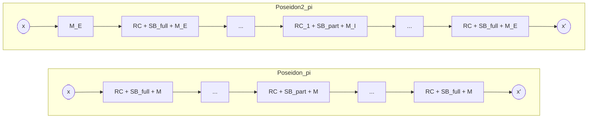

> **Prerequisites**: Poseidon_π và HADES architecture (xem [[02-poseidon-hades|02. Poseidon & HADES]]), linear layers $M_E$ và $M_I$ (xem [[03-linear-layers-me-mi|03. Linear Layers]])  
> 🔴 **Prerequisite references**: Bertoni et al. — *Sponge Functions* [BDPV07] (sponge construction theory)  
> **Lesson type**: Scheme  
> **Covers**: §5.1 (Poseidon2_π Specification — 3 differences), §5.2 (Instances, Table 1), §6.1 (Sponge Mode), §6.2 (Compression Function Mode), Figure 1
>
> **Notation** (bổ sung từ Lesson 03):
> | Ký hiệu | Ý nghĩa | Ký hiệu trong paper |
> |---------|---------|---------------------|
> | $P_2$ | Poseidon2_π permutation | $\mathsf{Poseidon2}_\pi$ |
> | $E_i^{(2)}$ | Full round thứ $i$ của Poseidon2_π (dùng $M_E$) | $E_i$ |
> | $I_j^{(2)}$ | Partial round thứ $j$ của Poseidon2_π (dùng $M_I$) | $I_j$ |
> | $r$ | Rate (số phần tử input mỗi block trong sponge) | $r$ |
> | $c$ | Capacity (số phần tử "bí mật" trong sponge state) | $c$ |
> | $d$ | Digest length (số phần tử output) | $d$ |

---

## Motivation

Hai lesson trước đã giải thích tại sao $M_E$ và $M_I$ hiệu quả hơn MDS matrix dày đặc. Bài học này kết hợp tất cả lại: đặc tả đầy đủ của permutation Poseidon2_π, so sánh trực tiếp với Poseidon_π qua Figure 1, và hai mode vận hành quan trọng: **sponge** (general-purpose hash) và **compression function** (tối ưu cho Merkle tree).

---

## Ba thay đổi so với Poseidon_π (§5.1)

Paper [GKS23] định nghĩa Poseidon2_π bởi chính xác **ba điểm khác biệt** so với Poseidon_π gốc (Remark 1: Poseidon gốc không bị thay đổi):

> [!note] Sự khác biệt Poseidon_π → Poseidon2_π
>
> **Khác biệt 1 — Initial linear layer**:
> Poseidon2_π thêm một phép nhân $M_E \cdot x$ **ở đầu** permutation, trước round đầu tiên. Poseidon_π không có bước này.
>
> **Khác biệt 2 — Hai linear layers khác nhau**:
> - Full rounds dùng $M_E$ (thay vì MDS $M$ của Poseidon)
> - Partial rounds dùng $M_I$ (thay vì cùng MDS $M$)
>
> Poseidon_π dùng cùng một $M$ cho tất cả rounds.
>
> **Khác biệt 3 — Chỉ một round constant trong partial rounds**:
> Trong partial rounds, chỉ áp dụng **một** round constant cho phần tử đầu (thay vì $t$ constants). Điều này phản ánh một tối ưu hóa mà implementation hiệu quả của Poseidon_π đã sử dụng ngầm — Poseidon2_π chính thức hóa nó trong spec.

---

## Poseidon2_π Permutation — Full Specification (§5.1)

### Round Functions

> [!note] Scheme 4.1 — Full Round $E_i^{(2)}$ của Poseidon2_π
> **Input**: $x \in \mathbb{F}_p^t$, round constant vector $C_i \in \mathbb{F}_p^t$
>
> **Bước 1** ($\mathsf{RC}$): $x \leftarrow x + C_i$
>
> **Bước 2** ($\mathsf{SB}_{\text{full}}$): $x \leftarrow (x_0^\alpha, x_1^\alpha, \ldots, x_{t-1}^\alpha)$
>
> **Bước 3** ($\mathsf{LL}_E$): $x \leftarrow M_E \cdot x$
>
> **Output**: $x' \in \mathbb{F}_p^t$

> [!note] Scheme 4.2 — Partial Round $I_j^{(2)}$ của Poseidon2_π
> **Input**: $x \in \mathbb{F}_p^t$, scalar round constant $c_j \in \mathbb{F}_p$
>
> **Bước 1** ($\mathsf{RC}$, partial): $x_0 \leftarrow x_0 + c_j$ (chỉ phần tử đầu)
>
> **Bước 2** ($\mathsf{SB}_{\text{partial}}$): $x_0 \leftarrow x_0^\alpha$ (chỉ phần tử đầu)
>
> **Bước 3** ($\mathsf{LL}_I$): $x \leftarrow M_I \cdot x$
>
> **Output**: $x' \in \mathbb{F}_p^t$

### Permutation hoàn chỉnh

> [!note] Scheme 4.3 — Poseidon2_π Permutation $P_2$
> **Input**: $x \in \mathbb{F}_p^t$
>
> **Kiến trúc** $[\text{Init},\; R_F/2 \text{ full},\; R_P \text{ partial},\; R_F/2 \text{ full}]$:
>
> $$
> P_2(x) = E_{R_F-1}^{(2)} \circ \cdots \circ E_{R_F/2}^{(2)} \circ I_{R_P-1}^{(2)} \circ \cdots \circ I_0^{(2)} \circ E_{R_F/2-1}^{(2)} \circ \cdots \circ E_0^{(2)}(M_E \cdot x)
> $$
>
> **Chi tiết**:
> 1. **Initial linear layer**: $x \leftarrow M_E \cdot x$
> 2. **$R_F/2$ full rounds** $E_0^{(2)}, \ldots, E_{R_F/2-1}^{(2)}$: dùng $M_E$
> 3. **$R_P$ partial rounds** $I_0^{(2)}, \ldots, I_{R_P-1}^{(2)}$: dùng $M_I$, một round constant
> 4. **$R_F/2$ full rounds** $E_{R_F/2}^{(2)}, \ldots, E_{R_F-1}^{(2)}$: dùng $M_E$
>
> **Output**: $x' \in \mathbb{F}_p^t$
>
> Round constants được sinh bằng Grain LFSR giống Poseidon gốc, với seed phụ thuộc tham số $(p, \alpha, t, R_F, R_P)$.

### Minh họa so sánh Poseidon_π vs Poseidon2_π (Figure 1)

*Phần đỏ trong Figure 1 của paper: initial $M_E$, chuyển sang $M_I$ trong partial rounds, chỉ 1 round constant trong partial rounds.*

---

## Tham số và Instantiation (§5.2, Table 1)

Round numbers của Poseidon2_π bằng Poseidon_π trong hầu hết các trường hợp thực tế — security argument tương đương nhờ sự tương đồng về cấu trúc.

| Field ($p$) | $n = \lceil \log_2 p \rceil$ | $t$ | $\alpha$ | $R_F$ | $R_P$ | Security |
|-------------|------------------------------|-----|---------|-------|-------|----------|
| BN254 | 254 | 2 | 5 | 8 | 56 | 128-bit |
| BN254 | 254 | 3 | 5 | 8 | 57 | 128-bit |
| BN254 | 254 | 4 | 5 | 8 | 56 | 128-bit |
| Goldilocks | 64 | 8 | 7 | 8 | 22 | 128-bit |
| Goldilocks | 64 | 12 | 7 | 8 | 22 | 128-bit |
| BabyBear | 31 | 16 | 7 | 8 | 13 | 128-bit |

> [!warning] Chú ý: Tham số phụ thuộc vào $p$
> $\alpha$ phải thỏa $\gcd(\alpha, p-1) = 1$. Với BN254 ($p - 1 \equiv 0 \pmod 3$) phải dùng $\alpha = 5$. Với Goldilocks ($p = 2^{64} - 2^{32} + 1$, $p - 1 \equiv 0 \pmod 3$) phải dùng $\alpha = 7$. Sử dụng sai $\alpha$ → S-box không invertible → permutation không hợp lệ.

---

## Modes of Operation (§6)

### Sponge Mode (§6.1)

Sponge construction là cách biến một permutation thành một hash function nhận input tùy độ dài.

> [!note] Scheme 4.4 — Poseidon2 Sponge Hash
> **Tham số**: state size $t = r + c$, trong đó $r$ = rate, $c$ = capacity; digest length $d \leq r$
>
> **$\mathsf{Init}$**: $s = (0^r \| 0^c) \in \mathbb{F}_p^t$ (state khởi đầu toàn $0$)
>
> **$\mathsf{Absorb}(m_1, m_2, \ldots, m_k)$** — với $m_i \in \mathbb{F}_p^r$:
>
> Với mỗi $i$:
>
> $$
> s \leftarrow P_2\bigl((s_{\text{rate}} \oplus m_i) \| s_{\text{capacity}}\bigr)
> $$
>
> (XOR message block vào phần rate, sau đó áp dụng permutation)
>
> **$\mathsf{Squeeze}$**: trả về $r$ phần tử đầu của state sau absorb cuối cùng:
>
> $$
> h = (s_0, s_1, \ldots, s_{d-1}) \in \mathbb{F}_p^d
> $$
>
> **Output**: $h \in \mathbb{F}_p^d$
>
> *Padding*: dùng theo quy ước SAFE [SAFE22] — thêm $1$ vào cuối input trước khi absorb.

**Security của Sponge**: nếu $P_2$ là permutation ngẫu nhiên (random permutation), sponge construction đạt indifferentiability from random oracle với capacity $c$ bits. Tức là: collision resistance đạt $\min(2^{c/2}, 2^\lambda)$, preimage resistance đạt $\min(2^c, 2^{n \cdot d})$.

### Compression Function Mode (§6.2)

Compression function là use case quan trọng nhất của Poseidon2, đặc biệt cho **Merkle tree**.

> [!note] Scheme 4.5 — Poseidon2 Compression Function
> **Tham số**: state size $t$, số input $k$ (thường $k = t - 1$ hoặc $k = t$), output size $d$
>
> **Input**: $(v_1, v_2, \ldots, v_k) \in \mathbb{F}_p^k$
>
> **Padding** (nếu $k < t$): điền $0$ hoặc constant để đủ $t$ phần tử
>
> **Thực thi**:
>
> $$
> \text{state} = (v_1 \| v_2 \| \cdots \| v_k \| \text{pad}) \in \mathbb{F}_p^t
> $$
>
> $$
> \text{state}' = P_2(\text{state})
> $$
>
> **Output**: $(s'_0, s'_1, \ldots, s'_{d-1}) \in \mathbb{F}_p^d$ (lấy $d$ phần tử đầu của output)

**Ưu điểm so với sponge** trong Merkle tree: sponge mode với rate $r = 1$ cần $k$ lần gọi permutation để hash $k$ inputs. Compression function mode hash $k$ inputs trong **một lần gọi permutation duy nhất**, bất kể $k \leq t$.

> [!tip] 💡 Agent note
> Đây là cải tiến thực tế quan trọng nhất của Poseidon2 so với Poseidon. Khi xây dựng Merkle tree với arity 4 (4 leaf → 1 node), sponge mode cần 4 permutation calls. Compression function mode chỉ cần 1 call với $t = 5$ (4 input + 1 capacity). Với Merkle tree sâu $\ell$ lớp, tiết kiệm là **4x** số permutation calls.

### So sánh hai modes

| | Sponge Mode | Compression Function Mode |
|-|-------------|--------------------------|
| **Input length** | Tùy ý | Cố định $\leq t$ |
| **Permutation calls** | $\lceil k/r \rceil$ | 1 |
| **Use case** | General hashing, PRF | Merkle tree, commitment |
| **Security** | Sponge security ($c$ bits) | Compression function security |
| **Hiệu quả** | Tốt với input dài | Tốt với input ngắn cố định |

---

## Correctness

> [!abstract] Theorem 4.6 — Correctness của Poseidon2_π (Remark 3, GKS23)
> Poseidon2_π là một **permutation** (bijective function) trên $\mathbb{F}_p^t$ nếu và chỉ nếu $M_E$ và $M_I$ đều invertible và $\gcd(\alpha, p-1) = 1$.

**Proof sketch**: Mỗi round function (full hoặc partial) là composed của ba invertible operations:
- Round constant addition: invertible (trừ đi hằng số)
- S-box $x \mapsto x^\alpha$: invertible trên $\mathbb{F}_p$ vì $\gcd(\alpha, p-1) = 1$, inverse là $x \mapsto x^{\alpha^{-1} \pmod{p-1}}$
- Linear layer $M_E$ hoặc $M_I$: invertible theo giả thiết

Composition của các bijections là bijection. Initial linear layer $M_E$ cũng invertible. $\square$

---

## Security Claim kế thừa từ Poseidon

> [!abstract] Security Claim 4.7 (GKS23, Remark 5)
> Do Poseidon2_π và Poseidon_π rất tương đồng về cấu trúc, **hầu hết các tấn công đều áp dụng tương tự cho cả hai**. Cụ thể:
> - Các tấn công statistical (differential, linear) → phụ thuộc vào branch number và số S-boxes active → Poseidon2 có $B(M_E) = t/4+4$ thay vì $t+1$, nhưng vẫn đủ an toàn với đủ full rounds
> - Các tấn công algebraic (interpolation, Gröbner basis) → phụ thuộc vào bậc polynomial và số variables → không thay đổi với việc đổi linear layer
>
> Vì vậy, round numbers của Poseidon2_π bằng hoặc rất gần Poseidon_π.

Chi tiết về security analysis sẽ được trình bày trong [[05-classical-security|05. Classical Security Analysis]] và [[06-algebraic-attacks|06. Algebraic Attacks]].

---

## Summary

- **Poseidon2_π** khác Poseidon_π ở đúng ba điểm: initial $M_E$, hai linear layers riêng biệt ($M_E$ cho full, $M_I$ cho partial), và chỉ 1 round constant trong partial rounds.
- **Permutation** là composition của initial $M_E$ + $[R_F/2, R_P, R_F/2]$ rounds dùng $M_E$/$M_I$ xen kẽ.
- **Correctness**: Poseidon2_π là permutation khi $M_E$, $M_I$ invertible và $\gcd(\alpha, p-1) = 1$.
- **Sponge mode**: nhận input tùy độ dài, general-purpose hash.
- **Compression function mode**: nhận $\leq t$ inputs, một permutation call — tối ưu cho Merkle tree, tiết kiệm tới 4x so với sponge.
- Round numbers tương đương Poseidon — kế thừa toàn bộ trust từ cryptanalysis community.

---

## References

- [GKS23] Grassi, Khovratovich, Schofnegger — *Poseidon2: A Faster Version of the Poseidon Hash Function*, AFRICACRYPT 2023
- [BDPV07] Bertoni, Daemen, Peeters, Van Assche — *Sponge Functions*, 2007 (🔴 Prerequisite — sponge construction theory)
- [SAFE22] Aumasson, Khovratovich, Mennink, Quine — *SAFE: Sponge API for Field Elements*, 2022 (⚪ Citation only — padding convention)
- [GKR+21] Grassi et al. — *POSEIDON*, USENIX Security 2021 (🔴 Prerequisite)
