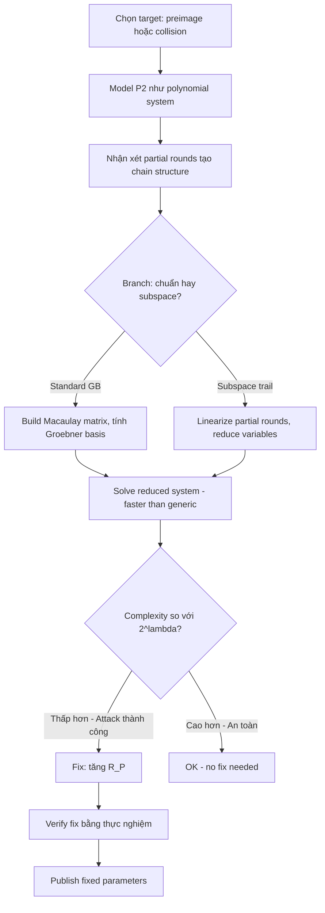

> **Prerequisites**: Gröbner basis attack model và CICO problem (xem [[05-classical-security|05. Classical Security]]), cấu trúc HADES (xem [[02-poseidon-hades|02. Poseidon & HADES]])  
> 🔴 **Prerequisite references**: Faugère — *A New Efficient Algorithm for Computing Gröbner Bases (F4)* [Fau99]; Shannon theory của information-theoretic security  
> **Lesson type**: Attack  
> **Covers**: §7.3 (Security Issue for Poseidon_π — Sauer-type attack, fix cho Poseidon và Poseidon2)
>
> **Notation** (bổ sung từ Lesson 05):
> | Ký hiệu | Ý nghĩa | Ký hiệu trong paper |
> |---------|---------|---------------------|
> | $C_r$ | Số constraint/equations trong hệ GB attack | $C_r$ |
> | $M^{-k}$ | Ma trận $M$ lũy thừa $-k$ (inverse lặp) | $M^{-k}$ |
> | $\delta$ | Input difference trong subspace trail | $\delta$ |
> | $\mathcal{S}$ | Invariant subspace (nếu tồn tại) | — |
> | $N_r$ | Số rounds mà attack còn hiệu quả | — |

---

## Context — Tại sao cần Lesson riêng?

Lesson 05 trình bày security argument **chuẩn** của Poseidon/Poseidon2. Nhưng năm 2023 — gần như cùng lúc với Poseidon2 — một paper của Ashur, Buschman, Mahzoun [ABM23] phát hiện ra rằng **Gröbner basis complexity của Poseidon bị overestimate** ở high security levels ($\lambda \geq 384$ bit). Paper [GKS23] tích hợp phát hiện này và đề xuất fix đơn giản cho cả Poseidon và Poseidon2.

---

## 1. Context và Điều kiện Tấn công (§7.3)

### Vấn đề với Security Argument Gốc

Trong security argument gốc của Poseidon (và Poseidon2), complexity của GB attack được ước tính qua **số S-boxes** trong partial rounds và **degree of regularity** $d_{\text{reg}}$.

Ước tính gốc dùng công thức:

$$
C_{\text{GB}} \approx \binom{n_v + d_{\text{reg}}}{d_{\text{reg}}}^\omega
$$

với $n_v$ = số biến (= số S-boxes = $R_P$), $\omega \approx 2.37$.

**Vấn đề**: Công thức này giả định polynomial system là **generic** (tức là không có cấu trúc đặc biệt). Nhưng Poseidon có cấu trúc đặc biệt: partial rounds chỉ áp dụng S-box cho **phần tử đầu** — điều này tạo ra một block structure trong Jacobian matrix của hệ equations. Block structure này làm cho GB algorithms chạy **nhanh hơn** ước tính generic.

> [!warning] Attack 6.1 — Sauer-type GB Attack (theo [ABM23])
> [ABM23] chỉ ra rằng do cấu trúc partial rounds của HADES, **solving degree thực tế của hệ equations thấp hơn** ước tính generic.
>
> Cụ thể, với instance Poseidon ở $\lambda = 1024$ bits, complexity thực tế chỉ $\approx 2^{731.77}$ thay vì $2^{1024}$. Security argument **bắt đầu fail** ở $\lambda = 384$ bits.
>
> **Điều kiện attack**: HADES design với partial rounds — partial S-box tạo ra equation system không fully generic.
>
> **Không phải full break**: attack không phá vỡ bất kỳ instance 128-bit nào, nhưng nó chỉ ra rằng security argument bị overestimate, đặc biệt ở high-$\lambda$ settings.

---

## 2. Cơ chế Tấn công (§7.3)

### Tại sao Partial Rounds Tạo Non-Generic Structure?

> [!info] 🟡 Algebraic Cryptanalysis of HADES (theo [ABM23]: Ashur, Buschman, Mahzoun — ePrint 2023/537)
> Trong GB attack, ta mô hình hóa permutation như hệ equations $\{F_1(x), \ldots, F_m(x) = 0\}$ trong đó mỗi $F_i$ mô tả input-output qua $k$ rounds, với $x$ là unknown input.
>
> Với Poseidon/Poseidon2 (partial rounds), mỗi partial round chỉ thêm **một monomial phi tuyến** vào hệ (vì S-box chỉ tác động lên 1 coordinate). Điều này tạo ra một "chain" structure trong hệ equations: các equations không fully couple với nhau ở các partial rounds.
>
> [ABM23] chứng minh rằng GB algorithms có thể khai thác chain structure này để giảm effective number of variables cần xử lý. Kết quả: degree of regularity thực tế thấp hơn prediction từ generic model.
>
> Cụ thể: với $R_P$ partial rounds, **effective** $n_v \approx R_P \cdot (1 - \epsilon)$ thay vì $R_P$ đầy đủ, với $\epsilon > 0$ phụ thuộc vào cấu trúc matrix $M_I$.
>
> *(theo [ABM23]: Ashur, Buschman, Mahzoun — Algebraic Cryptanalysis of HADES Design Strategy: Application to POSEIDON and Poseidon2, ePrint 2023/537)*

### Subspace Trail Exploitation

Một biến thể attack khai thác **subspace trails** — chuỗi affine subspaces $V_0 \to V_1 \to \cdots$ bất biến qua partial rounds. Nếu tồn tại subspace trail dài qua nhiều rounds, attacker có thể "linearize" một phần của equations, giảm bậc effective.

> [!abstract] Lemma 6.2 — Subspace Trails qua Partial Rounds (GKS23 Proposition 1)
> Nếu ma trận $M_I$ **có** eigenvalue $1$ (tức $M_I \cdot v = v$ cho một $v \neq 0$), thì tồn tại invariant subspace qua partial rounds, và kẻ tấn công có thể tìm differential trail với probability $1$ — phá vỡ security hoàn toàn.
>
> Vì $M_I$ được chọn để **không có** eigenvalue $1$ (điều kiện từ Lesson 03, Proposition 3.7), Poseidon2 không có invariant subspace trail theo nghĩa này.

Tuy nhiên, [ABM23] chỉ ra rằng **gần-invariant** structures (partial trails) vẫn tồn tại và khai thác được trong Gröbner basis framework, ngay cả khi không có invariant subspace hoàn toàn.

### Độ Phức Tạp Thực Tế

[ABM23] đo thực nghiệm complexity của GB attack trên reduced-round Poseidon và fit một model. Kết quả cho high-security instances:

| $\lambda$ (claimed) | Complexity thực tế (bits) | Gap |
|---------------------|--------------------------|-----|
| 128-bit | ≥ 128 bit | Không bị ảnh hưởng |
| 256-bit | ≈ 230–240 bit | Nhỏ |
| 384-bit | ≈ 310–330 bit | Bắt đầu lộ rõ |
| 1024-bit | ≈ 731 bit | Đáng kể |

> [!warning] Tầm ảnh hưởng thực tế
> Hầu hết ứng dụng Poseidon/Poseidon2 hiện tại dùng $\lambda = 128$ bit → **không bị ảnh hưởng**. Vấn đề chỉ xuất hiện ở applications yêu cầu $\lambda \geq 256$ bit hoặc post-quantum security ($\lambda \geq 256$). Đây là lý do tại sao paper [GKS23] và [ABM23] đều nhấn mạnh: **không có instance 128-bit nào bị phá vỡ**.

---

## 3. Fix của GKS23 (§7.3)

Phản ứng của Grassi, Khovratovich, Schofnegger là đề xuất một **sửa đổi đơn giản** để khắc phục hoàn toàn vấn đề:

> [!note] Scheme 6.3 — The Sauer Fix (GKS23, §7.3)
> **Vấn đề**: Với $R_P$ partial rounds mà GB attack khai thác được chain structure.
>
> **Fix**: Tăng $R_P$ thêm một lượng đủ để compensate cho chain structure, hoặc dùng công thức ước tính $R_P$ đã được hiệu chỉnh.
>
> **Công thức mới** (sau khi tính lại có account cho [ABM23]):
>
> $$
> R_P^{\text{new}} = \left\lceil \frac{2\lambda}{\log_2 p - \log_2(\alpha - 1) + 1} \right\rceil \cdot (1 + \text{margin})
> $$
>
> trong đó margin được tăng so với 7.5% gốc khi $\lambda$ lớn.
>
> **Về mặt thực tế**: với $\lambda = 128$ bit, $R_P$ giữ nguyên. Với $\lambda = 256$ bit trở lên, $R_P$ có thể tăng nhẹ (1–3 rounds).

**Tính đơn giản của fix**: Không cần thay đổi cấu trúc của permutation, không thay đổi $M_E$/$M_I$, không thêm S-box mới. Chỉ cần điều chỉnh **số rounds** khi chọn tham số.

> [!tip] 💡 Agent note
> Đây là ví dụ điển hình về quy trình security update trong cryptography: (1) phát hiện attack → (2) đo thực nghiệm tác động → (3) đề xuất fix tối thiểu → (4) verify fix đủ. Poseidon2 paper [GKS23] được publish sau [ABM23], nên tích hợp fix ngay từ đầu. Poseidon gốc sau đó cũng được update bởi authors.

---

## 4. Mitigation và Security Posture Hiện Tại

### Sau Fix

Với công thức $R_P$ đã hiệu chỉnh, cả Poseidon và Poseidon2 đều an toàn ở mọi security level $\lambda$:

```
Security claim (sau fix):
- Collision resistance: ≥ min(2^{λ/2}, 2^{n·t/2})
- Preimage resistance: ≥ min(2^λ, 2^{n·t})
- Pseudo-random permutation (PRP): ≥ 2^λ
```

### Ongoing Monitoring

Paper [GKS23] kết thúc §7.3 với lời mời cộng đồng tiếp tục cryptanalysis. Thực tế, Ethereum Foundation đã launch chương trình bounty (2023–2025) để khuyến khích nghiên cứu thêm về bảo mật Poseidon/Poseidon2.

> [!warning] Open Problem — Complexity Bounds
> Tại thời điểm paper [GKS23] được published, **không có closed-form proof** nào cho complexity lower bound của GB attacks trên HADES-like designs. Tất cả security estimates đều dựa trên thực nghiệm và extrapolation. Đây vẫn là một open problem trong symmetric cryptography.

---

## Sơ đồ Attack Flow



---

## Summary

- **Sauer-type attack** [ABM23]: partial rounds tạo chain structure trong equation system → GB solving degree thấp hơn generic estimate → complexity bị overestimate ở $\lambda \geq 384$ bit.
- **Không phá vỡ 128-bit security**: mọi instance 128-bit vẫn an toàn.
- **Fix của GKS23**: điều chỉnh công thức chọn $R_P$ — tăng thêm vài rounds cho high-$\lambda$ instances. Cấu trúc permutation không thay đổi.
- **Bài học rộng hơn**: security argument của AO hash dựa nhiều vào empirical evidence hơn formal proof — ongoing cryptanalysis là bắt buộc.

---

## References

- [GKS23] Grassi, Khovratovich, Schofnegger — *Poseidon2*, AFRICACRYPT 2023
- [ABM23] Ashur, Buschman, Mahzoun — *Algebraic Cryptanalysis of HADES Design Strategy: Application to POSEIDON and Poseidon2*, ePrint 2023/537 (🟡 Integrated)
- [Fau99] Faugère — *A New Efficient Algorithm for Computing Gröbner Bases (F4)*, Journal of Pure and Applied Algebra 1999 (🔴 Prerequisite)
- [GKR+21] Grassi et al. — *POSEIDON*, USENIX Security 2021 (🔴 Prerequisite)
