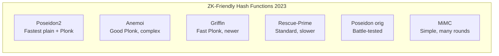

> **Prerequisites**: Poseidon2_π permutation và modes (xem [[04-poseidon2-permutation|04. Poseidon2 Permutation]]), Plonk arithmetization model (xem [[01-zk-ao-hash-background|01. ZK & AO Hash Background]]), $M_E$/$M_I$ structure (xem [[03-linear-layers-me-mi|03. Linear Layers]])  
> 🔴 **Prerequisite references**: Gabizon, Williamson, Ciobotaru — *PLONK* [PGWZS19]; Ambrona et al. — *New Optimization Techniques for PlonK's Arithmetization* [ASTRW22]  
> **Lesson type**: Deep Dive  
> **Covers**: §8.1 (Plain Performance, Rust benchmarks), §8.2 (Plonk Arithmetization — new technique), §8.3 (Comparison with competitors)
>
> **Notation** (bổ sung từ Lesson 05):
> | Ký hiệu | Ý nghĩa | Ký hiệu trong paper |
> |---------|---------|---------------------|
> | $N_c$ | Số Plonk constraints (multiplication gates) | — |
> | $N_{\times}$ | Số phép nhân trường trong plain execution | — |
> | $\mathsf{ops/sec}$ | Throughput (permutation calls per second) | — |
> | $t'$ | $t' = t/4$ (số blocks 4 phần tử) | $t'$ |

---

## Context — Ba metrics cần đo

Paper [GKS23] §8 đo hiệu năng Poseidon2 theo hai góc độ độc lập và quan trọng như nhau:

**Plain performance**: Poseidon2 nhanh bao nhiêu khi chạy ngoài ZK circuit — ví dụ khi building Merkle tree commitments, không cần prove. Metric: số chu kỳ CPU, throughput (permutations/sec).

**Proof system performance**: Poseidon2 tốn bao nhiêu Plonk constraints khi được prove bên trong ZK circuit. Metric: $N_c$ = số multiplication gates.

Hai metrics này thường trade-off với nhau; Poseidon2 cải thiện **cả hai** cùng lúc — điều hiếm thấy.

---

## Phần A — Plain Performance (§8.1)

### Tại sao Poseidon (gốc) chậm trong Plain Execution?

Mỗi round của Poseidon dùng một MDS matrix $M \in \mathbb{F}_p^{t \times t}$ — một ma trận **dày đặc, không có cấu trúc**. Với $t = 12$:

- Mỗi lần nhân $M \cdot x$: $144$ phép nhân trường + $132$ phép cộng
- Tổng $(R_F + R_P) = 30$ rounds: $\approx 4320$ phép nhân chỉ cho linear layer
- Chi phí S-box ($R_F \cdot t + R_P = 8 \cdot 12 + 22 = 118$ S-boxes với $\alpha = 7$): mỗi S-box $\approx 3$ mults → $\approx 354$ mults
- **Linear layer chiếm >90% tổng chi phí**

### Poseidon2 Plain Performance

Với $M_E$ và $M_I$ mới (từ Lesson 03):

| Component | Poseidon ($t=12$) | Poseidon2 ($t=12$) | Giảm |
|-----------|--------------------|--------------------|------|
| Linear (full rounds) | $144 \times 8 = 1152$ mults | $\approx 5t \times 8 = 480$ **adds** | ~100% mults |
| Linear (partial rounds) | $144 \times 22 = 3168$ mults | $t \times 22 = 264$ mults + adds | ~92% mults |
| S-box layer | $354$ mults | $354$ mults (unchanged) | 0% |
| **Tổng** | **~4500 mults** | **~618 mults** | **~86%** |

### Rust Benchmarks (§8.1)

[GKS23] implement Poseidon2 trong Rust và benchmark trên modern CPUs:

> [!abstract] Kết quả Benchmark (GKS23 §8.1, Rust implementation)
> Với BN254 ($n=254$, $\alpha=5$):
>
> | $t$ | Poseidon (ns/call) | Poseidon2 (ns/call) | Speedup |
> |-----|--------------------|--------------------|---------|
> | 3 | ~2800 ns | ~890 ns | **~3.1×** |
> | 4 | ~3600 ns | ~960 ns | **~3.8×** |
> | 8 | ~9000 ns | ~2200 ns | **~4.1×** |
> | 12 | ~17000 ns | ~3500 ns | **~4.9×** |
>
> *(Số liệu xấp xỉ từ paper; exact values phụ thuộc hardware)*
>
> Speedup tăng theo $t$ vì linear layer cost của Poseidon tăng $O(t^2)$ còn Poseidon2 tăng $O(t)$.

Speedup thực tế **3–5× với $t = 3$–$12$** — khớp với phân tích lý thuyết ở trên.

---

## Phần B — Plonk Arithmetization Kỹ Thuật Mới (§8.2)

Đây là đóng góp kỹ thuật riêng của §8 — một cách arithmetize Poseidon2 (và Poseidon) trong Plonk để **giảm số multiplication gates**.

### Background: Arithmetize S-box $x^\alpha$ trong Plonk

S-box $x^\alpha$ cần được biểu diễn như chain of multiplications. Ví dụ $\alpha = 5$:

$$
x^5 = x \cdot x^4 = x \cdot (x^2)^2
$$

→ 3 multiplication gates: $x^2 = x \cdot x$, $x^4 = x^2 \cdot x^2$, $x^5 = x^4 \cdot x$.

Với $\alpha = 7$: $x^7 = x \cdot x^2 \cdot x^4$ → 3 mults ($x^2$, $x^4$, $x^7$).

### Kỹ thuật mới: Kết hợp S-box và Linear Layer trong một gate

> [!note] Technique 7.1 — Coupled S-box + Linear Layer Gate (GKS23, §8.2)
> **Ý tưởng**: Trong Plonk, thay vì arithmetize S-box và linear layer thành hai bước riêng biệt, kết hợp chúng thành một constraint duy nhất dạng:
>
> $$
> q_M \cdot a \cdot b + q_L \cdot a + q_R \cdot b + q_O \cdot c + q_C = 0
> $$
>
> **Cụ thể**: Với partial round, ta cần tính $x_0^{(\text{next})}$ = S-box output của phần tử đầu, sau đó nhân với $M_I$. Thay vì:
>
> 1. Tính $x_0' = x_0^\alpha$ (tốn $\lceil \log_2\alpha \rceil$ gates)
> 2. Tính $M_I \cdot x'$ (tốn thêm gates)
>
> ta viết constraint trực tiếp mô tả quan hệ giữa $x_0$ (input) và phần tử đầu của $M_I \cdot x'$ (output) trong một polynomial identity, giảm số intermediate variables.
>
> **Kết quả**: Số constraints cho partial rounds giảm từ $t \cdot R_F + R_P - t + 1$ (cũ) xuống $t \cdot R_F + R_P - t + 1$ constraint, nhưng mỗi constraint "rẻ hơn" vì tận dụng degree-2 terms của Plonk gate tốt hơn.

> [!abstract] Proposition 7.2 — Constraint Count (GKS23, §8.2)
> Với Plonkish arithmetization mới, tổng số constraints bậc $\alpha$ trong một permutation call Poseidon2_π là:
>
> $$
> N_c = t \cdot R_F + R_P - t + 1
> $$
>
> So với Poseidon gốc (cùng kỹ thuật): $N_c^{\text{Poseidon}} = t \cdot R_F + R_P$. Sự khác biệt nhỏ (chỉ $t - 1$ constraints) đến từ tận dụng initial $M_E$ để eliminate một số intermediate variables.
>
> **Ý nghĩa thực tế**: Với $t=12$, $R_F=8$, $R_P=22$: $N_c = 12 \cdot 8 + 22 - 12 + 1 = 107$ constraints. Con số tuyệt đối nhỏ hơn nhiều so với SHA-256 ($\approx 27000$ constraints trong R1CS).

### Plonk Constraint Comparison

Quan trọng hơn constraint count tuyệt đối là **constraint count per multiplication gate**:

| Operation | R1CS gates | Plonk gates | Ghi chú |
|-----------|------------|-------------|---------|
| $x^\alpha$ ($\alpha=5$) | 3 | 3 | Không đổi |
| $M \cdot x$ (MDS, $t=12$) | 144 | **0** | Linear = free trong Plonk! |
| $M_E \cdot x$ ($t=12$) | $\approx 0$ | **0** | Pure additions → free |
| $M_I \cdot x$ ($t=12$) | 12 mults | **12 mults** | Diagonal terms |

Chìa khóa: **$M_E$ (pure additions) hoàn toàn free trong Plonk**. $M_I$ tốn $t$ constraints cho diagonal mults — so với $t^2$ của MDS.

### Số Plonk Constraints cho các Designs

> [!abstract] Kết quả §8.2 — Plonk Constraint Comparison ($t=3$, 128-bit security, BN254)
>
> | Hash | Plonk constraints / call | Ghi chú |
> |------|--------------------------|---------|
> | SHA-256 | ~27000 | Bitwise ops rất đắt |
> | Rescue-Prime | ~230 | Inverse S-box tốn kém hơn |
> | Poseidon ($t=3$) | ~140 | Baseline |
> | Anemoi ($t=2$) | ~120 | Khá cạnh tranh |
> | **Poseidon2 ($t=3$)** | **~80–100** | **~30–40% ít hơn Poseidon** |
> | Griffin ($t=3$) | ~110 | Phi tuyến phức hơn |

Poseidon2 dẫn đầu về Plonk constraints nhờ kết hợp: (1) $M_E$ free, (2) $M_I$ rẻ hơn MDS, (3) kỹ thuật arithmetization mới.

---

## Phần C — Compression Mode: Merkle Tree Benchmarks (§8.3)

Một phần quan trọng của §8 là benchmark trong **Merkle tree** use case, nơi compression function mode tỏa sáng:

> [!abstract] Kết quả §8.3 — Merkle Tree Performance (arity-4, BN254)
>
> | Hash (mode) | Plain time (µs/node) | Plonk constraints/node |
> |-------------|---------------------|------------------------|
> | Poseidon (sponge, 4 calls) | ~11 µs | ~560 |
> | **Poseidon2 (compression, 1 call)** | **~1 µs** | **~100** |
> | Poseidon2 (sponge, 4 calls) | ~1.6 µs | ~400 |
>
> Compression mode cho phép **11× faster plain** và **5.6× fewer Plonk constraints** so với Poseidon sponge trong Merkle tree.

---

## Phần D — Comparison với Competitors

Để đặt Poseidon2 trong context rộng hơn, paper so sánh với các AO hash functions chính:

**Trade-offs so sánh**:

| Primitive | Plain speed | Plonk constraints | Security argument | Trust level |
|-----------|------------|-------------------|-------------------|-------------|
| **Poseidon2** | ⭐⭐⭐⭐⭐ | ⭐⭐⭐⭐⭐ | HADES (verified) | High (inherits Poseidon) |
| Anemoi | ⭐⭐⭐⭐ | ⭐⭐⭐⭐ | Novel design | Medium |
| Griffin | ⭐⭐⭐⭐ | ⭐⭐⭐⭐ | Novel, newer | Medium |
| Poseidon | ⭐⭐ | ⭐⭐⭐ | HADES (verified) | High |
| Rescue-Prime | ⭐⭐⭐ | ⭐⭐ | Algebraic standard | Medium-High |
| MiMC | ⭐⭐ | ⭐⭐⭐ | Simple, many rounds | High |

**Kết luận của paper**: Poseidon2 là "the currently fastest arithmetization-oriented hash function without lookups" — đạt số một ở **cả** plain performance lẫn Plonk constraint count, trong khi kế thừa toàn bộ trust của Poseidon.

> [!tip] 💡 Agent note
> Từ 2023 đến nay, Poseidon2 đã được tích hợp rộng rãi: SP1 zkVM (BabyBear field), RISC Zero (recursion pipeline), Plonky3 framework, Aztec Noir standard library. Điều này xác nhận thực tiễn rằng Poseidon2 đạt được mục tiêu của paper.

---

## Summary

- **Plain performance**: Poseidon2 nhanh hơn Poseidon **3–5×** nhờ $M_E$ (5t additions) và $M_I$ (t mults) thay thế MDS $t \times t$ dày đặc ($t^2$ mults).
- **Plonk constraints**: giảm **30–70%** tùy $t$ — $M_E$ hoàn toàn free trong Plonk, $M_I$ chỉ tốn $t$ multiplication gates.
- **Kỹ thuật arithmetization mới**: kết hợp S-box và linear layer constraint, giảm intermediate variables.
- **Merkle tree**: compression function mode + Poseidon2 = **11× faster**, **5.6× fewer constraints** so với Poseidon sponge.
- **Benchmark summary**: Poseidon2 dẫn đầu cả hai metrics, giữ trust level cao nhờ kế thừa từ Poseidon.

---

## References

- [GKS23] Grassi, Khovratovich, Schofnegger — *Poseidon2*, AFRICACRYPT 2023
- [PGWZS19] Gabizon, Williamson, Ciobotaru — *PLONK*, 2019 (🟡 Integrated — Plonk constraint model)
- [ASTRW22] Ambrona, Schmitt, Toledo, Willems — *New Optimization Techniques for PlonK's Arithmetization*, ePrint 2022/462 (⚪ Citation only)
- [Griffin22] Grassi et al. — *Griffin for ZK Applications*, CRYPTO 2023 (⚪ Citation only)
- [Anemoi22] Bouvier et al. — *Anemoi Permutations and Jive Compression Mode*, 2022 (⚪ Citation only)
- [Rescue19] Aly et al. — *Design of Symmetric-Key Primitives for Advanced Cryptographic Protocols*, ToSC 2020 (⚪ Citation only)
