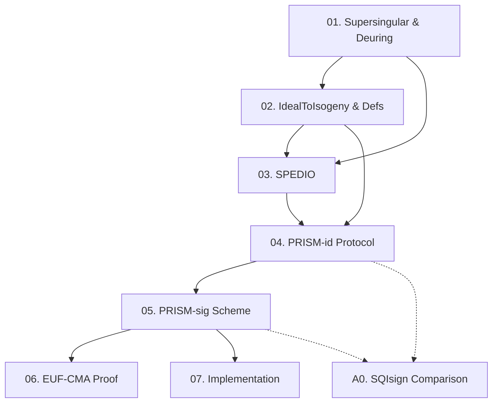

PRISM là scheme chữ ký post-quantum dựa trên bài toán tính isogeny bậc nguyên tố lớn từ đường cong elliptic supersingular không biết endomorphism ring — khó với cả máy tính classical lẫn quantum. Course này distill toàn bộ paper (33 trang, PKC 2025 Best Paper) thành 7 lesson + 1 appendix, từ nền tảng toán học đến proof bảo mật và implementation.

**Tài liệu gốc**: [PRISM — eprint.iacr.org/2025/135](https://eprint.iacr.org/2025/135)  
**Kiến thức nền tảng yêu cầu** (🔴 Prerequisite references): ECC cơ bản [Sil09], SQISign framework [DKL+20], Quaternion algebras [Voi21]

---

## Lesson Overview

| # | Title | Type | Covers (sections) | File | Dependencies |
|---|-------|------|-------------------|------|-------------|
| 01 | Supersingular Elliptic Curves & Deuring Correspondence | Math Component | §2.1–2.3, Table 1, Theorem 1 | [[01-supersingular-deuring\|01. Supersingular & Deuring]] | — |
| 02 | IdealToIsogeny & Security Definitions | Foundation | §2.4–2.5 | [[02-ideal-to-isogeny-defs\|02. IdealToIsogeny & Defs]] | 01 |
| 03 | SPEDIO: The Hardness Assumption | Foundation | §3.1 (Problem 2) | [[03-spedio-hardness\|03. SPEDIO]] | 01, 02 |
| 04 | PRISM-id: The Identification Protocol | Protocol | §3.2–3.4, Figure 3 | [[04-prism-id-protocol\|04. PRISM-id Protocol]] | 02, 03 |
| 05 | PRISM-sig: The Signature Scheme | Scheme | §4.1–4.2, Figure 5 | [[05-prism-sig-scheme\|05. PRISM-sig Scheme]] | 04 |
| 06 | Security Proof: EUF-CMA of PRISM-sig | Deep Dive | §4.3, Proposition 2, Figure 6 | [[06-prism-sig-security\|06. EUF-CMA Proof]] | 05 |
| 07 | Implementation & Performance | Deep Dive | §5, performance tables | [[07-implementation-performance\|07. Implementation]] | 05 |
| A0 | Appendix: Comparison with SQIsign Variants | — | Appendix A.1 | [[a0-sqisign-comparison\|A0. SQIsign Comparison]] | 04, 05 |

**Lesson types**: Foundation · Math Component · Scheme · Protocol · Deep Dive

---

## Coverage Map

| Document section | Covered in lesson |
|------------------|-------------------|
| §1 Introduction | Context (roadmap này + Lesson 03) |
| §2.1 Supersingular Elliptic Curves | 01 |
| §2.2 Kani's Lemma (Theorem 1) | 01 |
| §2.3 Deuring Correspondence (Table 1) | 01 |
| §2.4 IdealToIsogeny Algorithm | 02 |
| §2.5 Security Definitions (Σ-protocol, EUF-CMA) | 02 |
| §3.1 Hardness Assumption (Problem 2 — SPEDIO) | 03 |
| §3.2 PRISM-id Protocol Definition (Figure 3) | 04 |
| §3.3 Security Analysis (Completeness, Soundness, HVZK) | 04 |
| §3.4 High Degree Oracles và HVZK simulation | 04 |
| §4.1 Hash-and-Sign Paradigm | 05 |
| §4.2 PRISM-sig Definition (Figure 5) | 05 |
| §4.3 EUF-CMA Proof (Proposition 2, Figure 6) | 06 |
| §5 Implementation & Performance | 07 |
| Appendix A.1 | A0 |

---

## Dependency Graph

---

## Progress

- [x] [[01-supersingular-deuring|01. Supersingular Elliptic Curves & Deuring Correspondence]]
- [x] [[02-ideal-to-isogeny-defs|02. IdealToIsogeny & Security Definitions]]
- [x] [[03-spedio-hardness|03. SPEDIO: The Hardness Assumption]]
- [x] [[04-prism-id-protocol|04. PRISM-id: The Identification Protocol]]
- [x] [[05-prism-sig-scheme|05. PRISM-sig: The Signature Scheme]]
- [x] [[06-prism-sig-security|06. Security Proof: EUF-CMA of PRISM-sig]]
- [x] [[07-implementation-performance|07. Implementation & Performance]]
- [x] [[a0-sqisign-comparison|A0. Appendix: SQIsign Comparison]]

---

## 🟡 Integrated References

| Ref Key | Used in lesson | What is integrated |
|---------|---------------|--------------------|
| [Kani97] | 01 | Theorem 1 (Kani's Lemma) — core của higher-dim embedding |
| [6] SQIsign2D-West | 01, 02 | Table 1 (Deuring summary), IdealToIsogeny algorithm |
| [Abdalla+02] | 02 | Hash-and-sign framework → EUF-CMA in standard model |
| [BJS14] | 03 | Quantum hardness analysis của SPEDIO |
| [Leroux25] DeuringVUF | 05 | Hash-and-sign isogeny signature paradigm |
| [BDLLS20] | 04 | Algorithm tính large prime degree isogeny (verification side) |

---

## Notes

Thứ tự học tuyến tính: 01 → 02 → 03 → 04 → 05 → 06 → 07. Lesson 03 ngắn nhưng quan trọng — nắm rõ SPEDIO trước khi vào protocol. Lesson 06 (security proof) là nặng nhất về mặt kỹ thuật. Appendix A0 là optional cho ai muốn so sánh với SQIsign variants.
