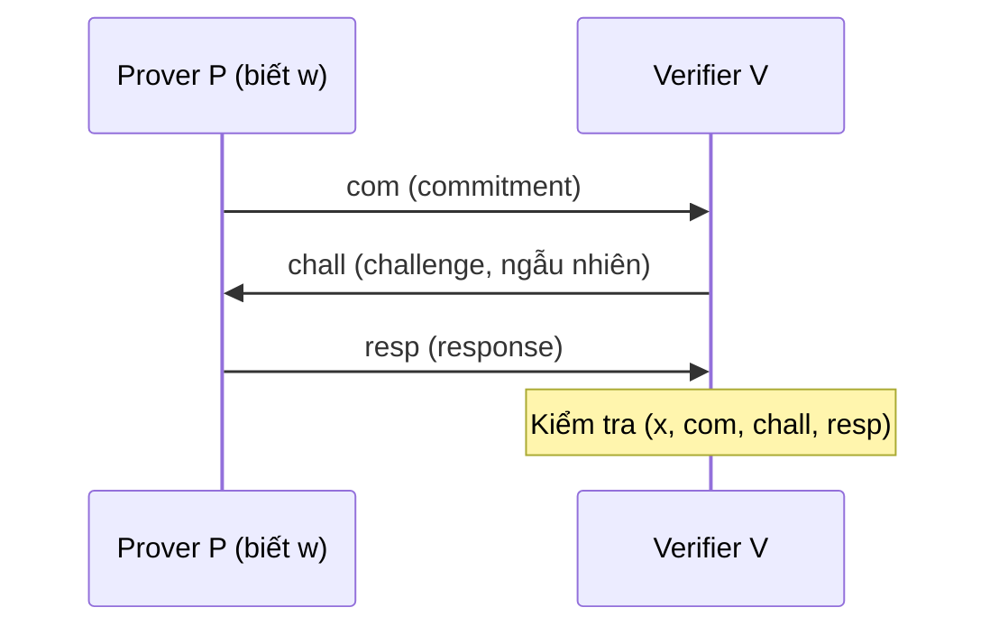
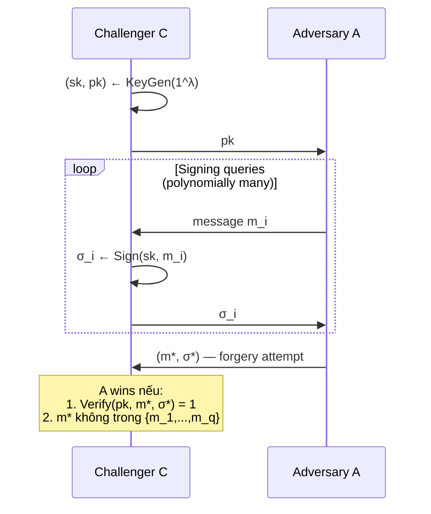

> **Prerequisites**: Deuring Correspondence (xem [[01-supersingular-deuring|01. Supersingular & Deuring]]), lý thuyết xác suất cơ bản, định nghĩa game-based security  
> 🔴 **Prerequisite references**: De Feo, Kohel, Leroux, Petit, Wesolowski — *SQISign* [DKL+20] (full SQIsign framework); Boneh, Shoup — *A Graduate Course in Applied Cryptography* [BS20] (nền tảng security definitions)  
> **Lesson type**: Foundation  
> **Covers**: §2.4 (IdealToIsogeny algorithm), §2.5 (Σ-protocol, HVZK, EUF-CMA definitions)
>
> **Notation** (ký hiệu mới trong bài này):
> | Ký hiệu | Ý nghĩa | Ký hiệu trong paper |
> |---------|---------|---------------------|
> | $\mathsf{IdealToIsogeny}(I, E)$ | Thuật toán chuyển ideal $I$ thành isogeny từ $E$ | $\mathsf{IdealToIsogeny}$ |
> | $\mathsf{nrd}(I)$ | Norm giảm (reduced norm) của ideal $I$ | $\text{nrd}(I)$ |
> | $(P, V)$ | Prover và Verifier trong Σ-protocol | — |
> | $(\mathsf{com}, \mathsf{chall}, \mathsf{resp})$ | Transcript của Σ-protocol | — |
> | $\mathsf{EUF\text{-}CMA}$ | Existential Unforgeability under Chosen Message Attack | EUF-CMA |
> | $\mathsf{PPT}$ | Probabilistic Polynomial-Time (algorithm) | PPT |
> | $\mathsf{negl}(\lambda)$ | Negligible function theo security parameter $\lambda$ | $\mathsf{negl}(\lambda)$ |
> | $\mathcal{A}$ | Adversary (PPT algorithm) | $\mathcal{A}$ |
> | $H$ | Hash function (trong random oracle model hoặc standard model) | $H$ |

---

## Motivation

Lesson trước đã xây dựng Deuring Correspondence — bijection giữa isogeny và quaternion ideal. Bây giờ ta cần hai thứ:

1. **Thuật toán**: Biến ideal thành isogeny một cách hiệu quả (IdealToIsogeny)
2. **Ngôn ngữ bảo mật**: Định nghĩa chính xác các tính chất mà PRISM cần đạt

Lesson này cung cấp cả hai, tạo nền tảng hoàn chỉnh để phân tích protocol PRISM-id ở Lesson 04.

---

## IdealToIsogeny: Từ Ideal sang Isogeny

### Vấn đề và Giải pháp Cũ

Từ Deuring Correspondence, ta biết: mỗi left ideal $I \subset \mathcal{O}$ ứng với một isogeny $\phi_I : E \to E'$. Nhưng **làm sao tính $\phi_I$ cụ thể**?

Thuật toán cũ (SQIsign gốc [DKL+20]) dùng **KLPT algorithm**: tìm ideal $J$ có norm trơn (smooth norm) tương đương với $I$, rồi tính isogeny tương ứng bằng cách chia chuỗi isogenies bậc nhỏ. Nhược điểm: KLPT chậm và yêu cầu $p$ có dạng đặc biệt (sum of smooth twins).

### Higher-Dimensional IdealToIsogeny

Các biến thể SQIsign2D (đặc biệt SQIsign2D-West [6]) đề xuất cách tiếp cận mới dùng **higher-dimensional isogenies** từ SIDH attacks, không cần KLPT:

> [!note] Algorithm 1 — IdealToIsogeny (từ SQIsign2D-West [6])
> **Input**:
> - $I$: left $\mathcal{O}$-ideal với $\text{nrd}(I) = N$ (không nhất thiết phải trơn)
> - $E$: supersingular elliptic curve với $\text{End}(E) \cong \mathcal{O}$ (đã biết)
> - Đủ torsion points trên $E$ để xác định $E[N]$
>
> **Output**:
> - $\phi_I : E \to E'$ isogeny bậc $N$ tương ứng với $I$
>
> **Ý tưởng chính**:
> 1. Dùng Kani's Lemma: viết $N = d_1 + d_2$ với $d_1 = N_{\text{smooth}}$ và $d_2$ là phần còn lại
> 2. Xây dựng $(2,2)$-isogeny (hoặc $(2^a, 2^a)$-isogeny) giữa abelian surfaces
> 3. "Chiếu xuống" (project down) 1 chiều để lấy $\phi_I$
>
> **Chi tiết kỹ thuật**: Kernel của higher-dimensional isogeny được xác định bởi torsion points của $E$ — cụ thể là các điểm $P, Q \in E[N]$ tạo nên $\ker(\phi_I)$.

> [!info] 🟡 IdealToIsogeny trong SQIsign2D-West (từ [6])
> Basso et al. [6] chứng minh rằng thuật toán này chạy trong thời gian **polynomial** theo $\log N$ và $\log p$, không cần norm của $I$ phải trơn. Điều kiện duy nhất: người tính phải biết $\text{End}(E)$ để xây dựng higher-dimensional representation.  
> Trong PRISM, IdealToIsogeny được dùng trong **signing**: prover biết $\text{End}(E_{vk})$ (secret key), do đó có thể chạy thuật toán này để tính isogeny bậc $q$ làm response.
>
> *(theo [6]: Basso et al. — SQIsign2D-West, ASIACRYPT 2024, Algorithm 3)*

### Vì sao Verification không cần IdealToIsogeny?

Verification trong PRISM chỉ cần **kiểm tra** rằng isogeny được cung cấp hợp lệ — không cần tính mới. Điều này thực hiện qua **higher-dimensional representation**: verifier nhận một biểu diễn nhỏ gọn (compact representation) của isogeny và verify tính đúng đắn theo cách khác (xem Lesson 05).

---

## Σ-Protocol (Sigma Protocol)

### Cấu trúc và Ba Tính Chất

Một **Σ-protocol** (Sigma protocol) là giao thức 3 bước giữa Prover $P$ và Verifier $V$, xác thực kiến thức của $P$ về một **witness** $w$ cho statement $x$ trong relation $\mathcal{R} = \{(x, w)\}$:

Ba tính chất bắt buộc:

> [!note] Định nghĩa 2.1 — Ba tính chất của Σ-protocol
>
> **(1) Completeness**: Nếu $P$ biết $w$ hợp lệ, thì $V$ luôn chấp nhận transcript.
>
> **(2) Special Soundness**: Cho hai transcripts $(com, chall_1, resp_1)$ và $(com, chall_2, resp_2)$ với cùng commitment nhưng khác challenge ($chall_1 \neq chall_2$), đều là valid — thì có thể extract $w$ từ hai transcripts này trong thời gian polynomial.
>
> **(3) Honest-Verifier Zero Knowledge (HVZK)**: Tồn tại PPT simulator $\mathsf{Sim}$ mà, khi chỉ biết $x$ (không biết $w$), có thể sinh ra transcript $(com, chall, resp)$ có phân phối giống hệt transcript thật.

> [!tip] 💡 Agent note
> PRISM-id là Σ-protocol trong đó:
> - **Statement** $x$: đường cong elliptic $E_{vk}$ (public key)  
> - **Witness** $w$: endomorphism ring $\text{End}(E_{vk})$ (secret key)  
> - **Relation**: $E_{vk}$ là supersingular curve với endomorphism ring biết trước
>
> Tính chất HVZK của PRISM-id là không trivial vì challenge là một số nguyên tố lớn $q$ — cần dùng **high degree oracle** để simulate (xem Lesson 04 chi tiết).

### Special Soundness và Knowledge Extractor

Special Soundness đảm bảo **Proof of Knowledge**: nếu $P$ có thể pass verification với xác suất không negligible, thì $P$ thực sự biết $w$. Formal hơn:

> [!abstract] Lemma 2.2 — Special Soundness → Proof of Knowledge
> Nếu Σ-protocol thỏa special soundness thì tồn tại PPT extractor $\mathcal{E}$ sao cho: với mọi prover $P^*$ pass verification với xác suất $\epsilon > 1/|\mathsf{ChallSpace}|$, extractor $\mathcal{E}^{P^*}$ tính được $w$ với xác suất tỉ lệ với $\epsilon$.

---

## EUF-CMA: Security Game cho Signature Scheme

### Định nghĩa Scheme Chữ Ký

> [!note] Định nghĩa 2.3 — Digital Signature Scheme
> Một digital signature scheme gồm 3 thuật toán PPT:
>
> **$\mathsf{KeyGen}(1^\lambda)$**
> - Input: security parameter $\lambda$ (unary)
> - Output: $(\mathsf{sk}, \mathsf{pk})$ — cặp khóa bí mật / công khai
>
> **$\mathsf{Sign}(\mathsf{sk}, m)$**
> - Input: secret key $\mathsf{sk}$, message $m \in \{0,1\}^*$
> - Output: signature $\sigma$
>
> **$\mathsf{Verify}(\mathsf{pk}, m, \sigma)$**
> - Input: public key $\mathsf{pk}$, message $m$, signature $\sigma$
> - Output: $1$ (accept) hoặc $0$ (reject)
>
> **Correctness**: $\Pr[\mathsf{Verify}(\mathsf{pk}, m, \mathsf{Sign}(\mathsf{sk}, m)) = 1] = 1$ với mọi $m$.

### Security Game EUF-CMA

> [!note] Định nghĩa 2.4 — EUF-CMA (Definition 4 trong paper)
> **EUF-CMA** (Existential Unforgeability under Chosen Message Attack) được định nghĩa qua game sau giữa Challenger $\mathcal{C}$ và Adversary $\mathcal{A}$:

> Scheme đạt **EUF-CMA** nếu với mọi PPT adversary $\mathcal{A}$:
>
> $$
> \Pr[\mathcal{A} \text{ wins}] \leq \mathsf{negl}(\lambda)
> $$

> [!tip] 💡 Agent note
> **Standard model vs Random Oracle Model (ROM)**: PRISM-sig được chứng minh bảo mật trong **standard model** — tức là không cần giả thiết hash function là random oracle. Đây là điểm mạnh hơn hầu hết các signature scheme dựa trên isogeny trước đó (kể cả SQIsign ban đầu). Lý do PRISM làm được điều này là do dùng **hash-and-sign paradigm** thay vì Fiat-Shamir transform.

### Từ Identification đến Signature: Hash-and-Sign

> [!info] 🟡 Framework Hash-and-Sign (từ [Abdalla+02])
> Abdalla, An, Bellare, Namprempre [Abdalla+02] phát biểu: nếu có một Σ-protocol thỏa **(1) completeness** và **(2) special soundness** mạnh, thì **hash-and-sign paradigm** — dùng hash để xác định challenge từ message và commitment — cho signature scheme EUF-CMA secure trong **standard model** (không cần ROM), dưới giả thiết hash function là collision-resistant.
>
> Cụ thể, trong hash-and-sign:
>
> $$
> \mathsf{Sign}(\mathsf{sk}, m) : \quad \text{tính } (com, resp) \text{ sao cho } chall = H(com, m)
> $$
>
> $$
> \mathsf{Verify}(\mathsf{pk}, m, \sigma) : \quad \text{kiểm tra } chall = H(com, m) \text{ và } (com, chall, resp) \text{ hợp lệ}
> $$
>
> *(theo [Abdalla+02]: Abdalla et al. — From identification to signatures via the Fiat-Shamir transform: minimizing assumptions, EUROCRYPT 2002)*

> [!warning] Phân biệt: Hash-and-Sign vs Fiat-Shamir Transform
> **Fiat-Shamir** (ROM): $chall = H(com \| m)$ với $H$ là random oracle → bảo mật trong ROM  
> **Hash-and-Sign** (standard model): challenge được hash từ commitment + message, nhưng cần thêm yêu cầu về protocol (soundness mạnh hơn) → bảo mật trong standard model  
> PRISM dùng hash-and-sign với hash function $H_{\text{prime}}$ collision-resistant để đạt bảo mật standard model.

---

## Kết Nối Tới PRISM

Sau hai lesson nền tảng, ta có đủ công cụ để phân tích PRISM:

| Thành phần | Nền tảng | Lesson |
|------------|----------|--------|
| Public key = $E_{vk}$, secret key = $\text{End}(E_{vk})$ | Deuring Correspondence | 01 |
| Signing = tính isogeny bậc $q$ | IdealToIsogeny | 02 (bài này) |
| Response compact = higher-dim isogeny | Kani's Lemma | 01 |
| Protocol 3-bước | Σ-protocol framework | 02 (bài này) |
| Bảo mật = EUF-CMA trong standard model | Hash-and-sign paradigm | 02 (bài này) |

---

## Summary

- **IdealToIsogeny** (từ SQIsign2D-West [6]): thuật toán polynomial-time chuyển left ideal thành isogeny, dùng higher-dimensional representation từ Kani's Lemma — không cần smooth norm.
- **Σ-protocol**: 3 bước (com, chall, resp) với 3 tính chất — Completeness, Special Soundness, HVZK.
- **EUF-CMA**: adversary thắng nếu forge được signature trên message chưa query — PRISM-sig đạt tính chất này trong standard model.
- **Hash-and-sign** (theo [Abdalla+02]): chuyển Σ-protocol thành signature bằng $chall = H(com, m)$, đạt EUF-CMA dưới collision-resistance của $H$.

---

## References

- [6] / [Basso+24] Basso et al. — *SQIsign2D-West*, ASIACRYPT 2024 (🟡 IdealToIsogeny algorithm)
- [Abdalla+02] Abdalla, An, Bellare, Namprempre — *From identification to signatures via the Fiat-Shamir transform*, EUROCRYPT 2002 (🟡 Hash-and-sign framework)
- [DKL+20] De Feo, Kohel, Leroux, Petit, Wesolowski — *SQISign*, ASIACRYPT 2020 (🔴 Prerequisite)
- [BS20] Boneh, Shoup — *A Graduate Course in Applied Cryptography* (🔴 Prerequisite)
