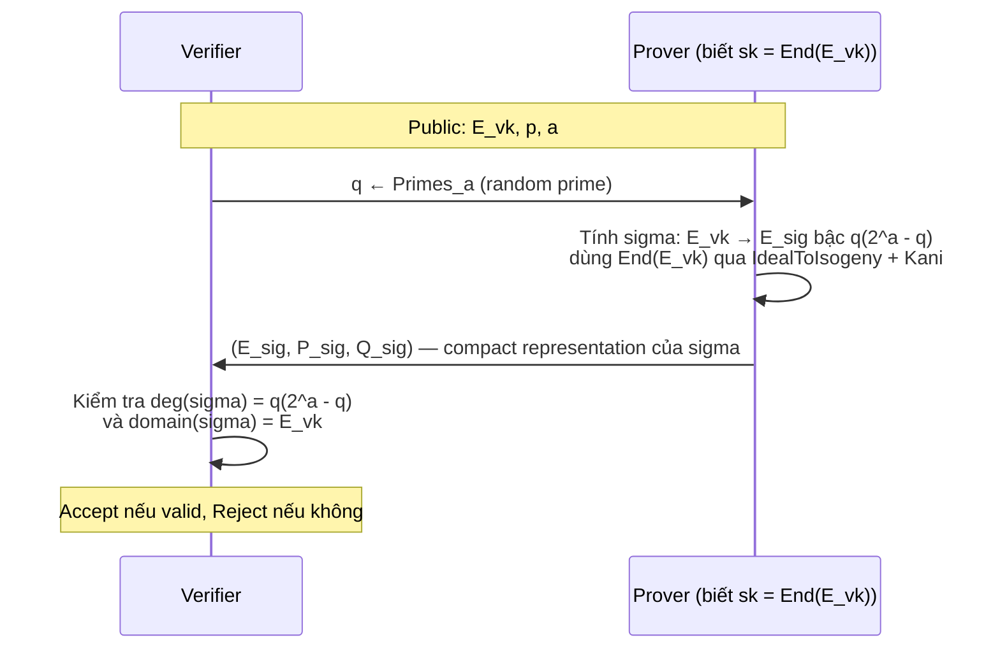
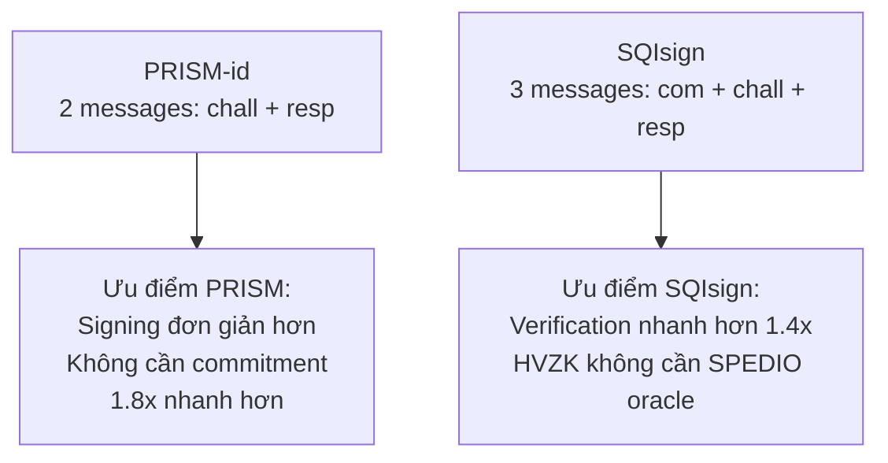

> **Prerequisites**: Supersingular curves, Kani's Lemma, Deuring Correspondence (xem [[01-supersingular-deuring|01. Supersingular & Deuring]]), Σ-protocol, EUF-CMA (xem [[02-ideal-to-isogeny-defs|02. IdealToIsogeny & Defs]]), SPEDIO hardness (xem [[03-spedio-hardness|03. SPEDIO]])  
> 🔴 **Prerequisite references**: De Feo, Kohel, Leroux, Petit, Wesolowski — *SQISign* [DKL+20] (3-message protocol để so sánh)  
> **Lesson type**: Protocol  
> **Covers**: §3.2 (PRISM-id protocol definition, Figure 3), §3.3 (Completeness, Soundness, HVZK), §3.4 (High Degree Oracles và HVZK simulation)
>
> **Notation** (ký hiệu mới trong bài này):
> | Ký hiệu | Ý nghĩa | Ký hiệu trong paper |
> |---------|---------|---------------------|
> | $E_0, \mathcal{O}_0$ | Đường cong và order khởi đầu với endomorphism ring biết trước | $E_0, \mathcal{O}_0$ |
> | $\phi_{\mathsf{sk}} : E_0 \to E_{vk}$ | Secret key — isogeny ngẫu nhiên từ $E_0$ | $\phi_{\mathsf{sk}}$ |
> | $\sigma : E_{vk} \to E_{\mathsf{sig}}$ | Isogeny response bậc $q(2^a - q)$ | $\sigma$ |
> | $E_{\mathsf{sig}}$ | Codomain curve của isogeny response | $E_{\mathsf{sig}}$ |
> | $(P_{\mathsf{sig}}, Q_{\mathsf{sig}})$ | Compact representation của $\sigma$ qua kernel generators | $P_{\mathsf{sig}}, Q_{\mathsf{sig}}$ |
> | $\mathsf{SPEDIO}(E, q)$ | SPEDIO oracle: trả về random isogeny bậc $q(2^a-q)$ từ $E$ | Definition 5 |
> | $a$ | Bit-length của challenge prime $q$ (security parameter phụ) | $a$ |

---

## Motivation: Tại sao PRISM-id Đơn Giản Hơn SQIsign?

SQIsign — người tiền nhiệm nổi tiếng — dùng một **3-message Σ-protocol**:

1. Prover gửi **commitment** $E_{\mathsf{com}}$ (curve ngẫu nhiên)
2. Verifier gửi **challenge** $\phi_{\mathsf{chall}} : E_{vk} \to E_{\mathsf{chall}}$ (isogeny ngẫu nhiên)
3. Prover gửi **response** $\sigma_{\mathsf{resp}} : E_{\mathsf{com}} \to E_{\mathsf{chall}}$

Cấu trúc này phức tạp vì: prover cần tính response thỏa sơ đồ giao hoán, yêu cầu KLPT (chậm) hoặc higher-dimensional isogeny phức tạp.

PRISM-id rũ bỏ commitment hoàn toàn:

> **Core insight**: Public key $E_{vk}$ tự nó đóng vai trò commitment cố định. Challenge là số nguyên tố $q$, response là isogeny từ $E_{vk}$ bậc $q(2^a-q)$.

Kết quả: **2-round protocol** với signing đơn giản hơn ~1.8× so với SQIsign.

---

## Setup và Key Generation

### Tham Số Hệ Thống

Trước khi mô tả protocol, ta cần tham số công khai:

- $p \equiv 3 \pmod{4}$: số nguyên tố đặc trưng
- $a$: bit-length của challenge prime, chọn sao cho $2^a \approx p^{1/2}$ (security balance)
- $E_0$: đường cong supersingular **khởi đầu** (starting curve) với endomorphism ring $\mathcal{O}_0 = \text{End}(E_0)$ **đã biết công khai**
- $\mathsf{Primes}_a$: tập số nguyên tố có đúng $a$ bit

> [!note] Algorithm 4.1 — PRISM-id KeyGen
> **Input**: tham số hệ thống $(p, a, E_0, \mathcal{O}_0)$
>
> **Output**: $(\mathsf{sk}, \mathsf{pk})$
>
> **$\mathsf{KeyGen}$**:
> 1. Chọn ngẫu nhiên isogeny $\phi_{\mathsf{sk}} : E_0 \to E_{vk}$ (random walk trong isogeny graph từ $E_0$)
> 2. Tính $\mathcal{O}_{vk} = \text{End}(E_{vk})$ via Deuring Correspondence từ $\mathcal{O}_0$ và $\phi_{\mathsf{sk}}$
> 3. Trả về $\mathsf{sk} = \mathcal{O}_{vk}$, $\mathsf{pk} = E_{vk}$

**Ý nghĩa trapdoor**: ai biết $\mathsf{sk} = \mathcal{O}_{vk} = \text{End}(E_{vk})$ có thể chạy IdealToIsogeny để tính isogeny từ $E_{vk}$ ra bất kỳ hướng nào. Không có $\mathsf{sk}$, bài toán SPEDIO là khó.

---

## PRISM-id: Giao Thức Hai Vòng

### Luồng Giao Thức (Figure 3)

### Mô Tả Chính Thức

> [!note] Protocol 4.2 — PRISM-id (Figure 3)
> **Participants**: Prover $P$ biết $\mathsf{sk} = \text{End}(E_{vk})$; Verifier $V$ biết $\mathsf{pk} = E_{vk}$
>
> **Round 1 — Challenge** ($V \to P$):
> - $V$ chọn $q \xleftarrow{R} \mathsf{Primes}_a$
> - $V$ gửi $q$ cho $P$
>
> **Round 2 — Response** ($P \to V$):
> - $P$ tính isogeny $\sigma : E_{vk} \to E_{\mathsf{sig}}$ bậc $q(2^a - q)$, dùng $\text{End}(E_{vk})$:
>   - Viết $\sigma = \phi_q \circ \phi_{q'} = \psi_{q'} \circ \psi_q$ với $\deg(\psi_q) = \deg(\phi_q) = q$ và $\deg(\psi_{q'}) = \deg(\phi_{q'}) = 2^a - q$
>   - Dùng Kani's Lemma (Theorem 1): nhúng vào $(2,2)$-isogeny để tính compact representation
> - $P$ gửi $(E_{\mathsf{sig}}, P_{\mathsf{sig}}, Q_{\mathsf{sig}})$ — trong đó $P_{\mathsf{sig}}, Q_{\mathsf{sig}} \in E_{\mathsf{sig}}[2^a]$ là kernel generators của phần trơn
>
> **Verification**:
> - $V$ kiểm tra: $(P_{\mathsf{sig}}, Q_{\mathsf{sig}})$ interpolate một isogeny bậc $q(2^a - q)$ từ $E_{vk}$ về $E_{\mathsf{sig}}$
> - Cụ thể: verify rằng isogeny xác định bởi $(P_{\mathsf{sig}}, Q_{\mathsf{sig}})$ có codomain $E_{\mathsf{sig}}$ và domain $E_{vk}$ với degree $q(2^a - q)$

### Compact Representation: Tại sao bậc $q(2^a - q)$?

> [!tip] 💡 Agent note
> Ta không truyền isogeny bậc $q$ trực tiếp mà truyền isogeny bậc $q(2^a - q)$ vì lý do sau:
>
> Kani's Lemma yêu cầu $N = d_1 + d_2$ với $d_1 = q$ và $d_2 = 2^a - q$. Tổng $N = 2^a$ là lũy thừa của 2 — **smooth** (trơn). Điều này cho phép:
> 1. **Prover**: tính higher-dimensional isogeny bậc $2^a$ (smooth degree) giữa abelian surfaces
> 2. **Verifier**: verify qua kernel generators $(P_{\mathsf{sig}}, Q_{\mathsf{sig}}) \in E_{\mathsf{sig}}[2^a]$ — các điểm nằm trên $\mathbb{F}_{p^2}$-rational torsion
>
> Biết $q$ thì biết $2^a - q$, nên từ isogeny bậc $q(2^a-q)$ ta extract được isogeny bậc $q$.

### Kích Thước Signature

Compact representation $(E_{\mathsf{sig}}, P_{\mathsf{sig}}, Q_{\mathsf{sig}})$ gồm:
- $E_{\mathsf{sig}}$: xác định qua $P_{\mathsf{sig}}$ (dùng Montgomery curve) → **0 extra bits**
- $P_{\mathsf{sig}} \in E_{\mathsf{sig}}(\mathbb{F}_{p^2})$: tọa độ $x$ → **$2 \log p$ bits** = $4\lambda$ bits (vì $\log p = 2\lambda$)
- $Q_{\mathsf{sig}}$: tọa độ $x$ + 1 sign bit → **$2\log p + 1$ bits** ≈ $4\lambda$ bits

**Tổng**: $\approx 8\lambda$ bits cho public key + signature ≈ **~1500 bytes** ở NIST Level I ($\lambda = 128$).

---

## Ba Tính Chất Bảo Mật

### 1. Completeness

> [!abstract] Theorem 4.3 — Completeness
> Nếu $P$ biết $\mathsf{sk} = \text{End}(E_{vk})$, thì với mọi $q \in \mathsf{Primes}_a$, prover có thể tính một response hợp lệ và verifier luôn chấp nhận.

**Proof sketch**: Biết $\text{End}(E_{vk})$, prover chạy IdealToIsogeny (từ SQIsign2D-West [6]) để tính isogeny bậc $q(2^a-q)$ từ $E_{vk}$. Điều này được đảm bảo bởi Deuring Correspondence và Kani embedding. Verification pass vì isogeny construction đúng bởi construction. $\square$

### 2. Soundness (Đặc Biệt Mạnh)

> [!abstract] Theorem 4.4 — Special Soundness của PRISM-id
> Soundness error của PRISM-id bằng $1/|\mathsf{Primes}_a|$ — **negligible** theo $a$ (và do đó theo $\lambda$).
>
> Cụ thể: nếu adversary $\mathcal{A}$ có thể tạo valid response cho một fraction non-negligible các challenge $q \in \mathsf{Primes}_a$, thì $\mathcal{A}$ solve được SPEDIO.

> [!tip] 💡 Agent note
> Đây là điểm then chốt phân biệt PRISM với các scheme dựa trên **isogeny group actions** (CSIDH, CSI-FiSh). Trong các scheme đó, soundness error là $1/2$ — yêu cầu lặp lại protocol $O(\lambda)$ lần để đạt bảo mật, gây overhead lớn. PRISM có soundness error **negligible** ngay từ một lần chạy — không cần lặp.
>
> Lý do soundness error nhỏ: challenge space $|\mathsf{Primes}_a| \approx 2^{a-1}/a$ — exponentially large.

**So sánh soundness errors:**

| Scheme | Challenge space | Soundness error | Lần lặp cần thiết |
|--------|----------------|-----------------|-------------------|
| SQIsign | Isogenies bậc $D$ smooth | $\mathsf{negl}(\lambda)$ | 1 |
| **PRISM-id** | $\mathsf{Primes}_a$ | $1/|\mathsf{Primes}_a| = \mathsf{negl}(\lambda)$ | **1** |
| CSI-FiSh cơ bản | $\{0, 1\}$ | $1/2$ | $O(\lambda)$ |

### 3. HVZK và High Degree Oracle

Đây là tính chất tinh tế nhất. HVZK yêu cầu: simulator $\mathsf{Sim}$, không biết $\mathsf{sk} = \text{End}(E_{vk})$, có thể tạo transcript $(q, \sigma)$ có phân phối giống hệt transcript thật.

**Vấn đề**: Để tạo valid response $\sigma : E_{vk} \to E_{\mathsf{sig}}$ bậc $q(2^a-q)$ mà không biết $\text{End}(E_{vk})$, cần một oracle đặc biệt.

> [!note] Definition 5 — SPEDIO Oracle (Đặc biệt quan trọng)
> Một **Special Degree Isogeny Oracle (SPEDIO)** là oracle nhận:
> - Input: đường cong supersingular $E$ trên $\mathbb{F}_{p^2}$ và prime $q \in \mathsf{Primes}_a$
> - Output: **uniformly random cyclic isogeny** bậc $q(2^a - q)$ từ $E$
>
> Simulator $\mathsf{Sim}$ được phép dùng oracle SPEDIO trong HVZK simulation.

> [!abstract] Theorem 4.5 — HVZK của PRISM-id
> PRISM-id đạt **Honest-Verifier Zero Knowledge** trong presence của SPEDIO oracle: simulator $\mathsf{Sim}^{\mathsf{SPEDIO}}$ có thể tạo transcript $(q, \sigma)$ với phân phối giống hệt transcript thật, mà không cần biết $\mathsf{sk}$.
>
> **Proof sketch**: Simulator thực hiện:
> 1. Chọn $q \xleftarrow{R} \mathsf{Primes}_a$
> 2. Gọi $\mathsf{SPEDIO}(E_{vk}, q)$ để lấy $\sigma : E_{vk} \to E_{\mathsf{sig}}$ bậc $q(2^a - q)$
> 3. Output transcript $(q, \mathsf{compact}(\sigma))$
>
> Tính phân phối uniform của SPEDIO oracle đảm bảo transcript có phân phối giống hệt transcript thật. $\square$

> [!warning] Tại sao cần SPEDIO oracle?
> Trong SQIsign, HVZK simulation dễ hơn vì challenge là isogeny bậc trơn — simulator có thể chọn ngẫu nhiên đường đi trong isogeny graph. Trong PRISM, challenge là số nguyên tố lớn $q$, và không có thuật toán hiệu quả nào tính isogeny bậc $q$ mà không biết $\text{End}(E_{vk})$.
>
> Do đó HVZK của PRISM-id yêu cầu **idealize** SPEDIO thành một oracle. Tính chất bảo mật này là **computational** (dựa trên hardness của SPEDIO), không phải information-theoretic.

---

## So Sánh Với SQIsign

| Aspect | PRISM-id | SQIsign |
|--------|----------|---------|
| Số messages | 2 (chall + resp) | 3 (com + chall + resp) |
| Commitment | Không có | Có ($E_{\mathsf{com}}$) |
| Signing | IdealToIsogeny từ $E_{vk}$ | IdealToIsogeny phức tạp hơn |
| Verification | Cần check bậc $q(2^a-q)$ | Kiểm tra sơ đồ giao hoán |
| HVZK | Cần SPEDIO oracle | Không cần oracle đặc biệt |
| Soundness error | $1/|\mathsf{Primes}_a|$ | $1/|\text{challenge space}|$ |

---

## Summary

- **PRISM-id** là **two-round protocol** (không có commitment): verifier gửi prime $q$, prover trả về compact isogeny $\sigma : E_{vk} \to E_{\mathsf{sig}}$ bậc $q(2^a - q)$.
- **Secret key** = $\text{End}(E_{vk})$ là trapdoor; **Public key** = $E_{vk}$ là "commitment cố định."
- Bậc $q(2^a - q)$: dùng Kani embedding với $d_1 = q$, $d_2 = 2^a - q$, $N = 2^a$ smooth.
- **Soundness error negligible**: $1/|\mathsf{Primes}_a|$ — không cần lặp protocol.
- **HVZK với SPEDIO oracle**: simulator dùng SPEDIO để tạo transcript giả mà không cần secret key.

---

## References

- [6] / [Basso+24] Basso et al. — *SQIsign2D-West*, ASIACRYPT 2024 (🟡 IdealToIsogeny, higher-dim representation)
- [BDLLS20] Bernstein, De Feo, Leroux, Smith — *Faster computation of isogenies of large prime degree*, ANTS 2020 (🟡 verification algorithm cho degree-q isogeny)
- [DKL+20] De Feo, Kohel, Leroux, Petit, Wesolowski — *SQISign*, ASIACRYPT 2020 (🔴 Prerequisite, so sánh)
- [Fouotsa25] Fouotsa — *WaterSQI and PRISMO*, ePrint 2025/1737 (⚪ variant của PRISM)
