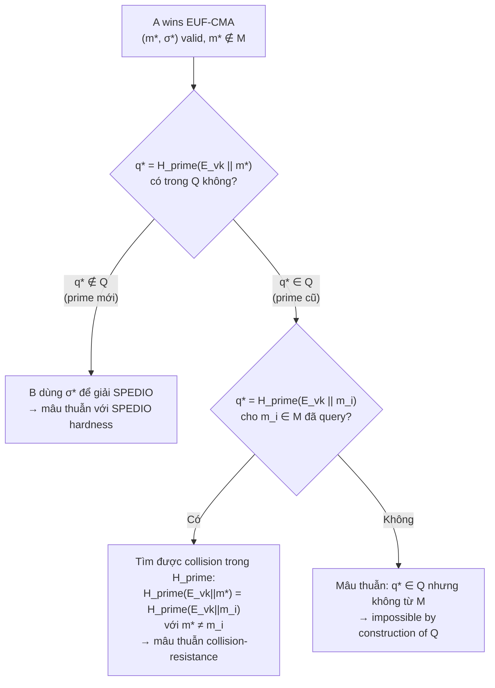
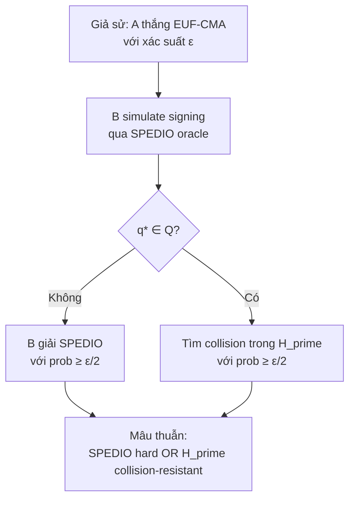

> **Prerequisites**: PRISM-sig scheme (xem [[05-prism-sig-scheme|05. PRISM-sig]]), SPEDIO hardness assumption (xem [[03-spedio-hardness|03. SPEDIO]]), EUF-CMA game (xem [[02-ideal-to-isogeny-defs|02. IdealToIsogeny & Defs]])  
> 🔴 **Prerequisite references**: Boneh, Shoup — *A Graduate Course in Applied Cryptography* [BS20] (reduction-based proofs)  
> **Lesson type**: Deep Dive  
> **Covers**: §4.3 (Proposition 2, Figure 6 — reduction từ EUF-CMA adversary sang SPEDIO solver), §4 (game-based proof, collision argument)
>
> **Notation** (ký hiệu mới trong bài này):
> | Ký hiệu | Ý nghĩa | Ký hiệu trong paper |
> |---------|---------|---------------------|
> | $\mathcal{A}$ | PPT adversary tấn công EUF-CMA của PRISM-sig | $\mathcal{A}$ |
> | $\mathcal{B}$ | PPT algorithm giải SPEDIO, dùng $\mathcal{A}$ như subroutine | $\mathcal{B}$ |
> | $M$ | Tập các message đã được $\mathcal{A}$ query signing | $M$ |
> | $Q$ | Tập các prime $q = H_{\mathsf{prime}}(E_{vk} \| m)$ đã được phát hành | $Q$ |
> | $(m^*, \sigma^*)$ | Forgery của $\mathcal{A}$ — output cuối cùng | $(m^*, \sigma^*)$ |
> | $q^*$ | Challenge prime ứng với forgery: $q^* = H_{\mathsf{prime}}(E_{vk} \| m^*)$ | $q^*$ |
> | $G_{\mathsf{pdeg}}$ | Security game SPEDIO — "prime degree isogeny game" | $G_{\mathsf{pdeg}}$ |

---

## Mục Tiêu Của Lesson

Lesson này trả lời câu hỏi then chốt:

> **Tại sao PRISM-sig an toàn?**

Cụ thể, ta sẽ chứng minh:

> Nếu $H_{\mathsf{prime}}$ collision-resistant **và** SPEDIO là hard, thì không có PPT adversary nào forge được PRISM-sig signature với xác suất non-negligible.

Cấu trúc proof là **reduction**: giả sử tồn tại adversary $\mathcal{A}$ phá PRISM-sig, ta xây dựng algorithm $\mathcal{B}$ giải SPEDIO — mâu thuẫn với hardness assumption.

---

## Phát Biểu Chính Thức

> [!abstract] Proposition 2 — EUF-CMA Security của PRISM-sig (§4.3)
> Nếu:
> - $H_{\mathsf{prime}}$ là collision-resistant cryptographic hash function, **và**
> - Problem 2 (SPEDIO) là hard
>
> thì PRISM-sig đạt **EUF-CMA** (Definition 4): với mọi PPT adversary $\mathcal{A}$,
>
> $$
> \Pr[\mathcal{A} \text{ wins EUF-CMA game}] \leq \mathsf{negl}(\lambda)
> $$

---

## Chiến Lược Proof: Phân Tích Hai Trường Hợp

Giả sử $\mathcal{A}$ thắng EUF-CMA — tức là $\mathcal{A}$ output forgery $(m^*, \sigma^*)$ với:
- $\mathsf{Verify}(E_{vk}, m^*, \sigma^*) = 1$
- $m^* \notin M$ (message chưa được query)

Tính $q^* = H_{\mathsf{prime}}(E_{vk} \| m^*)$. Có hai trường hợp:

Cả hai trường hợp đều dẫn đến mâu thuẫn → $\mathcal{A}$ không thể thắng với xác suất non-negligible. $\blacksquare$

---

## Reduction Algorithm $\mathcal{B}$ (Figure 6)

Ta xây dựng $\mathcal{B}$ giải SPEDIO dùng $\mathcal{A}$ như oracle:

> [!note] Algorithm 6.1 — Reduction $\mathcal{B}$ (Figure 6)
> **Input**: $(E_{vk})$ — random supersingular curve (SPEDIO challenge)  
> **Goal**: output isogeny bậc $q'(2^a - q')$ từ $E_{vk}$ cho prime $q'$ chưa được SPEDIO phát hành
>
> **Setup**:
> - Gửi $\mathsf{pk} = E_{vk}$ cho $\mathcal{A}$
> - Khởi tạo: $M \leftarrow \emptyset$ (tập messages đã query), $Q \leftarrow \emptyset$ (tập primes đã phát hành)
>
> **Simulating signing queries** (khi $\mathcal{A}$ query $\mathsf{Sign}(m_i)$):
> 1. Tính $q_i = H_{\mathsf{prime}}(E_{vk} \| m_i)$
> 2. Thêm $m_i$ vào $M$, thêm $q_i$ vào $Q$
> 3. Gọi oracle $\mathsf{SPEDIO}(E_{vk}, q_i)$ để lấy $\sigma_i : E_{vk} \to E_i$ bậc $q_i(2^a - q_i)$
> 4. Trả về $\sigma_i$ cho $\mathcal{A}$  (đây là valid signature vì có cùng degree và domain như PRISM-sig sẽ tạo)
>
> **Khi $\mathcal{A}$ output forgery $(m^*, \sigma^*)$**:
> 1. **Assert**: $\mathsf{Verify}(E_{vk}, m^*, \sigma^*) = 1$ (forgery hợp lệ)
> 2. **Assert**: $m^* \notin M$ (message mới)
> 3. Tính $q^* = H_{\mathsf{prime}}(E_{vk} \| m^*)$
> 4. **If** $q^* \notin Q$: trả về $\sigma^*$ như **solution cho SPEDIO** với prime $q^*$
> 5. **Else** ($q^* \in Q$): trả về **collision** trong $H_{\mathsf{prime}}$: tìm $m_i \in M$ với $H_{\mathsf{prime}}(E_{vk} \| m_i) = q^*$ nhưng $m_i \neq m^*$

---

## Phân Tích Correctness của Reduction

### Trường Hợp 1: $q^* \notin Q$

$\sigma^*$ là valid signature — tức là nó là **compact representation của một isogeny $E_{vk} \to E_{\mathsf{sig}}^*$ bậc $q^*(2^a - q^*)$** với $q^* \in \mathsf{Primes}_a$.

Vì $q^* \notin Q$, đây là isogeny của **prime degree chưa từng được SPEDIO phát hành** — đúng là solution của SPEDIO (Problem 2).

> [!tip] 💡 Agent note — Tại sao injectivity của degree quan trọng?
> Paper chứng minh: với mọi $q \in \mathsf{Primes}_a$, ta có $q > 2^a - q$ (vì $q > 2^{a-1}$). Suy ra với $q \neq q' \in \mathsf{Primes}_a$:
>
> $$
> q(2^a - q) \neq q'(2^a - q')
> $$
>
> **Lý do**: nếu $q(2^a - q) = q'(2^a - q')$ thì do cả hai vế đều chia hết cho $q$ và $q'$ là nguyên tố, phải có $q = q'$ — mâu thuẫn. Tính chất này đảm bảo: từ $\sigma^*$ bậc $q^*(2^a - q^*)$, verifier (và $\mathcal{B}$) có thể **xác định duy nhất** $q^*$ là prime component.

### Trường Hợp 2: $q^* \in Q$

$q^* \in Q$ nghĩa là tồn tại $m_i \in M$ với $H_{\mathsf{prime}}(E_{vk} \| m_i) = q^*$.

Nhưng $m^* \notin M$ nên $m^* \neq m_i$. Kết hợp:

$$
H_{\mathsf{prime}}(E_{vk} \| m^*) = q^* = H_{\mathsf{prime}}(E_{vk} \| m_i), \quad m^* \neq m_i
$$

Đây là **collision trong $H_{\mathsf{prime}}$** — mâu thuẫn với collision-resistance.

### Kết Luận

$$
\Pr[\mathcal{A} \text{ wins}] \leq \Pr[\mathcal{B} \text{ solves SPEDIO}] + \Pr[\text{collision in } H_{\mathsf{prime}}]
$$

Nếu SPEDIO hard và $H_{\mathsf{prime}}$ collision-resistant, cả hai xác suất đều negligible. $\blacksquare$

---

## Tại sao Standard Model, không phải ROM?

Proof trên **không dùng** random oracle. $H_{\mathsf{prime}}$ chỉ cần **collision-resistant** — property tiêu chuẩn, không cần giả thiết $H_{\mathsf{prime}}$ là truly random.

So sánh với Fiat-Shamir approach (dùng trong nhiều scheme khác):

| Property | Fiat-Shamir (ROM) | Hash-and-Sign (Standard) |
|----------|-------------------|--------------------------|
| $H$ cần gì? | Random oracle | Collision-resistant |
| Adversary query $H$? | Có thể query | Chỉ evaluate |
| Security model | ROM (weaker) | Standard (stronger) |
| Dùng trong PRISM? | Không | **Có** |

> [!warning] Lưu ý quan trọng về HVZK
> Proof của Proposition 2 dùng SPEDIO oracle để **simulate signing queries** trong reduction. Đây là lý do ta cần HVZK của PRISM-id trong presence của SPEDIO oracle (Lesson 04): nếu HVZK không đạt được ngay cả với SPEDIO oracle, thì $\mathcal{B}$ không thể simulate signing trung thực cho $\mathcal{A}$.
>
> Tóm tắt: HVZK của PRISM-id là điều kiện cần cho reduction của Proposition 2 chạy được.

---

## Tính Chặt Chẽ Của Reduction (Tightness)

> [!abstract] Remark 6.2 — Tightness
> Reduction từ $\mathcal{A}$ sang SPEDIO là **tight**: nếu $\mathcal{A}$ thắng EUF-CMA với xác suất $\epsilon$, thì hoặc $\mathcal{B}$ giải SPEDIO với xác suất $\geq \epsilon - \delta$, hoặc tìm được collision trong $H_{\mathsf{prime}}$ với xác suất $\geq \delta$. Không có loss factor polynomial (ví dụ như trong ROM proof với rewinding).

Đây là điểm mạnh thực tế: **không cần tăng tham số** để bù overhead từ reduction.

---

## Tóm Tắt Proof

---

## Summary

- **Proposition 2**: PRISM-sig là EUF-CMA secure dưới SPEDIO hardness + collision-resistance của $H_{\mathsf{prime}}$.
- **Reduction**: Cho adversary $\mathcal{A}$ forge signature, $\mathcal{B}$ simulate signing queries bằng SPEDIO oracle và dùng forgery để giải SPEDIO.
- **Hai trường hợp**: $q^* \notin Q$ → SPEDIO solution; $q^* \in Q$ → collision trong $H_{\mathsf{prime}}$.
- **Key lemma**: injectivity của map $q \mapsto q(2^a-q)$ trên $\mathsf{Primes}_a$ — đảm bảo degree xác định duy nhất prime.
- **Standard model**: proof không dùng random oracle — chỉ cần collision-resistance.
- **Tight reduction**: không có polynomial loss factor.

---

## References

- [Abdalla+02] Abdalla, An, Bellare, Namprempre — *From identification to signatures via the Fiat-Shamir transform*, EUROCRYPT 2002 (🟡 framework EUF-CMA từ identification)
- [BS20] Boneh, Shoup — *A Graduate Course in Applied Cryptography* (🔴 Prerequisite — reduction-based proofs)
