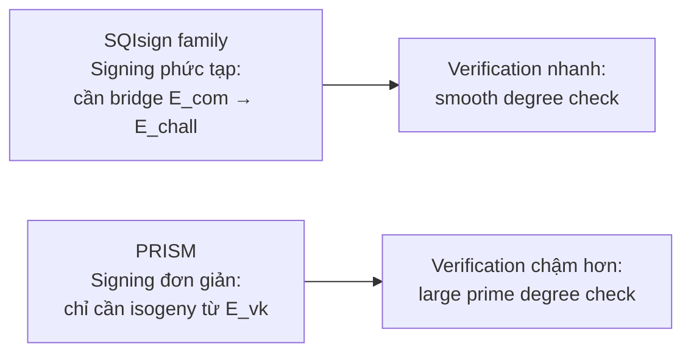

> **Prerequisites**: PRISM-id protocol (xem [[04-prism-id-protocol|04. PRISM-id]]), PRISM-sig scheme (xem [[05-prism-sig-scheme|05. PRISM-sig]])  
> 🔴 **Prerequisite references**: De Feo, Kohel, Leroux, Petit, Wesolowski — *SQISign* [DKL+20]; Basso et al. — *SQIsign2D-West* [6]; Dartois et al. — *SQISignHD* [28]  
> **Lesson type**: Deep Dive (Appendix)  
> **Covers**: Appendix A.1 — fine-grained comparison PRISM-id với SQIsign và các biến thể; thiết kế choices và trade-offs
>
> **Notation**: Sử dụng notation đã thiết lập trong các lesson trước. Không có ký hiệu mới.

---

## Mục Tiêu

Appendix này trả lời câu hỏi:

> **PRISM-id/PRISM-sig khác SQIsign và các biến thể của nó ở điểm nào cụ thể? Tại sao những khác biệt đó dẫn đến signing nhanh hơn nhưng verification chậm hơn?**

Đây là nội dung của Appendix A.1 trong paper gốc — một phân tích kỹ thuật fine-grained mà body paper chỉ đề cập tóm tắt.

---

## Cấu Trúc Chung Của SQIsign-Family

Tất cả các scheme trong SQIsign family đều dựa trên cùng một Σ-protocol template:

> [!note] Template chung — SQIsign-family Σ-protocol
>
> **Setup**: Public parameters $(E_0, \mathcal{O}_0)$ với $\mathcal{O}_0 = \text{End}(E_0)$ biết công khai
>
> **Key**: $\mathsf{sk}$ = isogeny $\phi_{\mathsf{sk}} : E_0 \to E_{vk}$; $\mathsf{pk}$ = $E_{vk}$
>
> **Protocol 3-bước** (SQIsign gốc):
> 1. **Commitment**: Prover chọn random isogeny $\psi_{\mathsf{com}} : E_0 \to E_{\mathsf{com}}$ và gửi $E_{\mathsf{com}}$
> 2. **Challenge**: Verifier gửi isogeny $\phi_{\mathsf{chall}} : E_{vk} \to E_{\mathsf{chall}}$ (bậc smooth)
> 3. **Response**: Prover tính và gửi $\sigma_{\mathsf{resp}} : E_{\mathsf{com}} \to E_{\mathsf{chall}}$
>
> Verifier check: $\sigma_{\mathsf{resp}}$ có đúng domain $E_{\mathsf{com}}$ và codomain $E_{\mathsf{chall}}$ không?

PRISM **phá vỡ** template này bằng cách bỏ bước commitment.

---

## So Sánh Chi Tiết: Response Computation

Điểm khó nhất trong tất cả các scheme là **tính response isogeny**. Dưới đây là so sánh từng scheme:

### SQIsign Gốc [DKL+20]

Prover cần tính $\sigma_{\mathsf{resp}} : E_{\mathsf{com}} \to E_{\mathsf{chall}}$ sao cho sơ đồ sau giao hoán:

$$
\sigma_{\mathsf{resp}} \circ \psi_{\mathsf{com}} = \phi_{\mathsf{chall}} \circ \phi_{\mathsf{sk}}
$$

Bước này yêu cầu **KLPT algorithm**: tìm ideal $J$ với smooth norm tương đương với ideal của composition. Rất chậm.

### SQIsign2D-West [6] / SQIsignHD [28]

Cải tiến: dùng higher-dimensional isogenies (Kani) để không cần smooth norm trong KLPT. Response $\sigma_{\mathsf{resp}}$ vẫn cần thỏa sơ đồ giao hoán, nhưng tính hiệu quả hơn qua Kani embedding.

Vẫn cần commitment $E_{\mathsf{com}}$ → still 3-message.

### PRISM-id / PRISM-sig

> [!note] Core Difference — Không Có Commitment
> Trong PRISM, **không có commitment** $E_{\mathsf{com}}$. Challenge là số nguyên tố $q$ (không phải isogeny). Response là isogeny **thẳng từ $E_{vk}$**:
>
> $$
> \sigma : E_{vk} \to E_{\mathsf{sig}}, \quad \deg(\sigma) = q(2^a - q)
> $$
>
> Không có sơ đồ giao hoán cần thỏa. Prover chỉ cần: "tính **một** isogeny bậc $q(2^a-q)$ từ $E_{vk}$" — dùng $\text{End}(E_{vk})$ qua IdealToIsogeny.

---

## Tại sao Bỏ Commitment Được?

Câu hỏi tự nhiên: commitment trong SQIsign có vai trò gì? Tại sao PRISM không cần nó?

Trong SQIsign, commitment $E_{\mathsf{com}}$ là nguồn gốc của **zero-knowledge**: prover "randomize" response bằng cách chọn commitment ngẫu nhiên, đảm bảo adversary không học được gì về $\phi_{\mathsf{sk}}$ từ response.

PRISM đạt zero-knowledge theo cách khác:

> [!tip] 💡 Agent note — ZK không cần commitment
> Trong PRISM-id, response $\sigma : E_{vk} \to E_{\mathsf{sig}}$ **không tiết lộ $\text{End}(E_{vk})$** vì có nhiều isogeny bậc $q(2^a-q)$ từ $E_{vk}$ — prover chọn **một** trong số đó. Verifier không biết prover chọn isogeny cụ thể nào, chỉ biết degree và domain/codomain.
>
> HVZK được đảm bảo bởi SPEDIO oracle (Lesson 04): simulator có thể tạo random isogeny bậc $q(2^a-q)$ từ $E_{vk}$ mà không cần biết $\text{End}(E_{vk})$. Đây là tương đương chức năng của commitment-randomization trong SQIsign.

---

## Bảng So Sánh Toàn Diện

| Aspect | SQIsign [DKL+20] | SQIsign2D-West [6] | SQIsignHD [28] | **PRISM-id** |
|--------|-----------------|-------------------|----------------|--------------|
| **Messages** | 3 | 3 | 3 | **2** |
| **Commitment** | Có ($E_{\mathsf{com}}$) | Có | Có | **Không** |
| **Challenge type** | Isogeny (smooth degree) | Isogeny (smooth degree) | Isogeny (smooth degree) | **Prime number $q$** |
| **Response** | $\sigma : E_{\mathsf{com}} \to E_{\mathsf{chall}}$ | $\sigma : E_{\mathsf{com}} \to E_{\mathsf{chall}}$ | $\sigma : E_{\mathsf{com}} \to E_{\mathsf{chall}}$ | **$\sigma : E_{vk} \to E_{\mathsf{sig}}$** |
| **Response computation** | KLPT (chậm) | Kani HD (faster) | Kani HD (4D) | **Kani HD (2D, no KLPT)** |
| **ZK mechanism** | Random commitment | Random commitment | Random commitment | **SPEDIO oracle** |
| **Security model** | Heuristic ROM | Heuristic ROM | Heuristic ROM | **Standard model** |
| **Signing speed** | Rất chậm | ~1.8× PRISM | — | **Fastest** |
| **Verification speed** | Nhanh hơn PRISM | **Nhanh hơn PRISM** | — | 1.4× chậm hơn SQIsign2D-W |
| **pk + sig size** | ~241 bytes | ~212 bytes | ~190 bytes | **~97 bytes** |
| **Design complexity** | Rất phức tạp | Phức tạp | Phức tạp | **Đơn giản** |

---

## Phân Tích: Challenge Design

Đây là điểm khác biệt sâu sắc nhất.

**Trong SQIsign**: Challenge là isogeny $\phi_{\mathsf{chall}} : E_{vk} \to E_{\mathsf{chall}}$ của smooth degree. Prover nhận một "endpoint" cụ thể $E_{\mathsf{chall}}$ và phải build bridge từ $E_{\mathsf{com}}$ đến đó.

**Trong PRISM**: Challenge là **số nguyên tố $q$** — không có endpoint. Prover chọn endpoint $E_{\mathsf{sig}}$ tùy ý, miễn là isogeny từ $E_{vk}$ đến $E_{\mathsf{sig}}$ có degree $q(2^a-q)$.

> [!abstract] Implication 1 — Tại sao PRISM signing đơn giản hơn
> Trong SQIsign, prover phải tính isogeny thỏa **hai điều kiện đồng thời**: đúng domain và đúng codomain. Điều này yêu cầu tìm lộ trình trong isogeny graph từ $E_{\mathsf{com}}$ đến $E_{\mathsf{chall}}$ — đây là bài toán khó (giải bằng KLPT hoặc Kani).
>
> Trong PRISM, prover chỉ cần thỏa **một điều kiện**: đúng domain $E_{vk}$ và đúng degree. Codomain $E_{\mathsf{sig}}$ hoàn toàn tự do. Bài toán đơn giản hơn nhiều — chỉ cần IdealToIsogeny một lần.

> [!abstract] Implication 2 — Tại sao PRISM verification chậm hơn
> Trong SQIsign, verifier check một sơ đồ giao hoán với isogeny smooth degree — nhanh.
>
> Trong PRISM, verifier check isogeny bậc $q(2^a-q)$ với $q$ là số nguyên tố **lớn và không trơn**. Không có chuỗi isogeny nhỏ nào; phải dùng thuật toán đặc biệt [BDLLS20] để verify large prime degree isogeny. Chậm hơn ~1.4×.

---

## Trade-off Fundamental: Signing vs Verification

Đây là **fundamental trade-off**: không thể có cả hai. Lý do:

- Signing đơn giản → không có endpoint constraint → response có large prime degree
- Large prime degree → verification cần specialized algorithm → chậm hơn

PRISM chọn ưu tiên signing đơn giản — phù hợp với ứng dụng nơi signer là server/device có nhiều signing requests, verifier là lightweight client.

---

## Complexity của Design Và Ứng Dụng Nâng Cao

> [!info] Tại sao design đơn giản quan trọng?
> Paper nhấn mạnh: SQIsign và variants có thiết kế **intricate** (phức tạp), làm khó:
> 1. Security analysis — cần ad-hoc oracles và assumptions
> 2. Flexibility — khó dùng như building block cho advanced protocols (ring signatures, threshold signatures, ZK proofs về chữ ký)
>
> PRISM với design đơn giản hơn đã ngay lập tức tạo ra derivative works: PRISMO (variant cho group actions), và có tiềm năng dùng trong ring signatures và ZK protocols.

Thực tế, paper follow-up **PRISM with a pinch of salt** (2026) đã mở rộng PRISM-sig để đạt **SUF-CMA** (Strong Unforgeability) — điều khó làm với SQIsign do complexity của nó.

---

## Summary

- **Điểm khác biệt cốt lõi**: PRISM không có commitment → 2-round protocol; SQIsign family có commitment → 3-round.
- **Challenge**: PRISM dùng prime $q$ (không có endpoint); SQIsign dùng isogeny (có endpoint cụ thể $E_{\mathsf{chall}}$).
- **Response**: PRISM đơn giản hơn — chỉ tính isogeny từ $E_{vk}$; SQIsign phức tạp — phải bridge $E_{\mathsf{com}} \to E_{\mathsf{chall}}$.
- **Trade-off**: PRISM signing ~1.8× nhanh hơn; PRISM verification ~1.4× chậm hơn.
- **Kích thước**: PRISM ~97 bytes tổng; SQIsign2D-West ~212 bytes; SQIsign ~241 bytes.
- **Standard model security**: PRISM đạt được; SQIsign variants chỉ heuristic ROM.
- **Design simplicity** → dễ extend thành advanced protocols hơn.

---

## References

- [DKL+20] De Feo, Kohel, Leroux, Petit, Wesolowski — *SQISign*, ASIACRYPT 2020 (🔴 Prerequisite)
- [6] / [Basso+24] Basso et al. — *SQIsign2D-West*, ASIACRYPT 2024 (🔴 Prerequisite)
- [28] / [Dartois+24] Dartois, Leroux, Robert, Wesolowski — *SQISignHD*, EUROCRYPT 2024 (🔴 Prerequisite)
- [Fouotsa25] Fouotsa — *WaterSQI and PRISMO*, ePrint 2025/1737 (⚪ PRISM variant)
- [Basso+26] Basso et al. — *PRISM with a pinch of salt*, ePrint 2026/443 (⚪ SUF-CMA extension)
