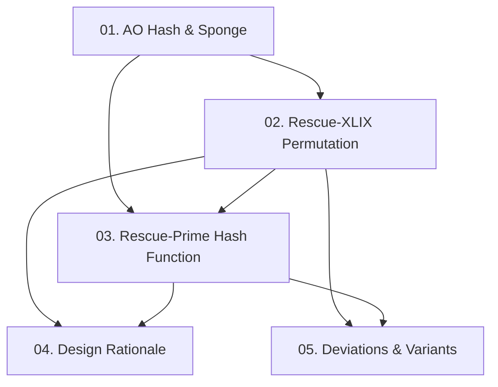

Paper 2020/1143 là một SoK (Systematization of Knowledge) cung cấp standard specification cho họ hash function **Rescue-Prime** — arithmetization-oriented hash function tối ưu cho SNARK/STARK/MPC, dựa trên sponge construction với permutation Rescue-XLIX. Course này cover toàn bộ nội dung của paper: từ motivation, specification hoàn chỉnh, đến các biến thể cho trường hợp đặc biệt.

**Tài liệu gốc**: [Rescue-Prime: a Standard Specification (SoK)](https://eprint.iacr.org/2020/1143)  
**Kiến thức nền tảng yêu cầu** (🔴 Prerequisite references): Aly et al. — *Marvellous* [AABS+19] (lý thuyết nền & security arguments); MDS codes (coding theory cơ bản); sponge construction (Bertoni et al.)

---

## Lesson Overview

| # | Title | Type | Covers (sections) | File | Dependencies |
|---|-------|------|-------------------|------|-------------|
| 01 | Arithmetization-Oriented Hash & Sponge | Foundation | §1, §1.1–1.2, sponge background | [[01-arithmetization-oriented-hash\|01. AO Hash & Sponge]] | — |
| 02 | Rescue-XLIX Permutation | Scheme | §2.1, §2.3, §2.4, §2.5, Alg 3–7, Fig 2 | [[02-rescue-xlix-permutation\|02. Rescue-XLIX Permutation]] | 01 |
| 03 | Rescue-Prime Hash Function | Scheme | §2.2, Alg 1–2, Fig 1 | [[03-rescue-prime-hash-function\|03. Rescue-Prime Hash Function]] | 01, 02 |
| 04 | Design Rationale: Rescue-XLIX vs Rescue | Deep Dive | §3.1–3.3 | [[04-design-rationale-rescue-xlix\|04. Design Rationale]] | 02, 03 |
| 05 | Deviations & Variants | Specification | §4.1–4.5, Alg 8–10 | [[05-deviations-and-variants\|05. Deviations & Variants]] | 02, 03 |

**Lesson types**: Foundation · Scheme · Deep Dive · Specification

---

## Coverage Map

| Document section | Covered in lesson |
|------------------|-------------------|
| §1 Introduction | 01 |
| §1.1 This Document | 01 |
| §1.2 Not in This Document | 01 |
| §2.1 Parameters | 02 |
| §2.2 Rescue-Prime Hash Function | 03 |
| §2.2 Padding | 03 |
| §2.2 Truncation and generic security | 03 |
| §2.3 Rescue-XLIX Permutation | 02 |
| §2.4 Selecting Parameters — MDS | 02 |
| §2.4 Selecting Parameters — Round Constants | 02 |
| §2.4 Selecting Parameters — Number of Rounds | 02 |
| §2.5 Computing α and α⁻¹ | 02 |
| §3.1 Flipped Order of S-boxes | 04 |
| §3.2 Simplified Round Constants | 04 |
| §3.3 Reduced Security Margin | 04 |
| §4.1 Small Fields and High Security | 05 |
| §4.2 Alternate MDS Matrices | 05 |
| §4.3 Omission of Padding | 05 |
| §4.4 Algebraically Dependent Round Constants | 05 |
| §4.5 Permitting n > rp (DEC functions) | 05 |
| Figure 1 | 03 |
| Figure 2 | 02 |
| Algorithm 1 (rescue_prime_hash) | 03 |
| Algorithm 2 (rescue_prime_wrapper) | 03 |
| Algorithm 3 (rescue_XLIX_permutation) | 02 |
| Algorithm 4 (get_mds_matrix) | 02 |
| Algorithm 5 (get_round_constants) | 02 |
| Algorithm 6 (get_alphas) | 02 |
| Algorithm 7 (get_number_of_rounds) | 02 |
| Algorithm 8 (get_number_of_rounds1) | 05 |
| Algorithm 9 (rescue_prime_DEC) | 05 |
| Algorithm 10 (rescue_prime_sponge) | 05 |

---

## Dependency Graph

---

## Progress

- [x] [[01-arithmetization-oriented-hash\|01. Arithmetization-Oriented Hash & Sponge]]
- [x] [[02-rescue-xlix-permutation\|02. Rescue-XLIX Permutation]]
- [x] [[03-rescue-prime-hash-function\|03. Rescue-Prime Hash Function]]
- [x] [[04-design-rationale-rescue-xlix\|04. Design Rationale]]
- [x] [[05-deviations-and-variants\|05. Deviations & Variants]]

---

## 🟡 Integrated References

| Ref Key | Used in lesson | Nội dung integrate |
|---------|----------------|--------------------|
| [AABS+19] | 04 | 3 thay đổi Rescue-XLIX so với Rescue gốc; khái niệm "folding" arithmetization |

---

## Notes

Đọc lesson 01 trước để hiểu bối cảnh arithmetization và sponge construction. Lesson 02 là trọng tâm kỹ thuật — nắm vững Rescue-XLIX trước khi đọc 03. Lesson 04 (Design Rationale) là optional nếu chỉ muốn implement; quan trọng nếu muốn hiểu tại sao Rescue-Prime khác Rescue gốc. Lesson 05 chỉ cần đọc khi cần deploy trong trường hợp đặc biệt.
