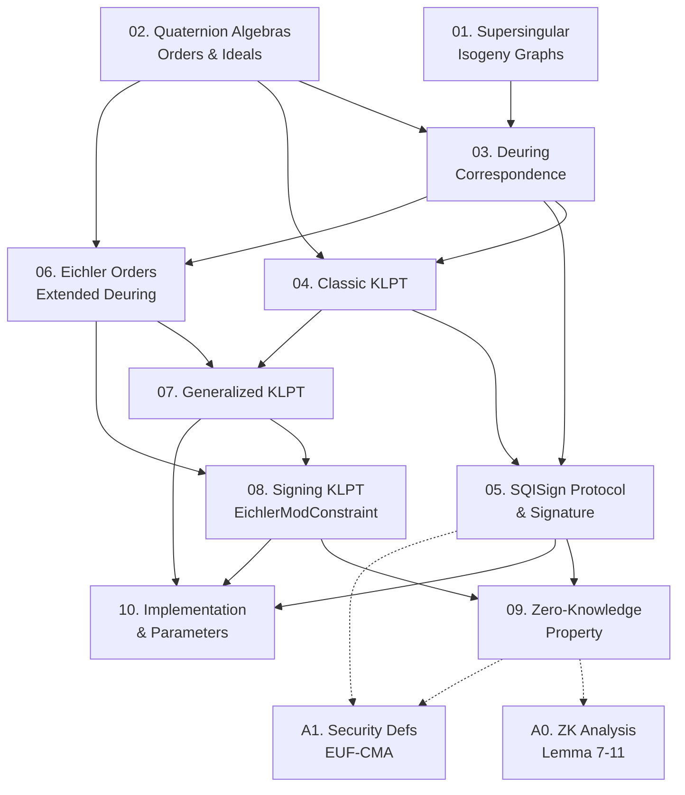

SQISign (Short Quaternion and Isogeny Signature) là lược đồ chữ ký hậu lượng tử dựa trên đồ thị isogeny của đường cong elliptic supersingular, đoạt giải Best Paper tại ASIACRYPT 2020. Course này cover toàn bộ 8 section chính, 10 thuật toán, tất cả theorem/lemma/proposition, và 2 appendix của bản ePrint 2020/1240.

**Tài liệu gốc**: [eprint.iacr.org/2020/1240](https://eprint.iacr.org/2020/1240)  
**Kiến thức nền tảng yêu cầu** (🔴 Prerequisite):
- ECC cơ bản: group law, ECDLP, dual isogeny — [Silverman — AEC]
- Isogeny-based crypto ở mức SIDH/CSIDH — [Jao–De Feo 2011], [Castryck et al. 2018]
- Vélu's formula để tính isogeny từ kernel — [Vélu 1971]
- Cornacchia's algorithm (giải norm equation) — textbook number theory
- ZK proofs / Sigma-protocols — [Damgård 2004] hoặc tương đương

---

## Lesson Overview

| # | Title | Type | Covers (sections) | File | Dependencies |
|---|-------|------|-------------------|------|-------------|
| 01 | Supersingular Isogeny Graphs | Foundation | §1, §2.1 | [[01-supersingular-isogeny-graphs\|01. Supersingular Isogeny Graphs]] | — |
| 02 | Quaternion Algebras, Orders & Ideals | Math Component | §2.2 | [[02-quaternion-algebras\|02. Quaternion Algebras, Orders & Ideals]] | — |
| 03 | The Deuring Correspondence | Math Component | §2.3 | [[03-deuring-correspondence\|03. The Deuring Correspondence]] | 01, 02 |
| 04 | Classic KLPT Algorithm | Deep Dive | §2.4, Alg 1–3 | [[04-klpt-classic\|04. Classic KLPT Algorithm]] | 02, 03 |
| 05 | SQISign Identification Protocol & Signature | Protocol | §3, §3.1–3.4 | [[05-sqisign-protocol\|05. SQISign Identification Protocol & Signature]] | 01, 03, 04 |
| 06 | Eichler Orders & Extended Deuring Correspondence | Math Component | §4, Prop 1–6, Lem 3 | [[06-eichler-orders\|06. Eichler Orders & Extended Deuring Correspondence]] | 02, 03 |
| 07 | Generalized KLPT Algorithm | Deep Dive | §5, Alg 4, Lem 4 | [[07-generalized-klpt\|07. Generalized KLPT Algorithm]] | 04, 06 |
| 08 | Signing KLPT & EichlerModConstraint | Deep Dive | §6, Alg 5–6, Lem 5–6 | [[08-signing-klpt\|08. Signing KLPT & EichlerModConstraint]] | 06, 07 |
| 09 | Zero-Knowledge Property | Foundation | §7, Prob 2, Prop 11, Lem 12 | [[09-zero-knowledge\|09. Zero-Knowledge Property]] | 05, 08 |
| 10 | Implementation & Parameters | Scheme | §8, Alg 7–10, Table 2 | [[10-implementation\|10. Implementation & Parameters]] | 05, 07, 08 |
| A0 | ZK Analysis: Lemma 7–11 (Proofs) | — | §7.2–7.3 (long proofs) | [[a0-zk-analysis\|A0. ZK Analysis: Lemma 7–11]] | 09 |
| A1 | Security Definitions & EUF-CMA | — | Appendix A, Thm 3 | [[a1-security-definitions\|A1. Security Definitions & EUF-CMA]] | 05, 09 |

**Lesson types**: Foundation · Math Component · Scheme · Protocol · Deep Dive

---

## Coverage Map

| Section trong paper | Covered trong lesson |
|---------------------|----------------------|
| §1 Introduction | 01 |
| §2.1 Supersingular elliptic curves and isogenies | 01 |
| §2.2 Quaternion algebras (H(a,b), Bp,∞, orders, ideals, Cl(O)) | 02 |
| §2.3 The Deuring Correspondence (kernel ideal, Table 1 classic rows) | 03 |
| §2.4 Algorithmic building blocks (Alg 1: RepresentIntegerO0, Alg 2: StrongApproximation, Alg 3: KLPT, Lem 1) | 04 |
| §3.1 Identification protocol (setup, keygen, commitment, challenge, response, Fig 1) | 05 |
| §3.2 Soundness (Prob 1: SSEP, Lem 2, Thm 1) | 05 |
| §3.3 Zero-knowledge: two insecure approaches | 05 |
| §3.4 Signature scheme (Fiat–Shamir, ΦDc, H, Thm 2) | 05 |
| §4 Eichler orders (Prop 1–5, Lem 3, Def 1) | 06 |
| §4 Extended Deuring (Prop 6, Table 1 new rows) | 06 |
| §5 Generalized KLPT (Alg 4, Lem 4) | 07 |
| §6.1 SigningKLPT overview (Alg 5) | 08 |
| §6.2 EichlerModConstraint (Alg 6, Lem 5, Lem 6) | 08 |
| §7.1 Problem 2 (ZK computational assumption) | 09 |
| §7.2 Simulator construction (Prop 11, Lem 12) | 09 |
| §7.3 Security of the assumption | 09 |
| §7 (Lemma 7–11, full distribution proofs) | A0 |
| §8.1 IdealToIsogenyFromKLPT (Alg 7) | 10 |
| §8.2 Parameters (Table 2, p, ℓ, D, Dc) | 10 |
| §8.3 KeyGen / Sign / Verify (Alg 8–10) | 10 |
| Appendix A (Sigma-protocol defs, Thm 3: EUF-CMA) | A1 |

---

## Dependency Graph

---

## Progress

- [ ] [[01-supersingular-isogeny-graphs\|01. Supersingular Isogeny Graphs]]
- [ ] [[02-quaternion-algebras\|02. Quaternion Algebras, Orders & Ideals]]
- [ ] [[03-deuring-correspondence\|03. The Deuring Correspondence]]
- [ ] [[04-klpt-classic\|04. Classic KLPT Algorithm]]
- [ ] [[05-sqisign-protocol\|05. SQISign Identification Protocol & Signature]]
- [ ] [[06-eichler-orders\|06. Eichler Orders & Extended Deuring Correspondence]]
- [ ] [[07-generalized-klpt\|07. Generalized KLPT Algorithm]]
- [ ] [[08-signing-klpt\|08. Signing KLPT & EichlerModConstraint]]
- [ ] [[09-zero-knowledge\|09. Zero-Knowledge Property]]
- [ ] [[10-implementation\|10. Implementation & Parameters]]
- [ ] [[a0-zk-analysis\|A0. ZK Analysis: Lemma 7–11]]
- [ ] [[a1-security-definitions\|A1. Security Definitions & EUF-CMA]]

---

## 🟡 Integrated References

| Ref Key | Dùng trong lesson | Nội dung tích hợp |
|---------|-------------------|-------------------|
| [KLPT14] | 04 | Lemma 5 (reformulate thành Lem 1 paper), sub-routines EquivalentPrimeIdeal / IdealModConstraint |
| [GPS19] | 05 | Kết quả Remark 6: outputs KLPT phụ thuộc equivalence class; §3.3 bác bỏ GPS approach |
| [EHL+18] | 05 | Heuristic reduction EndRing ↔ SSEP (Problem 1, Remark 8) |
| [PetitSmith18] | 04 | Remark 4: StrongApproximation deterministic nhỏ hơn (CVP lattice trick) |
| [CGL09] | 05 | ΦDc: non-backtracking walk construction dùng trong Sign |
| [Waterhouse69] | 03 | Định nghĩa kernel ideal Iϕ và E0[I] |
| [FiatShamir86] | 05 | Biến đổi Fiat–Shamir từ identification sang signature |
| [Voight-QA] | 06 | [50, Remark 42.3.10] — Eichler order dưới Deuring (paper prove điều này) |

---

## Notes

- **Thứ tự tối ưu**: 01 → 02 → 03 → 04 → 06 → 05 → 07 → 08 → 09 → 10. Lesson 05 đặt sau 04 nhưng trước 07–08 vì nó giới thiệu *framework* (protocol + ZK failure), còn 07–08 giải quyết vấn đề ZK đó.
- **Lesson 06** (Eichler orders) là trung tâm toán học của paper — đọc kỹ trước khi sang 07 và 08.
- **Appendix A0** chứa các proof kỹ thuật của ZK (Lemma 7–11); Lesson 09 trích dẫn kết quả, appendix chứa full proof.
- **Appendix A1** (Security Definitions) có thể đọc sau khi xong Lesson 05, không cần đợi đến cuối.
- Lesson 10 là lesson duy nhất có nội dung implementation — có thể đọc độc lập sau khi hiểu 05 + 08.
