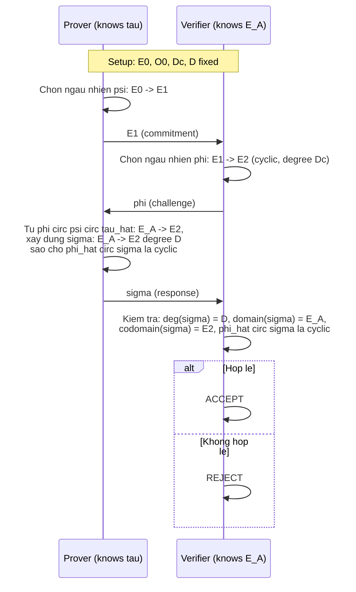

> **Prerequisites**: [[01-supersingular-isogeny-graphs\|01. Supersingular Isogeny Graphs]], [[03-deuring-correspondence\|03. The Deuring Correspondence]], [[04-klpt-classic\|04. Classic KLPT Algorithm]]; ZK proofs / Sigma-protocols (Damgård 2004 hoặc tương đương)  
> 🔴 **Prerequisite references**: Fiat–Shamir transform [FS86]; Sigma-protocol definitions (completeness, special soundness, HVZK)  
> **Lesson type**: Protocol  
> **Covers**: §3.1 (identification protocol, Fig. 1), §3.2 (soundness — Problem 1, Lemma 2, Theorem 1), §3.3 (ZK failure — hai cách tiếp cận không an toàn), §3.4 (signature scheme — Theorem 2, ΦDc)
>
> **Notation**:
> | Ký hiệu | Ý nghĩa |
> |---------|---------|
> | $E_0$ | Curve đặc biệt, $\mathcal{O}_0 \cong \text{End}(E_0)$ biết tường minh |
> | $\tau: E_0 \to E_A$ | Secret key isogeny |
> | $E_A$ | Public key curve |
> | $\psi: E_0 \to E_1$ | Commitment isogeny (random, secret) |
> | $\varphi: E_1 \to E_2$ | Challenge isogeny (degree $D_c$, cyclic) |
> | $\sigma: E_A \to E_2$ | Response isogeny (degree $D$, $\hat{\varphi} \circ \sigma$ cyclic) |
> | $D_c$ | Odd smooth challenge degree ($\lambda$ bits) |
> | $D = 2^e$ | Response degree (trên diameter của 2-isogeny graph) |
> | $\Phi_{D_c}(E, s)$ | Non-backtracking walk degree $D_c$ bắt đầu từ $E$, index $s$ |
> | $H$ | Hash function $\{0,1\}^* \to [1, \mu(D_c)]$ (ROM) |
> | $\mu(D_c) = \prod_i \ell_i^{e_i-1}(\ell_i+1)$ | Số lượng non-backtracking walks degree $D_c$ |

---

## Participants & Goal

| Bên | Thông tin biết | Mục tiêu |
|-----|----------------|----------|
| **Prover (Signer)** | $E_0$, $\mathcal{O}_0$, secret $\tau: E_0 \to E_A$, $\mathcal{O}_A \cong \text{End}(E_A)$ | Chứng minh biết $\tau$ mà không tiết lộ $\tau$ |
| **Verifier** | $E_0$, $\mathcal{O}_0$, public key $E_A$ | Kiểm tra Prover biết isogeny từ $E_0$ đến $E_A$ |

**Setup** (params): Chọn nguyên tố $p$, curve $E_0/\mathbb{F}_p$ với $\mathcal{O}_0$ biết tường minh; $D_c$ là odd smooth $\lambda$-bit; $D = 2^e$ lớn hơn diameter của 2-isogeny graph.

**KeyGen**: Chọn ngẫu nhiên isogeny walk $\tau: E_0 \to E_A$. Public key = $E_A$; secret key = $\tau$ (hoặc ideal $I_\tau$ tương ứng).

---

## Protocol Flow (Identification)

**Hình 1** trong paper (Fig. 1) minh họa bốn isogenies trên sơ đồ hình vuông:

$$
\begin{array}{ccc}
E_0 & \xrightarrow{\psi} & E_1 \\
{\scriptstyle\tau}\downarrow & & \downarrow{\scriptstyle\varphi} \\
E_A & \xrightarrow{\sigma} & E_2
\end{array}
$$

Prover biết $\tau$ và $\psi$ nên biết $\varphi \circ \psi \circ \hat{\tau}: E_A \to E_2$ — nhưng publish isogeny này trực tiếp sẽ **tiết lộ** thông tin về $\tau$. Thay vào đó dùng SigningKLPT (Lesson 08) để tính $\sigma$ "mới" equivalent nhưng không tiết lộ $\tau$.

---

## Completeness

> [!abstract] Proposition 5.1 — Completeness
> Nếu Prover honest (biết $\tau$) và dùng thuật toán đúng để tính $\sigma$, Verifier luôn accept.
>
> **Proof.** Correctness của Algorithm 5 (SigningKLPT, Lesson 08) đảm bảo Prover có thể xây dựng $\sigma: E_A \to E_2$ degree $D$ sao cho $\hat{\varphi} \circ \sigma$ là cyclic. Degree và domain/codomain đúng theo construction. $\blacksquare$

---

## Soundness

> [!note] Problem 5.2 — Supersingular Smooth Endomorphism Problem (SSEP, Problem 1 trong paper)
> **Input**: Nguyên tố $p$ và đường cong elliptic supersingular $E/\mathbb{F}_{p^2}$.  
> **Output**: Một cyclic endomorphism $\alpha \in \text{End}(E)$, $\alpha \neq [n]$, có **smooth degree**.
>
> **Hardness heuristic** (Remark 8): Dưới heuristic tương tự [EHL+18], SSEP heuristically tương đương với Endomorphism Ring Problem (tính tường minh $\text{End}(E)$).

> [!info] 🟡 Reduction SSEP ↔ EndRing (theo [EHL+18], Remark 8)
> [Eisenträger–Hallgren–Lauter–Morrison–Petit 2018] cho thấy heuristically:
>
> - **EndRing → SSEP**: Biết $\text{End}(E)$, lấy random walk $E \to E'$ rồi tìm non-zero cyclic endomorphism của $E'$ (có thể làm nhờ biết $\text{End}(E)$).
> - **SSEP → EndRing**: Biết smooth cyclic endomorphism → có thể adapt [EHL+18, Alg. 8] để reduce EndRing về SSEP.
>
> Do đó hardness của SSEP tương đương hardness của EndRing — bài toán cốt lõi trong isogeny cryptography.

> [!abstract] Lemma 5.3 — Hai conversations → endomorphism lisse (Lemma 2 trong paper)
> Cho hai **accepting conversations** $(E_1, \varphi, \sigma)$ và $(E_1, \varphi', \sigma')$ với $\varphi \neq \varphi'$, composition:
>
> $$
> \hat{\sigma}' \circ \varphi' \circ \hat{\varphi} \circ \sigma \in \text{End}(E_A)
> $$
>
> là một **non-scalar endomorphism** của $E_A$ có **smooth degree** $(DD_c)^2$.

**Proof.** Degree = $(DD_c)^2$ vì là composition của $\sigma$ (degree $D$), $\hat{\varphi}$ (degree $D_c$), $\varphi'$ (degree $D_c$), $\hat{\sigma}'$ (degree $D$). Smooth vì $D = 2^e$ và $D_c$ là odd smooth.

Chứng minh non-scalar: Giả sử đối lập $\hat{\sigma}' \circ \varphi' \circ \hat{\varphi} \circ \sigma = [DD_c]$. Khi đó $\hat{\varphi} \circ \sigma$ và $\hat{\varphi}' \circ \sigma'$ là hai cyclic isogenies từ $E_A$ đến $E_1$ cùng degree, nên $\hat{\varphi}' \circ \sigma' = \hat{\varphi} \circ \sigma$, dẫn đến $\varphi = \varphi'$ — mâu thuẫn. $\blacksquare$

> [!abstract] Theorem 5.4 — Soundness (Theorem 1 trong paper)
> Nếu adversary $\mathcal{A}$ phá soundness với xác suất $w$ và thời gian $r$ trên public key $E_A$, thì tồn tại algorithm giải SSEP trên $E_A$ với expected running time $O(r / (w - 1/c))$, trong đó $c = |\text{challenge space}|$.

**Proof.** Protocol có **special soundness** với relation $\mathcal{R} = \{(E_A, \alpha) : \alpha \text{ là cyclic smooth-degree endomorphism của } E_A\}$:

Theo Lemma 5.3, từ hai accepting conversations với cùng $E_1$ nhưng $\varphi \neq \varphi'$, ta extract một witness cho $\mathcal{R}$. Đây là proof of knowledge cho $\mathcal{R}$ với knowledge error $1/c$ ([Damgård 2004, Theorem 1]): adversary xác suất $w$ thời gian $r$ cho knowledge extractor thời gian $O(r/(w-1/c))$. $\blacksquare$

---

## Zero-Knowledge: Hai Cách Tiếp cận Không An toàn

Section 3.3 phân tích tại sao các cách tính $\sigma$ **đã biết trước** đều không an toàn:

> [!warning] Insecure Approach 1 — Direct response
> **Cách**: Đặt $\sigma = \varphi \circ \psi \circ \hat{\tau}$ trực tiếp.  
> **Lỗi**: Tiết lộ ngay $\ker(\hat{\tau})$, từ đó recover $\tau$ — **secret key bị lộ hoàn toàn**.

> [!warning] Insecure Approach 2 — KLPT classic theo GPS [GPS19]
> **Cách**: Dịch $\varphi \circ \psi \circ \hat{\tau}$ thành left $\mathcal{O}_A$-ideal, áp KLPT classic ([KLPT14]) để lấy equivalent ideal, rồi dịch ngược về isogeny $\sigma$.  
> **Lỗi (theo [EHL+18])**: KLPT classic (Algorithm 3) **systematically reveals** một path từ $E_A$ đến $E_0$. Biết path này tương đương biết $\tau$ (vì $\tau: E_0 \to E_A$ là path đó). Secret key bị lộ.

> [!info] 🟡 GPS scheme [GPS19]
> Galbraith–Petit–Silva (GPS, 2020) dùng đúng Approach 2 — đó là lý do GPS scheme không có implementation an toàn. SQISign giải quyết vấn đề này bằng Generalized KLPT (Lesson 07) + SigningKLPT (Lesson 08), được prove ZK trong Lesson 09.

**Kết luận Section 3.3**: Cần một KLPT variant mới không tiết lộ path về $E_0$. Đây là nội dung Section 5–7 (Lesson 07–09).

---

## Signature Scheme (Fiat–Shamir Transform)

> [!note] Scheme 5.5 — SQISign Signature (Section 3.4)
> **Type**: Digital Signature (Fiat–Shamir của identification protocol)  
> **Setting**: $E_0$, $\mathcal{O}_0$, $D_c$ (odd smooth $\lambda$-bit), $D = 2^e$; hash $H: \{0,1\}^* \to [1, \mu(D_c)]$ (ROM); function $\Phi_{D_c}(E, s)$ mapping index $s$ sang non-backtracking walk degree $D_c$ từ $E$
>
> **$\mathsf{KeyGen}(\text{param})$**
> - Input: params
> - Chọn random isogeny walk $\tau: E_0 \to E_A$
> - Output: $\mathsf{pk} = E_A$, $\mathsf{sk} = \tau$ (+ ideal $I_\tau \in \mathcal{O}_0$)
>
> **$\mathsf{Sign}(\mathsf{sk}, m)$**
> - Input: $\mathsf{sk} = \tau$, message $m \in \{0,1\}^*$
> - Chọn ngẫu nhiên isogeny walk $\psi: E_0 \to E_1$
> - Tính $s = H(j(E_1), m)$ và $\varphi = \Phi_{D_c}(E_1, s): E_1 \to E_2$
> - Từ $I_\tau$ và isogeny $\varphi \circ \psi: E_0 \to E_2$, dùng $\mathsf{SigningKLPT}$ xây dựng $\sigma: E_A \to E_2$ degree $D$ sao cho $\hat{\varphi} \circ \sigma$ cyclic
> - Output: $\Sigma = (E_1, \sigma)$
>
> **$\mathsf{Verify}(\mathsf{pk}, m, \Sigma)$**
> - Input: $\mathsf{pk} = E_A$, message $m$, $\Sigma = (E_1, \sigma)$
> - Tính $s = H(j(E_1), m)$, recover $\varphi = \Phi_{D_c}(E_1, s): E_1 \to E_2$
> - Kiểm tra: $\sigma: E_A \to E_2$, $\deg(\sigma) = D$, $\hat{\varphi} \circ \sigma$ cyclic
> - Output: $1$ (accept) hoặc $0$ (reject)

> [!info] 🟡 $\Phi_{D_c}$ construction (theo [CGL09], Section 3.4)
> Hàm $\Phi_{D_c}(E, s)$ mapping integer $s \in [1, \mu(D_c)]$ sang một non-backtracking walk degree $D_c$ bắt đầu từ $E$ được xây dựng theo [Charles–Lauter–Goren 2009]. Cụ thể: nếu $D_c = \prod_i \ell_i^{e_i}$, mỗi $\ell_i$-isogeny walk được encode bằng index trong $\{1, \ldots, \ell_i+1\} \setminus \{\text{backtrack}\}$, ghép lại qua CRT. Tổng số walks: $\mu(D_c) = \prod_i \ell_i^{e_i-1}(\ell_i+1)$.

> [!info] 🟡 Fiat–Shamir transform (theo [FS86])
> Biến đổi Fiat–Shamir [Fiat–Shamir 1986] chuyển một Sigma-protocol (identification) thành signature scheme trong Random Oracle Model: challenge $\varphi$ được thay bởi $H(E_1, m)$ (hash của commitment và message). An toàn của signature tương đương an toàn của identification protocol trong ROM.

> [!abstract] Theorem 5.6 — EUF-CMA Security (Theorem 2 trong paper)
> SQISign signature đạt **EUF-CMA** (Existential Unforgeability under Chosen Message Attack) trong Random Oracle Model, dưới giả thiết hardness của Problem 1 (SSEP) và Problem 2 (ZK assumption, sẽ học Lesson 09).
>
> **Proof.** Theo Theorem 3 (Appendix A — xem [[a1-security-definitions\|A1. Security Definitions]]), áp dụng cho identification scheme §3.1:
>
> - **Complete**: Theo Proposition 5.1.
> - **Special sound**: Theo Theorem 5.4 (giả thiết SSEP, Problem 1).
> - **HVZK**: Theo Lemma 12 + Proposition 11 (giả thiết Problem 2, Lesson 09).
>
> Fiat–Shamir của một HVZK special-sound Sigma-protocol đạt EUF-CMA trong ROM. $\blacksquare$

---

## Signature Size và Performance

Paper nhắm đến **NIST-1 security level** (AES-128 equivalent). Kết quả implementation (§8, Lesson 10):

| Thành phần | Kích thước |
|-----------|------------|
| Signature $(E_1, \sigma)$ | **204 bytes** |
| Secret key $\tau$ | **16 bytes** |
| Public key $E_A$ | **64 bytes** |
| **Tổng (sig + pk)** | **268 bytes** |

So sánh: mọi lược đồ chữ ký hậu lượng tử khác tại thời điểm 2020 có signature + public key ít nhất lớn hơn **một bậc độ lớn**.

> [!tip] 💡 Agent note — Trade-off SQISign
> Kích thước cực kỳ nhỏ là ưu điểm nổi bật nhất của SQISign. Nhược điểm: signing time ~2.5s trên workstation hiện đại (2020), do SigningKLPT tốn kém. Các version sau (SQISign2D-West, 2024) giảm xuống dưới 100ms nhờ dùng 2D isogenies thay KLPT.

---

## Summary

- **Identification protocol**: Sigma-protocol 3 bước (commitment $E_1$, challenge $\varphi$, response $\sigma$) trên đồ thị isogeny.
- **Completeness**: Đảm bảo bởi correctness của SigningKLPT.
- **Soundness** (Thm 1): Special soundness — hai accepting conversations → extract smooth cyclic endomorphism → giải SSEP.
- **ZK**: Không trivial — naive approaches đều lộ secret. Cần SigningKLPT + Problem 2 assumption (Lesson 09).
- **Signature**: Fiat–Shamir transform. EUF-CMA dưới Problem 1 (SSEP) + Problem 2 (ZK).
- **Size**: 204 bytes signature, 64 bytes public key — compact nhất trong PQC tại 2020.

---

## References

- Paper gốc: De Feo, Kohel, Leroux, Petit, Wesolowski — *SQISign*, ASIACRYPT 2020, §3
- [GPS19] Galbraith, Petit, Silva — *J. Cryptology 33(1)*, 2020 (🟡 — §3.3 failure analysis)
- [EHL+18] Eisenträger, Hallgren, Lauter, Morrison, Petit — *EUROCRYPT 2018* (🟡 — SSEP ↔ EndRing, §3.2 Remark 8)
- [CGL09] Charles, Lauter, Goren — *J. Cryptology 22(1)*, 2009 (🟡 — $\Phi_{D_c}$ non-backtracking walk)
- [FS86] Fiat, Shamir — *CRYPTO 1986* (🟡 — Fiat–Shamir transform)
- [Dam04] Damgård — *Sigma-protocol theory*, 2004 (🔴 Prerequisite — proof of knowledge, knowledge error)
