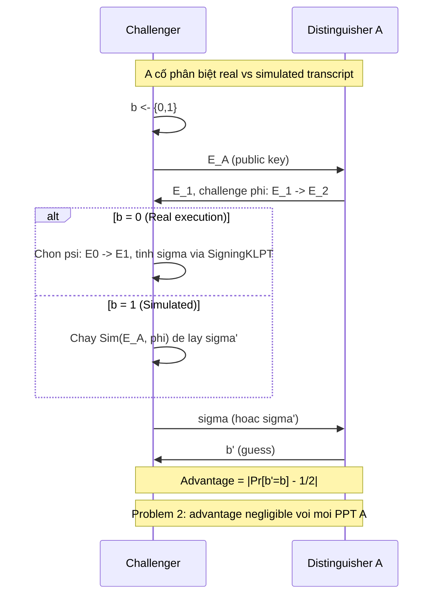

> **Prerequisites**: [[05-sqisign-protocol\|05. SQISign Identification Protocol & Signature]], [[08-signing-klpt\|08. Signing KLPT & EichlerModConstraint]]; ZK proofs / Sigma-protocols (HVZK, simulator)  
> 🔴 **Prerequisite references**: Goldreich — *Foundations of Cryptography* (ZK definitions, simulation paradigm); Damgård [Dam04] (Sigma-protocol HVZK)  
> **Lesson type**: Foundation  
> **Covers**: §7 đầy đủ — Problem 2 (ZK computational assumption), Lemmas 7–12 (statements + proof sketches; full proofs trong [[a0-zk-analysis\|A0]]), Proposition 11 (simulator), §7.3 (security của assumption)
>
> **Notation**:
> | Ký hiệu | Ý nghĩa |
> |---------|---------|
> | $\tau: E_0 \to E_A$ | Secret key isogeny, ideal $I_\tau$ |
> | $\psi: E_0 \to E_1$ | Commitment isogeny (random, secret của Prover) |
> | $\varphi: E_1 \to E_2$ | Challenge isogeny (degree $D_c$, từ Verifier) |
> | $\sigma: E_A \to E_2$ | Response isogeny, output của $\mathsf{SigningKLPT}$ |
> | $I$ | Left $\mathcal{O}_A$-ideal tương ứng $\varphi \circ \psi \circ \hat{\tau}$ |
> | $J$ | Output ideal của $\mathsf{SigningKLPT}(I, I_\tau)$, $\text{n}(J) = D$ |
> | $\mathcal{D}_{\tau,\varphi}$ | Phân phối của $J$ (response) với secret $\tau$ và challenge $\varphi$ |
> | $\mathcal{U}_{[I]}$ | Phân phối đều trên $\mathcal{O}$-equivalence class của $I$ với norm $D$ |
> | $\text{Sim}$ | Simulator không biết $\tau$ |

---

## Motivation: Tại sao ZK khó hơn Soundness?

Từ Lesson 05 (§3.3), ta biết ZK của SQISign **không trivial**: hai cách tính $\sigma$ đã biết đều tiết lộ secret. Vấn đề cốt lõi:

> Distribution của response isogeny $\sigma$ (output của SigningKLPT) **phụ thuộc vào** $\tau$ qua cách construct $I = I_{\varphi \circ \psi \circ \hat{\tau}}$. Để ZK, cần chứng minh distribution này có thể **simulate** mà không cần biết $\tau$.

Không giống SeaSign hay CSI-FiSh (đạt perfect ZK nhờ group action structure), SQISign **không đạt perfect ZK** — chỉ đạt computational ZK dưới một giả thiết mới. §7 formalize assumption đó và xây dựng simulator.

---

## §7.1 — Problem 2: ZK Computational Assumption

> [!note] Problem 9.1 — KLPT Output Distribution Assumption (Problem 2 trong paper)
> Cho tham số security $\lambda$, xét phân phối:
>
> $$
> \mathcal{D}_{\tau,\varphi} = \{J = \mathsf{SigningKLPT}(I_{\varphi \circ \psi \circ \hat{\tau}},\, I_\tau) : \psi \stackrel{R}{\leftarrow} \text{random walk}\}
> $$
>
> Phân phối này được tạo ra khi Prover biết $\tau$, chọn random $\psi$ và chạy SigningKLPT.
>
> **Problem 2 phát biểu**: Phân phối $\mathcal{D}_{\tau,\varphi}$ **computationally indistinguishable** với phân phối đều $\mathcal{U}_{[I]}$ trên tập:
>
> $$
> \{J : J \sim_\mathcal{O} I,\; \text{n}(J) = D\}
> $$
>
> nghĩa là output của SigningKLPT trông như lấy mẫu ngẫu nhiên từ equivalence class tương ứng.

> [!warning] Problem 2 là heuristic assumption
> Paper không chứng minh Problem 2 từ giả thiết chuẩn (như ECDLP hay isogeny path problem). Đây là một **computational assumption mới**, được justify bằng:
> (a) Phân tích lý thuyết về distribution của StrongApproximation outputs (§7.2, Lemma 7–11).
> (b) Bằng chứng thực nghiệm (không có trong bản ngắn; có trong extended ePrint).
> (c) Không biết distinguisher hiệu quả nào.

---

## §7.2 — Simulator và HVZK

Để chứng minh HVZK, ta cần xây dựng **simulator** $\text{Sim}$ không biết $\tau$ nhưng output transcript $(E_1, \varphi, \sigma)$ indistinguishable từ transcript thật.

> [!note] Scheme 9.2 — Simulator $\text{Sim}(E_A, \varphi)$
> **Type**: ZK Simulator  
> **Setting**: Biết $E_A$ (public key), challenge $\varphi: E_1 \to E_2$ (degree $D_c$); **không** biết $\tau$
>
> **$\text{Sim}(E_A, \varphi)$**
> - Input: Public key $E_A$, challenge $\varphi: E_1 \to E_2$
> - Output: $(E_1, \varphi, \sigma)$ — simulated transcript
>
> - Bước 1: Lấy ngẫu nhiên isogeny $\sigma: E_A \to E_2$ degree $D = 2^e$ sao cho $\hat{\varphi} \circ \sigma$ cyclic. (Tính toán bằng cách sample random walk trong 2-isogeny graph từ $E_A$ đến một curve, rồi check cyclicity.)
> - Bước 2: Trả về transcript $(E_1, \varphi, \sigma)$

**Tại sao Sim có thể compute $\sigma$ mà không cần $\tau$?**

Trong honest execution, Prover tính $\sigma$ từ $\varphi \circ \psi \circ \hat{\tau}$ rồi dùng SigningKLPT. Simulator không đi qua $\tau$: nó trực tiếp sample random $\sigma: E_A \to E_2$ degree $D$ thỏa cyclicity condition — đây là bài toán dễ (uniform random walk degree $D$ từ $E_A$, rồi filter theo cyclicity).

---

## Lemmas 7–12: Phân tích Phân phối

§7.2 chứa chuỗi lemma kỹ thuật phân tích distribution của SigningKLPT output. Đây là phần toán nặng nhất của paper; full proofs trong [[a0-zk-analysis\|A0. ZK Analysis]].

> [!abstract] Lemma 9.3 — Lemma 7 (phân phối của EquivalentPrimeIdeal)
> Output $L$ của $\mathsf{EquivalentPrimeIdeal}(K')$ với $K' = [I_\tau]_* I$ phân phối **gần đều** trên các prime-norm ideals equivalent với $K'$, independent of $\tau$ (up to rerandomization của $I$).
>
> *(Proof đầy đủ trong [[a0-zk-analysis\|A0]], dựa trên mixing time của random walk trong supersingular graph.)*

> [!abstract] Lemma 9.4 — Lemma 8 (phân phối của RepresentInteger output)
> Output $\gamma$ của $\mathsf{RepresentInteger}_{\mathcal{O}_0}(N\ell^{e_0})$ phân phối **nearly uniform** trên $\{\gamma \in \mathcal{O}_0 : \text{n}(\gamma) = N\ell^{e_0}\}$ khi $N$ và $e_0$ đủ lớn.

> [!abstract] Lemma 9.5 — Lemma 9 (phân phối của StrongApproximation output)
> Với $(C, D)$ từ CRT của $(C_0:D_0)$ và $(C_1:D_1)$, output $\nu$ của $\mathsf{StrongApproximation}_{\ell^\bullet}(NN_\tau, C, D)$ phân phối **computationally indistinguishable** từ uniform trên $\{\nu \in \mathcal{O}_0 : \text{n}(\nu) = \ell^{e_1}\}$ với $e_1$ fixed.
>
> *(Proof dùng heuristic về distribution của Cornacchia outputs — xem [[a0-zk-analysis\|A0]].)*

> [!abstract] Lemma 9.6 — Lemma 10 (independence từ $\tau$)
> Kết hợp Lemma 7–9: output $\beta = \gamma\nu$ của SigningKLPT phân phối indistinguishable từ uniform trên $\{\beta \in [I_\tau]_* I \cap \mathcal{O} : \text{n}(\beta) = NN_\tau\ell^e\}$, **independent** của $\tau$ sau rerandomization.

> [!abstract] Lemma 9.7 — Lemma 11 (bijection với Cl$_\mathcal{O}(\mathcal{O}_0)$)
> Map $\beta \mapsto J = \chi_{[I_\tau]_* I}(\beta)$ là bijection (up to units) giữa tập elements $\beta$ ở trên và equivalence classes trong $\text{Cl}_\mathcal{O}(\mathcal{O}_0)$ với norm $D$. Do đó phân phối của $J$ cũng indistinguishable từ $\mathcal{U}_{[I]}$.

> [!abstract] Lemma 9.8 — Lemma 12 (simulator và honest execution)
> Phân phối của transcript $(E_1, \varphi, \sigma)$ trong honest execution **computationally indistinguishable** với phân phối của transcript $(E_1, \varphi, \sigma')$ được tạo bởi Simulator $\text{Sim}$, under Problem 2.
>
> **Proof.** Lemma 11 cho thấy $J$ từ SigningKLPT phân phối $\approx \mathcal{U}_{[I]}$ under Problem 2. Simulator sample $\sigma$ uniform từ isogenies $E_A \to E_2$ degree $D$ thỏa cyclicity — cũng tương ứng $\mathcal{U}_{[I]}$ under Deuring correspondence. Do đó hai phân phối indistinguishable. $\blacksquare$

---

## §7.3 — Security of Problem 2 Assumption

> [!abstract] Proposition 9.9 — HVZK (Proposition 11 trong paper)
> Identification protocol trong §3.1 là **Honest-Verifier Zero-Knowledge (HVZK)** dưới Problem 2.
>
> **Proof.** Cần xây dựng simulator PPTM $\text{Sim}$ output transcript indistinguishable từ real. Ta dùng $\text{Sim}$ từ Scheme 9.2. Theo Lemma 12, phân phối transcripts của $\text{Sim}$ và honest execution indistinguishable under Problem 2. $\blacksquare$

Paper §7.3 cũng thảo luận evidence cho hardness của Problem 2:

> [!info] Evidence cho Problem 2 (§7.3)
> **Meet-in-the-middle attack**: Kẻ tấn công có thể thử enumerate $D/2$ steps từ $E_A$ và $D/2$ steps từ $E_2$, tìm collision. Tuy nhiên với $D = 2^e \sim p^2$, attack này require $2^{e/2} \sim p$ operations — tương đương $O(p)$ — không efficient hơn brute force.
>
> **No structural leakage**: Rerandomization trong SigningKLPT đảm bảo output không depend tuyến tính vào $I_\tau$. Không biết algorithm polynomial-time nào phân biệt output của SigningKLPT với uniform.
>
> **Heuristic justification**: Phân phối của Cornacchia outputs trong StrongApproximation được conjectured là close to uniform khi modulus đủ lớn — đây là assumption chuẩn trong lý thuyết số heuristic.

---

## Security Game: HVZK Formally

> [!abstract] Theorem 9.10 — Kết hợp: EUF-CMA từ HVZK + Soundness
> Kết hợp:
>
> - **Special soundness** (Theorem 1, Lesson 05): Prover giả mạo → extract smooth cyclic endomorphism → giải SSEP (Problem 1).
> - **HVZK** (Proposition 11): Transcript simulatable under Problem 2.
>
> Áp dụng **Theorem 3** (Appendix A, [[a1-security-definitions\|A1]]): Fiat–Shamir của HVZK special-sound Sigma-protocol → EUF-CMA trong ROM.
>
> **Kết luận**: SQISign đạt EUF-CMA under Problem 1 (SSEP hardness) + Problem 2 (KLPT output distribution) + ROM. $\blacksquare$

---

## Summary

- **Problem 2** (ZK assumption): Output distribution của SigningKLPT ≈ uniform trên equivalence class — không có polynomial-time distinguisher.
- **Simulator** (Scheme 9.2): Sample random $\sigma: E_A \to E_2$ degree $D$ thỏa cyclicity — không cần $\tau$.
- **Lemma 7–11**: Chuỗi phân tích phân phối — EquivalentPrimeIdeal, RepresentInteger, StrongApproximation, CRT đều contribute vào "randomness" của output.
- **Lemma 12**: Simulated ≡ real (under Problem 2) — HVZK.
- **HVZK + Soundness + Fiat–Shamir** → EUF-CMA (Theorem 2, Lesson 05).
- Full proofs của Lemma 7–11: [[a0-zk-analysis\|A0. ZK Analysis]].

---

## References

- Paper gốc: De Feo, Kohel, Leroux, Petit, Wesolowski — *SQISign*, ASIACRYPT 2020, §7
- [[05-sqisign-protocol\|05. SQISign Protocol]] — Problem 1, Theorem 1 (soundness), Theorem 2 (EUF-CMA)
- [[08-signing-klpt\|08. Signing KLPT]] — Algorithm 5 (SigningKLPT), rerandomization
- [[a0-zk-analysis\|A0. ZK Analysis]] — Full proofs của Lemma 7–11
- [[a1-security-definitions\|A1. Security Definitions]] — Theorem 3 (EUF-CMA từ HVZK + FS)
- [Dam04] Damgård — *Sigma-protocol theory* (🔴 Prerequisite — HVZK, knowledge error)
