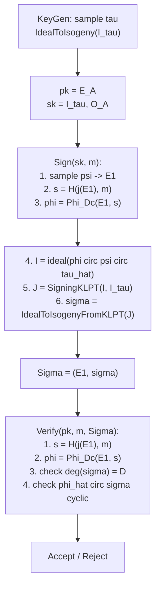

> **Prerequisites**: [[05-sqisign-protocol\|05. SQISign Identification Protocol & Signature]], [[07-generalized-klpt\|07. Generalized KLPT Algorithm]], [[08-signing-klpt\|08. Signing KLPT & EichlerModConstraint]]  
> **Lesson type**: Scheme  
> **Covers**: §8 đầy đủ — Algorithm 7 (IdealToIsogenyFromKLPT), Algorithms 8–10 (KeyGen, Sign, Verify), §8.2 (parameters, Table 2), §8.1 (torsion tricks)
>
> **Notation**:
> | Ký hiệu | Ý nghĩa |
> |---------|---------|
> | $T$ | Smooth integer: tích các primes nhỏ accessible qua torsion |
> | $E[T]$ | $T$-torsion subgroup của $E$ |
> | $\mathsf{IdealToIsogeny}(I, E_0)$ | Chuyển ideal $I$ (norm smooth) thành isogeny từ $E_0$ |
> | $\mathsf{IdealToIsogenyFromKLPT}$ | Version dùng KLPT khi norm không smooth |
> | $D = 2^e$ | Response degree (lũy thừa 2) |
> | $D_c$ | Challenge degree (odd smooth, $\lambda$ bits) |
> | $p$ | Prime đặc trưng $\sim 2^{256}$ cho NIST-1 |

---

## Motivation: Từ Lý thuyết đến Thực tế

Các bài học trước xây dựng toàn bộ framework lý thuyết của SQISign. Bài này kết nối lý thuyết với implementation: làm thế nào để thực sự **compute isogenies** từ ideals, chọn parameters như thế nào, và pipeline đầy đủ của KeyGen/Sign/Verify trông ra sao.

Ba thách thức chính trong implementation:

1. **IdealToIsogeny**: Chuyển ideal $J$ (norm $D = 2^e$ lớn) thành isogeny — cần torsion points.
2. **Torsion availability**: $E[D]$ với $D \sim p^2$ không accessible trực tiếp — cần tricks.
3. **Parameter selection**: Chọn $p$, $\ell$, $D$, $D_c$ cân bằng security vs efficiency.

---

## §8.1 — IdealToIsogenyFromKLPT

### Bài toán IdealToIsogeny

Với ideal $J$ (left $\mathcal{O}_0$-ideal, norm $N = \text{n}(J)$), tính isogeny $\varphi_J: E_0 \to E_0/E_0[J]$.

Khi $N$ là **smooth** (tích các primes nhỏ), ta dùng $N$-torsion points: tìm $P, Q$ generators của $E_0[N]$, sau đó dùng Vélu's formula theo từng prime factor — đây là cách tiêu chuẩn.

Khi $N$ **không smooth** (như $N = D = 2^e$ nhưng $e$ rất lớn, hoặc $N \sim p^3$): cần approach khác.

> [!note] Scheme 10.1 — $\mathsf{IdealToIsogenyFromKLPT}(J, E_0, T)$
> **Type**: Ideal-to-isogeny translation dùng KLPT decomposition  
> **Setting**: Left $\mathcal{O}_0$-ideal $J$; smooth integer $T$ (torsion accessible trên $\mathbb{F}_{p^2}$ hoặc extension nhỏ)
>
> **$\mathsf{IdealToIsogenyFromKLPT}(J, E_0, T)$**
> - Input: Left $\mathcal{O}_0$-ideal $J$ (norm có thể không smooth); curve $E_0$; smooth $T$
> - Output: Isogeny $\varphi_J : E_0 \to E_J$
>
> - Bước 1: Tính $J_1 = \mathsf{KLPT}_T(J)$ — ideal equivalent với $J$ nhưng norm chia hết $T$ (hoặc $\ell^\bullet$).
> - Bước 2: Tính $\varphi_1 = \mathsf{IdealToIsogeny}(J_1, E_0)$ dùng $T$-torsion (Vélu). Đặt $E_1 = \text{codomain}(\varphi_1)$.
> - Bước 3: Tính ideal chuyển tiếp: $J_2 = \overline{J_1} \cdot J / \text{n}(J_1)$ — đây là left $\mathcal{O}_1$-ideal kết nối $E_1$ và $E_J$.
> - Bước 4: Tính $\varphi_2 = \mathsf{IdealToIsogeny}(J_2, E_1)$ dùng torsion tương ứng.
> - Bước 5: Trả về $\varphi_J = \varphi_2 \circ \varphi_1 : E_0 \to E_J$

**Correctness**: $\varphi_2 \circ \varphi_1$ có kernel $E_0[J]$ theo Deuring: $I_{\varphi_2 \circ \varphi_1} = I_{\varphi_1} \cdot I_{\varphi_2} = J_1 \cdot J_2 = J$ (up to norm factors). $\checkmark$

> [!tip] 💡 Agent note — Torsion requirement và hai tricks
> Output norm của KLPT xấp xỉ $p^3$, đòi torsion $T \sim p^3$. Điều này tốn kém — cần torsion trên extension field lớn. Paper §8.1 giới thiệu **hai tricks** để giảm xuống $T \sim p^{3/2}$:
>
> **Trick 1 — Split $\psi$**: Thay vì dùng $E_1[D_1 D_2]$ torsion với $D_1, D_2$ coprime, split isogeny $\psi = \psi_1 \circ \psi_2$ với $\text{n}(\psi_1) = D_1$ và $\text{n}(\psi_2) = D_2$ riêng biệt. Mỗi bước chỉ cần $D_1$- hoặc $D_2$-torsion.
>
> **Trick 2 — Exploit $E_0$ structure**: Curve $E_0$ có endomorphisms tường minh $\iota, \pi$, cho phép compute torsion hiệu quả hơn curve generic.

---

## §8.2 — Parameters (Table 2)

Paper chọn parameters nhắm NIST-1 level (AES-128 equivalent). Constraint chính:

- **$p$**: Cần $p \equiv 3 \pmod{4}$; đủ lớn cho $\sqrt{p} \sim 2^{128}$ (classical security); accessible torsion $T = \prod_{\ell_i \leq B} \ell_i^{e_i}$ với $B$ nhỏ.
- **$D = 2^e$**: Cần $e$ trên diameter của 2-isogeny graph ($\sim \log_2 p / 2$).
- **$D_c$**: Odd smooth $\lambda$-bit number; challenge space $\mu(D_c) \geq 2^\lambda$ để có **one-round** protocol (soundness error $1/\mu(D_c)$).

> [!note] Table 2 — Parameters NIST-1 (từ §8.2)
> | Parameter | Giá trị | Ý nghĩa |
> |-----------|---------|---------|
> | $p$ | $\sim 2^{256}$ | Prime đặc trưng |
> | $\log_2 p$ | $256$ | Kích thước $p$ |
> | $\ell$ | $2$ | Prime cho response isogenies |
> | $e$ (trong $D = 2^e$) | $\sim 900$ | Response degree exponent |
> | $D_c$ | $\sim 2^{256}$ (odd smooth) | Challenge degree |
> | $\lambda$ | $128$ | Security level |
> | sig size | **204 bytes** | = $j(E_1)$ + compressed $\sigma$ |
> | pk size | **64 bytes** | = compressed $j(E_A)$ |
> | sk size | **16 bytes** | = seed cho $\tau$ |
>
> **Tại sao sig nhỏ?** $E_1$ biểu diễn bằng j-invariant trong $\mathbb{F}_{p^2}$ → 64 bytes. $\sigma$ là isogeny degree $D = 2^e$ — biểu diễn bằng kernel point $P \in E_A[D]$ → 140 bytes. Tổng = 204 bytes.

---

## §8.3 — KeyGen, Sign, Verify: Pipeline Đầy đủ

> [!note] Scheme 10.2 — $\mathsf{KeyGen}(\text{param})$
> **Type**: Key Generation  
> **Setting**: $E_0$, $\mathcal{O}_0$ fixed và public; $D_c$, $D$, $T$ từ params
>
> **$\mathsf{KeyGen}(\text{param})$**
> - Input: params ($p$, $E_0$, $\mathcal{O}_0$, $D$, $D_c$, $T$)
> - Output: $(\mathsf{pk} = E_A,\; \mathsf{sk} = (I_\tau, \mathcal{O}_A))$
>
> - Bước 1: Sample seed ngẫu nhiên $s \stackrel{R}{\leftarrow} \{0,1\}^\lambda$.
> - Bước 2: Từ $s$, derive random walk $\tau: E_0 \to E_A$ (degree $N_\tau$ prime, $\sim \sqrt{p}$) bằng cách chọn $I_\tau$ prime-norm ideal trong $\mathcal{O}_0$.
> - Bước 3: Tính $E_A = \mathsf{IdealToIsogeny}(I_\tau, E_0)$ — curve public key.
> - Bước 4: Tính $\mathcal{O}_A$ = right order của $I_\tau$ (representation của $\text{End}(E_A)$).
> - Bước 5: Trả về $\mathsf{pk} = E_A$, $\mathsf{sk} = (I_\tau, \mathcal{O}_A)$

---

> [!note] Scheme 10.3 — $\mathsf{Sign}(\mathsf{sk}, m)$
> **Type**: Signing  
> **Setting**: Như KeyGen; hash $H: \{0,1\}^* \to [1, \mu(D_c)]$ (ROM); $\Phi_{D_c}(E, s)$ từ [CGL09]
>
> **$\mathsf{Sign}(\mathsf{sk}, m)$**
> - Input: $\mathsf{sk} = (I_\tau, \mathcal{O}_A)$; message $m$
> - Output: Signature $\Sigma = (E_1, \sigma)$
>
> - Bước 1: Sample random commitment isogeny $\psi: E_0 \to E_1$ (degree $D_\psi$ smooth, $\sim p$). Tính $E_1 = \mathsf{IdealToIsogeny}(I_\psi, E_0)$.
> - Bước 2: Hash challenge: $s = H(j(E_1), m)$. Recover $\varphi = \Phi_{D_c}(E_1, s): E_1 \to E_2$.
> - Bước 3: Tính ideal $I = I_{\varphi \circ \psi \circ \hat{\tau}}$: trong ngôn ngữ ideal, $I = \bar{I}_\tau \cdot I_\psi \cdot I_\varphi$ (up to normalization).
> - Bước 4: Chạy $J = \mathsf{SigningKLPT}(I, I_\tau)$ — tìm $J \sim I$, $\text{n}(J) = D$.
> - Bước 5: Tính $\sigma = \mathsf{IdealToIsogenyFromKLPT}(J, E_A, T)$ — isogeny tương ứng $J$.
> - Bước 6: Trả về $\Sigma = (j(E_1), \sigma)$

---

> [!note] Scheme 10.4 — $\mathsf{Verify}(\mathsf{pk}, m, \Sigma)$
> **Type**: Verification  
> **Setting**: Như Sign
>
> **$\mathsf{Verify}(\mathsf{pk}, m, \Sigma)$**
> - Input: $\mathsf{pk} = E_A$; message $m$; $\Sigma = (E_1, \sigma)$
> - Output: $1$ (accept) hoặc $0$ (reject)
>
> - Bước 1: Parse $\Sigma$: decode $j(E_1) \in \mathbb{F}_{p^2}$, decode $\sigma$ từ kernel point.
> - Bước 2: Kiểm tra $j(E_1)$ là j-invariant supersingular hợp lệ.
> - Bước 3: Tính $s = H(j(E_1), m)$. Recover $\varphi = \Phi_{D_c}(E_1, s): E_1 \to E_2$.
> - Bước 4: Tính $\hat{\varphi} \circ \sigma: E_A \to E_1$ và kiểm tra **tính cyclic**: $\ker(\hat{\varphi} \circ \sigma)$ là cyclic subgroup.
> - Bước 5: Kiểm tra $\deg(\sigma) = D$ và $\text{codomain}(\sigma) = E_2$.
> - Bước 6: Nếu tất cả check pass, trả về $1$; ngược lại $0$

**Cyclicity check** (Bước 4): Isogeny $\sigma$ degree $D = 2^e$ cyclic iff $\ker(\sigma) \cong \mathbb{Z}/D\mathbb{Z}$ (cyclic, không phải $(\mathbb{Z}/2^{e/2}\mathbb{Z})^2$). Trong practice: kiểm tra qua Weil pairing — $e_D(P, Q) = 1$ iff $P, Q$ không tạo thành full $D$-torsion.

---

## Performance và Bottleneck

> [!note] Performance trên modern workstation (2020, từ §8)
> | Thao tác | Thời gian |
> |---------|-----------|
> | **KeyGen** | ~0.6s |
> | **Sign** | ~2.5s |
> | **Verify** | ~50ms |
> | **Signature size** | 204 bytes |
> | **Public key** | 64 bytes |

**Bottleneck**: Sign tốn 2.5s — chủ yếu do SigningKLPT (cần nhiều vòng lặp StrongApproximation) và IdealToIsogenyFromKLPT (cần compute isogenies degree $\sim p^3$). Verify nhanh hơn nhiều vì chỉ cần đi theo isogeny chain cho trước, không cần KLPT.

> [!tip] 💡 Agent note — Cải tiến sau 2020
> SQISign 2020 là baseline. Các version sau cải thiện đáng kể:
>
> - **SQISign2 (2022)** [De Feo–Leroux–Wesolowski]: New algorithms for Deuring correspondence → 2x speedup signing.
> - **SQISignHD (2024)** [Dartois–Leroux–Robert–Wesolowski]: Dùng 2D isogenies thay KLPT → 20x speedup signing (Best Paper EUROCRYPT 2024).
> - **SQISign2D-West (2024)**: Round 2 NIST submission, signing ~100ms.
>
> Tất cả variants đều dùng cùng framework lý thuyết (Deuring correspondence, quaternion algebras) — chỉ khác ở ideal-to-isogeny subroutine.

---

## Full Pipeline: Nhìn Toàn Cảnh

---

## Summary

- **IdealToIsogenyFromKLPT** (Alg 7): Decompose ideal $J$ thành smooth-norm pieces qua KLPT, rồi compute isogeny từng piece bằng Vélu — cho phép xử lý ideals norm không smooth.
- **KeyGen** (Alg 8): Sample random prime-norm ideal $I_\tau$, compute $E_A$ bằng IdealToIsogeny.
- **Sign** (Alg 9): Sample $\psi$, hash challenge $\varphi$, compute response ideal $J$ qua SigningKLPT, convert $J$ sang $\sigma$ qua IdealToIsogenyFromKLPT.
- **Verify** (Alg 10): Recompute $\varphi$ từ hash, kiểm tra degree + cyclicity của $\sigma$ — **không cần KLPT** → nhanh (~50ms).
- **Parameters NIST-1**: $p \sim 2^{256}$, sig 204 bytes, pk 64 bytes, sk 16 bytes.
- **Cải tiến**: SQISignHD (2024) đạt ~100ms signing nhờ 2D isogenies, nhưng framework lý thuyết giữ nguyên.

---

## References

- Paper gốc: De Feo, Kohel, Leroux, Petit, Wesolowski — *SQISign*, ASIACRYPT 2020, §8
- [[07-generalized-klpt\|07. Generalized KLPT]] — KLPT_T variant
- [[08-signing-klpt\|08. Signing KLPT]] — Algorithm 5 (SigningKLPT)
- [[05-sqisign-protocol\|05. SQISign Protocol]] — $\Phi_{D_c}$ construction [CGL09]
- [Vél71] Vélu — *Isogénies entre courbes elliptiques* (🔴 Prerequisite — Vélu's formula)
