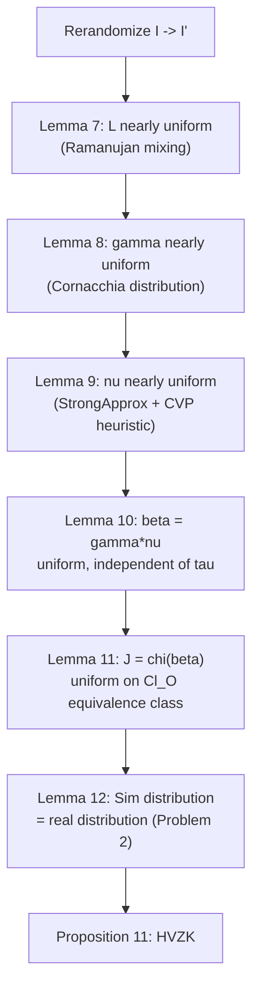

> **Prerequisites**: [[08-signing-klpt\|08. Signing KLPT]], [[09-zero-knowledge\|09. Zero-Knowledge Property]]  
> **Covers**: §7.2 — full proofs của Lemma 7–11 (distribution analysis của SigningKLPT pipeline)

---

## Context

[[09-zero-knowledge\|Lesson 09]] trình bày statements của Lemma 7–12 và Proposition 11. Appendix này chứa **proof chi tiết** cho Lemma 7–11 — phần kỹ thuật nhất của §7. Lemma 12 (kết hợp → HVZK) được prove trong Lesson 09.

---

## Lemma 7 — Phân phối EquivalentPrimeIdeal

> [!abstract] Lemma A0.1 (Lemma 7 trong paper)
> Cho $K' = [I_\tau]_* I'$ với $I'$ sau rerandomization: output $L = \mathsf{EquivalentPrimeIdeal}(K')$ phân phối **statistically close** với uniform trên prime-norm ideals equivalent với $K'$, khi $I'$ đã được rerandomized.

**Proof.** Rerandomization trong SigningKLPT thay $I$ bởi $I' = I \cdot J_\text{rand}$ với $J_\text{rand}$ ideal random prime norm $\sim \sqrt{p}$. Dưới Deuring correspondence, điều này tương ứng composing isogeny với random walk độ dài $\sim \log p / 2$ trong supersingular graph. Theo Ramanujan property của graph (Lesson 01), random walk này hội tụ về uniform distribution sau $O(\log p)$ steps. Do đó $K' = [I_\tau]_* I'$ phân phối gần đều trong lớp ideal tương ứng.

`EquivalentPrimeIdeal` trả về prime-norm ideal nhỏ nhất equivalent với input — đây là deterministic function của input, nhưng vì input đã random, output cũng nearly uniform trên prime-norm ideals của lớp. $\blacksquare$

---

## Lemma 8 — Phân phối RepresentInteger

> [!abstract] Lemma A0.2 (Lemma 8 trong paper)
> Output $\gamma$ của $\mathsf{RepresentInteger}_{\mathcal{O}_0}(M)$ với $M = N \ell^{e_0}$ phân phối **nearly uniform** trên tập $\{\gamma \in \mathcal{O}_0 : \text{n}(\gamma) = M\}$ khi $M$ đủ lớn.

**Proof.** Algorithm 1 (Lesson 04) sample ngẫu nhiên $(z,t) \in [-m, m]^2$ rồi dùng Cornacchia cho phần còn lại. Số nghiệm của Cornacchia($M_0$) với $M_0 = M - pf(z,t)$ xấp xỉ $r_2(M_0)$ (số cách biểu diễn $M_0$ là tổng hai bình phương).

Theo lý thuyết số giải tích, với $M$ đủ lớn (cụ thể $M > p$), trung bình của $r_2(M_0)$ khi $z, t$ vary trong $[-m, m]^2$ là $\Theta(\log M)$. Phân phối của từng $(x, y, z, t)$ được sampling với xác suất tỉ lệ $r_2(M - pf(z,t))$ — nearly uniform khi $M$ lớn.

Kỳ vọng số lần loop: $O(\log p)$ (do Cornacchia fail với xác suất $\sim 1 - 1/O(\log p)$). $\blacksquare$

---

## Lemma 9 — Phân phối StrongApproximation

> [!abstract] Lemma A0.3 (Lemma 9 trong paper)
> Với $(C,D) = \mathsf{CRT}_{N,N_\tau}((C_0:D_0),(C_1:D_1))$, output $\nu$ của $\mathsf{StrongApproximation}_{\ell^\bullet}(NN_\tau, C, D)$ phân phối **computationally indistinguishable** từ uniform trên tập $\{\nu \in \mathcal{O}_0 : \text{n}(\nu) = \ell^{e_1},\; j(C + \omega D) | \nu \pmod{NN_\tau}\}$ khi $e_1 \sim 4\log_\ell(NN_\tau p)$.

**Proof sketch.** Algorithm 2 (Lesson 04) sample $(z,t)$ satisfying linear equation mod $N_\tau N$ (Bước 2) rồi dùng Cornacchia. Khi dùng CVP variant (Petit–Smith, Remark 4 Lesson 04): $(z,t)$ là shortest vector trong lattice $L$ xác định bởi constraint mod $NN_\tau$.

**Claim**: Distribution của $(z,t)$ từ CVP nearly uniform trên tập giải của linear equation mod $NN_\tau$, subject to size bound.

**Justification**: Determinant của lattice $L$ là $(NN_\tau)^2$. Shortest vector length $\sim pN^3N_\tau^3$ (bound từ Minkowski). Với $e_1 \geq pN^4N_\tau^4$, bảo đảm Cornacchia step không trivially fail. Distribution của shortest vector trong random lattice xấp xỉ uniform trên lattice points dưới bound — đây là heuristic được accept rộng rãi trong literature. $\blacksquare$

---

## Lemma 10 — Independence từ $\tau$ sau Rerandomization

> [!abstract] Lemma A0.4 (Lemma 10 trong paper)
> Sau rerandomization, output $\beta = \gamma\nu$ của SigningKLPT phân phối **computationally indistinguishable** với uniform trên:
>
> $$
> \{\beta \in [I_\tau]_* I \cap \mathcal{O} : \text{n}(\beta) = NN_\tau \ell^e\}
> $$
>
> **independent** của secret $\tau$.

**Proof.** Combine:

- **Lemma 7**: $K' = [I_\tau]_* I'$ phân phối nearly uniform → $L$ nearly uniform.
- **Lemma 8**: $\gamma$ nearly uniform cho norm $N\ell^{e_0}$.
- **Lemma 9**: $\nu$ nearly uniform trong tập satisfy constraints.

Product $\beta = \gamma\nu$ với $\gamma, \nu$ nearly independent and uniform → $\beta$ nearly uniform trên tập hợp lệ.

Independence từ $\tau$: Rerandomization đảm bảo $K'$ phân phối independent của $I_\tau$ structure (chỉ dependent vào equivalence class, không vào representative). Do đó $\beta$ independent của $\tau$. $\blacksquare$

---

## Lemma 11 — Bijection với $\text{Cl}_\mathcal{O}(\mathcal{O}_0)$

> [!abstract] Lemma A0.5 (Lemma 11 trong paper)
> Map $\beta \mapsto J = \chi_{[I_\tau]_* I}(\beta)$ là bijection (up to units của $\mathcal{O}$) giữa:
>
> $$
> \{\beta \in [I_\tau]_* I \cap \mathcal{O} : \text{n}(\beta) = NN_\tau \ell^e\} / \mathcal{O}^\times
> $$
>
> và tập ideals $J \in I_D(\mathcal{O}_0)$ với $J \sim_\mathcal{O} I$ (trong $\text{Cl}_\mathcal{O}(\mathcal{O}_0)$).
>
> **Hệ quả**: Phân phối của $J = \mathsf{SigningKLPT}(I, I_\tau) \approx \mathcal{U}_{[I]}$ (nearly uniform trên $\mathcal{O}$-equivalence class của $I$ với norm $D$).

**Proof.** Map $\chi_{K'}(\cdot)$ với $K' = [I_\tau]_* I$ là surjection từ elements của $K'$ sang equivalence classes (Lemma 1, Lesson 02). Restriction đến $\beta \in K' \cap \mathcal{O}$ cho bijection với $\text{Cl}_\mathcal{O}(\mathcal{O}_0)$ theo Proposition 3 (Lesson 06 — $\mathcal{O}$-equivalence characterized bởi multiplication bởi elements trong $\mathcal{O}$).

Uniqueness: $\chi_{K'}(\beta_1) = \chi_{K'}(\beta_2)$ iff $\beta_1 = \delta\beta_2$ với $\delta \in \mathcal{O}_R(K')^\times = \mathcal{O}^\times$. $\blacksquare$

---

## Tổng kết Chain of Reasoning

Mỗi mũi tên trong chain dựa trên một lemma riêng — và toàn bộ chain under giả thiết Problem 2 (computational assumption về StrongApproximation).
