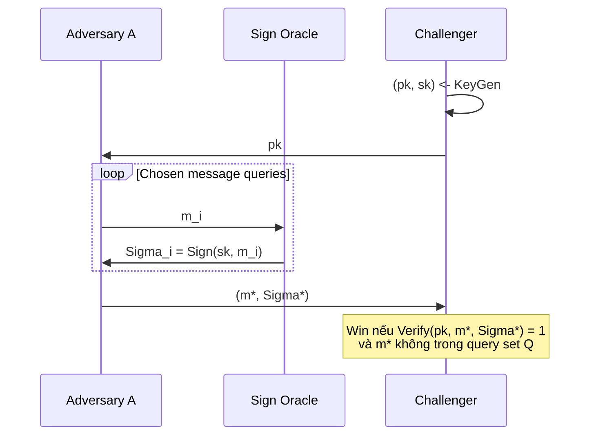

> **Prerequisites**: [[05-sqisign-protocol\|05. SQISign Identification Protocol & Signature]], [[09-zero-knowledge\|09. Zero-Knowledge Property]]  
> **Covers**: Appendix A — Sigma-protocol definitions, HVZK, special soundness, EUF-CMA, Theorem 3 (Fiat–Shamir security)

---

## Sigma-Protocol: Định nghĩa Chuẩn

> [!note] Định nghĩa A1.1 — Sigma-Protocol
> Một **Sigma-protocol** cho relation $\mathcal{R} \subseteq \mathcal{X} \times \mathcal{W}$ (instance × witness) là giao thức 3 bước (Commitment $a$, Challenge $c$, Response $z$) thỏa:
>
> 1. **Completeness**: Honest prover (biết $w$ với $(x,w) \in \mathcal{R}$) luôn được accept.
> 2. **Special Soundness**: Từ hai accepting conversations $(a, c, z)$ và $(a, c', z')$ với $c \neq c'$, có thể extract witness $w$.
> 3. **HVZK**: Tồn tại PPT simulator $\mathsf{Sim}(x)$ output $(a, c, z)$ indistinguishable từ real transcript.

Với SQISign:
- Instance $x = E_A$ (public key)
- Witness $w = \tau: E_0 \to E_A$ (secret isogeny)
- Relation $\mathcal{R} = \{(E_A, \alpha) : \alpha \text{ là smooth cyclic endomorphism của } E_A\}$ (từ Soundness extraction)

---

## EUF-CMA Security Game

> [!note] Định nghĩa A1.2 — EUF-CMA
> Signature scheme $\Pi = (\mathsf{KeyGen}, \mathsf{Sign}, \mathsf{Verify})$ đạt **EUF-CMA** nếu với mọi PPT adversary $\mathcal{A}$:
>
> $$
> \Pr\left[\mathsf{Verify}(\mathsf{pk}, m^*, \Sigma^*) = 1 \;\wedge\; m^* \notin Q\right] \leq \mathsf{negl}(\lambda)
> $$
>
> trong đó $(\mathsf{pk}, \mathsf{sk}) \leftarrow \mathsf{KeyGen}(1^\lambda)$; $\mathcal{A}$ có oracle access đến $\mathsf{Sign}(\mathsf{sk}, \cdot)$ và query tập $Q$; $(m^*, \Sigma^*)$ là forgery output.

---

## Theorem 3: Fiat–Shamir → EUF-CMA

> [!abstract] Theorem A1.3 — EUF-CMA của Fiat–Shamir (Theorem 3 trong Appendix A)
> Cho Sigma-protocol $\Pi_\text{id}$ thỏa:
>
> - **Completeness** (Proposition 5.1, Lesson 05)
> - **Special soundness** với knowledge error $1/c$ (Theorem 1, Lesson 05, assuming Problem 1 hard)
> - **HVZK** (Proposition 11, Lesson 09, assuming Problem 2 hard)
>
> Fiat–Shamir transform $\Pi_\text{sig} = \mathsf{FS}(\Pi_\text{id})$ đạt **EUF-CMA** trong **Random Oracle Model (ROM)** assuming Problem 1 và Problem 2 hard.

**Proof sketch** (standard Fiat–Shamir argument):

Giả sử adversary $\mathcal{A}$ forge signature $(m^*, (E_1^*, \sigma^*))$ với non-negligible probability $\epsilon$. Ta xây dựng $\mathcal{B}$ giải Problem 1 (SSEP):

$\mathcal{B}$ simulate $\mathcal{A}$ với signing oracle bằng HVZK simulator (không cần sk): khi $\mathcal{A}$ query $\mathsf{Sign}(\mathsf{sk}, m_i)$, $\mathcal{B}$ dùng $\mathsf{Sim}(E_A, \varphi_i)$ với $\varphi_i$ được program vào random oracle.

Bằng **Forking Lemma** [PS96]: với xác suất $\geq \epsilon^2/q_H$, chạy $\mathcal{A}$ hai lần cùng random tape nhưng random oracle khác nhau tại $H(j(E_1^*), m^*)$ cho **hai forgeries** $(E_1^*, \varphi^*, \sigma^*)$ và $(E_1^*, \varphi^{**}, \sigma^{**})$ với $\varphi^* \neq \varphi^{**}$.

Đây là **hai accepting conversations** cùng $E_1^*$ nhưng challenge khác nhau → Lemma 2 (Lesson 05) extract smooth cyclic endomorphism của $E_A$ → giải Problem 1. $\blacksquare$

---

## Security Parameters

> [!note] Security Level Analysis (§8.2)
> Với tham số NIST-1 ($p \sim 2^{256}$):
>
> | Attack | Complexity | Bound |
> |--------|-----------|-------|
> | Forgery không biết sk | $\sim \sqrt{p} \approx 2^{128}$ | Classical + quantum |
> | Endomorphism ring computation | $\tilde{O}(p^{1/2})$ classical | $\sim 2^{128}$ |
> | Quantum attack (Grover on random oracle) | $O(q_H^{1/3}/c^{2/3})$ | Bounded bởi $q_H$ |
> | Meet-in-middle trên Problem 2 | $O(\sqrt{D}) \approx 2^{128}$ | Dưới Problem 2 |

---

## Tóm tắt Security Argument

Toàn bộ security chain của SQISign:

$$
\text{SSEP hard (Problem 1)} + \text{KLPT distribution (Problem 2)} + \text{ROM} \implies \text{EUF-CMA}
$$

Trong đó SSEP heuristically equivalent với Endomorphism Ring Problem — bài toán cốt lõi của isogeny cryptography, tin là hard với cả quantum computers.
