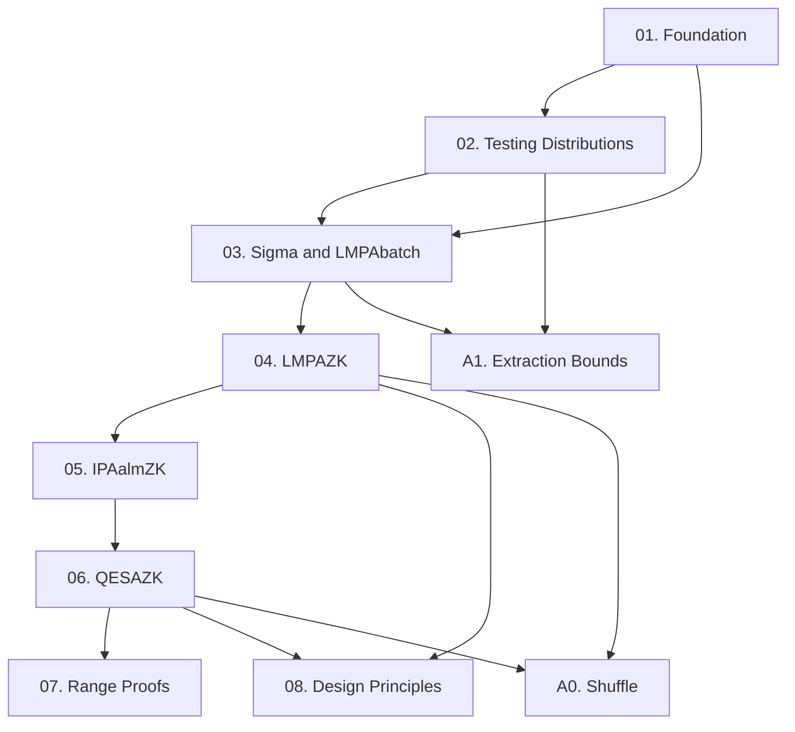

Paper này hệ thống hóa và cải tiến các zero-knowledge argument trong discrete log setting — giới thiệu LMPAZK (O(log n) communication cho preimage của linear map) và QESAZK (argument cho hệ quadratic equation tổng quát hơn R1CS), cùng framework phân tích extraction chặt chẽ hơn thông qua testing distributions và short-circuit extraction. Course này cover toàn bộ §1–5 và các Appendix chính của full version.

**Tài liệu gốc**: [ePrint 2019/944](https://eprint.iacr.org/2019/944)  
**Kiến thức nền yêu cầu** (🔴 Prerequisite): Discrete logarithm assumption, Pedersen commitment, Sigma-protocol cơ bản, nhóm abelian và ký hiệu additive [Boneh-Shoup]; ILC model [GK15]

---

## Lesson Overview

| # | Title | Type | Covers (sections) | File | Dependencies |
|---|-------|------|-------------------|------|-------------|
| 01 | ZK Arguments in the Discrete Log Setting | Foundation | §1.1–1.3, §2.1–2.2 | [[01-zk-dlog-foundation\|01. Foundation]] | — |
| 02 | Testing Distributions & Special Soundness | Math Component | §2.3–2.4, Lem 2.11, Def 2.16–2.19, Cor 2.20 | [[02-testing-distributions\|02. Testing Distributions]] | 01 |
| 03 | Standard Σ-Protocol và LMPAbatch | Scheme | §3.1–3.3, Prot 3.1, Lem 3.2, Prot 3.4, Lem 3.5 | [[03-sigma-lmpabatch\|03. Σstd & LMPAbatch]] | 01, 02 |
| 04 | Recursive Compression: LMPAnoZK → LMPAZK | Scheme | §3.4–3.5, Prot 3.9, Lem 3.10, LMPAZK | [[04-lmpazk\|04. LMPAZK]] | 03 |
| 05 | Almost-ZK Inner Product Argument | Scheme | §4.1, IPAalmZK | [[05-ipa-almzk\|05. IPAalmZK]] | 04 |
| 06 | Quadratic Equation Satisfiability: QESAZK | Scheme | §4.2–4.3, QESAZK, QE vs R1CS | [[06-qesazk\|06. QESAZK]] | 05 |
| 07 | Applications: Range Proofs & Performance | Deep Dive | §5, Tables 1–2, benchmarks | [[07-range-proofs-impl\|07. Range Proofs & Implementation]] | 06 |
| 08 | Design Principles Synthesized | Survey | §1.1 (revisited), all techniques unified | [[08-design-principles\|08. Design Principles]] | 04, 06 |
| A0 | Shuffle Argument Πshuffle | Protocol | Appendix C | [[a0-shuffle-argument\|A0. Shuffle Argument]] | 04, 06 |
| A1 | Witness-Extended Emulation & Extraction Bounds | Deep Dive | Appendix D, §2.4 (short-circuit bounds) | [[a1-wee-extraction\|A1. Extraction Bounds]] | 02, 03 |

**Lesson types**: Foundation · Math Component · Scheme · Deep Dive · Protocol · Survey

---

## Coverage Map

| Document section | Covered in lesson |
|-----------------|-------------------|
| §1.1 Basic techniques | 01, 08 |
| §1.2 Contribution overview | 01 |
| §1.3 Related work | 01 |
| §2.1 Matrix kernel assumptions, Pedersen commitments | 01 |
| §2.2 Interactive arguments, HVZK, Fiat–Shamir | 01 |
| §2.3 Testing distributions (Def 2.9–2.15, Lem 2.11) | 02 |
| §2.3.1 Dual testing distributions (Def 2.16) | 02 |
| §2.4 Special soundness (Def 2.17–2.19, Cor 2.20) | 02 |
| §3.1 Intuition for LMPA | 03 |
| §3.2 Protocol Σstd, Lemma 3.2 | 03 |
| §3.3 Protocol LMPAbatch, Lemma 3.5 | 03 |
| §3.4 Protocol LMPAnoZK, Lemma 3.10 | 04 |
| §3.5 LMPAZK (ZK conversion protocols) | 04 |
| §4.1 IPAalmZK | 05 |
| §4.2–4.3 QESAZK | 06 |
| §5 Range proofs, benchmarks | 07 |
| Appendix B (batch proofs) | 03 |
| Appendix C (shuffle argument) | A0 |
| Appendix D (witness-extended emulation) | A1 |
| Appendix E (testing distributions extended) | 02 |
| Appendix G (protocol sketches for LMPAnoZK) | 04 |
| Tables 1–2 | 07 |

---

## Dependency Graph

---

## Progress

- [x] [[01-zk-dlog-foundation|01. ZK Arguments — Foundation]]
- [x] [[02-testing-distributions|02. Testing Distributions & Special Soundness]]
- [x] [[03-sigma-lmpabatch|03. Σstd & LMPAbatch]]
- [x] [[04-lmpazk|04. LMPAZK]]
- [x] [[05-ipa-almzk|05. IPAalmZK]]
- [x] [[06-qesazk|06. QESAZK]]
- [x] [[07-range-proofs-impl|07. Range Proofs & Implementation]]
- [x] [[08-design-principles|08. Design Principles]]
- [x] [[a0-shuffle-argument|A0. Shuffle Argument]]
- [x] [[a1-wee-extraction|A1. Extraction Bounds]]

---

## 🟡 Integrated References

| Ref Key | Used in lesson | What is integrated |
|---------|---------------|--------------------|
| [MRV16] | 01 | Kernel Matrix DH assumption — Definition 2.1 |
| [Mau09/CDS94] | 01, 03 | HVZK framework; Σstd generalises standard template |
| [Att20] | 02 | TreeFinder generalisations, extraction runtime |
| [Boo16] | 04 | Inner product / recursive argument structure (LMPAnoZK) |
| [Bün18] | 05, 06, 07 | IPAalmZK derived; QESAZK vs Bulletproofs; benchmarks |
| [BGro12] | A0 | Shuffle proof statement; instantiated with LMPAZK + QESAZK |

---

## Notes

Thứ tự học nên linear 01 → 08. Lesson 08 (Design Principles) là lesson tổng hợp — đọc sau cùng để thấy "big picture". Hai appendix A0–A1 optional nhưng quan trọng cho implementation hoặc security analysis chặt chẽ. **Lesson 04 là pivot point** — nắm được LMPAZK thì phần còn lại sẽ dễ hơn nhiều.
