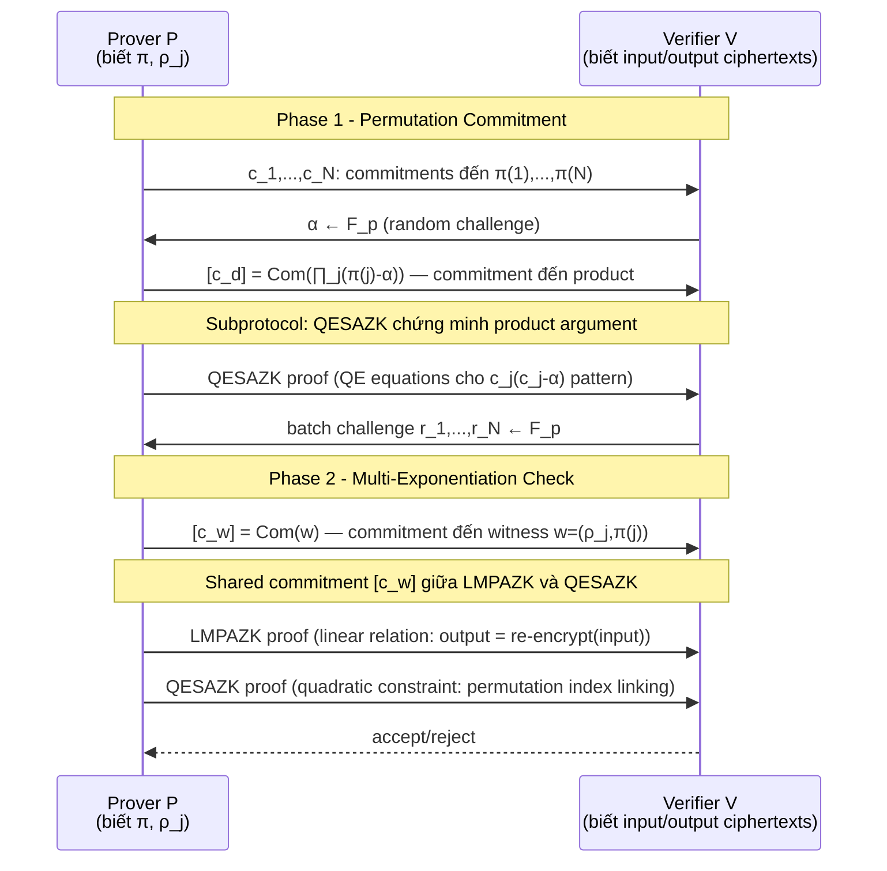

> **Prerequisites**: [[04-lmpazk|04. LMPAZK]] (linear map preimage argument, $O(\log N)$); [[06-qesazk|06. QESAZK]] (quadratic equation argument, adaptive commit-and-prove).
> 🔴 **Prerequisite references**: Bayer-Groth [BGro12] — *Efficient Zero-Knowledge Argument for Correctness of a Shuffle*, EUROCRYPT 2012 — protocol framework $\Pi_\text{BG}$ mà [HKR19] instantiate lại.
> **Lesson type**: Protocol
> **Covers**: Appendix C — $\Pi_\text{shuffle}$: shuffle argument cho ElGamal ciphertexts dùng LMPAZK + QESAZK làm subprotocols; proof size $O(\log N)$; Remark C.1 (concurrent work).
>
> **Notation** (bổ sung):
> | Ký hiệu | Ý nghĩa | Ký hiệu trong paper |
> |---------|---------|---------------------|
> | $N$ | Số ElGamal ciphertexts được shuffle | $N$ |
> | $(u_i, v_i)$ | Ciphertext thứ $i$: $(g^{r_i}, \text{pk}^{r_i} m_i) \in G^2$ | $(u_i, v_i)$ |
> | $\pi \in S_N$ | Secret permutation | $\pi$ |
> | $\rho_i$ | Re-encryption randomness cho ciphertext $\pi(i)$ | $\rho_i$ |
> | $(U_j, V_j)$ | Output ciphertext $j$ sau shuffle | $(U_j, V_j)$ |
> | $\text{pk} = g^x$ | ElGamal public key | $\text{pk}$ |

---

## 1. Participants & Goal

**Participants**: Prover $P$ (mix-server biết permutation $\pi$ và randomness $\rho_i$) và Verifier $V$.

**Mục tiêu**: Chứng minh rằng $N$ output ciphertexts $(U_j, V_j)_{j=1}^N$ là **shuffle hợp lệ** của $N$ input ciphertexts $(u_i, v_i)_{i=1}^N$:

$$
\exists \pi \in S_N,\; (\rho_j)_{j=1}^N \;:\; (U_j, V_j) = \left(u_{\pi(j)} \cdot g^{\rho_j},\; v_{\pi(j)} \cdot \text{pk}^{\rho_j}\right) \quad \forall j
$$

**Ứng dụng thực tiễn**:
- **Electronic voting (e-voting)**: Mix-net ẩn danh hóa ballots — mỗi mix-server shuffle ciphertexts mà không lộ thứ tự. Cần chứng minh shuffle đúng để đảm bảo không thay đổi phiếu bầu.
- **Anonymous communication**: Ẩn danh hóa messages trong network.

**Adversary model**: Honest-verifier ZK (HVZK). Adversary là computationally bounded. Dlog assumption đủ — không cần semantic security của ElGamal.

---

## 2. Bối cảnh: Bayer-Groth [BGro12]

> [!info] 🟡 Framework Bayer-Groth [BGro12]
> Bayer-Groth đề xuất một shuffle argument $\Pi_\text{BG}$ với communication $O(\sqrt{N})$ group elements (chọn $m \approx \sqrt{N}$ rows trong matrix decomposition). Protocol gồm hai phases:
>
> **Phase 1 — Permutation commitment**: Prover commit đến permutation $\pi$ bằng commitments $[c_{\pi(j)}]_{j=1}^N$. Chứng minh rằng $\{c_j\}$ là commitments đến một **permutation** (không chỉ arbitrary values) bằng một "product argument" — chứng minh $\prod_j (c_j - \alpha) = \prod_j (j - \alpha)$ cho random $\alpha$.
>
> **Phase 2 — Multi-exponentiation argument**: Với permutation committed, chứng minh rằng output ciphertexts đúng là re-encryptions của $c_j$-th input ciphertexts. Reduce về một inner product / linear map argument.
>
> Communication của $\Pi_\text{BG}$: $O(\sqrt{N})$ group elements. Computation: $O(N)$ exponentiations.
>
> Paper [HKR19] **thay thế** các subprotocols của $\Pi_\text{BG}$ bằng LMPAZK và QESAZK — giữ nguyên cấu trúc macro nhưng achieve $O(\log N)$ proof size.
>
> *(theo [BGro12]: Bayer, Groth — Efficient Zero-Knowledge Argument for Correctness of a Shuffle, EUROCRYPT 2012)*

---

## 3. Protocol Flow — $\Pi_\text{shuffle}$

Protocol $\Pi_\text{shuffle}$ follow structure của $\Pi_\text{BG}$ với LMPAZK và QESAZK thay thế các inner subprotocols.

**Shared commitment**: Điểm then chốt là **cùng một commitment** $[c_w]$ được sử dụng bởi cả LMPAZK (Phase 2 linear part) và QESAZK (Phase 1 permutation quadratic part). Đây là **composition của hai argument systems** bằng cách share commitment — kỹ thuật §1.1.5 (Lesson 01).

---

## 4. Hai Reductions Chính

### Reduction 1 — Permutation thành Product Argument

**Statement**: $\{c_j\}$ là commitments đến một permutation $\pi$.

**Reduction**: Dùng polynomial identity — $\{\pi(1), \ldots, \pi(N)\}$ là permutation $\Leftrightarrow$ chúng là roots của $X^N - \prod_j X \equiv \prod_{k=1}^N (X - k)$.

Equivalently: với random $\alpha \leftarrow \mathbb{F}_p$:

$$
\prod_{j=1}^N (\pi(j) - \alpha) = \prod_{j=1}^N (j - \alpha)
$$

với high probability (Schwartz-Zippel). RHS là public; LHS involve secret $\pi(j)$.

**Argument**: Chứng minh rằng committed values thỏa tích này. Reduction về **QESAZK**: mỗi factor $(\pi(j) - \alpha)$ có thể encoded thành quadratic constraints liên quan đến commitments $c_j$.

### Reduction 2 — Re-encryption thành Linear Map

**Statement**: Output $(U_j, V_j) = (u_{\pi(j)} g^{\rho_j}, v_{\pi(j)} \text{pk}^{\rho_j})$.

**Rewrite**: Đặt $\mathbf{u} = (u_1, \ldots, u_N)$, $\mathbf{v} = (v_1, \ldots, v_N)$ là public input vectors. Với permutation matrix $P_\pi \in \{0,1\}^{N \times N}$:

$$
(U_j) = P_\pi \mathbf{u} + g^{\mathbf{r}}, \quad (V_j) = P_\pi \mathbf{v} + \text{pk}^{\mathbf{r}}
$$

trong đó $\mathbf{r} = (\rho_1, \ldots, \rho_N)$. Đây là **linear relation** giữa witness $(P_\pi, \mathbf{r})$ và public data — thuộc dạng $[A]w = [t]$ của LMPAZK.

**Argument**: Chứng minh commitment $[c_w]$ đến $(P_\pi, \mathbf{r})$ thỏa linear relation trên → **LMPAZK subprotocol**.

---

## 5. Correctness

Với honest prover biết $\pi$ và $\rho_j$:
- **Permutation argument** (QESAZK): product $\prod_j(\pi(j)-\alpha)$ đúng → QESAZK proof hợp lệ.
- **Re-encryption argument** (LMPAZK): linear relation đúng theo định nghĩa shuffle → LMPAZK proof hợp lệ.
- **Shared commitment**: Cùng $[c_w]$ trong cả hai subprotocols → consistent. ✓

---

## 6. Security Properties

> [!abstract] Security của $\Pi_\text{shuffle}$
> **Completeness**: Honest prover với valid shuffle luôn được accept.
>
> **HVZK**: Kế thừa từ LMPAZK (perfect HVZK) và QESAZK ($\varepsilon$-HVZK). Tổng simulator: $\varepsilon$-HVZK với $\varepsilon = \mathsf{negl}(\kappa)$.
>
> **Soundness**: Nếu adversary thuyết phục V chấp nhận một invalid shuffle, extractor có thể:
> - Từ QESAZK proof: extract permutation $\pi$ (hoặc break kernel assumption)
> - Từ LMPAZK proof: extract $(\pi, \mathbf{r})$ thỏa linear relation (hoặc break kernel)
> - Verify: nếu extracted witness không match, break dlog assumption

**Assumption**: dlog assumption (đủ — không cần semantic security của ElGamal).

---

## 7. Communication Complexity

**$\Pi_\text{BG}$ (Bayer-Groth original)**: $O(\sqrt{N})$ group elements. Computation $O(N)$.

**$\Pi_\text{shuffle}$ (HKR19 với LMPAZK + QESAZK)**: $O(\log N)$ group elements. Computation $O(N)$ (không thay đổi nhiều vì vẫn cần tính $P_\pi \mathbf{u}$ v.v.).

> [!warning] Tradeoff computation
> Paper ước tính computation của $\Pi_\text{shuffle}$ "at worst $2\text{–}3\times$" so với $\Pi_\text{BG}$. Lý do: LMPAZK và QESAZK là subprotocols logarithmic (nhỏ về communication nhưng recursive về computation), trong khi $\Pi_\text{BG}$ dùng subprotocols tuyến tính hơn nhưng đơn giản hơn về structure. Trong practice, với $N$ lớn, communication savings ($O(\log N)$ vs $O(\sqrt{N})$) quan trọng hơn computation overhead.

| Metric | $\Pi_\text{BG}$ [BGro12] | $\Pi_\text{shuffle}$ [HKR19] |
|--------|--------------------------|-------------------------------|
| Proof size | $O(\sqrt{N})$ group elements | **$O(\log N)$** group elements |
| Prover compute | $O(N)$ exp | $O(N)$ exp ($2\text{–}3\times$ overhead) |
| Verifier compute | $O(N)$ exp | $O(N)$ exp |
| Assumption | dlog | dlog |

**Lịch sử**: Đây là **first known** efficient shuffle argument với $O(\log N)$ proof size (tính đến CCS 2019).

> [!note] Remark C.1 — Concurrent Work
> Sau khi paper submit, tác giả được thông báo về một công trình concurrent độc lập (reference [3] trong paper) cũng đạt improvement tương tự, nhưng trong setting của **shuffle of commitments** (thay vì ElGamal ciphertexts). Hai approaches khác nhau về setting, approach của [HKR19] work trực tiếp trong ElGamal setting của [BGro12].

---

## 8. Analysis — Underlying Assumptions

**Tại sao dlog đủ, không cần DDH?**

Argument $\Pi_\text{shuffle}$ chứng minh **structural correctness** — rằng output là well-formed re-encryptions của permuted inputs. Điều này chỉ cần binding property của commitments (← dlog) và soundness của LMPAZK/QESAZK (← dlog). Semantic security của ElGamal (← DDH) chỉ cần cho **zero-knowledge của shuffle output** (ẩn thứ tự), không phải cho argument về correctness.

**Composition**: Sharing commitment $[c_w]$ giữa hai subprotocols là sound vì:
- LMPAZK extractor trích xuất $(P_\pi, \mathbf{r})$ từ $[c_w]$
- QESAZK extractor trích xuất $\pi$ độc lập từ phase 1

Hai extractions cùng trỏ về cùng witness nhờ binding của Pedersen commitment.

---

## Summary

- **$\Pi_\text{shuffle}$** = Framework của Bayer-Groth [BGro12] với LMPAZK + QESAZK thay thế các subprotocols tuyến tính.
- **Hai phases**: (1) QESAZK prove permutation via polynomial identity; (2) LMPAZK prove re-encryption via linear map.
- **Shared commitment** $[c_w]$ liên kết hai phases — composition via §1.1.5.
- **Proof size $O(\log N)$**: First known argument đạt được (tính đến CCS 2019).
- **Computation $O(N)$** với $2\text{–}3\times$ overhead so với $\Pi_\text{BG}$ — acceptable trade-off cho applications lớn.
- **Ứng dụng**: E-voting mix-nets, anonymous communication.

---

## References

- [HKR19] Hoffmann, Klooß, Rupp — *Efficient ZK Arguments in the Discrete Log Setting, Revisited*, CCS 2019 — Appendix C
- [BGro12] Bayer, Groth — *Efficient Zero-Knowledge Argument for Correctness of a Shuffle*, EUROCRYPT 2012 (🟡 — framework $\Pi_\text{BG}$, permutation argument, product identity technique; integrated above)
- [Groth08] Groth, Ishai — *Sub-linear Zero-Knowledge Argument for Correctness of a Shuffle*, ASIACRYPT 2008 (⚪ — earlier $O(\sqrt{N})$ result)
