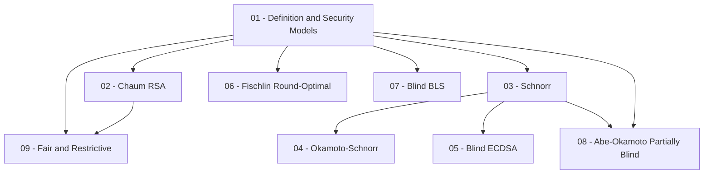
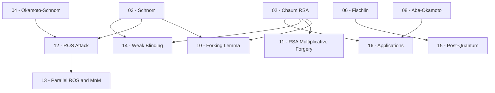

Course này trình bày hệ thống các **Blind Signature Scheme** từ định nghĩa nền tảng đến các attack hiện đại, kết hợp phân tích bảo mật chính thức và CTF exploitation patterns.

**Kiến thức nền tảng yêu cầu**: Discrete math, modular arithmetic, group theory, finite fields, ECC cơ bản, hash functions/MACs, RSA và public-key cryptography cơ bản.

**Tài liệu tham khảo chính**: Chaum 1983; Pointcheval & Stern, JoC 2000; Abe & Okamoto, CRYPTO 2000; Boldyreva, PKC 2003; Benhamouda et al., EUROCRYPT 2021; Boneh & Shoup (toc.cryptobook.us).

---

## Lesson Overview

| # | Title | Type | File | Prerequisites |
|---|-------|------|------|---------------|
| 01 | Blind Signature: Definition & Security Models | Foundation | [[01-blind-signature-definition-security-models\|01. Definition & Security Models]] | — |
| 02 | Chaum RSA Blind Signature | Scheme | [[02-chaum-rsa-blind-signature\|02. Chaum RSA Blind Signature]] | 01 |
| 03 | Schnorr Blind Signature | Scheme | [[03-schnorr-blind-signature\|03. Schnorr Blind Signature]] | 01 |
| 04 | Okamoto-Schnorr Blind Signature | Scheme | [[04-okamoto-schnorr-blind-signature\|04. Okamoto-Schnorr Blind Signature]] | 01, 03 |
| 05 | Blind ECDSA | Scheme | [[05-blind-ecdsa\|05. Blind ECDSA]] | 01, 03 |
| 06 | Fischlin's Round-Optimal Blind Signature | Scheme | [[06-fischlin-round-optimal\|06. Fischlin Round-Optimal]] | 01 |
| 07 | Blind BLS (Boldyreva) | Scheme | [[07-blind-bls-boldyreva\|07. Blind BLS (Boldyreva)]] | 01 |
| 08 | Partially Blind Signature: Abe-Okamoto | Scheme | [[08-abe-okamoto-partially-blind\|08. Abe-Okamoto Partially Blind]] | 01, 03 |
| 09 | Fair & Restrictive Blind Signatures | Scheme | [[09-fair-restrictive-blind-signatures\|09. Fair & Restrictive Blind Signatures]] | 01, 02 |
| 10 | Forking Lemma for Blind Signatures | Deep Dive | [[10-forking-lemma-blind-signatures\|10. Forking Lemma]] | 02, 03 |
| 11 | Attack I — RSA Blinding: Multiplicative Forgery | Attack | [[11-rsa-blinding-multiplicative-forgery\|11. Attack I — RSA Multiplicative Forgery]] | 02 |
| 12 | Attack II — The ROS Attack | Attack | [[12-ros-attack\|12. Attack II — ROS Attack]] | 03, 04 |
| 13 | Attack III — Parallel ROS & M&M Attack | Attack | [[13-parallel-ros-mnm-attack\|13. Attack III — Parallel ROS & M&M]] | 12 |
| 14 | Attack IV — Weak Blinding & Linkability Flaws | Attack | [[14-weak-blinding-linkability-flaws\|14. Attack IV — Weak Blinding]] | 02, 03 |
| 15 | Post-Quantum Blind Signatures | Scheme | [[15-post-quantum-blind-signatures\|15. Post-Quantum Blind Signatures]] | 01, 06 |
| 16 | Applications: eCash, e-Voting & Anonymous Credentials | Protocol | [[16-applications-ecash-evoting-credentials\|16. Applications]] | 01, 02, 08 |
| A0 | Blind Signature CTF Cheatsheet | Appendix | [[a0-ctf-cheatsheet\|A0. CTF Cheatsheet]] | 11, 12, 13, 14 |
| A1 | ROS Attack — SageMath Implementation | Appendix | [[a1-ros-attack-implementation\|A1. ROS Implementation]] | 12, 13 |
| A2 | Formal Definitions Reference | Appendix | [[a2-formal-definitions-reference\|A2. Formal Definitions]] | 01–05 |

**Lesson types**: Foundation · Scheme · Attack · Protocol · Deep Dive · Appendix

---

## Dependency Graph

### Phần Schemes

### Phần Attacks & Advanced

---

## Diagram Assets Plan

| Lesson | File | Mô tả |
|--------|------|--------|
| 01 | `assets/img-01-blind-sig-ecosystem.html` | Kiến trúc tổng quan: User, Signer, Verifier với 3 phase Blind / Sign / Unblind |
| 07 | `assets/img-07-pairing-structure.html` | Cấu trúc bilinear pairing $e: \mathbb{G}_1 \times \mathbb{G}_2 \to \mathbb{G}_T$ |
| 12 | `assets/img-12-ros-attack-structure.html` | Ma trận ROS — hệ $\ell+1$ equations trên $\ell$ unknowns |
| 13 | `assets/img-13-mnm-attack-flow.html` | M&M attack — concurrent sessions với mix-and-match transcript arrows |

> Mermaid sequenceDiagram và flowchart không liệt kê ở đây.

---

## Progress

### Foundation

- [ ] [[01-blind-signature-definition-security-models\|01. Blind Signature: Definition & Security Models]]

### Schemes

- [ ] [[02-chaum-rsa-blind-signature\|02. Chaum RSA Blind Signature]]
- [ ] [[03-schnorr-blind-signature\|03. Schnorr Blind Signature]]
- [ ] [[04-okamoto-schnorr-blind-signature\|04. Okamoto-Schnorr Blind Signature]]
- [ ] [[05-blind-ecdsa\|05. Blind ECDSA]]
- [ ] [[06-fischlin-round-optimal\|06. Fischlin's Round-Optimal Blind Signature]]
- [ ] [[07-blind-bls-boldyreva\|07. Blind BLS (Boldyreva)]]
- [ ] [[08-abe-okamoto-partially-blind\|08. Partially Blind Signature: Abe-Okamoto]]
- [ ] [[09-fair-restrictive-blind-signatures\|09. Fair & Restrictive Blind Signatures]]

### Deep Dive

- [ ] [[10-forking-lemma-blind-signatures\|10. Forking Lemma for Blind Signatures]]

### Attacks

- [ ] [[11-rsa-blinding-multiplicative-forgery\|11. Attack I — RSA Blinding: Multiplicative Forgery]]
- [ ] [[12-ros-attack\|12. Attack II — The ROS Attack]]
- [ ] [[13-parallel-ros-mnm-attack\|13. Attack III — Parallel ROS & M&M Attack]]
- [ ] [[14-weak-blinding-linkability-flaws\|14. Attack IV — Weak Blinding & Linkability Flaws]]

### Advanced & Applications

- [ ] [[15-post-quantum-blind-signatures\|15. Post-Quantum Blind Signatures]]
- [ ] [[16-applications-ecash-evoting-credentials\|16. Applications: eCash, e-Voting & Anonymous Credentials]]

### Appendices

- [ ] [[a0-ctf-cheatsheet\|A0. Blind Signature CTF Cheatsheet]]
- [ ] [[a1-ros-attack-implementation\|A1. ROS Attack — SageMath Implementation]]
- [ ] [[a2-formal-definitions-reference\|A2. Formal Definitions Reference]]
