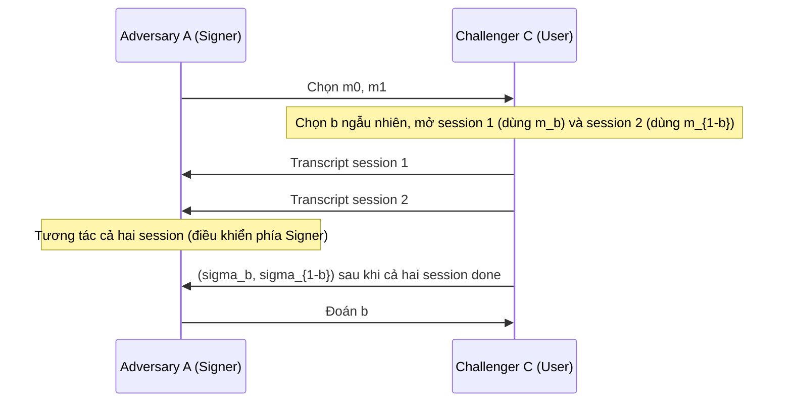
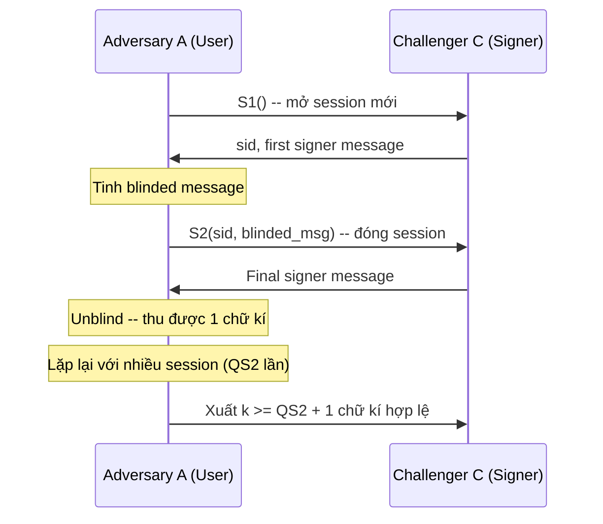

> **Prerequisites**: Digital signature (EUF-CMA), hash function (Random Oracle Model), PPT adversary, cyclic group cơ bản  
> **Lesson type**: Foundation
>
> **Notation** (ký hiệu dùng mà không định nghĩa trong bài này):
> | Ký hiệu | Ý nghĩa |
> |---------|---------|
> | $\lambda$ | Security parameter |
> | $\mathcal{A}$ | Adversary (PPT algorithm) |
> | $\mathsf{negl}(\lambda)$ | Negligible function của $\lambda$ |
> | $\stackrel{R}{\leftarrow}$ | Lấy mẫu đều ngẫu nhiên |
> | $\mathcal{M}$ | Message space |
> | $\mathsf{pk}, \mathsf{sk}$ | Public key, secret key |

---

## Motivation

Trong hệ thống chữ ký điện tử thông thường (EUF-CMA), signer biết đầy đủ message $m$ mà mình ký. Điều này phù hợp cho nhiều ứng dụng, nhưng có những tình huống mà người dùng cần nhận chữ ký mà **không tiết lộ nội dung message cho signer**.

Ví dụ điển hình: trong hệ thống **e-cash** của Chaum (1983), ngân hàng cần ký lên một "đồng tiền số" (một số serial ngẫu nhiên do user chọn) để xác nhận giá trị, nhưng không được biết serial đó là gì — nếu biết, ngân hàng có thể theo dõi giao dịch và phá vỡ tính ẩn danh của người dùng.

Nhu cầu này dẫn đến primitive **blind signature** (chữ ký mù): user *làm mờ* (blind) message trước khi gửi cho signer, signer ký trên phiên bản đã làm mờ mà không thấy nội dung thực, sau đó user *bỏ làm mờ* (unblind) để thu được chữ ký hợp lệ trên message gốc. Toàn bộ quá trình đảm bảo signer không thể liên kết chữ ký cuối cùng với phiên ký ban đầu.

![[assets/img-01-blind-sig-ecosystem.png]]
*Ba bên tham gia và ba phase của giao thức blind signature: User làm mờ message, Signer ký mù, User bỏ làm mờ và gửi chữ ký cho Verifier.*

---

## Cú pháp (Syntax)

Một blind signature scheme BS gồm hai thuật toán thường trực và một giao thức tương tác:

> [!note] Definition 1.1 — Blind Signature Scheme (Syntax)
> Một **blind signature scheme** BS = ($\mathsf{KeyGen}$, $\langle \mathsf{S}, \mathsf{U} \rangle$, $\mathsf{Verify}$) gồm:
>
> **$\mathsf{KeyGen}(1^\lambda)$**
> - Input: security parameter $1^\lambda$
> - Output: cặp khóa $(\mathsf{sk}, \mathsf{pk})$
>
> **Giao thức ký $\langle \mathsf{S}(\mathsf{sk}), \mathsf{U}(\mathsf{pk}, m) \rangle$**
> - Tương tác giữa Signer $\mathsf{S}$ (giữ $\mathsf{sk}$) và User $\mathsf{U}$ (giữ $\mathsf{pk}$ và message $m \in \mathcal{M}$)
> - Cuối giao thức: $\mathsf{U}$ thu được chữ ký $\sigma$ (hoặc $\bot$ nếu thất bại); $\mathsf{S}$ không thu được output có ý nghĩa
>
> **$\mathsf{Verify}(\mathsf{pk}, m, \sigma)$**
> - Input: $\mathsf{pk}$, message $m \in \mathcal{M}$, chữ ký $\sigma$
> - Output: $1$ (hợp lệ) hoặc $0$ (không hợp lệ)

Giao thức ký thường được phân tách thành ba bước:

**Blind** (phía User): User tính $\hat{m} = \mathsf{Blind}(\mathsf{pk}, m; r)$ từ message $m$ và *blinding factor* ngẫu nhiên $r$, rồi gửi $\hat{m}$ cho Signer.

**Sign** (phía Signer): Signer tính $\hat{\sigma} = \mathsf{Sign}(\mathsf{sk}, \hat{m})$ và trả về $\hat{\sigma}$ cho User.

**Unblind** (phía User): User tính $\sigma = \mathsf{Unblind}(\hat{\sigma}, r)$ để thu được chữ ký thực sự trên $m$.

### Canonical Three-Move Blind Signature

Nhiều scheme thực tế (Chaum RSA, Schnorr, BLS) có dạng **canonical three-move**: giao thức ký gồm đúng ba bước — User gửi $\hat{m}$, Signer gửi $\hat{\sigma}$, rồi User unblind. Đây là loại scheme được nghiên cứu chủ yếu trong course này.

Dạng tổng quát hơn (multi-round) và round-optimal (2-round) cũng tồn tại — sẽ được bàn ở [[06-fischlin-round-optimal|Lesson 06]].

---

## Correctness

Yêu cầu đầu tiên là giao thức phải hoạt động đúng: khi cả hai bên honest, chữ ký thu được phải verify thành công.

> [!abstract] Definition 1.2 — Correctness
> BS là **correct** (hay **perfectly correct**) nếu với mọi $(\mathsf{sk}, \mathsf{pk}) \leftarrow \mathsf{KeyGen}(1^\lambda)$ và mọi $m \in \mathcal{M}$:
>
> $$
> \Pr\bigl[\mathsf{Verify}(\mathsf{pk}, m, \sigma) = 1 \;\big|\; \sigma \leftarrow \langle \mathsf{S}(\mathsf{sk}),\, \mathsf{U}(\mathsf{pk}, m) \rangle\bigr] = 1
> $$

Một số scheme lattice-based cho phép correctness error nhỏ (xác suất abort không bằng 0). Trong setting đó, correctness chỉ yêu cầu xác suất verify thành công là *overwhelming* (gần bằng 1). Định nghĩa OMUF chỉ có ý nghĩa khi correctness error là negligible — nếu scheme thường xuyên abort, adversary không thể thu đủ chữ ký dù tương tác nhiều lần.

---

## Security Property I: Blindness

Blindness đảm bảo rằng Signer không thể liên kết một phiên ký với chữ ký cuối cùng — ngay cả khi signer nhận được cả hai chữ ký và giữ toàn bộ transcript.

> [!note] Definition 1.3 — Blindness Game (BlindBS)
> Game được chạy giữa Challenger $\mathcal{C}$ và adversary $\mathcal{A}$ (đóng vai Signer):
>
> **Setup**: $\mathcal{C}$ sinh $(\mathsf{sk}, \mathsf{pk}) \leftarrow \mathsf{KeyGen}(1^\lambda)$, chọn bit $b \stackrel{R}{\leftarrow} \{0,1\}$, trao $\mathsf{pk}$ và $\mathsf{sk}$ cho $\mathcal{A}$.
>
> **Online**: $\mathcal{A}$ chọn hai message $m_0, m_1 \in \mathcal{M}$. $\mathcal{C}$ mở hai signing session song song, trong đó session 1 dùng $m_b$ và session 2 dùng $m_{1-b}$. $\mathcal{A}$ tương tác với cả hai session (điều khiển phía Signer). Khi cả hai session hoàn thành, $\mathcal{C}$ trao cho $\mathcal{A}$ hai chữ ký $(\sigma_b, \sigma_{1-b})$ — nhưng không nói session nào tương ứng với $m_0$ hay $m_1$.
>
> **Output**: $\mathcal{A}$ đoán bit $b' \in \{0,1\}$. $\mathcal{A}$ thắng nếu $b' = b$.
>
> **Advantage**:
> $$
> \mathsf{Adv}^{\mathsf{Blind}}_{\mathsf{BS},\mathcal{A}} := \left|\Pr[b' = b] - \frac{1}{2}\right|
> $$

> [!note] Definition 1.4 — Perfect Blindness
> BS có **perfect blindness** nếu $\mathsf{Adv}^{\mathsf{Blind}}_{\mathsf{BS},\mathcal{A}} = 0$ với **mọi** adversary $\mathcal{A}$ (kể cả unbounded). Đây là blindness information-theoretic — không phụ thuộc vào giả thiết tính toán.

Trong **honest signer model**, $\mathcal{A}$ nhận $\mathsf{sk}$ từ $\mathcal{C}$. Trong **malicious signer model** (mạnh hơn), $\mathcal{A}$ tự chọn $\mathsf{sk}$ và $\mathsf{pk}$ tùy ý. Course này tập trung vào honest signer model trừ khi có ghi chú khác.

---

## Security Property II: One-More Unforgeability (OMUF)

OMUF là analog của EUF-CMA cho blind signatures. Intuition: sau $\ell$ phiên ký hoàn chỉnh, adversary không thể tạo ra hơn $\ell$ chữ ký hợp lệ trên các message phân biệt.

> [!note] Definition 1.5 — OMUF Game (OMUF-BS)
> Game giữa Challenger $\mathcal{C}$ và adversary $\mathcal{A}$ (đóng vai User):
>
> **Setup**: $\mathcal{C}$ sinh $(\mathsf{sk}, \mathsf{pk}) \leftarrow \mathsf{KeyGen}(1^\lambda)$, đặt $\ell_{\mathsf{closed}} = 0$. Trao $\mathsf{pk}$ cho $\mathcal{A}$.
>
> **Oracle $\mathsf{S}_1$**: Khi $\mathcal{A}$ gọi, $\mathcal{C}$ khởi tạo một session mới với identifier $\mathsf{sid}$, trả về message đầu tiên của Signer (nếu có), đánh dấu session là *open*.
>
> **Oracle $\mathsf{S}_2(\mathsf{sid}, \cdot)$**: Khi $\mathcal{A}$ gửi message của User cho session $\mathsf{sid}$, $\mathcal{C}$ trả về message cuối của Signer để hoàn tất session; đặt $\ell_{\mathsf{closed}} \mathrel{+}= 1$, đánh dấu session là *closed*.
>
> **Output**: $\mathcal{A}$ xuất danh sách $(m_1, \sigma_1), \ldots, (m_k, \sigma_k)$. $\mathcal{A}$ **thắng** nếu:
> $$
> k \geq \ell_{\mathsf{closed}} + 1 \quad \text{và} \quad \forall i: \mathsf{Verify}(\mathsf{pk}, m_i, \sigma_i) = 1 \quad \text{và} \quad m_i \neq m_j \text{ với } i \neq j
> $$
>
> **Advantage**: $\mathsf{Adv}^{\mathsf{OMUF}}_{\mathsf{BS},\mathcal{A}} := \Pr[\mathcal{A} \text{ wins OMUF-BS}]$

> [!abstract] Definition 1.6 — OMUF Security
> BS là **(ε, t, $Q_{\mathsf{S}_1}$, $Q_{\mathsf{S}_2}$)-OMUF** nếu với mọi adversary $\mathcal{A}$ chạy trong thời gian $\leq t$, gọi $\mathsf{S}_1$ tối đa $Q_{\mathsf{S}_1}$ lần và $\mathsf{S}_2$ tối đa $Q_{\mathsf{S}_2}$ lần:
>
> $$
> \mathsf{Adv}^{\mathsf{OMUF}}_{\mathsf{BS},\mathcal{A}} \leq \varepsilon
> $$

Lưu ý vai trò của $Q_{\mathsf{S}_1}$ và $Q_{\mathsf{S}_2}$: $\mathcal{A}$ có thể mở nhiều session hơn số session nó đóng — các session bị bỏ dở (*abandoned sessions*) không tạo ra chữ ký. Vì thế điều kiện thắng so sánh số chữ ký xuất với số **closed sessions** $\ell_{\mathsf{closed}} = Q_{\mathsf{S}_2}(\mathcal{A})$, không phải $Q_{\mathsf{S}_1}(\mathcal{A})$.

---

## Sequential vs. Concurrent OMUF

Đây là phân biệt cốt lõi trong bảo mật blind signature, ảnh hưởng trực tiếp đến phân tích ROS attack ở [[12-ros-attack|Lesson 12]].

> [!note] Definition 1.7 — Sequential vs. Concurrent
> **Sequential OMUF**: Adversary chỉ được mở **một** session tại một thời điểm. Cụ thể: $\mathcal{A}$ phải đóng session hiện tại trước khi mở session mới. Điều kiện này được áp đặt bằng cách $Q_{\mathsf{S}_1}(\mathcal{A}) = Q_{\mathsf{S}_2}(\mathcal{A})$ và các lời gọi xen kẽ: $\mathsf{S}_1, \mathsf{S}_2, \mathsf{S}_1, \mathsf{S}_2, \ldots$
>
> **Concurrent OMUF**: Adversary được mở **nhiều session song song** tùy ý. $Q_{\mathsf{S}_1}(\mathcal{A})$ có thể lớn hơn $Q_{\mathsf{S}_2}(\mathcal{A})$ nhiều lần; $\mathcal{A}$ có thể đan xen các lời gọi $\mathsf{S}_1$ và $\mathsf{S}_2$ theo bất kỳ thứ tự nào.

> [!warning] Sequential ≠ Concurrent
> Concurrent OMUF **mạnh hơn** sequential OMUF đáng kể. Nhiều scheme an toàn trong sequential setting hoàn toàn bị phá trong concurrent setting — điển hình là Schnorr blind signature, dễ bị **ROS attack** khi $\ell+1$ session chạy song song. Xem [[12-ros-attack|Lesson 12]] để phân tích chi tiết.

Có thể hình dung qua so sánh:

| Thuộc tính | Sequential OMUF | Concurrent OMUF |
|---|---|---|
| Số session đồng thời | 1 | Không giới hạn |
| Sức mạnh adversary | Yếu hơn | Mạnh hơn |
| Scheme an toàn | Chaum RSA, Schnorr, Okamoto-Schnorr | Blind BLS (Boldyreva), Fischlin |
| Thực tế | Không thực tế (deployment hiếm sequential) | Thực tế (web server ký nhiều req cùng lúc) |

---

## So sánh với EUF-CMA

Blind signature và digital signature thông thường chia sẻ mục tiêu chung là bảo vệ khỏi forgery, nhưng có những điểm khác biệt căn bản:

| Tiêu chí | EUF-CMA (standard signature) | OMUF (blind signature) |
|---|---|---|
| Adversary biết message? | Signer biết message khi ký | Signer **không biết** message |
| Oracle | Signing oracle $\mathcal{O}_{\mathsf{Sign}}(m)$ | Hai oracle $\mathsf{S}_1, \mathsf{S}_2$ tương tác |
| Điều kiện thắng | Forge $(m^*, \sigma^*)$ với $m^*$ chưa được ký | Tạo ra **nhiều hơn** $\ell$ chữ ký sau $\ell$ session |
| Blindness | Không yêu cầu | **Bắt buộc** — Signer không link được |
| Quan hệ | EUF-CMA ⊊ OMUF | OMUF ngụ ý EUF-CMA (implicit) |

> [!info] Quan hệ OMUF và EUF-CMA
> Nếu BS đạt OMUF thì BS đương nhiên ngăn adversary forge chữ ký mà không tương tác với Signer (vì sau 0 session, adversary không thể tạo ra 1 chữ ký hợp lệ). Tuy nhiên chiều ngược lại không đúng: EUF-CMA không đủ để đảm bảo OMUF, vì OMUF còn yêu cầu adversary không *khai thác thêm* từ các signing session.

---

## Computational Models: ROM và AGM

Hầu hết bằng chứng bảo mật blind signature dựa trên một hoặc cả hai model sau:

**Random Oracle Model (ROM)**: Hash function $H$ được model như một oracle ngẫu nhiên — bất kỳ query $H(x)$ nào đều trả về một giá trị ngẫu nhiên độc lập, nhất quán. ROM cho phép adversary bị *rewound* để trích xuất witness từ hai lần chạy với cùng random tape (kỹ thuật nền của Forking Lemma, xem [[10-forking-lemma-blind-signatures|Lesson 10]]).

**Algebraic Group Model (AGM)**: Mọi group element mà adversary output phải là tổ hợp tuyến tính (biết trước) của các group element đầu vào. Nói cách khác, adversary phải "biết" cách tính group element mà nó xuất. AGM là model yếu hơn ROM về mặt giả thiết (tức là mạnh hơn về phía adversary), nhưng cho phép chứng minh chặt chẽ hơn trong một số trường hợp.

> [!info] Khi nào cần AGM?
> Schnorr blind signature an toàn sequential OMUF dưới ROM + DL assumption, nhưng cần thêm AGM để chứng minh được trong setting cụ thể (Pointcheval & Stern 2000). Blind BLS (Boldyreva) đạt concurrent OMUF chỉ cần ROM + Gap-DH assumption, không cần AGM — đây là một ưu thế đáng kể.

---

## Summary

- Blind signature là primitive cho phép User nhận chữ ký mà Signer không biết nội dung message.
- **Syntax**: KeyGen + giao thức tương tác (Blind / Sign / Unblind) + Verify.
- **Correctness**: chữ ký thu được luôn verify thành công khi cả hai bên honest.
- **Blindness**: Signer không thể link session ký với chữ ký cuối cùng, kể cả khi có transcript và cả hai chữ ký. Perfect blindness là information-theoretic.
- **OMUF**: sau $\ell$ closed session, adversary không thể tạo $\geq \ell+1$ chữ ký hợp lệ.
- **Sequential vs. Concurrent OMUF**: concurrent mạnh hơn đáng kể và là target thực tế. Phần lớn Schnorr-based scheme chỉ đạt sequential.
- **ROM + AGM**: hai model tính toán chính trong proof bảo mật blind signature.

---

## References

- Chaum, D. — *Blind Signatures for Untraceable Payments*, CRYPTO 1983
- Pointcheval & Stern — *Security Arguments for Digital Signatures and Blind Signatures*, Journal of Cryptology 2000
- Hauck, Kiltz & Loss — *A Modular Treatment of Blind Signatures from Identification Schemes*, EUROCRYPT 2019
- Benhamouda et al. — *On the (In)Security of ROS*, EUROCRYPT 2021
- Boneh & Shoup — *A Graduate Course in Applied Cryptography*, Ch. 19 (toc.cryptobook.us)
