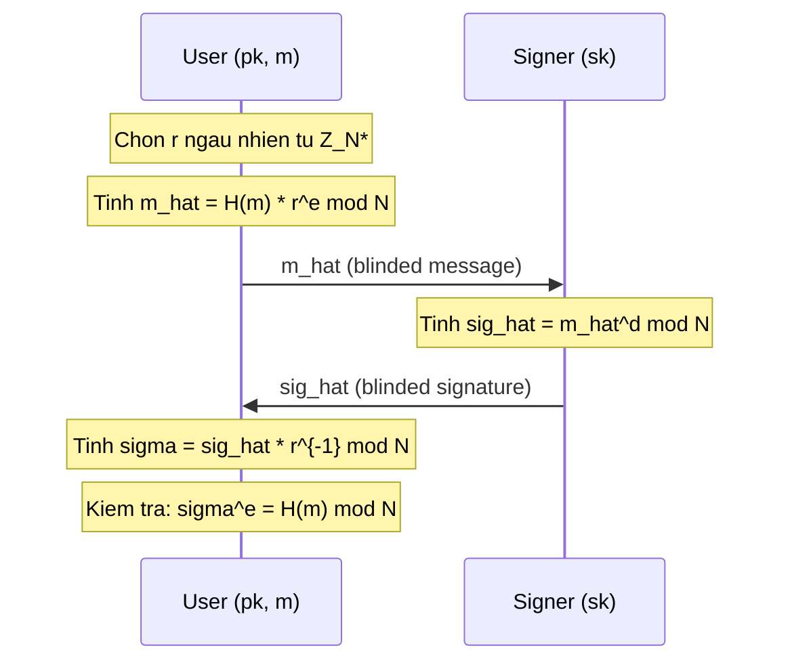

> **Prerequisites**: [[01-blind-signature-definition-security-models|01. Definition & Security Models]], RSA trapdoor permutation, multiplicative group $\mathbb{Z}_N^*$
> **Lesson type**: Scheme
>
> **Notation** (ký hiệu dùng mà không định nghĩa trong bài này):
> | Ký hiệu | Ý nghĩa |
> |---------|---------|
> | $N = pq$ | RSA modulus (tích hai số nguyên tố lớn) |
> | $\varphi(N)$ | Euler's totient: $(p-1)(q-1)$ |
> | $\mathbb{Z}_N^*$ | Nhóm nhân modulo $N$, bậc $\varphi(N)$ |
> | $H$ | Hash function: $\{0,1\}^* \to \mathbb{Z}_N^*$ (Random Oracle) |
> | $\mathsf{negl}(\lambda)$ | Negligible function |

---

## Motivation

Năm 1983, David Chaum giới thiệu scheme blind signature đầu tiên trong lịch sử, nền tảng cho hệ thống e-cash DigiCash. Ý tưởng cốt lõi xuất phát từ một tính chất đơn giản nhưng mạnh mẽ của RSA: **multiplicative homomorphism**.

Trong RSA thông thường, hàm ký $f(m) = m^d \bmod N$ là *multiplicative*:

$$
(m_1 \cdot m_2)^d \equiv m_1^d \cdot m_2^d \pmod{N}
$$

Tính chất này cho phép User nhân message với một *blinding factor* ngẫu nhiên $r^e$, Signer ký trên phiên bản đã làm mờ, và sau đó User loại bỏ đúng phần đóng góp của $r$ để thu được chữ ký thực sự — mà Signer không biết message gốc là gì.

---

## Mathematical Setting

> [!note] Setting 2.0 — RSA Group
> **Modulus**: $N = p \cdot q$ với $p, q$ là hai số nguyên tố lớn phân biệt.
> **Exponent pair**: $e \in \mathbb{Z}_{\varphi(N)}^*$ (public exponent), $d = e^{-1} \bmod \varphi(N)$ (secret exponent), thỏa $ed \equiv 1 \pmod{\varphi(N)}$.
> **RSA trapdoor**: Với phần tử bất kỳ $x \in \mathbb{Z}_N^*$, ta có $(x^e)^d \equiv x \pmod{N}$ và $(x^d)^e \equiv x \pmod{N}$.
> **Hash**: $H : \{0,1\}^* \to \mathbb{Z}_N^*$ được model như random oracle.

---

## Scheme Definition

> [!note] Scheme 2.1 — Chaum RSA Blind Signature
> **Type**: Blind Digital Signature
> **Setting**: RSA group $\mathbb{Z}_N^*$; hash $H : \{0,1\}^* \to \mathbb{Z}_N^*$ (random oracle)
>
> **$\mathsf{KeyGen}(1^\lambda)$**
> - Sinh hai số nguyên tố $p, q$ sao cho $N = pq$ có $\lambda$ bit
> - Chọn $e \stackrel{R}{\leftarrow} \mathbb{Z}_{\varphi(N)}^*$; tính $d = e^{-1} \bmod \varphi(N)$
> - Output: $\mathsf{pk} = (N, e)$, $\mathsf{sk} = (N, d)$
>
> **$\mathsf{Blind}(\mathsf{pk}, m;\, r)$** — phía User
> - Input: $\mathsf{pk} = (N, e)$, message $m \in \{0,1\}^*$, blinding factor $r \stackrel{R}{\leftarrow} \mathbb{Z}_N^*$
> - Tính $\hat{m} = H(m) \cdot r^e \bmod N$
> - Output: blinded message $\hat{m} \in \mathbb{Z}_N^*$; giữ $r$ bí mật
>
> **$\mathsf{Sign}(\mathsf{sk}, \hat{m})$** — phía Signer
> - Input: $\mathsf{sk} = (N, d)$, blinded message $\hat{m} \in \mathbb{Z}_N^*$
> - Tính $\hat{\sigma} = \hat{m}^d \bmod N$
> - Output: blinded signature $\hat{\sigma} \in \mathbb{Z}_N^*$
>
> **$\mathsf{Unblind}(\hat{\sigma}, r)$** — phía User
> - Input: blinded signature $\hat{\sigma}$, blinding factor $r$
> - Tính $\sigma = \hat{\sigma} \cdot r^{-1} \bmod N$
> - Output: signature $\sigma \in \mathbb{Z}_N^*$
>
> **$\mathsf{Verify}(\mathsf{pk}, m, \sigma)$**
> - Input: $\mathsf{pk} = (N, e)$, message $m$, signature $\sigma$
> - Tính $v = \sigma^e \bmod N$
> - Output: $1$ nếu $v = H(m)$; ngược lại $0$

Giao thức chỉ có **2 bước trao đổi** (User → Signer → User), không phải 3-move canonical như Schnorr. Đây là điểm đặc biệt của RSA blind signature: nó không cần commitment round từ Signer.

---

## Correctness

> [!abstract] Theorem 2.2 — Correctness
> Với mọi $(\mathsf{sk}, \mathsf{pk})$ sinh bởi $\mathsf{KeyGen}$ và mọi $m \in \{0,1\}^*$, nếu cả hai bên honest:
>
> $$
> \mathsf{Verify}\bigl(\mathsf{pk},\, m,\, \mathsf{Unblind}(\mathsf{Sign}(\mathsf{sk}, \mathsf{Blind}(\mathsf{pk}, m; r)), r)\bigr) = 1
> $$

**Proof.** Đặt $\hat{m} = H(m) \cdot r^e \bmod N$. Signer trả về $\hat{\sigma} = \hat{m}^d \bmod N$. User tính:

$$
\sigma = \hat{\sigma} \cdot r^{-1} = \hat{m}^d \cdot r^{-1} = \bigl(H(m) \cdot r^e\bigr)^d \cdot r^{-1} \pmod{N}
$$

Vì $\gcd(e, \varphi(N)) = 1$ nên $ed \equiv 1 \pmod{\varphi(N)}$, ta có $r^{ed} = r^1 = r$ theo định lý Euler. Do đó:

$$
\sigma = H(m)^d \cdot r^{ed} \cdot r^{-1} = H(m)^d \cdot r \cdot r^{-1} = H(m)^d \pmod{N}
$$

Trong bước Verify: $\sigma^e = (H(m)^d)^e = H(m)^{de} = H(m) \pmod{N}$. Điều kiện $\sigma^e = H(m)$ thỏa mãn. $\blacksquare$

---

## Security Analysis

### Blindness: Perfect

> [!abstract] Theorem 2.3 — Perfect Blindness
> Chaum RSA blind signature có **perfect blindness** (information-theoretic): với mọi adversary (kể cả computationally unbounded), $\mathsf{Adv}^{\mathsf{Blind}} = 0$.

**Proof.** Adversary (Signer) quan sát $\hat{m} = H(m) \cdot r^e \bmod N$. Do $r \stackrel{R}{\leftarrow} \mathbb{Z}_N^*$ và $\gcd(e, \varphi(N)) = 1$, ánh xạ $r \mapsto r^e \bmod N$ là **bijection** trên $\mathbb{Z}_N^*$ (permutation). Vì vậy $r^e$ phân phối đều trên $\mathbb{Z}_N^*$, và tích $H(m) \cdot r^e$ cũng phân phối đều trên $\mathbb{Z}_N^*$ — **hoàn toàn độc lập với $m$**.

Adversary thấy $\hat{m}$ là một phần tử ngẫu nhiên đều của $\mathbb{Z}_N^*$, không mang thông tin về $m$. Kể cả khi nhận được cả hai chữ ký $(\sigma_0, \sigma_1)$ sau hai phiên ký, adversary không thể phân biệt phiên nào tương ứng với $m_0$ hay $m_1$ — vì transcript $(\hat{m}_0, \hat{m}_1)$ là độc lập với bit permutation $b$. $\blacksquare$

> [!tip] Tại sao perfect blindness quan trọng?
> Perfect blindness là information-theoretic — không phụ thuộc vào giả thiết tính toán. Điều này có nghĩa là kể cả quantum computer cũng không phá được blindness của Chaum RSA (dù RSA keygeneration bị Shor's algorithm tấn công).

### One-More Unforgeability: ct-RSA Assumption

OMUF của Chaum RSA **không thể chứng minh từ standard RSA assumption**. Đây là một điểm quan trọng và đã là open problem trong suốt ~20 năm (1983–2003). Bellare, Namprempre, Pointcheval & Semanko (BNPS, 2003) cuối cùng đã chứng minh được security dưới một assumption *mạnh hơn* (non-standard).

> [!note] Assumption 2.4 — One-More RSA Inversion (ct-RSA)
> Cho RSA keypair $\mathsf{pk} = (N, e)$. Adversary $\mathcal{A}$ được cho:
> - Oracle **Target**: trả về các điểm ngẫu nhiên $t_1, \ldots, t_{Q_T} \stackrel{R}{\leftarrow} \mathbb{Z}_N^*$
> - Oracle **Helper** $(\cdot)^d$: thực hiện RSA inversion trên input bất kỳ
>
> Assumption: không có PPT $\mathcal{A}$ nào có thể tính $\{t_i^d\}_{i=1}^{Q_T}$ với số lần gọi Helper **nghiêm ngặt nhỏ hơn** $Q_T$.

Nói cách khác: để invert $\ell$ target points, adversary buộc phải gọi Helper ít nhất $\ell$ lần. Nếu có thể invert $\ell+1$ target points với chỉ $\ell$ lần gọi Helper → vi phạm ct-RSA.

> [!abstract] Theorem 2.5 — OMUF (Bellare et al. 2003)
> Chaum RSA blind signature là OMUF (concurrent) trong Random Oracle Model dưới **one-more RSA inversion assumption (ct-RSA)**.

**Proof sketch.** Giả sử adversary $\mathcal{A}$ có thể forge $\ell_{\mathsf{closed}} + 1$ chữ ký sau $\ell_{\mathsf{closed}}$ signing session. Ta xây dựng reduction $\mathcal{B}$ giải ct-RSA:

$\mathcal{B}$ nhận $\ell_{\mathsf{closed}} + 1$ target points $t_1, \ldots, t_{\ell+1}$ từ Target oracle, và có Helper oracle $(\cdot)^d$. $\mathcal{B}$ chạy $\mathcal{A}$, mô phỏng oracle $H$ (random oracle) và các signing session:

Mỗi khi $\mathcal{A}$ query $H(m_i)$, $\mathcal{B}$ trả về $t_j$ (một target point chưa dùng) và ghi nhớ mapping. Mỗi khi $\mathcal{A}$ hoàn thành một signing session (gửi $\hat{m}$), $\mathcal{B}$ gọi Helper để tính $\hat{m}^d$. Cuối cùng, khi $\mathcal{A}$ xuất $\ell+1$ chữ ký hợp lệ, $\mathcal{B}$ dùng chúng để suy ngược ra $\ell+1$ giá trị $t_j^d$ — nhưng chỉ gọi Helper $\ell$ lần. Điều này vi phạm ct-RSA. $\square$

*(Proof đầy đủ trong: Bellare, Namprempre, Pointcheval & Semanko, Journal of Cryptology 2003.)*

> [!warning] Giới hạn của Chaum RSA
> Bảo mật OMUF dựa trên **ct-RSA assumption**, không phải standard RSA. Assumption này ít được nghiên cứu và chưa được xem là cứng vững như RSA standard. Ngoài ra, RSA blind signature **không có chuẩn hóa padding** an toàn cho blind setting — phần này sẽ được khai thác trong [[11-rsa-blinding-multiplicative-forgery|Lesson 11]].

---

## Tính chất nổi bật

**Hiệu quả**: Mỗi bên chỉ cần tính 1 modular exponentiation. User tính $r^e$ và $H(m)$ khi blind; Signer tính $\hat{m}^d$; User tính $\hat{\sigma} \cdot r^{-1}$.

**2-round**: Không cần commitment round từ Signer (khác với Schnorr 3-move). Điều này giúp giảm độ trễ mạng.

**Perfect blindness**: Information-theoretic — mạnh nhất có thể về mặt blindness.

**Concurrent security**: Khác với Schnorr blind signature (chỉ sequential), Chaum RSA đạt OMUF concurrent dưới ct-RSA. Điều này xuất phát từ cấu trúc "stateless" của Signer — mỗi session độc lập hoàn toàn, không có state dùng chung.

---

## CTF Pattern

> [!example] CTF Pattern — Unpadded RSA Blind Signing Oracle
> Nhiều CTF challenge expose một oracle RSA ký trực tiếp $m^d \bmod N$ nhưng từ chối ký một số message nhất định (ví dụ: từ chối ký $H(\text{"admin"})$ trực tiếp).
>
> Khai thác: User chọn ngẫu nhiên $r$, tính $\hat{m} = m_{\text{target}} \cdot r^e \bmod N$ (message muốn ký nhân với blinding factor), gửi cho oracle. Oracle ký $\hat{m}^d \bmod N$. User tính $\sigma = \hat{\sigma} \cdot r^{-1} \bmod N$ để thu được $\sigma = m_{\text{target}}^d$.
>
> Chi tiết khai thác với hash và các edge case: xem [[11-rsa-blinding-multiplicative-forgery|Lesson 11]].

---

## Summary

- Chaum RSA blind signature dựa trên **multiplicative homomorphism của RSA**: $(m \cdot r^e)^d = m^d \cdot r$.
- Giao thức **2-round**: User blind ($\hat{m} = H(m) \cdot r^e$) → Signer ký ($\hat{\sigma} = \hat{m}^d$) → User unblind ($\sigma = \hat{\sigma} / r$).
- **Correctness**: trực tiếp từ $ed \equiv 1 \pmod{\varphi(N)}$.
- **Perfect blindness**: $r^e$ là bijection trên $\mathbb{Z}_N^*$ → blinded message phân phối đều, không mang thông tin về $m$.
- **OMUF**: concurrent-secure dưới **ct-RSA assumption** (non-standard), được chứng minh bởi BNPS 2003.
- Điểm yếu thực tế: thiếu padding chuẩn → khai thác trong [[11-rsa-blinding-multiplicative-forgery|Lesson 11]].

---

## References

- Chaum, D. — *Blind Signatures for Untraceable Payments*, CRYPTO 1983
- Bellare, Namprempre, Pointcheval & Semanko — *The One-More-RSA-Inversion Problems and the Security of Chaum's Blind Signature Scheme*, Journal of Cryptology 2003
- Pointcheval & Stern — *Security Arguments for Digital Signatures and Blind Signatures*, Journal of Cryptology 2000
- Boneh & Shoup — *A Graduate Course in Applied Cryptography*, Ch. 13 & 19 (toc.cryptobook.us)
