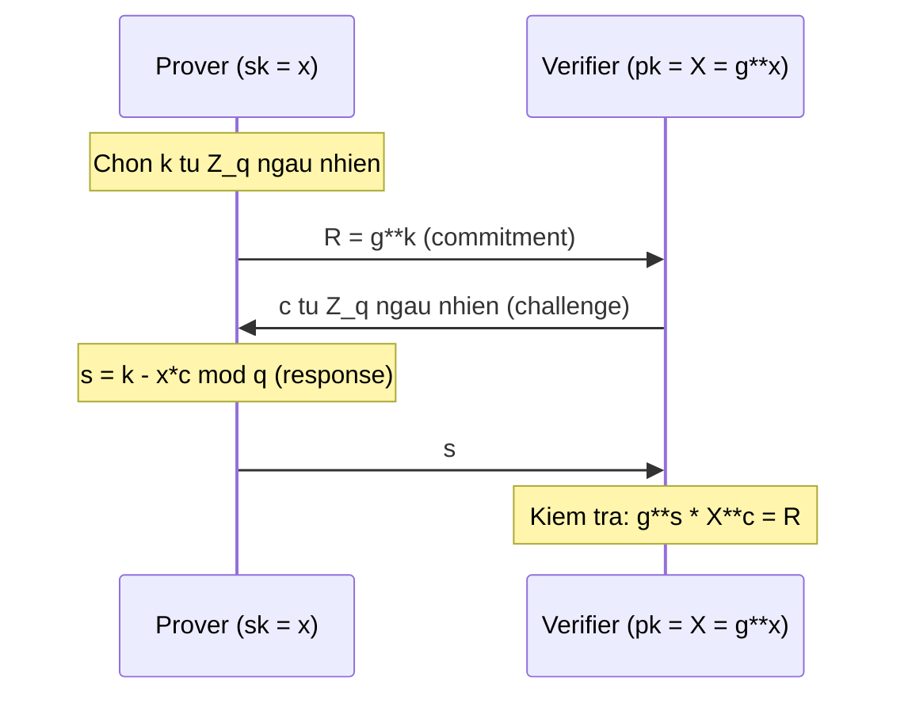

> **Prerequisites**: [[01-blind-signature-definition-security-models|01. Definition & Security Models]], Schnorr identification protocol, discrete logarithm problem (DLP), Fiat-Shamir transform, Random Oracle Model
> **Lesson type**: Scheme
>
> **Notation** (ký hiệu dùng mà không định nghĩa trong bài này):
> | Ký hiệu | Ý nghĩa |
> |---------|---------|
> | $\mathbb{G}$ | Cyclic group bậc nguyên tố $q$ |
> | $g$ | Generator của $\mathbb{G}$ |
> | $\mathbb{Z}_q$ | Vành số nguyên modulo $q$ |
> | $H$ | Hash function: $\{0,1\}^* \to \mathbb{Z}_q$ (random oracle) |
> | $x$ | Secret key $\in \mathbb{Z}_q^*$ |
> | $X = g^x$ | Public key $\in \mathbb{G}$ |
> | $\mathsf{negl}(\lambda)$ | Negligible function |

---

## Motivation

Trong khi Chaum RSA blind signature khai thác homomorphism nhân của RSA, Schnorr blind signature (Chaum & Pedersen 1992, Pointcheval & Stern 1996) áp dụng ý tưởng tương tự cho **Schnorr identification protocol** trong nhóm cyclic discrete-log.

Ý tưởng trung tâm: Schnorr identification là giao thức 3-move (commit $R$ → challenge $c$ → response $s$). Nếu User đứng giữa Signer và Verifier, User có thể **biến đổi ngẫu nhiên** commitment và challenge trước khi forward — sao cho signature cuối cùng là hợp lệ nhưng Signer không thể nhận ra transcript gốc.

Kỹ thuật randomization này — thêm hai tham số $(α, β) \in \mathbb{Z}_q^2$ — cho phép User kiểm soát hoàn toàn cặp $(R', c')$ trong signature, trong khi Signer chỉ thấy challenge $c = c' - \beta$ (một giá trị ngẫu nhiên đều không mang thông tin).

---

## Schnorr Identification Protocol (Ôn lại)

Trước khi xem blind signature, ta ôn lại giao thức identification 3-move làm nền tảng:



Soundness (special soundness): hai response hợp lệ $(s, s')$ cho cùng $R$ với hai challenge $c \neq c'$ cho phép extract $x = (s - s')(c - c')^{-1} \bmod q$.

---

## Scheme Definition

> [!note] Scheme 3.1 — Schnorr Blind Signature
> **Type**: Blind Digital Signature
> **Setting**: Cyclic group $\mathbb{G}$ bậc nguyên tố $q$, generator $g$; hash $H: \{0,1\}^* \to \mathbb{Z}_q$ (random oracle)
>
> **$\mathsf{KeyGen}(1^\lambda)$**
> - Chọn $x \stackrel{R}{\leftarrow} \mathbb{Z}_q^*$; tính $X = g^x \in \mathbb{G}$
> - Output: $\mathsf{sk} = x$, $\mathsf{pk} = X$
>
> **$\mathsf{S}_1(\mathsf{sk})$** — Signer gửi commitment
> - Input: $\mathsf{sk} = x$
> - Chọn nonce $k \stackrel{R}{\leftarrow} \mathbb{Z}_q^*$; tính $R = g^k \in \mathbb{G}$
> - Lưu state $\mathsf{st}_S = k$
> - Output: $R$ (gửi cho User); giữ $\mathsf{st}_S$
>
> **$\mathsf{U}_1(\mathsf{pk}, m, R)$** — User blind và tính challenge
> - Input: $\mathsf{pk} = X$, message $m \in \{0,1\}^*$, commitment $R$
> - Chọn blinding factors $\alpha \stackrel{R}{\leftarrow} \mathbb{Z}_q$, $\beta \stackrel{R}{\leftarrow} \mathbb{Z}_q$
> - Tính $R' = g^\alpha \cdot R \cdot X^\beta \in \mathbb{G}$ (blinded commitment)
> - Tính $c' = H(R' \| m) \in \mathbb{Z}_q$ (challenge cho signature)
> - Tính $c = c' - \beta \bmod q$ (blinded challenge gửi Signer)
> - Lưu state $\mathsf{st}_U = (\alpha, \beta, c', R', m)$
> - Output: $c$ (gửi cho Signer); giữ $\mathsf{st}_U$
>
> **$\mathsf{S}_2(\mathsf{sk}, c, \mathsf{st}_S)$** — Signer trả lời challenge
> - Input: $\mathsf{sk} = x$, challenge $c \in \mathbb{Z}_q$, $\mathsf{st}_S = k$
> - Tính $s = k - x \cdot c \bmod q$
> - Output: $s$ (gửi cho User)
>
> **$\mathsf{U}_2(\mathsf{pk}, s, \mathsf{st}_U)$** — User unblind và thu signature
> - Input: $\mathsf{pk} = X$, response $s \in \mathbb{Z}_q$, $\mathsf{st}_U = (\alpha, \beta, c', R', m)$
> - Tính $s' = s + \alpha \bmod q$
> - Output: $\sigma = (R', c', s')$
>
> **$\mathsf{Verify}(\mathsf{pk}, m, \sigma)$**
> - Input: $\mathsf{pk} = X$, $m$, $\sigma = (R', c', s')$
> - Tính $R'' = g^{s'} \cdot X^{c'} \in \mathbb{G}$
> - Output: $1$ nếu $R'' = R'$ **và** $H(R'' \| m) = c'$; ngược lại $0$

```mermaid
sequenceDiagram
    participant U as User (pk, m)
    participant S as Signer (sk)
    Note over S: Chon k ngau nhien
    S->>U: R = g**k
    Note over U: Chon alpha, beta; R' = g**alpha * R * X**beta
    Note over U: c' = H(R' || m); c = c' - beta
    U->>S: c (blinded challenge)
    Note over S: s = k - x*c mod q
    S->>U: s
    Note over U: s' = s + alpha mod q; sigma = (R', c', s')
```

---

## Correctness

> [!abstract] Theorem 3.2 — Correctness
> Với mọi $(\mathsf{sk}, \mathsf{pk})$ và mọi $m$, nếu cả hai bên honest, giao thức trả về $\sigma = (R', c', s')$ thỏa mãn $\mathsf{Verify}(\mathsf{pk}, m, \sigma) = 1$.

**Proof.** Ta cần kiểm tra hai điều kiện trong $\mathsf{Verify}$:

**Điều kiện 1**: $g^{s'} \cdot X^{c'} = R'$.

$$
g^{s'} \cdot X^{c'} = g^{s + \alpha} \cdot g^{xc'} = g^{(k - xc) + \alpha} \cdot g^{xc'}
$$

Thay $c = c' - \beta$:

$$
= g^{k - x(c' - \beta) + \alpha} \cdot g^{xc'} = g^{k - xc' + x\beta + \alpha + xc'} = g^{k + \alpha + x\beta}
$$

Mặt khác, từ cách tính $R'$:

$$
R' = g^\alpha \cdot R \cdot X^\beta = g^\alpha \cdot g^k \cdot g^{x\beta} = g^{k + \alpha + x\beta}
$$

Vậy $g^{s'} \cdot X^{c'} = R'$. $\checkmark$

**Điều kiện 2**: $H(R'' \| m) = c'$.

Vì $R'' = g^{s'} \cdot X^{c'} = R'$ (từ điều kiện 1), ta có $H(R'' \| m) = H(R' \| m) = c'$. $\checkmark$

$\blacksquare$

---

## Security Analysis

### Blindness: Perfect

> [!abstract] Theorem 3.3 — Perfect Blindness
> Schnorr blind signature có **perfect blindness**: $\mathsf{Adv}^{\mathsf{Blind}} = 0$ với mọi adversary (kể cả computationally unbounded), trong honest-signer model.

**Proof.** Signer quan sát transcript $(R, c, s)$. Ta cần chỉ ra transcript này không phụ thuộc vào message $m$.

Signer gửi $R = g^k$. User trả về $c = c' - \beta \bmod q$. Vì $\beta \stackrel{R}{\leftarrow} \mathbb{Z}_q$ là ngẫu nhiên đều và hoàn toàn ẩn với Signer, $c$ phân phối đều trên $\mathbb{Z}_q$ — **độc lập với $c' = H(R' \| m)$ và do đó với $m$**.

Signer tính $s = k - xc \bmod q$, hoàn toàn xác định bởi $k$ và $c$. Transcript $(R, c, s)$ mà Signer giữ phân phối đồng nhất trên tất cả transcripts hợp lệ của identification protocol với commitment $R$ — bất kể $m$ là gì.

Kể cả khi Signer nhận được cả hai chữ ký cuối cùng $(\sigma_0, \sigma_1) = ((R'_0, c'_0, s'_0), (R'_1, c'_1, s'_1))$, do $R'_i = g^{\alpha_i} \cdot R_i \cdot X^{\beta_i}$ với $(\alpha_i, \beta_i)$ ẩn, Signer không thể khớp $R'_i$ với $R_i$ nếu không biết $\alpha_i, \beta_i$. $\blacksquare$

> [!warning] Honest-signer vs. Malicious-signer
> Perfect blindness chỉ được đảm bảo trong **honest-signer model**. Trong malicious-signer model (Signer tự chọn khóa), Signer có thể nhúng thông tin vào $R$ theo cách đặc biệt để tracking User sau này. Schnorr blind signature chưa được chứng minh blind dưới malicious-signer model.

### Sequential OMUF: ROM + DL

> [!abstract] Theorem 3.4 — Sequential OMUF (Pointcheval & Stern 2000)
> Schnorr blind signature đạt **sequential OMUF** trong Random Oracle Model, dưới Discrete Logarithm assumption: với mọi PPT adversary $\mathcal{A}$ chạy sequentially,
>
> $$
> \mathsf{Adv}^{\mathsf{OMUF}}_{\mathsf{seq},\mathcal{A}} \leq \mathsf{negl}(\lambda)
> $$
>
> dưới DL assumption trong $\mathbb{G}$.

**Proof sketch.** Dùng **Forking Lemma** (Bellare & Neven, hoặc Pointcheval & Stern): giả sử $\mathcal{A}$ forge được sau $\ell$ sequential session. Ta rewind $\mathcal{A}$ tại điểm query $H(R' \| m)$ để thu được hai phản hồi khác nhau $c'_1 \neq c'_2$ cho cùng $(R', m)$.

Hai chữ ký $(R', c'_1, s'_1)$ và $(R', c'_2, s'_2)$ thỏa:

$$
g^{s'_1} \cdot X^{c'_1} = R' = g^{s'_2} \cdot X^{c'_2}
$$

Suy ra $g^{s'_1 - s'_2} = X^{c'_2 - c'_1}$, tức là:

$$
x = \frac{s'_1 - s'_2}{c'_2 - c'_1} \bmod q
$$

Đây là giải DLP. Mâu thuẫn với DL assumption. $\square$

*(Proof đầy đủ trong: Pointcheval & Stern, Journal of Cryptology 2000; Bellare & Neven, ACM CCS 2006.)*

### Tại sao Concurrent OMUF bị phá

Đây là điểm yếu cốt lõi của Schnorr blind signature — và là lý do chính ROS attack tồn tại.

> [!danger] Concurrent OMUF bị phá — ROS Attack
> Schnorr blind signature **không** đạt concurrent OMUF với hơn $O(\text{polylog}(\lambda))$ session song song. Cụ thể, với $\ell + 1 = O(\ell)$ session concurrent (với $\ell$ đủ nhỏ), adversary có thể forge $\ell + 1$ chữ ký sau $\ell$ session — phá vỡ OMUF.
>
> Lý do kỹ thuật: trong concurrent setting, adversary kiểm soát tất cả $\ell$ challenge $c^{(1)}, \ldots, c^{(\ell)}$ đồng thời. User chọn $c^{(i)} = c'^{(i)} - \beta^{(i)}$; adversary có thể chọn các $c^{(i)}$ phụ thuộc nhau theo cách giải được hệ phương trình có liên quan đến **ROS problem**: tìm $(c_1, \ldots, c_\ell, c_{\ell+1})$ sao cho $c_{\ell+1} = \sum_i \rho_i c_i$ với $\rho_i$ biết trước. Điều này cho phép tính signature thứ $\ell+1$ là tổ hợp tuyến tính của $\ell$ signature đã có.

Phân tích chi tiết của ROS attack: [[12-ros-attack|Lesson 12]].

---

## Cấu trúc Algebraic của Blinding

Tính chất quan trọng của Schnorr blind signature là **blinding transformation tuyến tính**:

$$
R' = g^\alpha \cdot R \cdot X^\beta = g^{\alpha + k + x\beta}, \quad s' = s + \alpha = k - xc + \alpha
$$

Mối quan hệ giữa transcript gốc $(R, c, s)$ và blinded transcript $(R', c', s')$:

$$
R' = g^\alpha \cdot g^k \cdot g^{x\beta}, \quad c' = c + \beta, \quad s' = s + \alpha
$$

Đây là phép **affine transform** trên không gian transcript: mỗi transcript hợp lệ $(R, c, s)$ được map thành một transcript hợp lệ $(R', c', s')$ bằng cách cộng $(\alpha + x\beta, \beta, \alpha)$. Tập transcript hợp lệ là một *coset* trong không gian $(R, c, s)$.

Tính chất tuyến tính này vừa cho phép perfect blindness (mọi transcript hợp lệ có thể được sinh từ bất kỳ blinding factor nào), vừa là nguyên nhân của ROS vulnerability (tổ hợp tuyến tính nhiều transcript hợp lệ vẫn cho transcript hợp lệ).

---

## So sánh với Chaum RSA

| Tiêu chí | Chaum RSA | Schnorr Blind |
|---|---|---|
| Round count | 2-round | 3-move |
| Assumption (OMUF) | ct-RSA (non-standard) | DL (standard) |
| Sequential OMUF | Concurrent | Chỉ sequential |
| Concurrent OMUF | Có | **Không** (ROS attack) |
| Blindness | Perfect (IT) | Perfect (IT, honest-signer) |
| Signature size | $|N|$ bits (2048+) | $2\log q$ bits (nhỏ hơn nhiều) |
| Quantum safety | Không (Shor) | Không (Shor) |

---

## CTF Pattern

> [!example] CTF Pattern — Schnorr Blind Signing Oracle
> Trong nhiều CTF, Signer expose oracle trả về $(R, s)$ cho challenge $c$ do User chọn. Nếu User có thể chọn $c$ tự do, User nhận được $(R, c, s)$ hợp lệ. Dùng blinding $(\alpha, \beta)$ để unblind thành signature thực sự.
>
> Pattern thường gặp: server ký nhiều session đồng thời (concurrent) → ROS attack có thể áp dụng nếu $\ell$ đủ nhỏ. Xem [[12-ros-attack|Lesson 12]] và [[a0-ctf-cheatsheet|A0. CTF Cheatsheet]] để chi tiết.

---

## Summary

- Schnorr blind signature biến Schnorr identification thành blind signature bằng blinding transform $(\alpha, \beta)$: $R' = g^\alpha R X^\beta$, $c = c' - \beta$, $s' = s + \alpha$.
- **Giao thức 3-move**: Signer gửi $R$ → User gửi $c$ → Signer gửi $s$ → User unblind.
- **Correctness**: $g^{s'} X^{c'} = g^{k + \alpha + x\beta} = R'$ — trực tiếp từ đại số.
- **Perfect blindness** (honest-signer): Signer thấy $c = c' - \beta$ phân phối đều, không liên kết được với $m$.
- **Sequential OMUF** (DL in ROM): chứng minh qua Forking Lemma.
- **Concurrent OMUF bị phá**: tính tuyến tính của blinding → ROS attack — xem [[12-ros-attack|Lesson 12]].

---

## References

- Chaum & Pedersen — *Wallet Databases with Observers*, CRYPTO 1992
- Pointcheval & Stern — *Security Arguments for Digital Signatures and Blind Signatures*, Journal of Cryptology 2000
- Bellare & Neven — *Multi-Signatures in the Plain Public Key Model and a General Forking Lemma*, ACM CCS 2006
- Benhamouda et al. — *On the (In)Security of ROS*, EUROCRYPT 2021
- Boneh & Shoup — *A Graduate Course in Applied Cryptography*, Ch. 19 (toc.cryptobook.us)
