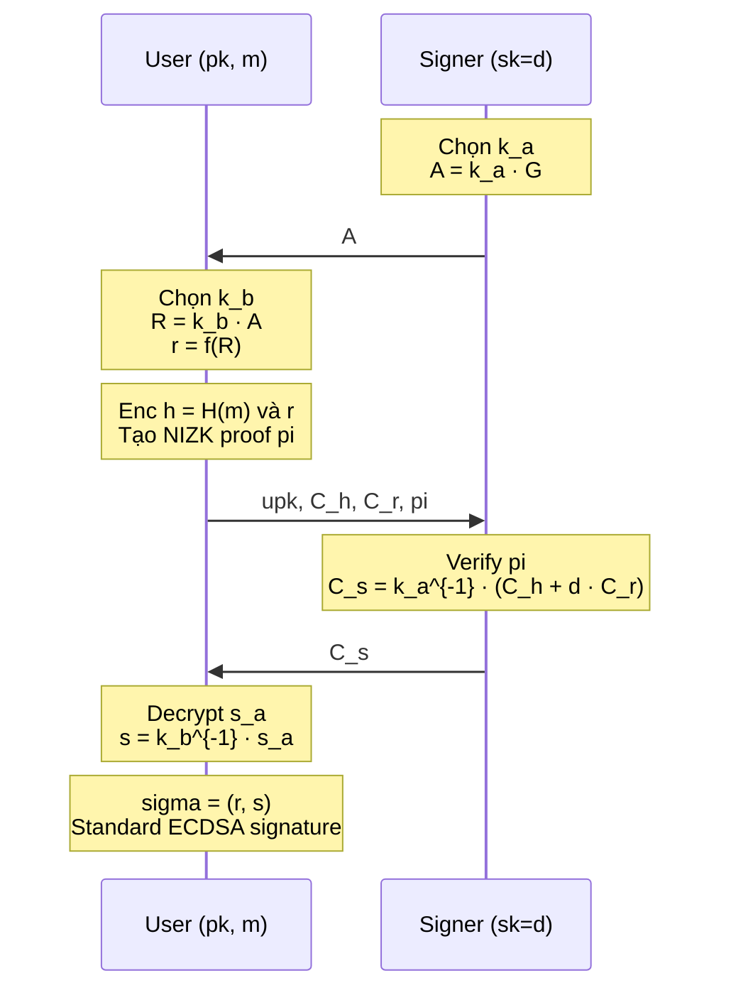

> **Prerequisites**: [[01-blind-signature-definition-security-models|01. Definition & Security Models]], [[03-schnorr-blind-signature|03. Schnorr Blind Signature]], ECDSA, additive homomorphic encryption cơ bản, ZK proof cơ bản
> **Lesson type**: Scheme
>
> **Notation** (ký hiệu dùng mà không định nghĩa trong bài này):
> | Ký hiệu | Ý nghĩa |
> |---------|---------|
> | $\mathbb{G}$ | Elliptic curve group bậc nguyên tố $q$ |
> | $G$ | Generator của $\mathbb{G}$ |
> | $q$ | Bậc của $\mathbb{G}$ (prime) |
> | $f: \mathbb{G} \to \mathbb{Z}_q$ | Conversion function: lấy x-coordinate của điểm mod $q$ |
> | $H: \{0,1\}^* \to \mathbb{Z}_q$ | Cryptographic hash function |
> | $d$ | Secret key $\in \mathbb{Z}_q^*$ |
> | $P = dG$ | Public key $\in \mathbb{G}$ |
> | $\mathsf{HE}$ | Additive homomorphic encryption scheme |
> | $\mathsf{NIZK}$ | Non-interactive zero-knowledge proof |
> | $\mathsf{negl}(\lambda)$ | Negligible function |

---

## Motivation

ECDSA là một trong những scheme chữ ký được triển khai rộng rãi nhất thực tế — có mặt trong TLS, SSH, Bitcoin, Ethereum. Nhu cầu xây dựng **blind ECDSA** xuất phát từ nhiều ứng dụng quan trọng: Bitcoin blind coin swap, anonymous credential tương thích với cơ sở hạ tầng ECDSA hiện có, và trustless tumbler service.

Tuy nhiên, "blindifying" ECDSA khó hơn đáng kể so với Schnorr hay RSA. Ba thách thức chính:

**A — Dependency on hash**: Signature $s = k^{-1}(H(m) + dr) \bmod q$ phụ thuộc vào $H(m)$. Để đạt blindness, User phải che giấu $H(m)$ khỏi Signer — không thể làm trực tiếp vì hash function không có homomorphism đơn giản.

**B — Dependency on nonce**: Nonce $k$ quyết định $R = kG$ và $r = f(R)$. $k$ phải bí mật với cả hai bên: với Signer (vì nếu Signer biết $k$ và $r$, Signer có thể tính $H(m)$ và liên kết session); với User (vì nếu User biết $k$, User có thể recover $d$).

**C — Nonlinearity**: Phép chia $k^{-1}$ và conversion function $f$ phá vỡ tính tuyến tính mà Schnorr blind signature khai thác. Không có blinding transform $(α, β)$ đơn giản nào dùng được trực tiếp.

---

## Generic Construction: HE + NIZK

Ý tưởng cốt lõi: dùng **additive homomorphic encryption (HE)** để Signer tính $k^{-1}(H(m) + dr)$ mà không học được $H(m)$ hay $m$.

> [!note] Scheme 5.1 — Generic Blind ECDSA (Qin-Cai-Yuen 2021)
> **Type**: Blind Digital Signature  
> **Setting**: EC group $\mathbb{G}$ bậc $q$, generator $G$; additive HE scheme $\mathsf{HE}$; NIZK proof system $\mathsf{NIZK}$; hash $H: \{0,1\}^* \to \mathbb{Z}_q$
>
> **$\mathsf{KeyGen}(1^\lambda)$**
> - Signer: chọn $d \stackrel{R}{\leftarrow} \mathbb{Z}_q^*$; tính $P = dG$
> - Output: $\mathsf{sk} = d$, $\mathsf{pk} = P$
>
> **$\mathsf{S}_1(\mathsf{sk})$** — Signer gửi partial nonce
> - Input: $\mathsf{sk} = d$
> - Chọn $k_a \stackrel{R}{\leftarrow} \mathbb{Z}_q^*$; tính $A = k_a G$
> - Lưu $\mathsf{st}_S = k_a$
> - Output: $A$ (gửi User)
>
> **$\mathsf{U}_1(\mathsf{pk}, m, A)$** — User blind và tính $R$
> - Input: $\mathsf{pk} = P$, message $m$, $A$
> - Sinh HE keypair: $(\mathsf{upk}, \mathsf{usk}) \leftarrow \mathsf{HE.KeyGen}(1^\lambda)$
> - Chọn $k_b \stackrel{R}{\leftarrow} \mathbb{Z}_q^*$; tính $R = k_b \cdot A = k_a k_b G$
> - Tính $r = f(R) \in \mathbb{Z}_q$ (x-coordinate của $R$ mod $q$)
> - Tính $h = H(m) \in \mathbb{Z}_q$
> - Mã hóa: $C_h = \mathsf{HE.Enc}(\mathsf{upk}, h)$, $C_r = \mathsf{HE.Enc}(\mathsf{upk}, r)$
> - Sinh NIZK proof $\pi$: chứng minh rằng $C_h, C_r$ là mã hóa đúng của $h \in \mathbb{Z}_q$ và $r \in \mathbb{Z}_q$
> - Lưu $\mathsf{st}_U = (k_b, h, r, \mathsf{usk})$
> - Output: $(\mathsf{upk}, C_h, C_r, \pi)$ (gửi Signer)
>
> **$\mathsf{S}_2(\mathsf{sk}, \mathsf{upk}, C_h, C_r, \pi, \mathsf{st}_S)$** — Signer tính encrypted $s$
> - Input: $\mathsf{sk} = d$, $\mathsf{st}_S = k_a$, received $(\mathsf{upk}, C_h, C_r, \pi)$
> - Verify NIZK: $\mathsf{NIZK.Vf}(\pi) = 1$ (nếu fail → abort)
> - Dùng HE homomorphism:
>   $C_s = k_a^{-1} \cdot (C_h \cdot C_r^d) = \mathsf{HE.Enc}(\mathsf{upk},\; k_a^{-1}(h + dr))$
>   (phép nhân với scalar và cộng ciphertext là homomorphic)
> - Output: $C_s$ (gửi User)
>
> **$\mathsf{U}_2(\mathsf{pk}, C_s, \mathsf{st}_U)$** — User decrypt và unblind
> - Input: $\mathsf{usk}$, $C_s$, $\mathsf{st}_U = (k_b, h, r, \mathsf{usk})$
> - Giải mã: $s_a = \mathsf{HE.Dec}(\mathsf{usk}, C_s) = k_a^{-1}(H(m) + dr) \bmod q$
> - Tính $s = k_b^{-1} \cdot s_a = (k_a k_b)^{-1}(H(m) + dr) = k^{-1}(H(m) + dr)$
>   (với $k = k_a k_b$ là nonce đầy đủ)
> - Output: $\sigma = (r, s)$
>
> **$\mathsf{Verify}(\mathsf{pk}, m, \sigma)$**
> - Input: $\mathsf{pk} = P$, $m$, $\sigma = (r, s)$
> - Tính $R' = s^{-1}H(m) G + s^{-1}r P$
> - Output: $1$ nếu $f(R') = r$; ngược lại $0$

---

## Correctness

> [!abstract] Theorem 5.2 — Correctness
> Với mọi $(\mathsf{sk}, \mathsf{pk})$ và mọi $m$, khi cả hai bên honest, $\sigma = (r, s)$ thu được là ECDSA signature hợp lệ trên $m$.

**Proof.** Nonce đầy đủ là $k = k_a k_b$. Signer tính $k_a^{-1}(H(m) + dr)$. User tính $s = k_b^{-1} \cdot k_a^{-1}(H(m) + dr) = k^{-1}(H(m) + dr) \bmod q$. Đây là ECDSA signature với nonce $k$ và $r = f(kG)$. Verification: $s^{-1}H(m)G + s^{-1}rP = k(H(m) + dr)^{-1}H(m)G + k(H(m)+dr)^{-1}r \cdot dG = kG(H(m) + dr)^{-1}(H(m) + dr) = kG = R$. Do đó $f(R') = f(R) = r$. $\blacksquare$

---

## Security Analysis

### Blindness

> [!abstract] Theorem 5.3 — Blindness
> Blind ECDSA đạt blindness dưới IND-CPA security của $\mathsf{HE}$, zero-knowledge của $\mathsf{NIZK}$, và hiding của commitment schemes.

**Proof sketch.** Signer quan sát $(\mathsf{upk}, C_h, C_r, \pi, C_s)$. Do IND-CPA của HE, $C_h$ và $C_r$ không tiết lộ $H(m)$ hay $r$. Do zero-knowledge của NIZK, proof $\pi$ không tiết lộ thông tin về plaintext. Signer không thể phân biệt session nào tương ứng với message nào. $\square$

### One-More Unforgeability: ABRO Model

OMUF của blind ECDSA phức tạp hơn đáng kể so với Schnorr, đòi hỏi model tính toán đặc biệt.

> [!note] Definition 5.4 — Algebraic Bijective Random Oracle Model (ABRO)
> **Bijective Random Oracle (BRO)**: Hash function $H$ được model như random oracle với tính chất bổ sung: $H$ là **bijection** từ message space sang $\mathbb{Z}_q$ — mọi value trong $\mathbb{Z}_q$ đều có đúng một preimage.
>
> **Algebraic Group Model (AGM)**: Mọi group element adversary xuất phải là tổ hợp tuyến tính biết trước của các group element nhận được.
>
> **ABRO = BRO + AGM**: Kết hợp cả hai constraint. Model này đủ mạnh để chứng minh OMUF của blind ECDSA, nhưng là non-standard assumption.

> [!abstract] Theorem 5.5 — OMUF under ABRO (Qin-Cai-Yuen 2021)
> Generic blind ECDSA đạt OMUF trong ABRO model dưới:
> - Hardness của một interactive DL-based assumption ("one-more" variant)
> - Assumption về EC group (đúng một subgroup bậc $q$)
> - IND-CPA security của $\mathsf{HE}$ và soundness của $\mathsf{NIZK}$
>
> Đặc biệt, ECDSA-ROS problem là hard trong ABRO model.

> [!warning] Non-standard model
> ABRO là model **non-standard** và **chưa được cộng đồng kiểm chứng rộng rãi**. Đây là điểm yếu lý thuyết đáng kể so với blind Schnorr (DL in ROM) hay blind BLS (Gap-DH in ROM).

### Concurrent Security (Approach mới nhất — 2025)

Một paper gần đây (Maire & Pulval-Dady, 2025) đề xuất cách tiếp cận mới: dùng MPC-in-the-head paradigm để extract message $m$ từ ZK proof, cho phép reduction trực tiếp về ECDSA assumption mà không cần ABRO.

> [!info] Blind ECDSA from ECDSA Assumption (2025)
> Construction mới dùng:
> - **Two-party nonce**: $k = k_u \cdot k_s \bmod q$ ($k_u$ do User chọn, $k_s$ do Signer chọn)
> - **Linearly HE modulo $q$**: encrypt $H(m)$ và $k_u^{-1}$ riêng biệt
> - **MPC-in-the-head ZK**: User chứng minh knowledge của $H(m)$ một cách extractable
> - **Concurrent OMUF**: Reduction extract $m$ và query standard ECDSA oracle — không cần ABRO
>
> Đây là first construction với concurrent OMUF dưới standard ECDSA assumption.

---

## ECDSA-ROS Attack

Trước khi xây dựng scheme, cần hiểu attack generic nhất trên blind ECDSA — tương tự ROS attack trên Schnorr.

> [!danger] ECDSA-ROS Attack
> Cho $\ell$ signing session cho ra các chữ ký $(r_j, s_j)$ trên messages $m_j$, adversary tìm vector $\vec{\rho} = (\rho_1, \ldots, \rho_\ell) \in \mathbb{Z}_q^\ell$ sao cho ba phương trình sau đồng thời thỏa mãn với message $m^*$ và điểm $R^*$:
>
> $$
> \frac{H(m^*)}{s^*} = \sum_{j=1}^\ell \rho_j \frac{H(m_j)}{s_j} \pmod{q}
> $$
>
> $$
> \frac{r^*}{s^*} = \sum_{j=1}^\ell \rho_j \frac{r_j}{s_j} \pmod{q}, \qquad R^* = \sum_{j=1}^\ell \rho_j R_j
> $$
>
> Nếu tìm được $(\vec{\rho}, m^*, R^*, s^*)$ thỏa ba phương trình, cặp $(r^* = f(R^*), s^*)$ là chữ ký hợp lệ trên $m^*$ mà không cần session thứ $\ell + 1$.

ECDSA-ROS attack khó hơn ROS attack thông thường (Lesson 12) vì phải giải đồng thời ba phương trình với hai hàm phi tuyến $f$ và $H$. Tác giả Qin et al. (2021) đề xuất đây là assumption độc lập có thể là hard.

---

## So sánh với Schnorr Blind Signature

| Tiêu chí | Schnorr Blind | Blind ECDSA |
|---|---|---|
| Linearity | Tuyến tính hoàn toàn | Phi tuyến ($k^{-1}$, $f$) |
| Signature output | $(R', c', s')$ — non-standard | $(r, s)$ — standard ECDSA |
| Security model | ROM | ABRO (Qin 2021) / ECDSA (Maire 2025) |
| Concurrent OMUF | Broken (ROS) | Possible với HE+NIZK |
| Bandwidth | Thấp | Cao (HE ciphertext + ZK proof) |
| Deployment complexity | Thấp | Cao |

---

## Tại sao Blind ECDSA quan trọng trong thực tế

> [!tip] Ứng dụng thực tế
> Blockchain applications (Bitcoin, Ethereum) đã triển khai ECDSA rộng rãi. Blind ECDSA cho phép:
> - **Blind coin swap**: trao đổi coin ẩn danh mà không cần trusted third party
> - **Trustless tumbler**: mixer service bảo mật
> - **Anonymous credentials**: credential tương thích với hệ thống ECDSA hiện có
> - **Privacy Pass**: cơ chế anonymous token (dùng blind signature)
>
> Không cần thay đổi infrastructure ECDSA hiện có — output $(r, s)$ là ECDSA signature chuẩn.

---

## Summary

- Blind ECDSA khó do **phi tuyến tính** của ECDSA: phép chia $k^{-1}$ và conversion function $f$.
- **ECDSA-ROS attack**: attack generic trên mọi blind ECDSA, tương tự ROS nhưng cần giải 3 phương trình đồng thời — có thể là hard.
- **Generic construction**: chia nonce $k = k_a k_b$ giữa Signer và User; dùng **additive HE** để Signer tính $k_a^{-1}(H(m) + dr)$ mà không học $m$; NIZK proof đảm bảo User honest.
- **Output**: ECDSA signature chuẩn $(r, s)$ — tương thích với cơ sở hạ tầng hiện có.
- **OMUF**: chứng minh trong ABRO model (Qin 2021) hoặc dưới ECDSA assumption với MPC-in-the-head (Maire 2025).
- **Trade-off**: bandwidth và computation cao hơn đáng kể so với Schnorr blind signature.

---

## References

- Qin, Cai & Yuen — *One-more Unforgeability of Blind ECDSA*, IACR ePrint 2021/1449
- Maire & Pulval-Dady — *Blind ECDSA from the ECDSA Assumption*, IACR ePrint 2025/1827
- Benhamouda et al. — *On the (In)Security of ROS*, EUROCRYPT 2021
- Castagnos & Laguillaumie — *Linearly Homomorphic Encryption from DDH*, CT-RSA 2015
- Fuchsbauer, Kiltz & Loss — *The Algebraic Group Model and its Applications*, CRYPTO 2018
