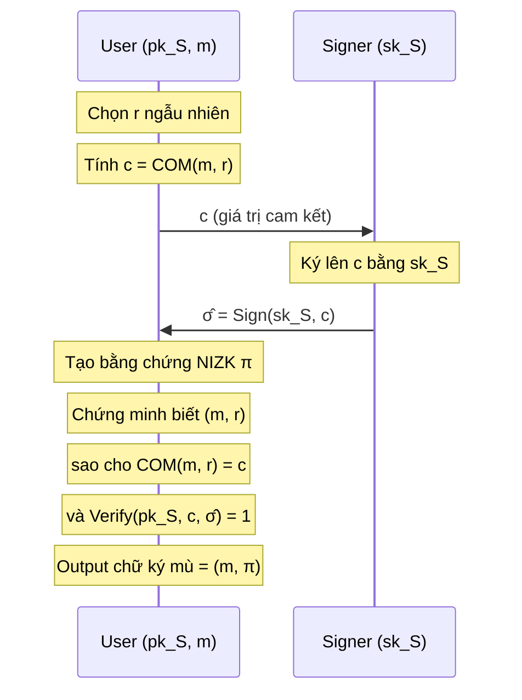

> **Prerequisites**: [[01-blind-signature-definition-security-models|01. Definition & Security Models]], NIZK proof systems (simulation soundness, online extractability), commitment schemes cơ bản
> **Lesson type**: Scheme
>
> **Notation** (ký hiệu dùng mà không định nghĩa trong bài này):
> | Ký hiệu | Ý nghĩa |
> |---------|---------|
> | $\lambda$ | Security parameter |
> | $\mathcal{A}$ | Adversary (PPT) |
> | $\mathsf{negl}(\lambda)$ | Negligible function |
> | $\stackrel{R}{\leftarrow}$ | Lấy mẫu đều ngẫu nhiên |
> | $\mathcal{M}$ | Message space |
> | $\mathsf{pk}, \mathsf{sk}$ | Public key, secret key |

---

## Motivation

Tất cả scheme đã học — Chaum RSA (2 moves: User → Signer → User), Schnorr và Okamoto-Schnorr (3 moves: Signer → User → Signer → User), Blind ECDSA (nhiều round) — đều yêu cầu từ 2 moves trở lên. Câu hỏi tự nhiên: **round-optimal** (2 rounds tối thiểu: mỗi bên gửi đúng 1 message) có thể đạt được không, và nếu có thì đổi lại điều gì?

Round-optimal quan trọng vì hai lý do thực tiễn: (1) minimizing latency trong giao tiếp client–server; (2) trong giao thức 2-round, Signer **không cần duy trì state** qua các signing session — mỗi request là độc lập. Điều này đồng nghĩa với việc **concurrent OMUF "free"**: không có session state để adversary khai thác cross-session.

Marc Fischlin (CRYPTO 2006) giải quyết bài toán này bằng một construction generic: thay vì Signer trực tiếp ký lên message blinded, Signer ký lên một **commitment** đến message, và User chứng minh bằng **NIZK** rằng mình biết opening của commitment đó ứng với signature hợp lệ. Toàn bộ blind signature sau đó **là** proof NIZK, không phải là signature thông thường.

---

## Ý tưởng trung tâm: Commit-then-Sign-then-Prove

Giao thức 3-move truyền thống yêu cầu Signer gửi trước một "commitment" (vd: $R = g^k$ trong Schnorr), rồi User gửi challenge dựa trên message. Nguồn gốc của round count cao là sự phụ thuộc này: User **phải** nhận được Signer's commitment trước khi có thể tính challenge gắn với message.

Fischlin đảo ngược thứ tự. Thay vì Signer commit trước:

1. **User commit**: User tự commit vào message $m$ qua commitment scheme $\mathsf{COM}$, gửi commitment $c$ cho Signer.
2. **Signer sign**: Signer ký lên $c$ bằng bất kỳ signature scheme thông thường $\mathsf{S}$ nào (không biết $m$), trả về $\hat{\sigma}$.
3. **User prove**: User tạo NIZK proof $\pi$ chứng minh: *"Tôi biết $m$ và randomness $r$ sao cho $c = \mathsf{COM}(m; r)$ và $\hat{\sigma}$ là chữ ký hợp lệ của Signer trên $c$."*

Chữ ký mù cuối cùng là $\sigma = (m, \pi)$. Verification: kiểm tra $\pi$.

Điểm then chốt: User gửi **một** message ($c$), Signer gửi **một** message ($\hat{\sigma}$). Đây là 2-round tối thiểu.

---

## Setting và Building Blocks

Fischlin's construction là **generic**: nó hoạt động với bất kỳ bộ ba building block $(\mathsf{S}, \mathsf{COM}, \mathsf{NIZK})$ thỏa mãn một số yêu cầu tối thiểu. Các yêu cầu chính:

> [!note] Building Blocks 6.1 — Fischlin Framework Requirements
> **$\mathsf{S} = (\mathsf{S.KGen}, \mathsf{S.Sign}, \mathsf{S.Verify})$**: Signature scheme EUF-CMA secure.
>
> **$\mathsf{COM} = (\mathsf{COM.Setup}, \mathsf{COM.Com}, \mathsf{COM.Verify})$**: Commitment scheme thỏa:
> - **Hiding**: commitment $c = \mathsf{COM}(m; r)$ không tiết lộ thông tin về $m$
> - **Binding**: không thể mở $c$ thành hai message khác nhau
>
> **$\mathsf{NIZK}$**: Non-interactive ZK proof system cho relation:
> $$
> \mathcal{R} := \bigl\{ (x, w) \mid x = (pk_S, c),\; w = (m, r, \hat{\sigma}) \text{ sao cho } c = \mathsf{COM}(m;r) \wedge \mathsf{S.Verify}(pk_S, c, \hat{\sigma}) = 1 \bigr\}
> $$
> Yêu cầu mạnh: **online extractability** — tồn tại extractor $\mathcal{E}$ tách được witness $w$ từ proof $\pi$ mà **không cần rewind** adversary.

> [!info] Online Extractability vs. Rewinding Extractability
> Trong setting thông thường (Forking Lemma), ta rewind adversary để lấy hai transcript với challenge khác nhau, từ đó extract witness. Trong Fischlin's scheme, do giao thức là **2-round** và concurrent, adversary không bị buộc phải dùng cùng một random tape → rewinding không khả thi. Online extractability giải quyết bài toán này: extractor hoạt động **online**, xử lý từng proof ngay khi nhận được, không cần rewind.

---

## Scheme Definition

> [!note] Scheme 6.2 — Fischlin Round-Optimal Blind Signature
> **Type**: Blind Digital Signature  
> **Setting**: Signature scheme $\mathsf{S}$; commitment scheme $\mathsf{COM}$; NIZK proof system với online-extractable extractor, cho relation $\mathcal{R}$ định nghĩa ở trên; hash $H: \{0,1\}^* \to \{0,1\}^\lambda$ (random oracle)
>
> **$\mathsf{KeyGen}(1^\lambda)$**
> - Chạy $(pk_S, sk_S) \leftarrow \mathsf{S.KGen}(1^\lambda)$
> - Output: $\mathsf{pk} = pk_S$, $\mathsf{sk} = sk_S$
>
> **Giao thức ký $\langle \mathsf{S}(sk_S),\; \mathsf{U}(pk_S, m) \rangle$**
>
> *Phase 1 — User:*
> - Chọn randomness $r \stackrel{R}{\leftarrow} \{0,1\}^\lambda$
> - Tính $c \leftarrow \mathsf{COM}(m;\, r)$
> - Gửi $c$ cho Signer
>
> *Phase 2 — Signer:*
> - Tính $\hat{\sigma} \leftarrow \mathsf{S.Sign}(sk_S,\, c)$
> - Gửi $\hat{\sigma}$ cho User
>
> *Phase 3 — User (unblind):*
> - Tính statement $x = (pk_S, c)$, witness $w = (m, r, \hat{\sigma})$
> - Kiểm tra $\mathsf{S.Verify}(pk_S, c, \hat{\sigma}) = 1$; nếu không, abort
> - Tính $\pi \leftarrow \mathsf{NIZK.Prove}(x, w)$
> - Output: chữ ký $\sigma = \pi$
>
> **$\mathsf{Verify}(\mathsf{pk},\; m,\; \sigma)$**
> - Input: $pk_S$, message $m \in \mathcal{M}$, chữ ký $\sigma = \pi$
> - Tái tạo statement $x = (pk_S, \cdot)$ từ $m$ và proof $\pi$
> - Output: $\mathsf{NIZK.Verify}(x, \pi)$

> [!tip] Ghi chú về verification
> Để verification hoạt động mà không cần $c$, proof $\pi$ thường **bao gồm** commitment $c$ như một phần của statement $x$ được encode trong $\pi$. Cụ thể, Verifier tự tính $x$ từ $(pk_S, c)$ với $c$ được embed trong $\pi$.

---

## Correctness

> [!abstract] Theorem 6.3 — Correctness
> Nếu $\mathsf{S}$ đúng và $\mathsf{NIZK}$ là perfectly complete, thì với mọi $(sk_S, pk_S) \leftarrow \mathsf{S.KGen}(1^\lambda)$ và mọi $m \in \mathcal{M}$, khi User chạy đúng giao thức:
>
> $$
> \Pr\bigl[\mathsf{Verify}(pk_S, m, \sigma) = 1\bigr] = 1
> $$

**Proof.** Khi Signer honest, $\hat{\sigma} = \mathsf{S.Sign}(sk_S, c)$ nên $\mathsf{S.Verify}(pk_S, c, \hat{\sigma}) = 1$ (correctness của $\mathsf{S}$). Do đó $(m, r, \hat{\sigma})$ là witness hợp lệ cho $\mathcal{R}$. Bởi perfect completeness của $\mathsf{NIZK}$, $\mathsf{NIZK.Verify}(x, \pi) = 1$. $\blacksquare$

---

## Blindness

> [!abstract] Theorem 6.4 — Perfect Blindness
> Fischlin's scheme đạt **perfect blindness** (information-theoretic) nếu $\mathsf{COM}$ là perfectly hiding và $\mathsf{NIZK}$ là perfect zero-knowledge.

**Proof sketch.** Trong blindness game, Signer (adversary) thấy commitment $c = \mathsf{COM}(m; r)$. Do $\mathsf{COM}$ perfectly hiding, $c$ phân phối đồng đều độc lập với $m$ — Signer không có thông tin nào về $m$. Chữ ký cuối cùng $\sigma = \pi$ được tạo bởi User bằng NIZK prover; do perfect ZK, distribution của $\pi$ là giống nhau cho mọi $(m, r, \hat{\sigma})$ thỏa mãn $\mathcal{R}$ — tức là Signer không thể distinguish hai session ứng với hai message khác nhau. $\blacksquare$

---

## One-More Unforgeability

> [!abstract] Theorem 6.5 — Concurrent OMUF (ROM)
> Nếu $\mathsf{S}$ là EUF-CMA secure, $\mathsf{COM}$ là computationally binding, và $\mathsf{NIZK}$ là **online-extractable simulation-sound**, thì Fischlin's scheme đạt **concurrent OMUF** trong ROM.

**Proof sketch.** Giả sử adversary $\mathcal{A}$ (đóng vai User) xuất $k \geq \ell + 1$ chữ ký hợp lệ sau $\ell$ signing sessions. Mỗi chữ ký $\sigma_i = \pi_i$ là NIZK proof; bởi **online extractability**, reduction $\mathcal{B}$ extract được witness $(m_i, r_i, \hat{\sigma}_i)$ từ mỗi $\pi_i$ **ngay khi nhận được**, không cần rewind. Ta thu được $k \geq \ell + 1$ cặp $(c_i, \hat{\sigma}_i)$ với $\hat{\sigma}_i$ là chữ ký hợp lệ của Signer trên $c_i$. Trong $\ell$ signing sessions, Signer chỉ ký trên $\ell$ commitments. Vì $c_i$ phân biệt (binding của $\mathsf{COM}$), ít nhất một $\hat{\sigma}_{i^*}$ ứng với commitment $c_{i^*}$ **chưa bao giờ được gửi trong bất kỳ session nào** — đây là EUF-CMA forgery của $\mathsf{S}$, mâu thuẫn với giả thiết. $\blacksquare$

> [!warning] Tại sao concurrent an toàn nhưng 3-move không?
> Trong 3-move Schnorr blind signature, adversary khai thác concurrent sessions bằng cách tạo **linear combination** các transcript — ROS attack (xem [[12-ros-attack|Lesson 12]]). Điểm mấu chốt: trong Fischlin's scheme, adversary không thể kết hợp các session vì mỗi session độc lập: Signer ký trên commitment $c$ được chọn ngẫu nhiên bởi User mà Signer không thấy $m$, và proof $\pi$ được tạo bởi User sau khi nhận đủ $\hat{\sigma}$. Không có algebraic relation nào giữa các sessions để khai thác.

---

## Trade-off: Complexity vs. Round Count

Fischlin's scheme giải quyết được round-optimal, nhưng không miễn phí:

| Tiêu chí | Schnorr Blind (3-move) | Blind BLS (1-round) | Fischlin (2-round) |
|---|---|---|---|
| Round count | 3 moves | 1-round | 2-round (optimal) |
| Concurrent OMUF | Không (ROS) | Có | Có |
| Signature size | $2\log q$ | $1$ group element | Size của NIZK proof |
| Assumption | DL (ROM) | Gap-DH (ROM) | EUF-CMA + binding + online-extractable NIZK |
| Signer state | Có ($k$ per session) | Không | Không |
| Dựa vào AGM | Có (sequential proof) | Không | Không |

NIZK proof có thể khá lớn trong instantiation thực tế. Katsumata et al. (EUROCRYPT 2023) đã tối ưu construction của Fischlin đạt signature + communication dưới 1 KB bằng cách thay PKE bằng commitment scheme và dùng rewinding-extractable NIZK (từ Fiat-Shamir của $\Sigma$-protocol) thay vì online-extractable NIZK đầy đủ.

> [!info] Impossibility của 3-move trong Standard Model
> Fischlin & Schröder (EUROCRYPT 2010) chứng minh rằng trong standard model (không có ROM), **không thể** xây dựng 3-move blind signature scheme an toàn với black-box reduction từ standard assumptions. Điều này lý giải tại sao hầu hết scheme thực tế hoặc dựa vào ROM, hoặc là round-optimal (2-round), hoặc dùng CRS model.

---

## Instantiation Thực tế

Fischlin 2006 đề xuất instantiation dùng:
- $\mathsf{S}$: any EUF-CMA secure signature scheme (vd: Schnorr, RSA-FDH)
- $\mathsf{COM}$: ElGamal commitment (perfectly hiding, computationally binding dưới DL)
- $\mathsf{NIZK}$: online-extractable NIZK từ CRS model (Canetti-Fischlin 2001)

Kết quả: concurrent OMUF secure trong CRS model + ROM dưới DL assumption.

Katsumata-Reichle-Sakai (EUROCRYPT 2023) instantiation hiệu quả hơn:
- $\mathsf{S}$: Waters signature (ABO reduction)
- $\mathsf{COM}$: re-randomizable commitment
- $\mathsf{NIZK}$: Fiat-Shamir từ $\Sigma$-protocol (rewinding-extractable)
- Kết quả: 447 B signature + 303 B communication, dưới SXDH assumption

---

## So sánh với Các Scheme Khác

Fischlin's paradigm ngày nay là nền tảng cho nhiều construction round-optimal hiện đại, kể cả các scheme lattice-based (del Pino & Katsumata CRYPTO 2022) và isogeny-based. Ý tưởng "commit → sign → prove knowledge of signed commitment" tách bạch hoàn toàn trách nhiệm giữa Signer (chỉ cần ký một commitment vô danh) và User (phải chứng minh biết nội dung).

---

## Summary

- Fischlin (2006) đưa ra construction **generic round-optimal (2-round)** cho blind signature.
- Mỗi bên gửi đúng 1 message: User gửi commitment $c = \mathsf{COM}(m; r)$, Signer gửi $\hat{\sigma} = \mathsf{S.Sign}(sk_S, c)$, User xuất NIZK proof $\pi$ làm chữ ký mù.
- **Concurrent OMUF**: do online-extractable NIZK cho phép extract witness mà không rewind — không tồn tại algebraic link giữa các session.
- **Perfect blindness**: do $\mathsf{COM}$ perfectly hiding và NIZK perfect ZK.
- **Trade-off**: signature là NIZK proof, có thể lớn hơn Schnorr/BLS. Instantiation hiệu quả nhất (Katsumata et al. 2023) đạt dưới 1 KB tổng.
- Không cần AGM. Chỉ cần ROM + standard assumptions.

---

## References

- Fischlin, M. — *Round-Optimal Composable Blind Signatures in the Common Reference String Model*, CRYPTO 2006
- Fischlin, M. & Schröder, D. — *On the Impossibility of Three-Move Blind Signature Schemes*, EUROCRYPT 2010
- Katsumata, S., Reichle, M. & Sakai, Y. — *Practical Round-Optimal Blind Signatures in the ROM from Standard Assumptions*, EUROCRYPT 2023
- Canetti, R. & Fischlin, M. — *Universally Composable Commitments*, CRYPTO 2001
- Boneh & Shoup — *A Graduate Course in Applied Cryptography*, Ch. 19 (toc.cryptobook.us)
