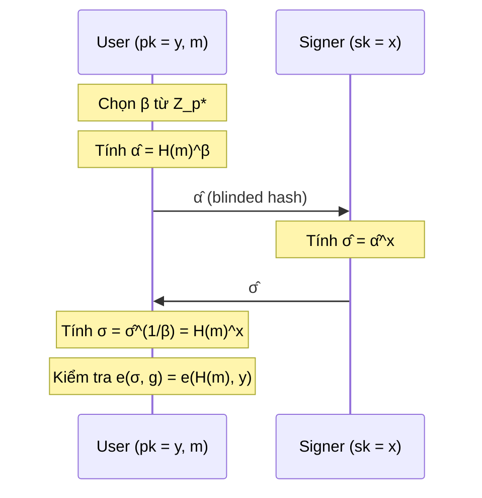

> **Prerequisites**: [[01-blind-signature-definition-security-models|01. Definition & Security Models]], BLS signature scheme, bilinear pairings cơ bản, Diffie-Hellman assumptions  
> **Lesson type**: Scheme
>
> **Notation** (ký hiệu dùng mà không định nghĩa trong bài này):
> | Ký hiệu | Ý nghĩa |
> |---------|---------|
> | $\lambda$ | Security parameter |
> | $\mathcal{A}$ | Adversary (PPT) |
> | $\mathsf{negl}(\lambda)$ | Negligible function |
> | $\stackrel{R}{\leftarrow}$ | Lấy mẫu đều ngẫu nhiên |
> | $\mathcal{M}$ | Message space |

---

## Motivation

Schnorr blind signature đạt sequential OMUF nhưng thất bại trong concurrent setting vì ROS attack. Fischlin's scheme đạt concurrent OMUF nhưng với signature là NIZK proof, có overhead lớn. Bài học này giới thiệu **Blind BLS** (Boldyreva, PKC 2003) — một scheme 1-round với concurrent OMUF, signature chỉ là **1 group element**, và blindness là **information-theoretic**.

Ý tưởng cốt lõi đến từ cấu trúc đặc biệt của **BLS signature** (Boneh-Lynn-Shacham 2001): chữ ký là $\sigma = H(m)^x$ trong một nhóm có cấu trúc **bilinear pairing**. Homomorphism nhân của BLS cho phép xây dựng blinding đơn giản: User che giấu $H(m)$ bằng một **scalar blinding factor** $\beta$, Signer ký lên phiên bản đã che, User bỏ blinding. Tính an toàn đến từ **Gap Diffie-Hellman (GDH) assumption** — CDH khó nhưng DDH dễ (có thể quyết định qua pairing).

---

## Recap: Bilinear Pairings và GDH Groups

Trước khi trình bày scheme, ta cần ôn lại cấu trúc toán học.

> [!note] Definition 7.1 — Bilinear Pairing
> Cho $\mathbb{G}_1, \mathbb{G}_2, \mathbb{G}_T$ là các nhóm cyclic bậc nguyên tố $p$ với generator $g_1, g_2$. Một **bilinear pairing** là map $e: \mathbb{G}_1 \times \mathbb{G}_2 \to \mathbb{G}_T$ thỏa:
>
> **Bilinearity**: $e(g_1^a, g_2^b) = e(g_1, g_2)^{ab}$ với mọi $a, b \in \mathbb{Z}_p$
>
> **Non-degeneracy**: $e(g_1, g_2) \neq 1_{\mathbb{G}_T}$ (tức là $e(g_1, g_2)$ generate $\mathbb{G}_T$)
>
> **Computability**: $e$ tính được hiệu quả

Trong setting **asymmetric** (Type-3), $\mathbb{G}_1 \neq \mathbb{G}_2$ và không có isomorphism hiệu quả giữa hai nhóm. Blind BLS của Boldyreva dùng setting **symmetric** (Type-1, $\mathbb{G}_1 = \mathbb{G}_2 = \mathbb{G}$) để đơn giản hóa.

![[assets/img-07-pairing-structure.png]]
*Cấu trúc bilinear pairing $e: \mathbb{G}_1 \times \mathbb{G}_2 \to \mathbb{G}_T$. Trong Blind BLS symmetric setting, $\mathbb{G}_1 = \mathbb{G}_2 = \mathbb{G}$. Pairing cho phép kiểm tra DDH hiệu quả, trong khi CDH vẫn khó.*

> [!note] Definition 7.2 — Gap Diffie-Hellman (GDH) Group
> Nhóm cyclic $\mathbb{G}$ bậc nguyên tố $p$ với generator $g$ là **GDH group** nếu:
>
> **CDH hard**: không có thuật toán PPT nào tính được $h = g^{ab}$ từ $(g, g^a, g^b)$ với xác suất non-negligible.
>
> **DDH easy**: tồn tại thuật toán PPT $\mathsf{VDDH}$ quyết định được $(g, g^a, g^b, g^{ab})$ có phải là DH-tuple không.
>
> Trong pairing setting: $\mathsf{VDDH}(g, u, v, h) = 1 \iff e(u, v) = e(g, h)$ — vì $e(g^a, g^b) = e(g,g)^{ab} = e(g, g^{ab})$.

---

## BLS Signature (Gốc)

Để hiểu blind version, ta ôn lại BLS signature:

- **KeyGen**: chọn $x \stackrel{R}{\leftarrow} \mathbb{Z}_p^*$, đặt $y = g^x$. Keys: $\mathsf{sk} = x$, $\mathsf{pk} = y$.
- **Sign**: $\sigma = H(m)^x$ với $H: \{0,1\}^* \to \mathbb{G}^* = \mathbb{G} \setminus \{1\}$ (random oracle).
- **Verify**: kiểm tra $e(\sigma, g) = e(H(m), y)$, tương đương $e(H(m)^x, g) = e(H(m), g^x)$.

Tính đúng: $e(H(m)^x, g) = e(H(m), g)^x = e(H(m), g^x)$. ✓

---

## Blind BLS Scheme (Boldyreva BGS)

Ý tưởng blinding: User chọn scalar $\beta \stackrel{R}{\leftarrow} \mathbb{Z}_p^*$ và gửi $\hat{\alpha} = H(m)^\beta$ cho Signer. Signer tính $\hat{\sigma} = \hat{\alpha}^x = H(m)^{\beta x}$. User tính $\sigma = \hat{\sigma}^{\beta^{-1}} = H(m)^x$. Đây là chữ ký BLS chuẩn trên $m$.

> [!note] Scheme 7.3 — Blind BLS (Boldyreva BGS)
> **Type**: Blind Digital Signature  
> **Setting**: GDH group $\mathbb{G}$ bậc nguyên tố $p$, generator $g$; hash $H: \{0,1\}^* \to \mathbb{G}^*$ (random oracle)
>
> **$\mathsf{KeyGen}(1^\lambda)$**
> - Chọn $x \stackrel{R}{\leftarrow} \mathbb{Z}_p^*$
> - Output: $\mathsf{sk} = x$, $\mathsf{pk} = y = g^x \in \mathbb{G}$
>
> **Giao thức ký $\langle \mathsf{S}(x),\; \mathsf{U}(y, m) \rangle$**
>
> *Phase 1 — User (blinding):*
> - Chọn $\beta \stackrel{R}{\leftarrow} \mathbb{Z}_p^*$
> - Tính $\hat{\alpha} = H(m)^\beta \in \mathbb{G}^*$
> - Gửi $\hat{\alpha}$ cho Signer
>
> *Phase 2 — Signer:*
> - Tính $\hat{\sigma} = \hat{\alpha}^x \in \mathbb{G}^*$
> - Gửi $\hat{\sigma}$ cho User
>
> *Phase 3 — User (unblinding):*
> - Tính $\sigma = \hat{\sigma}^{\beta^{-1}} = \hat{\sigma}^{\beta^{-1} \bmod p} \in \mathbb{G}^*$
> - Output: $\sigma$
>
> **$\mathsf{Verify}(\mathsf{pk},\; m,\; \sigma)$**
> - Input: $y = g^x$, message $m$, $\sigma \in \mathbb{G}^*$
> - Output: $1$ nếu $e(\sigma, g) = e(H(m), y)$, ngược lại $0$

---

## Correctness

> [!abstract] Theorem 7.4 — Correctness
> Với mọi $(x, y) \leftarrow \mathsf{KeyGen}(1^\lambda)$, mọi $m \in \mathcal{M}$, và mọi $\beta \in \mathbb{Z}_p^*$:
>
> $$
> \mathsf{Verify}(y,\, m,\, \sigma) = 1 \quad \text{với } \sigma = \hat{\sigma}^{\beta^{-1}}
> $$

**Proof.** Ta tính:

$$
\sigma = \hat{\sigma}^{\beta^{-1}} = (\hat{\alpha}^x)^{\beta^{-1}} = (H(m)^\beta)^{x\beta^{-1}} = H(m)^x
$$

Do đó $e(\sigma, g) = e(H(m)^x, g) = e(H(m), g)^x = e(H(m), g^x) = e(H(m), y)$. $\blacksquare$

---

## Blindness

> [!abstract] Theorem 7.5 — Perfect Blindness (Information-Theoretic)
> Blind BLS đạt **perfect blindness** trong **malicious signer model**: ngay cả adversary computationally unbounded đóng vai Signer cũng không thể link session với chữ ký cuối cùng.

**Proof.** Signer thấy $\hat{\alpha} = H(m)^\beta$. Với $\beta$ chọn đều trong $\mathbb{Z}_p^*$, map $\beta \mapsto H(m)^\beta$ là bijection trên $\mathbb{G}^*$ (vì $H(m) \neq 1$ và $\mathbb{G}$ cyclic bậc nguyên tố). Do đó $\hat{\alpha}$ phân phối đều trong $\mathbb{G}^*$, **độc lập hoàn toàn với $m$**. Signer không nhận được thông tin nào về $m$ hay về chữ ký cuối $\sigma = H(m)^x$. $\blacksquare$

> [!tip] Tại sao mạnh hơn Chaum RSA và Schnorr?
> Chaum RSA đạt perfect blindness nhưng chỉ trong honest-signer model. Schnorr blind signature đạt perfect blindness trong honest-signer model. Blind BLS đạt perfect blindness trong **malicious-signer model** — kể cả khi Signer cố tình chọn $\mathsf{sk}$ và $\mathsf{pk}$ xấu. Điều này đến từ việc $\hat{\alpha}$ phân phối đều trong $\mathbb{G}^*$ hoàn toàn bởi User, không phụ thuộc vào bất kỳ tham số nào của Signer.

---

## One-More Unforgeability: ct-CDH Assumption

Security của Blind BLS dựa trên **chosen-target CDH (ct-CDH)** assumption, một variant của CDH phù hợp với setting one-more forgery.

> [!note] Definition 7.6 — Chosen-Target CDH (ct-CDH)
> Cho GDH group $\mathbb{G}$ bậc $p$, generator $g$, và $y = g^x$ (với $x$ ẩn). Bài toán **$(\ell+1)$-ct-CDH** là: cho $\ell+1$ random targets $T_1, \ldots, T_{\ell+1} \stackrel{R}{\leftarrow} \mathbb{G}^*$, với oracle trả lời $\mathsf{CDH}_x(T) = T^x$ tối đa $\ell$ lần (trên các target tùy chọn), tính $T_{i^*}^x$ cho một target $T_{i^*} \in \{T_1, \ldots, T_{\ell+1}\}$ **chưa được query**.

> [!abstract] Theorem 7.7 — Concurrent OMUF
> Nếu ct-CDH là $(t, \epsilon)$-hard trong $\mathbb{G}$ (GDH group), thì Blind BLS đạt **concurrent OMUF** trong ROM: không có adversary $\mathcal{A}$ chạy trong thời gian $t' \approx t$ có thể thắng OMUF với xác suất $\geq \epsilon$.

**Proof sketch.** Giả sử adversary $\mathcal{A}$ thắng OMUF: sau $\ell$ signing sessions, xuất $\ell+1$ chữ ký hợp lệ $(m_1, \sigma_1), \ldots, (m_{\ell+1}, \sigma_{\ell+1})$. Ta xây dựng reduction $\mathcal{B}$ giải ct-CDH:

$\mathcal{B}$ nhận $(g, y, T_1, \ldots, T_{\ell+1})$ với $T_i = H(m_i)$ (program random oracle). $\mathcal{B}$ mô phỏng $\ell$ signing sessions: khi $\mathcal{A}$ gửi $\hat{\alpha}_i$, $\mathcal{B}$ dùng DDH oracle để xác định $i_j$ sao cho $\hat{\alpha}_j = T_{i_j}^\beta$ cho một số $\beta$, sau đó dùng CDH oracle để tính $\hat{\sigma}_j = T_{i_j}^{x\beta}$. Cuối cùng, $\mathcal{A}$ xuất $\ell+1$ chữ ký; ít nhất một $\sigma_{i^*} = H(m_{i^*})^x = T_{i^*}^x$ ứng với một target $T_{i^*}$ chưa được query vào CDH oracle — đây là giải ct-CDH. $\square$

*(Proof đầy đủ: Boldyreva, PKC 2003, Theorem 4; xem thêm Boneh & Shoup Ch. 19.)*

> [!warning] ct-CDH vs CDH
> ct-CDH là assumption **mạnh hơn** CDH thông thường: adversary được chọn target trước khi thấy oracle queries. Đây là non-standard assumption, nhưng được chứng minh là equivalent với CDH trong GDH group khi số queries $\ell$ là polynomial.

---

## Tại sao 1-Round và Concurrent an toàn

Giao thức Blind BLS chỉ có **1-round**: User gửi $\hat{\alpha}$, Signer gửi $\hat{\sigma}$. Trong setting 1-round này:

- Không có state nào phía Signer giữa các session (Signer chỉ tính một lần DH).
- Adversary không thể kết hợp các session theo bất kỳ cách nào — mỗi $\hat{\alpha}_j$ là random group element không liên quan.
- Không có ROS-style attack: khác Schnorr, không có "additive combination" nào của các session cho output hợp lệ mới.

Đặc biệt, DDH oracle (từ pairing) cho phép reduction kiểm tra rằng $\hat{\alpha}$ thực sự là lũy thừa của một $H(m)$ cụ thể — đây là điều không có trong Schnorr setting (không có pairing), và là lý do cốt lõi tại sao ct-CDH reduction hoạt động còn Schnorr thì không.

---

## Verification qua Pairing

Verification sử dụng bilinear pairing một cách thanh lịch:

$$
e(\sigma, g) = e(H(m)^x, g) = e(H(m), g)^x = e(H(m), g^x) = e(H(m), y)
$$

Verifier chỉ cần biết $\mathsf{pk} = y = g^x$ và tính hai pairing evaluations. Không cần biết $x$. Signature size: **1 group element** — với pairing-friendly curve như BN-254 hay BLS12-381, đây là 32–48 bytes (compressed).

---

## So sánh với các Scheme khác

| Tiêu chí | Chaum RSA | Schnorr Blind | Blind BLS |
|---|---|---|---|
| Round count | 2-round | 3-move | 1-round |
| Concurrent OMUF | Có (ct-RSA) | Không (ROS) | Có (ct-CDH) |
| Blindness model | Perfect (honest) | Perfect (honest) | **Perfect (malicious)** |
| Assumption type | ct-RSA (non-standard) | DL in ROM | ct-CDH in GDH (ROM) |
| Signature size | $\|N\|$ bits | $2\log q$ | **1 group element** |
| Signer state | Không | Có ($k$ per session) | Không |
| Quantum safety | Không | Không | Không |
| Cần pairing | Không | Không | Có |

---

## Ứng dụng và Deployment Thực tế

Blind BLS đã được triển khai trong nhiều hệ thống thực tế:
- **Privacy Pass** (Cloudflare + Apple): token system dùng variant của Blind BLS để cấp anonymous tokens
- **PrivacyPass IETF RFC 9578**: chuẩn hóa blind token protocol dùng blind RSA và OPRF (liên quan đến blind BLS)
- **Threshold blind signature**: Boldyreva cũng đề xuất threshold variant để phân tán key của Signer

---

## CTF Pattern

> [!example] CTF Pattern — Blind BLS Oracle
> Server expose oracle: nhận $\hat{\alpha} \in \mathbb{G}^*$ và trả về $\hat{\sigma} = \hat{\alpha}^x$. Challenge: lấy chữ ký BLS trên message $m^*$ bị cấm trực tiếp.
>
> Exploit: chọn $\beta \stackrel{R}{\leftarrow} \mathbb{Z}_p^*$, gửi $\hat{\alpha} = H(m^*)^\beta$, nhận $\hat{\sigma} = H(m^*)^{\beta x}$, tính $\sigma = \hat{\sigma}^{\beta^{-1}} = H(m^*)^x$. Verify bằng pairing check.
>
> Lưu ý: nếu server filter bằng cách kiểm tra $\hat{\alpha} = H(m)$ cho một số $m$ đã biết, exploit sẽ thất bại. Nếu server chỉ kiểm tra $\hat{\alpha} \in \mathbb{G}^*$, exploit hoạt động hoàn hảo.

---

## Summary

- Blind BLS (Boldyreva 2003) là blind signature **1-round**, signature là **1 group element**, concurrent OMUF, perfect blindness trong malicious-signer model.
- **Giao thức**: User gửi $\hat{\alpha} = H(m)^\beta$, Signer gửi $\hat{\sigma} = \hat{\alpha}^x$, User tính $\sigma = \hat{\sigma}^{\beta^{-1}} = H(m)^x$.
- **Correctness**: $\hat{\sigma}^{\beta^{-1}} = H(m)^x$ — tính đúng từ định nghĩa.
- **Perfect blindness**: $\hat{\alpha} = H(m)^\beta$ phân phối đều trong $\mathbb{G}^*$ bất kể $m$.
- **Concurrent OMUF**: dựa trên ct-CDH trong GDH group (ROM); DDH oracle từ pairing cho phép reduction hoạt động.
- **Không bị ROS**: không có algebraic combination nào của session transcripts cho forgery mới.

---

## References

- Boldyreva, A. — *Threshold Signatures, Multisignatures and Blind Signatures Based on the Gap-Diffie-Hellman-Group Signature Scheme*, PKC 2003
- Boneh, B., Lynn, B. & Shacham, H. — *Short Signatures from the Weil Pairing*, ASIACRYPT 2001
- Benhamouda et al. — *On the (In)Security of ROS*, EUROCRYPT 2021 (confirms BLS unaffected)
- Boneh & Shoup — *A Graduate Course in Applied Cryptography*, Ch. 15 & 19 (toc.cryptobook.us)
